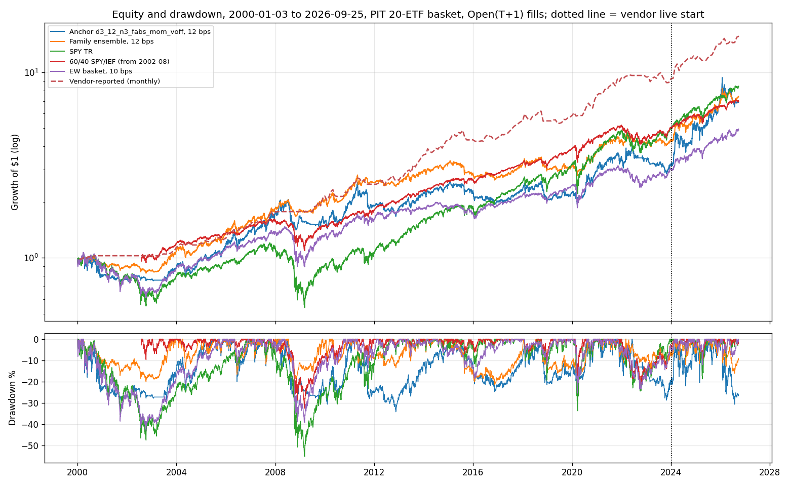
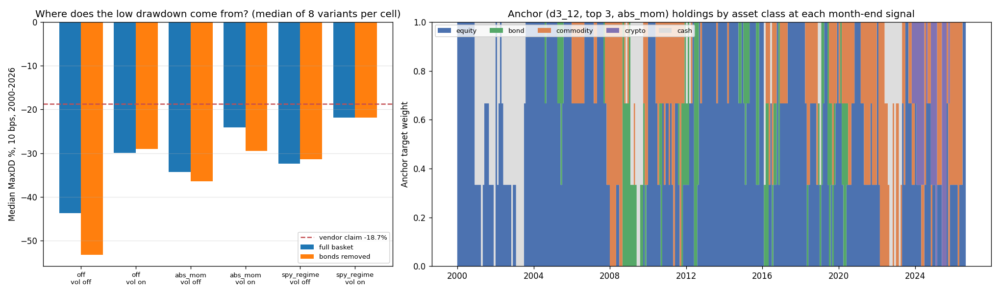

<!-- GENERATED FILE. EDIT THE CANONICAL KNOWLEDGE RECORD. -->

# SetupAlpha ETF rotation monthly rebalance claim audit

!!! warning "Research-only"
    This page summarizes saved research evidence. It does not authorize LIVE, allocation, or deployment.

## TL;DR

> **Verdict:** A transparent ETF momentum rotation does not beat a plain 60/40 SPY/IEF (Sharpe 0.57 anchor vs 0.82 since 2002) and its ranking is indistinguishable from random picks; the vendor profile (10.9%, Sharpe 0.89, -18.7%) sits above all 48 variants, and its low drawdown matches long zero-return cash spells (22% of vendor months are exactly 0.0%), not bond holdings. Do not buy; do not trade.

> **Status:** `diagnostic`

> **Disposition:** `rejected`

> **Replication:** `directionally_replicated`

## Research question

Determine whether a transparent, frozen family of 48 generic monthly cross-sectional momentum rotations on a point-in-time 20-ETF basket (equities, bonds, commodities, crypto; month-end signal, Open_T+1 fills, 2/10/12/25 bps) reproduces the headline profile claimed by the SetupAlpha ETF Rotation Monthly Rebalance product (CAGR 10.86%, Sharpe 0.89, MaxDD -18.7%, worst year -2.2%, 2000-2026); whether the return comes from momentum ranking rather than basket exposure (random-rank rotation with the same N, weights and turnover, 100 seeds; equal-weight basket; SPY and 60/40 SPY/IEF); and how much of the low drawdown comes from holding bonds or cash.

## Exact setup

| Field | Value |
| --- | --- |
| Signal family | momentum_rotation |
| Universe | ["20-ETF basket (equity/bond/commodity/crypto), listing-date PIT; GBTC from its 2024-01-11 ETF conversion"] |
| Decision | Close_T (last session of month) |
| Fill | Open_T+1 |
| Primary cost layer | central_research |
| Last reviewed | 2026-09-26T12:11:35+00:00 |

## Timing and overnight attribution

```text
information available: Close_T (last session of month)
primary executable fill: Open_T+1
```

If final `Close_T` data formed the signal, a hypothetical `Close_T` entry is diagnostic only unless a separate pre-close protocol was modeled. Comparing that diagnostic with `Open_(T+1)` and applying the compounded return identity shows whether the apparent edge occurred in the overnight gap. Missing attribution numbers mean **not tested**, not zero.

| Attribution field | Value |
| --- | --- |
| Status | tested |
| Diagnostic Path | rebalance at the signal Close_T |
| Executable Path | rebalance at Open_T+1 |
| Method | Every family variant run with both fills at 10 bps; median same_close minus next_open Sharpe and CAGR |
| Headline Result | Same-close adds only +0.02 Sharpe / +0.25 pp CAGR (median, full period). |
| Metrics | {"median_cagr_diff_full": 0.0025, "median_sharpe_diff_full": 0.0214} |
| Artifact | pakal-research/reports/setupalpha_etf_rotation_monthly_audit/tables/timing_attribution_summary.csv |

## Primary metrics

| Metric | Value |
| --- | ---: |
| Period | 2000-01-03 to 2026-09-25 |
| Universe | PIT 20-ETF basket |
| Cost Layer | central_research (10 bps RT) |
| Cagr | 7.60% |
| Annualized Volatility | 18.80% |
| Sharpe | 0.484 |
| Maximum Drawdown | -34.10% |
| Turnover | about 8.2x equity per year |

## Four separate verdicts

| Question | Conclusion |
| --- | --- |
| Source Replication | Basket and rules unpublished (literal not_assessed). Family median at 12 bps 7.2%/0.58/-30.7% vs vendor 10.86%/0.89/-18.7%: directionally replicated only; vendor above all 48 variants. |
| Predictive Value | Momentum rank not distinguishable from random-rank rotations (75th percentile full; 41-73 by slice). |
| Economic Value | Anchor 10 bps: CAGR 7.6%, Sharpe 0.48, MaxDD -34%; 60/40 SPY/IEF Sharpe 0.82 vs anchor 0.57 since 2002-08. |
| Promotion | Fails every frozen leg; rejected. Do not buy, do not trade. |

## Key findings

| Feature | Role | Direction | Status | Effect | Action |
| --- | --- | --- | --- | --- | --- |
| ETF momentum rank | rank | none detectable | rejected | anchor 75th percentile of random rank | do not pursue as alpha |
| SPY>SMA200 cash gate | risk overlay | cash in equity downtrends | diagnostic | median MaxDD -24% vs -38% filter off; 25% of days in cash | overlay only |
| bond sleeve in basket | universe | little effect | diagnostic | removing bonds: median MaxDD -30.5% -> -31.4%, Sharpe 0.58 -> 0.60 | not needed for the low-drawdown profile |
| asset 63-day vol scaling | risk overlay | lower drawdown | diagnostic | median MaxDD about -10 pp, CAGR about -2 pp | overlay only |

## Visual evidence






## Limitations

- Vendor basket unknown; our 20-ETF basket is a stand-in.
- No bond ETF before 2002-07-26 and no commodity ETF before 2004-11; no proxy splicing.
- Cash earns zero (vendor-like).
- Crypto only from 2021-10 (BITO) / 2024-01 (IBIT, GBTC).
- Vendor live returns self-reported.

## Next gates

- None required.

## Sources

- `https://setupalpha.com/products/etf-rotation-monthly-rebalance-realtest-strategy (snapshot pakal-research/reports/setupalpha_catalog_audit/sources/etf-rotation-monthly-rebalance-realtest-strategy.txt, sha256 76b6c7854dc681a9e3a371e46e578927f3320884ce23acf2ad8efb6e22316bcf)`
- `pakal-research/reports/setupalpha_catalog_audit/AGENT_BRIEF.md`

## Canonical artifacts

| Artifact | Pakal path |
| --- | --- |
| Concise Report | `pakal-research/reports/setupalpha_etf_rotation_monthly_audit/REPORT.md` |
| Full Report | `pakal-research/reports/setupalpha_etf_rotation_monthly_audit/REPORT_FULL.md` |
| Notebook | `pakal-research/setupalpha_etf_rotation_monthly_audit.ipynb` |
| Frozen Specification | `pakal-research/reports/setupalpha_etf_rotation_monthly_audit/research_spec_frozen.json` |
| Manifest | `pakal-research/reports/setupalpha_etf_rotation_monthly_audit/run_manifest.json` |
| Primary Source Code | `["pakal-research/setupalpha_etf_rotation_monthly_audit.py", "pakal-research/setupalpha_ndx_momentum_rotation_audit.py", "pakal-research/build_setupalpha_momentum_rotation_artifacts.py", "pakal-research/build_setupalpha_momentum_rotation_notebook.py", "pakal-research/build_setupalpha_momentum_rotation_manifest.py", "tests/test_setupalpha_momentum_rotation_audits.py"]` |
| Primary Tables | `["pakal-research/reports/setupalpha_etf_rotation_monthly_audit/tables/family_period_summary.csv", "pakal-research/reports/setupalpha_etf_rotation_monthly_audit/tables/family_median_by_period.csv", "pakal-research/reports/setupalpha_etf_rotation_monthly_audit/tables/random_control_percentiles.csv", "pakal-research/reports/setupalpha_etf_rotation_monthly_audit/tables/selection_bias_summary.csv", "pakal-research/reports/setupalpha_etf_rotation_monthly_audit/tables/capacity_summary.csv", "pakal-research/reports/setupalpha_etf_rotation_monthly_audit/tables/vendor_monthly_correlation.csv", "pakal-research/reports/setupalpha_etf_rotation_monthly_audit/tables/drawdown_source_decomposition.csv", "pakal-research/reports/setupalpha_etf_rotation_monthly_audit/tables/no_bond_basket_family_summary.csv", "pakal-research/reports/setupalpha_etf_rotation_monthly_audit/tables/common_window_summary.csv"]` |
| Primary Charts | `["pakal-research/reports/setupalpha_etf_rotation_monthly_audit/charts/family_vs_vendor_claim.png", "pakal-research/reports/setupalpha_etf_rotation_monthly_audit/charts/random_rank_control.png", "pakal-research/reports/setupalpha_etf_rotation_monthly_audit/charts/equity_drawdown_vs_vendor.png", "pakal-research/reports/setupalpha_etf_rotation_monthly_audit/charts/cost_capacity_timing.png", "pakal-research/reports/setupalpha_etf_rotation_monthly_audit/charts/drawdown_sources.png"]` |
| Research State | `pakal-research/reports/setupalpha_etf_rotation_monthly_audit/research_state.json` |
| Hypothesis Registry | `pakal-research/reports/setupalpha_etf_rotation_monthly_audit/hypothesis_registry.json` |
| Experiment Ledger | `pakal-research/reports/setupalpha_etf_rotation_monthly_audit/experiment_ledger.jsonl` |
| Decision Log | `pakal-research/reports/setupalpha_etf_rotation_monthly_audit/decision_log.jsonl` |
| Source Rule Map | `pakal-research/reports/setupalpha_etf_rotation_monthly_audit/SOURCE_RULE_MAP.md` |
