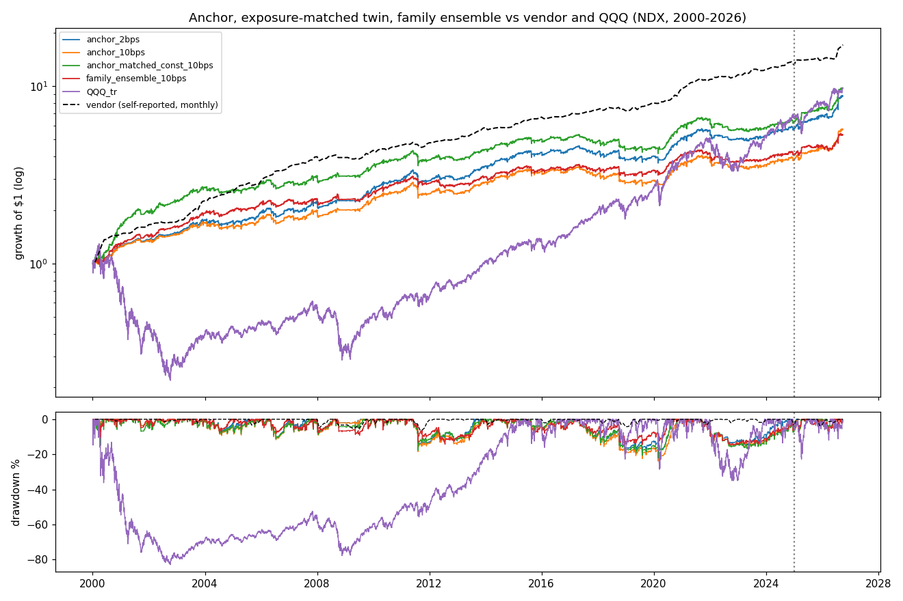
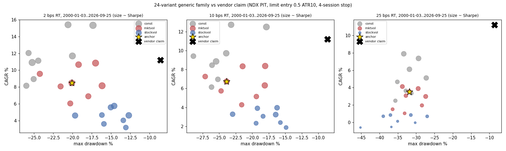

<!-- GENERATED FILE. EDIT THE CANONICAL KNOWLEDGE RECORD. -->

# SetupAlpha low-drawdown Nasdaq 100 mean-reversion audit (volatility-scaling overlay)

!!! warning "Research-only"
    This page summarizes saved research evidence. It does not authorize LIVE, allocation, or deployment.

## TL;DR

> **Verdict:** The low-drawdown profile is not reproduced (family MaxDD -13% to -26% vs vendor -8.6%); the volatility-scaling overlay only lowers exposure and costs Sharpe versus an exposure-matched constant size (0/16 pairs better) because mean-reversion trades pay most in turbulent markets. Timing edge real but thin and decaying; limit-fill optimism worth ~1/3 of Sharpe. Do not buy; do not trade live.

> **Status:** `diagnostic`

> **Disposition:** `diagnostic`

> **Replication:** `directionally_replicated`

## Research question

Determine (1) whether a frozen generic family of long-only Nasdaq 100 RSI2/DV2 pullback rules with day-limit entries, limit-and-market exits, a 4-session time stop and volatility-scaled sizing reproduces the SetupAlpha Low Drawdown Nasdaq Mean Reversion profile (Sharpe 1.43, CAGR 11.22%, MaxDD -8.6%, worst year -1.5%, 2000-2026), and (2) whether the volatility-scaling overlay improves return per unit of exposure versus an exposure-matched constant-size twin, or only lowers average exposure (risk overlay); (3) how much the result depends on optimistic limit fills.

## Exact setup

| Field | Value |
| --- | --- |
| Signal family | mean_reversion |
| Universe | ["Nasdaq 100 Current & Past, point-in-time membership (Norgate, shared cache ndx)"] |
| Decision | Close_T |
| Fill | day limit during session T+1 at Close_T - 0.5*ATR10 (0.1% penetration); limit or MOO exits |
| Primary cost layer | central_research |
| Last reviewed | 2026-09-26T12:16:42+00:00 |

## Timing and overnight attribution

```text
information available: Close_T
primary executable fill: day limit during session T+1 at Close_T - 0.5*ATR10 (0.1% penetration); limit or MOO exits
```

If final `Close_T` data formed the signal, a hypothetical `Close_T` entry is diagnostic only unless a separate pre-close protocol was modeled. Comparing that diagnostic with `Open_(T+1)` and applying the compounded return identity shows whether the apparent edge occurred in the overnight gap. Missing attribution numbers mean **not tested**, not zero.

| Attribution field | Value |
| --- | --- |
| Status | tested |
| Diagnostic Path | MOO market entry at Open_T+1 and optimistic touch/uncapped limit fills |
| Executable Path | limit entry with 0.1% penetration buffer and orders capped at free slots |
| Method | Fill-model ladder on the same anchor (a Close_T fill is impossible for a limit below Close_T) |
| Headline Result | Touch-uncapped fills lift Sharpe from 0.73 to 1.06 and CAGR from 6.7% to 11.2% at 10 bps (-32% Sharpe for the realistic model); 0.5% penetration leaves 0.14; MOO entry 0.56. |
| Metrics | {"moo_sharpe_10bps": 0.562, "primary_order_fill_rate": 0.382, "primary_sharpe_10bps": 0.726, "strict_sharpe_10bps": 0.141, "touch_uncapped_sharpe_10bps": 1.063} |
| Artifact | pakal-research/reports/setupalpha_ndx_low_drawdown_mr_audit/tables/limit_fill_realism.csv |

## Primary metrics

| Metric | Value |
| --- | ---: |
| Period | 2000-01-03 to 2026-09-25 |
| Universe | Nasdaq 100 PIT |
| Cost Layer | central_research (10 bps RT) |
| Cagr | 6.70% |
| Annualized Volatility | 9.60% |
| Sharpe | 0.726 |
| Maximum Drawdown | -23.90% |
| Turnover | about 41x equity per year |

## Four separate verdicts

| Question | Conclusion |
| --- | --- |
| Source Replication | Rules unpublished (literal not_assessed). Family median at 2 bps: CAGR 8.1%, Sharpe 0.74, MaxDD -19.4% vs vendor 11.22%/1.43/-8.6%; return partly reproduced, low drawdown not (best MaxDD -12.7%). |
| Predictive Value | RSI2/DV2 pullbacks beat same-date members by 14-23 bps per 4-session trade (q<=0.002, 4/4) and random names (anchor at the 100th percentile of 50 controls full period); edge near zero 2021-2024. |
| Economic Value | Anchor rsi2_sma5lim_t4_mktvol_s10 at 10 bps: CAGR 6.7%, Sharpe 0.73, MaxDD -23.9%, worst year -11%; negative at 25 bps in 2015-2020 and 2021-2024; soft at $10M, strained at $100M. Volatility scaling loses to exposure-matched constant size in 16/16 pairs. |
| Promotion | Fails the frozen promotion and overlay rules; diagnostic. Do not buy; do not trade live; do not add vol-scaling to mean-reversion sleeves as an improvement. |

## Key findings

| Feature | Role | Direction | Status | Effect | Action |
| --- | --- | --- | --- | --- | --- |
| market-volatility position scaling min(1, 20%/RV20_QQQ) | sizing (risk overlay) | smaller size in turbulent markets | rejected | median Sharpe -0.07 vs exposure-matched constant twin (0/8 pairs better), MaxDD not improved | do not use vol-scaling as an efficiency improvement for dip-buying sleeves |
| per-stock NATR sizing min(1, 2%/NATR14) | sizing (risk overlay) | smaller size in volatile names | rejected | median Sharpe -0.24 vs exposure-matched twin (0/8) | reject |
| day-limit entry 0.5*ATR10 below close | execution | buy further into the dip | diagnostic | limit-conditional event edge +20..+23 bps vs +14..+15 bps MOO; but the portfolio result depends on the fill model (-32% Sharpe from touch to 0.1% buffer) | only with measured live fill rates |
| RSI2<10 with Close>SMA200 | entry signal | oversold -> higher 4-session return | diagnostic | +15 bps (MOO) per 4-session trade vs members | no new work beyond the lead study |

## Visual evidence






## Limitations

- Vendor rules unpublished; limit price and exit targets are standard guesses.
- Daily bars cannot resolve intraday order of limit fills.
- Vendor live returns self-reported.
- Dividends excluded (CAPITALSPECIAL).
- 67% of anchor log growth in 2000-2014.

## Next gates

- Optional forward shadow of the constant-size anchor with real day-limit orders to measure fill rates and adverse selection.

## Sources

- `https://setupalpha.com/products/low-drawdown-nasdaq-mean-reversion-realtest-strategy`
- `pakal-research/reports/setupalpha_catalog_audit/sources/low-drawdown-nasdaq-mean-reversion-realtest-strategy.txt`
- `pakal-research/reports/setupalpha_ndx_mean_reversion_audit`

## Canonical artifacts

| Artifact | Pakal path |
| --- | --- |
| Concise Report | `pakal-research/reports/setupalpha_ndx_low_drawdown_mr_audit/REPORT.md` |
| Full Report | `pakal-research/reports/setupalpha_ndx_low_drawdown_mr_audit/REPORT_FULL.md` |
| Notebook | `pakal-research/setupalpha_ndx_low_drawdown_mr_audit.ipynb` |
| Frozen Specification | `pakal-research/reports/setupalpha_ndx_low_drawdown_mr_audit/research_spec_frozen.json` |
| Manifest | `pakal-research/reports/setupalpha_ndx_low_drawdown_mr_audit/run_manifest.json` |
| Primary Source Code | `["pakal-research/setupalpha_ndx_low_drawdown_mr_audit.py", "pakal-research/setupalpha_limit_mr_engine.py", "pakal-research/setupalpha_lane_common.py", "pakal-research/build_setupalpha_ndx_low_drawdown_mr_notebook.py", "pakal-research/build_setupalpha_ndx_low_drawdown_mr_manifest.py"]` |
| Primary Tables | `["pakal-research/reports/setupalpha_ndx_low_drawdown_mr_audit/tables/family_period_summary.csv", "pakal-research/reports/setupalpha_ndx_low_drawdown_mr_audit/tables/overlay_pairs.csv", "pakal-research/reports/setupalpha_ndx_low_drawdown_mr_audit/tables/volatility_regime_trades.csv", "pakal-research/reports/setupalpha_ndx_low_drawdown_mr_audit/tables/limit_fill_realism.csv", "pakal-research/reports/setupalpha_ndx_low_drawdown_mr_audit/tables/random_control_percentiles.csv", "pakal-research/reports/setupalpha_ndx_low_drawdown_mr_audit/tables/event_edge_summary.csv", "pakal-research/reports/setupalpha_ndx_low_drawdown_mr_audit/tables/capacity_summary.csv", "pakal-research/reports/setupalpha_ndx_low_drawdown_mr_audit/tables/selection_bias.csv", "pakal-research/reports/setupalpha_ndx_low_drawdown_mr_audit/tables/annual_returns_vs_vendor.csv"]` |
| Primary Charts | `["pakal-research/reports/setupalpha_ndx_low_drawdown_mr_audit/charts/overlay_vs_exposure_matched.png", "pakal-research/reports/setupalpha_ndx_low_drawdown_mr_audit/charts/volatility_regime_trades.png", "pakal-research/reports/setupalpha_ndx_low_drawdown_mr_audit/charts/limit_fill_realism.png", "pakal-research/reports/setupalpha_ndx_low_drawdown_mr_audit/charts/equity_drawdown_vs_vendor.png", "pakal-research/reports/setupalpha_ndx_low_drawdown_mr_audit/charts/family_vs_vendor_claim.png"]` |
| Research State | `pakal-research/reports/setupalpha_ndx_low_drawdown_mr_audit/research_state.json` |
| Hypothesis Registry | `pakal-research/reports/setupalpha_ndx_low_drawdown_mr_audit/hypothesis_registry.json` |
| Experiment Ledger | `pakal-research/reports/setupalpha_ndx_low_drawdown_mr_audit/experiment_ledger.jsonl` |
| Decision Log | `pakal-research/reports/setupalpha_ndx_low_drawdown_mr_audit/decision_log.jsonl` |
| Source Rule Map | `pakal-research/reports/setupalpha_ndx_low_drawdown_mr_audit/SOURCE_RULE_MAP.md` |
| Catalog Entry | `pakal-research/reports/setupalpha_ndx_low_drawdown_mr_audit/catalog_entry.md` |
