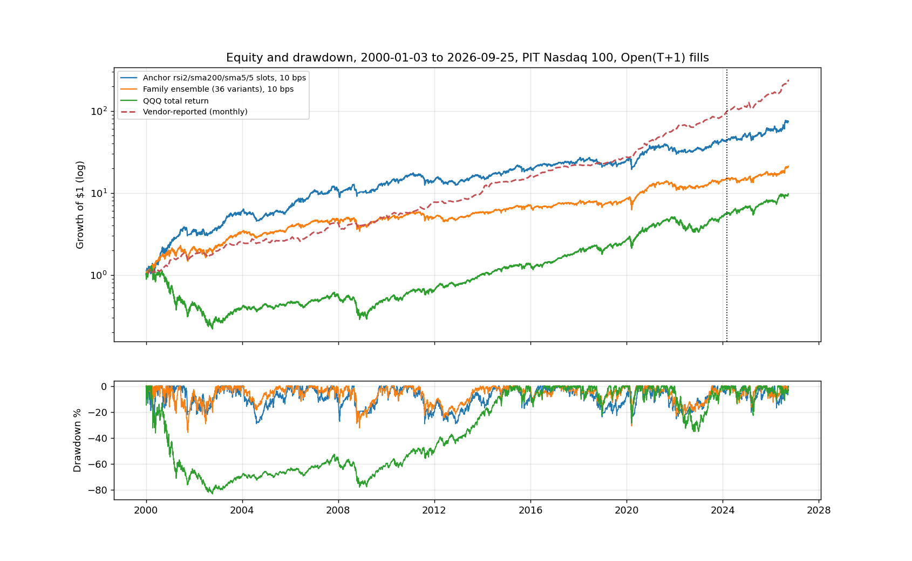
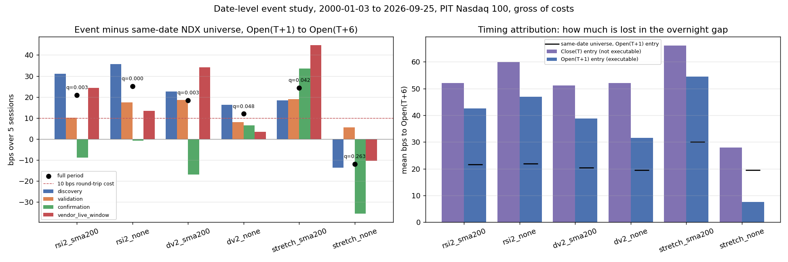

<!-- GENERATED FILE. EDIT THE CANONICAL KNOWLEDGE RECORD. -->

# SetupAlpha Nasdaq 100 mean-reversion claim audit

!!! warning "Research-only"
    This page summarizes saved research evidence. It does not authorize LIVE, allocation, or deployment.

## TL;DR

> **Verdict:** Vendor backtest profile is reproduced by a free generic RSI2/SMA200 NDX rule; timing edge is real (~20 bps per 5-day trade, beats random entries) but decays after 2014, halves at 10 bps and strains at $10M. Do not buy; do not trade live.

> **Status:** `diagnostic`

> **Disposition:** `diagnostic`

> **Replication:** `directionally_replicated`

## Research question

Determine whether a transparent, frozen family of generic long-only Nasdaq 100 oversold rules (point-in-time membership, next-open fills, 2/10/25 bps round trip) reproduces the headline profile claimed by the SetupAlpha Nasdaq 100 Mean-Reversion product (CAGR 22.8%, Sharpe 1.04, max drawdown -28.4%, 2000-2026), and whether its return comes from oversold timing rather than from simply holding Nasdaq 100 stocks, measured by date-equal event-minus-universe returns and a random-entry portfolio control.

## Exact setup

| Field | Value |
| --- | --- |
| Signal family | mean_reversion |
| Universe | ["Nasdaq 100 Current & Past, point-in-time membership (Norgate)"] |
| Decision | Close_T |
| Fill | Open_T+1 |
| Primary cost layer | central_research |
| Last reviewed | 2026-09-26T10:31:42+00:00 |

## Timing and overnight attribution

```text
information available: Close_T
primary executable fill: Open_T+1
```

If final `Close_T` data formed the signal, a hypothetical `Close_T` entry is diagnostic only unless a separate pre-close protocol was modeled. Comparing that diagnostic with `Open_(T+1)` and applying the compounded return identity shows whether the apparent edge occurred in the overnight gap. Missing attribution numbers mean **not tested**, not zero.

| Attribution field | Value |
| --- | --- |
| Status | tested |
| Diagnostic Path | Close_T to Open_T+6 |
| Executable Path | Open_T+1 to Open_T+6 |
| Method | Compounded overnight gap and executable-return decomposition on date-level events |
| Headline Result | 10-20 bps of the naive close-entry 5-session event return accrues in the non-capturable overnight gap (rsi2_sma200: 0.52% close-entry vs 0.43% executable). |
| Metrics | {"rsi2_sma200_close_entry": 0.0052, "rsi2_sma200_exec": 0.0043, "rsi2_sma200_gap": 0.001} |
| Artifact | pakal-research/reports/setupalpha_ndx_mean_reversion_audit/tables/event_edge_summary.csv |

## Primary metrics

| Metric | Value |
| --- | ---: |
| Period | 2000-01-03 to 2026-09-25 |
| Universe | Nasdaq 100 PIT |
| Cost Layer | central_research (10 bps RT) |
| Cagr | 17.50% |
| Annualized Volatility | 24.00% |
| Sharpe | 0.794 |
| Maximum Drawdown | -29.10% |
| Turnover | about 87x equity per year |

## Four separate verdicts

| Question | Conclusion |
| --- | --- |
| Source Replication | Rules unpublished (literal not_assessed). Pre-declared generic anchor RSI2<10 / Close>SMA200 / exit Close>SMA5 / 5 slots matches the vendor profile at 2 bps; family median is lower (directionally replicated). |
| Predictive Value | Oversold events beat the same-date NDX universe by ~0.2% over 5 sessions from Open_T+1 (5/6 definitions, BH q<=0.05); edge weakens after 2014 and RSI2 is negative in 2021-2024. |
| Economic Value | Anchor 10 bps: CAGR 17.5%, Sharpe 0.79, MaxDD -29%; 25 bps: 10.1%/0.52. Family median 10 bps: 10.8%/0.56. 67% of anchor log growth in 2000-2014. |
| Promotion | Fails frozen promotion rule; diagnostic. Do not buy the product; do not trade live. |

## Key findings

| Feature | Role | Direction | Status | Effect | Action |
| --- | --- | --- | --- | --- | --- |
| RSI2<10 entry | entry signal | low RSI2 -> higher 5-session return | diagnostic | +21 bps vs universe (with SMA200) | keep as diagnostic component; no stand-alone promotion |
| Close>SMA200 filter | risk overlay | filter on reduces drawdown | diagnostic | family median MaxDD -32% vs -69%; Sharpe 0.69 vs 0.41 | use as risk overlay in any dip-buying sleeve |
| DV2<10 entry | entry signal | low DV2 -> higher return | diagnostic | +18 bps (with SMA200) | no further work beyond existing DV2 study |
| ATR stretch below SMA10 | entry signal | stretch -> higher return with trend filter only | diagnostic | +24 bps with SMA200, -12 bps without | forward hypothesis only; low frequency (~6 trades/month) |

## Visual evidence






## Limitations

- Vendor rules unpublished; exact product not tested.
- Vendor live returns self-reported.
- ADV proxies opening-auction volume.
- Dividends excluded (CAPITALSPECIAL).
- Edge concentrated in 2000-2003.

## Next gates

- Optional: forward shadow of the frozen anchor with real MOO fills; compare to vendor monthly figures.
- Overlap/correlation of anchor with existing HPI and DV2 sleeves before any sleeve consideration.

## Sources

- `https://setupalpha.com/products/nasdaq-100-mean-reversion-realtest-strategy`
- `pakal-research/reports/setupalpha_ndx_mean_reversion_audit/data/source_vendor_claims_2026-09-26.json`
- `pakal-research/reports/dv2_hpi_diversification_study`
- `pakal-research/reports/cross_sectional_rsi2_sma200_regime_followup`

## Canonical artifacts

| Artifact | Pakal path |
| --- | --- |
| Concise Report | `pakal-research/reports/setupalpha_ndx_mean_reversion_audit/REPORT.md` |
| Full Report | `pakal-research/reports/setupalpha_ndx_mean_reversion_audit/REPORT_FULL.md` |
| Notebook | `pakal-research/setupalpha_ndx_mean_reversion_audit.ipynb` |
| Frozen Specification | `pakal-research/reports/setupalpha_ndx_mean_reversion_audit/research_spec_frozen.json` |
| Manifest | `pakal-research/reports/setupalpha_ndx_mean_reversion_audit/run_manifest.json` |
| Primary Source Code | `["pakal-research/setupalpha_ndx_mean_reversion_audit.py", "pakal-research/build_setupalpha_ndx_mean_reversion_artifacts.py", "pakal-research/build_setupalpha_ndx_mean_reversion_notebook.py"]` |
| Primary Tables | `["pakal-research/reports/setupalpha_ndx_mean_reversion_audit/tables/family_period_summary.csv", "pakal-research/reports/setupalpha_ndx_mean_reversion_audit/tables/event_edge_summary.csv", "pakal-research/reports/setupalpha_ndx_mean_reversion_audit/tables/random_control_percentiles.csv", "pakal-research/reports/setupalpha_ndx_mean_reversion_audit/tables/capacity_summary.csv", "pakal-research/reports/setupalpha_ndx_mean_reversion_audit/tables/vendor_monthly_correlation.csv"]` |
| Primary Charts | `["pakal-research/reports/setupalpha_ndx_mean_reversion_audit/charts/family_vs_vendor_claim.png", "pakal-research/reports/setupalpha_ndx_mean_reversion_audit/charts/event_edge_and_timing.png", "pakal-research/reports/setupalpha_ndx_mean_reversion_audit/charts/random_entry_control.png", "pakal-research/reports/setupalpha_ndx_mean_reversion_audit/charts/equity_drawdown_vs_vendor.png"]` |
| Research State | `pakal-research/reports/setupalpha_ndx_mean_reversion_audit/research_state.json` |
| Hypothesis Registry | `pakal-research/reports/setupalpha_ndx_mean_reversion_audit/hypothesis_registry.json` |
| Experiment Ledger | `pakal-research/reports/setupalpha_ndx_mean_reversion_audit/experiment_ledger.jsonl` |
| Decision Log | `pakal-research/reports/setupalpha_ndx_mean_reversion_audit/decision_log.jsonl` |
| Source Rule Map | `pakal-research/reports/setupalpha_ndx_mean_reversion_audit/SOURCE_RULE_MAP.md` |
