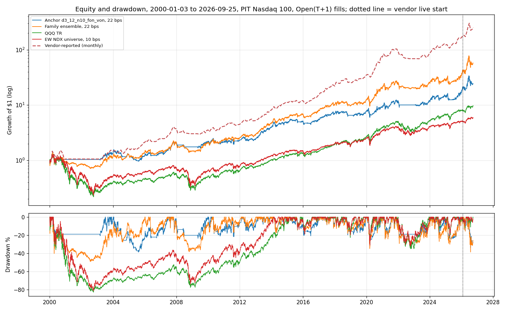
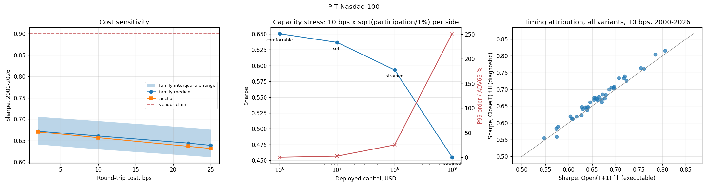

<!-- GENERATED FILE. EDIT THE CANONICAL KNOWLEDGE RECORD. -->

# SetupAlpha NASDAQ momentum rotation claim audit

!!! warning "Research-only"
    This page summarizes saved research evidence. It does not authorize LIVE, allocation, or deployment.

## TL;DR

> **Verdict:** Generic NDX momentum rotation earns a real but modest ranking edge (anchor 13% CAGR, Sharpe 0.66 at 10 bps; beats 97% of random-rank rotations; beats QQQ Sharpe 0.45) but the vendor claim (23.1%, Sharpe 0.9) sits above all 40 transparent variants and would need tens of thousands of tries to appear by luck. Do not buy; do not trade live.

> **Status:** `diagnostic`

> **Disposition:** `diagnostic`

> **Replication:** `directionally_replicated`

## Research question

Determine whether a transparent, frozen family of 40 generic monthly momentum-rotation rules on point-in-time Nasdaq 100 members (month-end signal, Open_T+1 fills, 2/10/22/25 bps round trip) reproduces the headline profile claimed by the SetupAlpha NASDAQ Momentum Rotation product (CAGR 23.1%, Sharpe 0.9, MaxDD -49.7%, worst year -25.7%, 2000-2026), and whether its return comes from momentum ranking rather than from holding Nasdaq 100 stocks, measured against random-rank rotation with the same N, weights and turnover (100 seeds), an equal-weight universe and QQQ buy-and-hold.

## Exact setup

| Field | Value |
| --- | --- |
| Signal family | momentum_rotation |
| Universe | ["Nasdaq 100 Current & Past, point-in-time membership (Norgate)"] |
| Decision | Close_T (last session of month) |
| Fill | Open_T+1 |
| Primary cost layer | central_research |
| Last reviewed | 2026-09-26T12:11:35+00:00 |

## Timing and overnight attribution

```text
information available: Close_T (last session of month)
primary executable fill: Open_T+1
```

If final `Close_T` data formed the signal, a hypothetical `Close_T` entry is diagnostic only unless a separate pre-close protocol was modeled. Comparing that diagnostic with `Open_(T+1)` and applying the compounded return identity shows whether the apparent edge occurred in the overnight gap. Missing attribution numbers mean **not tested**, not zero.

| Attribution field | Value |
| --- | --- |
| Status | tested |
| Diagnostic Path | rebalance at the signal Close_T |
| Executable Path | rebalance at Open_T+1 |
| Method | Every family variant run with both fills at 10 bps; median same_close minus next_open Sharpe and CAGR |
| Headline Result | Same-close adds only +0.01 Sharpe / +0.3 pp CAGR (median, full period); monthly rotation is not timing-sensitive. |
| Metrics | {"median_cagr_diff_full": 0.0033, "median_sharpe_diff_full": 0.0107} |
| Artifact | pakal-research/reports/setupalpha_ndx_momentum_rotation_audit/tables/timing_attribution_summary.csv |

## Primary metrics

| Metric | Value |
| --- | ---: |
| Period | 2000-01-03 to 2026-09-25 |
| Universe | Nasdaq 100 PIT |
| Cost Layer | central_research (10 bps RT) |
| Cagr | 13.30% |
| Annualized Volatility | 23.00% |
| Sharpe | 0.657 |
| Maximum Drawdown | -38.20% |
| Turnover | about 7.8x equity per year |

## Four separate verdicts

| Question | Conclusion |
| --- | --- |
| Source Replication | Rules unpublished (literal not_assessed). Family median at 22 bps 14.9%/0.64/-52.8% vs vendor 23.1%/0.90/-49.7%: directionally replicated; the vendor sits above all 40 variants. |
| Predictive Value | Momentum rank beats random-rank rotations with identical count, weights and turnover (97th percentile full period; 77th in 2021-2026). |
| Economic Value | Anchor 10 bps: CAGR 13.3%, Sharpe 0.66, MaxDD -38%; beats QQQ (0.45) and equal-weight NDX (0.38) on Sharpe; family median Sharpe 0.59/0.91/0.59 by slice. |
| Promotion | Fails frozen economic leg (median Sharpe >=0.70 per slice). diagnostic; do not buy, do not trade live. |

## Key findings

| Feature | Role | Direction | Status | Effect | Action |
| --- | --- | --- | --- | --- | --- |
| 12m / dual 3+12 momentum rank | rank | higher rank -> higher next-month return | diagnostic | anchor CAGR 13.3% vs random-rank median 7.3% at equal exposure | keep as known component; no stand-alone promotion |
| QQQ 63-day vol scaling | risk overlay | lower exposure when index vol is high | promising_component | median Sharpe 0.63 -> 0.72, MaxDD -77% -> -49% at equal CAGR (filter off) | candidate overlay for any NDX long book; forward shadow only |
| QQQ>SMA200 and stock>SMA100 entry filter | risk overlay | cash in index downtrends | diagnostic | median CAGR 17.1% -> 15.1%, MaxDD -77% -> -53% | use only as drawdown control |

## Visual evidence






## Limitations

- Vendor rules unpublished.
- Vendor live window only ~8 months and self-reported.
- CAPITALSPECIAL excludes dividends while QQQ is total return.
- ADV proxies opening-auction volume.
- 2026 book concentrated in semiconductors (live-window vol 56%).

## Next gates

- Optional forward shadow of the frozen anchor and index-vol overlay versus vendor monthly figures.

## Sources

- `https://setupalpha.com/products/nasdaq-momentum-rotation-strategy (snapshot pakal-research/reports/setupalpha_catalog_audit/sources/nasdaq-momentum-rotation-strategy.txt, sha256 4bb80f52a1a18553c4baeaf870b91fabb87745880bacd332bffb66b75f171beb)`
- `pakal-research/reports/setupalpha_catalog_audit/AGENT_BRIEF.md`

## Canonical artifacts

| Artifact | Pakal path |
| --- | --- |
| Concise Report | `pakal-research/reports/setupalpha_ndx_momentum_rotation_audit/REPORT.md` |
| Full Report | `pakal-research/reports/setupalpha_ndx_momentum_rotation_audit/REPORT_FULL.md` |
| Notebook | `pakal-research/setupalpha_ndx_momentum_rotation_audit.ipynb` |
| Frozen Specification | `pakal-research/reports/setupalpha_ndx_momentum_rotation_audit/research_spec_frozen.json` |
| Manifest | `pakal-research/reports/setupalpha_ndx_momentum_rotation_audit/run_manifest.json` |
| Primary Source Code | `["pakal-research/setupalpha_ndx_momentum_rotation_audit.py", "pakal-research/setupalpha_ndx_momentum_rotation_audit.py", "pakal-research/build_setupalpha_momentum_rotation_artifacts.py", "pakal-research/build_setupalpha_momentum_rotation_notebook.py", "pakal-research/build_setupalpha_momentum_rotation_manifest.py", "tests/test_setupalpha_momentum_rotation_audits.py"]` |
| Primary Tables | `["pakal-research/reports/setupalpha_ndx_momentum_rotation_audit/tables/family_period_summary.csv", "pakal-research/reports/setupalpha_ndx_momentum_rotation_audit/tables/family_median_by_period.csv", "pakal-research/reports/setupalpha_ndx_momentum_rotation_audit/tables/random_control_percentiles.csv", "pakal-research/reports/setupalpha_ndx_momentum_rotation_audit/tables/selection_bias_summary.csv", "pakal-research/reports/setupalpha_ndx_momentum_rotation_audit/tables/capacity_summary.csv", "pakal-research/reports/setupalpha_ndx_momentum_rotation_audit/tables/vendor_monthly_correlation.csv"]` |
| Primary Charts | `["pakal-research/reports/setupalpha_ndx_momentum_rotation_audit/charts/family_vs_vendor_claim.png", "pakal-research/reports/setupalpha_ndx_momentum_rotation_audit/charts/random_rank_control.png", "pakal-research/reports/setupalpha_ndx_momentum_rotation_audit/charts/equity_drawdown_vs_vendor.png", "pakal-research/reports/setupalpha_ndx_momentum_rotation_audit/charts/cost_capacity_timing.png"]` |
| Research State | `pakal-research/reports/setupalpha_ndx_momentum_rotation_audit/research_state.json` |
| Hypothesis Registry | `pakal-research/reports/setupalpha_ndx_momentum_rotation_audit/hypothesis_registry.json` |
| Experiment Ledger | `pakal-research/reports/setupalpha_ndx_momentum_rotation_audit/experiment_ledger.jsonl` |
| Decision Log | `pakal-research/reports/setupalpha_ndx_momentum_rotation_audit/decision_log.jsonl` |
| Source Rule Map | `pakal-research/reports/setupalpha_ndx_momentum_rotation_audit/SOURCE_RULE_MAP.md` |
