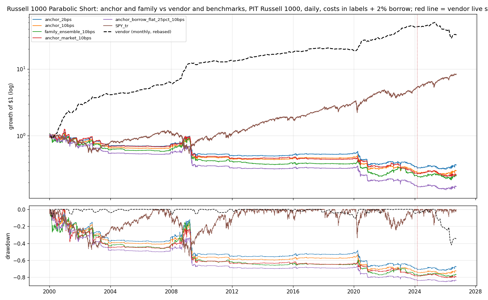
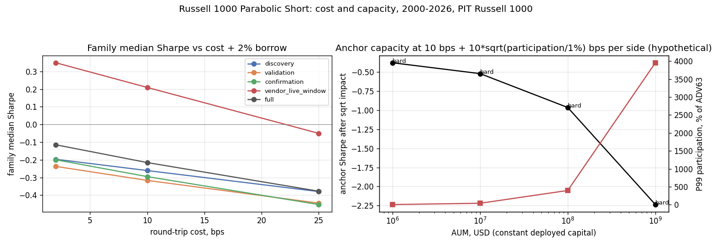

<!-- GENERATED FILE. EDIT THE CANONICAL KNOWLEDGE RECORD. -->

# SetupAlpha Russell 1000 Parabolic Short claim audit

!!! warning "Research-only"
    This page summarizes saved research evidence. It does not authorize LIVE, allocation, or deployment.

## TL;DR

> **Verdict:** Vendor profile (13.9% CAGR, Sharpe 1.09) is not reproduced: a frozen 24-variant generic R1000 parabolic-short family loses money 2000-2026 (median -3.6%, Sharpe -0.12 at 2 bps + 2% borrow; best 0.07) and cracked parabolic names show no significant 2-session underperformance vs the universe. Borrow stress and squeeze tails make it worse. The vendor's own live record (-10%/yr, -42% drawdown since 2024-03 vs -11% worst backtest drawdown) fits an overfit backtest. Do not buy; do not trade.

> **Status:** `diagnostic`

> **Disposition:** `rejected`

> **Replication:** `not_reproducible`

## Research question

Determine whether a transparent frozen family of 24 generic Russell 1000 parabolic-short books (N-day run through Close_(T-1) with >= 3 up closes, crack on day T, day sell-short limit at Close_T with a mirrored conservative fill, cover by a 5% limit target and/or market on open, 2% borrow, 2/10/25 bps round trip, point-in-time membership) reproduces the SetupAlpha Parabolic Short headline profile (CAGR 13.88%, Sharpe 1.09, MAR 0.32 / MaxDD -43.4%, worst year -16.1%, 2000-2026), whether exhausted names underperform the same-date universe (date-level HAC test, BH across 6 definitions) beyond a random-short control, and whether the edge survives hard-to-borrow fees, locate failures, optimistic-versus-conservative limit fills and gap-up squeeze tails.

## Exact setup

| Field | Value |
| --- | --- |
| Signal family | short_exhaustion_reversal |
| Universe | ["Russell 1000 Current & Past, point-in-time membership (Norgate), raw close >= $5"] |
| Decision | Close_T |
| Fill | day sell-short limit at Close_T during T+1 (conservative 0.1% penetration); cover by limit on e+1..e+2 or at the declared open |
| Primary cost layer | central_research |
| Last reviewed | 2026-09-26T12:16:05+00:00 |

## Timing and overnight attribution

```text
information available: Close_T
primary executable fill: day sell-short limit at Close_T during T+1 (conservative 0.1% penetration); cover by limit on e+1..e+2 or at the declared open
```

If final `Close_T` data formed the signal, a hypothetical `Close_T` entry is diagnostic only unless a separate pre-close protocol was modeled. Comparing that diagnostic with `Open_(T+1)` and applying the compounded return identity shows whether the apparent edge occurred in the overnight gap. Missing attribution numbers mean **not tested**, not zero.

| Attribution field | Value |
| --- | --- |
| Status | tested |
| Diagnostic Path | Close_T to Open_T+3 |
| Executable Path | Open_T+1 to Open_T+3 |
| Method | Compounded overnight gap decomposition on date-level events plus conservative-limit vs touch vs market-on-open short entries |
| Headline Result | Overnight gap after the crack is small (-0.01 to -0.16 pp long-side); close entry does not rescue the edge. Touch fills add about 0.35 pp CAGR over conservative fills; market-on-open short entries are worse. |
| Metrics | {"anchor_cagr_conservative_10bps": -0.0442, "anchor_cagr_market_10bps": -0.0491, "anchor_cagr_touch_10bps": -0.0406, "r10_30_lowbreak_close_entry_long": 0.0036, "r10_30_lowbreak_exec_long": 0.0038} |
| Artifact | pakal-research/reports/setupalpha_r1000_parabolic_short_audit/tables/event_edge_summary.csv |

## Primary metrics

| Metric | Value |
| --- | ---: |
| Period | 2000-01-03 to 2026-09-25 |
| Universe | Russell 1000 PIT |
| Cost Layer | central_research (10 bps RT + 2% annual borrow) |
| Cagr | -4.40% |
| Annualized Volatility | 12.00% |
| Sharpe | -0.312 |
| Maximum Drawdown | -76.20% |
| Turnover | about 18.6x equity per year (92 trades/yr, 2.3-session hold, ~9% average gross exposure) |

## Four separate verdicts

| Question | Conclusion |
| --- | --- |
| Source Replication | Rules unpublished (literal not_assessed). Profile not reproduced: vendor Sharpe 1.09 vs family max 0.07; anchor r10_30/lowbreak/tgt5_mkt3/10 slots -3.7%/-0.25/-72% at 2 bps + 2% borrow. |
| Predictive Value | Universe-minus-event 2-session short edge -0.23..+0.04 pp across 6 definitions, none significant (BH q>=0.52); the anchor definition is wrong-signed. |
| Economic Value | Anchor 10 bps + 2% borrow -4.4%/-0.31/-76%; positive only in the vendor live window (3.2%, Sharpe 0.33), which falls to 0.09 at 25% borrow and -0.16 at 50%. |
| Promotion | Rejected; diagnostic. No forward shadow. |

## Key findings

| Feature | Role | Direction | Status | Effect | Action |
| --- | --- | --- | --- | --- | --- |
| N-day parabolic run (>=3 up closes) plus crack | entry signal (short) | cracked runs -> 2-session underperformance (hypothesised) | rejected | -0.23..+0.04 pp universe-minus-event | do not use |
| hard-to-borrow fee | cost stress | negative | diagnostic | 0.24%/trade at 25%, 0.48%/trade at 50% (2-3 calendar days) | always stress short books at 25-50% on extended names |
| gap-up squeeze tail | risk | negative skew | diagnostic | trade skew -1.5, P1 -28%, worst -52%, worst adverse gap -36% | any short-exhaustion idea needs a hard stop and squeeze stress |

## Visual evidence






## Limitations

- Vendor rules unpublished; exact product not tested.
- Actual borrow availability, fees, recalls and SSR not observed (stress scenarios only).
- No short rebate on proceeds.
- Vendor live returns self-reported.
- Limit price level (Close_T) is an assumption.

## Next gates

- None.

## Sources

- `https://setupalpha.com/products/parabolic-short-realtest-qullamaggie-strategy`
- `pakal-research/reports/setupalpha_catalog_audit/sources/parabolic-short-realtest-qullamaggie-strategy.txt`
- `pakal-research/reports/setupalpha_r1000_parabolic_short_audit/data/source_vendor_claims_2026-09-26.json`

## Canonical artifacts

| Artifact | Pakal path |
| --- | --- |
| Concise Report | `pakal-research/reports/setupalpha_r1000_parabolic_short_audit/REPORT.md` |
| Full Report | `pakal-research/reports/setupalpha_r1000_parabolic_short_audit/REPORT_FULL.md` |
| Notebook | `pakal-research/setupalpha_r1000_parabolic_short_audit.ipynb` |
| Frozen Specification | `pakal-research/reports/setupalpha_r1000_parabolic_short_audit/research_spec_frozen.json` |
| Manifest | `pakal-research/reports/setupalpha_r1000_parabolic_short_audit/run_manifest.json` |
| Primary Source Code | `["pakal-research/setupalpha_r1000_parabolic_short_audit.py", "pakal-research/setupalpha_limit_trend_short_engine.py", "pakal-research/build_setupalpha_breakout_parabolic_artifacts.py", "pakal-research/build_setupalpha_breakout_parabolic_notebooks.py", "pakal-research/build_setupalpha_breakout_parabolic_manifests.py", "pakal-research/freeze_setupalpha_breakout_parabolic_specs.py"]` |
| Primary Tables | `["pakal-research/reports/setupalpha_r1000_parabolic_short_audit/tables/family_period_summary.csv", "pakal-research/reports/setupalpha_r1000_parabolic_short_audit/tables/event_edge_summary.csv", "pakal-research/reports/setupalpha_r1000_parabolic_short_audit/tables/random_control_percentiles.csv", "pakal-research/reports/setupalpha_r1000_parabolic_short_audit/tables/borrow_stress.csv", "pakal-research/reports/setupalpha_r1000_parabolic_short_audit/tables/squeeze_tail.csv", "pakal-research/reports/setupalpha_r1000_parabolic_short_audit/tables/selection_bias.csv", "pakal-research/reports/setupalpha_r1000_parabolic_short_audit/tables/execution_fill_model_comparison.csv", "pakal-research/reports/setupalpha_r1000_parabolic_short_audit/tables/capacity_summary.csv", "pakal-research/reports/setupalpha_r1000_parabolic_short_audit/tables/annual_returns_vs_vendor.csv"]` |
| Primary Charts | `["pakal-research/reports/setupalpha_r1000_parabolic_short_audit/charts/family_vs_vendor_claim.png", "pakal-research/reports/setupalpha_r1000_parabolic_short_audit/charts/equity_drawdown_vs_vendor.png", "pakal-research/reports/setupalpha_r1000_parabolic_short_audit/charts/random_entry_control.png", "pakal-research/reports/setupalpha_r1000_parabolic_short_audit/charts/event_edge_by_period.png", "pakal-research/reports/setupalpha_r1000_parabolic_short_audit/charts/short_side_realism.png", "pakal-research/reports/setupalpha_r1000_parabolic_short_audit/charts/annual_returns_vs_vendor.png", "pakal-research/reports/setupalpha_r1000_parabolic_short_audit/charts/cost_and_capacity.png"]` |
| Research State | `pakal-research/reports/setupalpha_r1000_parabolic_short_audit/research_state.json` |
| Hypothesis Registry | `pakal-research/reports/setupalpha_r1000_parabolic_short_audit/hypothesis_registry.json` |
| Experiment Ledger | `pakal-research/reports/setupalpha_r1000_parabolic_short_audit/experiment_ledger.jsonl` |
| Decision Log | `pakal-research/reports/setupalpha_r1000_parabolic_short_audit/decision_log.jsonl` |
| Source Rule Map | `pakal-research/reports/setupalpha_r1000_parabolic_short_audit/SOURCE_RULE_MAP.md` |
| Catalog Entry | `pakal-research/reports/setupalpha_r1000_parabolic_short_audit/catalog_entry.md` |
