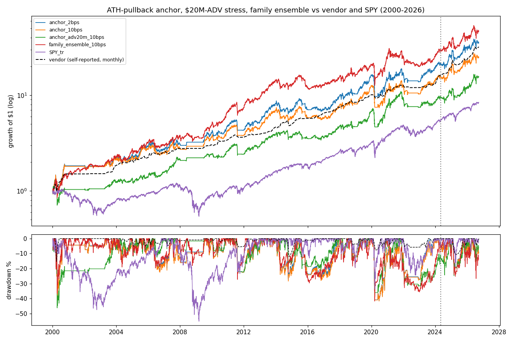
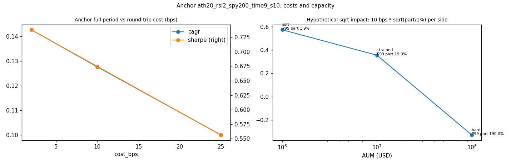

<!-- GENERATED FILE. EDIT THE CANONICAL KNOWLEDGE RECORD. -->

# SetupAlpha Russell 3000 all-time-high pullback mean-reversion audit

!!! warning "Research-only"
    This page summarizes saved research evidence. It does not authorize LIVE, allocation, or deployment.

## TL;DR

> **Verdict:** A generic Russell 3000 ATH-pullback family reproduces the vendor's return level (median 15.4% CAGR at 2 bps) but not its risk (Sharpe 0.74 vs 1.09, MaxDD -52% vs -24%). The RSI2 pullback after a recent all-time high adds ~30 bps per 9-day trade over liquid R3000 names and ~20 bps over a generic pullback, but the edge sits in 2000-2014 and 2024-26 and is ~0 in 2015-2024; limit-fill optimism is worth ~1/3 of CAGR; small-cap capacity is soft at $1M and strained at $10M. Do not buy; do not trade live.

> **Status:** `diagnostic`

> **Disposition:** `diagnostic`

> **Replication:** `directionally_replicated`

## Research question

Determine whether a frozen generic family of long-only Russell 3000 'pullback after a new all-time high' rules (PIT membership, declared price/ADV floors, day-limit entries with a 0.1% penetration buffer, MOO exits, 2/10/25 bps) reproduces the SetupAlpha All-Time-High Mean-Reversion profile (Sharpe 1.09, CAGR 13.85%, MaxDD -24%, worst year -5.3%, 2000-2026), and whether the return comes from the ATH condition and the pullback timing rather than from holding liquid Russell 3000 stocks, measured by date-equal event-minus-universe tests (ATH-pullback vs universe, vs generic pullback, and ATH-without-pullback) and a random-entry control; plus limit-fill realism and small-cap capacity.

## Exact setup

| Field | Value |
| --- | --- |
| Signal family | mean_reversion |
| Universe | ["Russell 3000 Current & Past, PIT membership, raw close >= $5, ADV63 >= $5M, > 252 sessions (Norgate, lane cache r3000_ath)"] |
| Decision | Close_T |
| Fill | day limit during session T+1 at Close_T - 0.5*ATR10 (0.1% penetration); MOO exits |
| Primary cost layer | central_research |
| Last reviewed | 2026-09-26T12:20:42+00:00 |

## Timing and overnight attribution

```text
information available: Close_T
primary executable fill: day limit during session T+1 at Close_T - 0.5*ATR10 (0.1% penetration); MOO exits
```

If final `Close_T` data formed the signal, a hypothetical `Close_T` entry is diagnostic only unless a separate pre-close protocol was modeled. Comparing that diagnostic with `Open_(T+1)` and applying the compounded return identity shows whether the apparent edge occurred in the overnight gap. Missing attribution numbers mean **not tested**, not zero.

| Attribution field | Value |
| --- | --- |
| Status | tested |
| Diagnostic Path | MOO market entry at Open_T+1 and optimistic touch/uncapped limit fills |
| Executable Path | limit entry with 0.1% penetration and orders capped at free slots |
| Method | Fill-model ladder on the same anchor; event tests from Open_T+1 to Open_T+10 |
| Headline Result | Touch-uncapped fills lift anchor CAGR from 12.8% to 18.4% and Sharpe from 0.67 to 0.88 at 10 bps; MOO entry 9.8%/0.49; strict 0.5% 8.3%/0.49. |
| Metrics | {"primary_cagr_10bps": 0.128, "primary_order_fill_rate": 0.361, "primary_sharpe_10bps": 0.675, "touch_uncapped_cagr_10bps": 0.184, "touch_uncapped_sharpe_10bps": 0.881, "uncapped_order_fill_rate": 0.07} |
| Artifact | pakal-research/reports/setupalpha_r3000_ath_pullback_audit/tables/limit_fill_realism.csv |

## Primary metrics

| Metric | Value |
| --- | ---: |
| Period | 2000-01-03 to 2026-09-25 |
| Universe | Russell 3000 PIT liquid ($5, $5M ADV63) |
| Cost Layer | central_research (10 bps RT) |
| Cagr | 12.80% |
| Annualized Volatility | 21.10% |
| Sharpe | 0.675 |
| Maximum Drawdown | -41.70% |
| Turnover | about 33x equity per year |

## Four separate verdicts

| Question | Conclusion |
| --- | --- |
| Source Replication | Rules unpublished (literal not_assessed). Family median at 2 bps: CAGR 15.4%, Sharpe 0.74, MaxDD -51.7% vs vendor 13.85%/1.09/-24%: return level reproduced, risk profile not. |
| Predictive Value | RSI2<10 within 10-20 sessions of a new ATH beats liquid R3000 members by ~30 bps per 9 sessions (q<=0.006) and a generic RSI2 pullback by ~20 bps (q 0.06-0.09); ATH without pullback +6 bps (n.s.); ATR-distance pullback fails; edge ~0 in 2015-2024. |
| Economic Value | Anchor ath20_rsi2_spy200_time9_s10 at 10 bps: CAGR 12.8%, Sharpe 0.68, MaxDD -41.7%; 25 bps 10.0%/0.56; beats 100% of random controls; soft at $1M, strained at $10M, hard at $100M; ADV>=$20M floor 10.8%/0.61. |
| Promotion | Fails the frozen promotion rule; diagnostic. Do not buy; do not trade live above ~$1M. |

## Key findings

| Feature | Role | Direction | Status | Effect | Action |
| --- | --- | --- | --- | --- | --- |
| RSI2<10 within K sessions of a new all-time high | entry signal | ATH-recent dip -> higher 9-session return | diagnostic | +30 bps (K=10) / +33 bps (K=20) vs liquid members; +20 bps vs generic RSI2 pullback | forward hypothesis only; small component |
| Close <= ATH - 2*ATR10 pullback | entry signal | deeper dip from ATH | rejected | +10..+17 bps vs members | reject |
| recent ATH without pullback | diagnostic (momentum control) | near-high stocks | rejected | +6 bps vs members | none |
| SPY > SMA200 regime filter | risk overlay | flat in bear markets | diagnostic | median MaxDD -44% vs -56%, Sharpe 0.67 vs 0.69, CAGR 12.8% vs 15.7% | use as risk overlay only |

## Visual evidence






## Limitations

- Vendor rules and liquidity filter unpublished; pullback, limit and exit definitions are standard guesses.
- ATH is 'since 1990' for older listings.
- Nominal dollar floors admit fewer names in 2000 (1,300) than 2026 (2,200).
- Daily bars cannot resolve intraday order of limit fills.
- Vendor live returns self-reported.
- Dividends excluded (CAPITALSPECIAL).

## Next gates

- Optional forward shadow of the anchor with real day-limit orders and a ~$1M cap to measure fill rates.

## Sources

- `https://setupalpha.com/products/all-time-high-mean-reversion-realtest-strategy`
- `pakal-research/reports/setupalpha_catalog_audit/sources/all-time-high-mean-reversion-realtest-strategy.txt`
- `pakal-research/reports/setupalpha_ndx_mean_reversion_audit`

## Canonical artifacts

| Artifact | Pakal path |
| --- | --- |
| Concise Report | `pakal-research/reports/setupalpha_r3000_ath_pullback_audit/REPORT.md` |
| Full Report | `pakal-research/reports/setupalpha_r3000_ath_pullback_audit/REPORT_FULL.md` |
| Notebook | `pakal-research/setupalpha_r3000_ath_pullback_audit.ipynb` |
| Frozen Specification | `pakal-research/reports/setupalpha_r3000_ath_pullback_audit/research_spec_frozen.json` |
| Manifest | `pakal-research/reports/setupalpha_r3000_ath_pullback_audit/run_manifest.json` |
| Primary Source Code | `["pakal-research/setupalpha_r3000_ath_pullback_audit.py", "pakal-research/setupalpha_limit_mr_engine.py", "pakal-research/setupalpha_lane_common.py", "pakal-research/build_setupalpha_r3000_ath_pullback_notebook.py", "pakal-research/build_setupalpha_r3000_ath_pullback_manifest.py"]` |
| Primary Tables | `["pakal-research/reports/setupalpha_r3000_ath_pullback_audit/tables/family_period_summary.csv", "pakal-research/reports/setupalpha_r3000_ath_pullback_audit/tables/event_edge_summary.csv", "pakal-research/reports/setupalpha_r3000_ath_pullback_audit/tables/limit_fill_realism.csv", "pakal-research/reports/setupalpha_r3000_ath_pullback_audit/tables/random_control_percentiles.csv", "pakal-research/reports/setupalpha_r3000_ath_pullback_audit/tables/capacity_summary.csv", "pakal-research/reports/setupalpha_r3000_ath_pullback_audit/tables/liquidity_floor_stress.csv", "pakal-research/reports/setupalpha_r3000_ath_pullback_audit/tables/selection_bias.csv", "pakal-research/reports/setupalpha_r3000_ath_pullback_audit/tables/annual_returns_vs_vendor.csv"]` |
| Primary Charts | `["pakal-research/reports/setupalpha_r3000_ath_pullback_audit/charts/family_vs_vendor_claim.png", "pakal-research/reports/setupalpha_r3000_ath_pullback_audit/charts/event_edge_by_slice.png", "pakal-research/reports/setupalpha_r3000_ath_pullback_audit/charts/limit_fill_realism.png", "pakal-research/reports/setupalpha_r3000_ath_pullback_audit/charts/equity_drawdown_vs_vendor.png", "pakal-research/reports/setupalpha_r3000_ath_pullback_audit/charts/cost_and_capacity.png"]` |
| Research State | `pakal-research/reports/setupalpha_r3000_ath_pullback_audit/research_state.json` |
| Hypothesis Registry | `pakal-research/reports/setupalpha_r3000_ath_pullback_audit/hypothesis_registry.json` |
| Experiment Ledger | `pakal-research/reports/setupalpha_r3000_ath_pullback_audit/experiment_ledger.jsonl` |
| Decision Log | `pakal-research/reports/setupalpha_r3000_ath_pullback_audit/decision_log.jsonl` |
| Source Rule Map | `pakal-research/reports/setupalpha_r3000_ath_pullback_audit/SOURCE_RULE_MAP.md` |
| Catalog Entry | `pakal-research/reports/setupalpha_r3000_ath_pullback_audit/catalog_entry.md` |
| Universe Cache | `pakal-research/reports/setupalpha_catalog_audit/shared_data/r3000_ath` |
