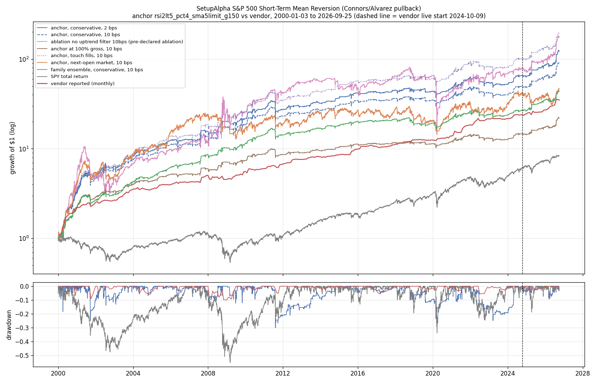
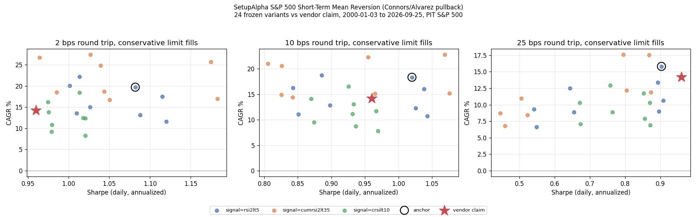

<!-- GENERATED FILE. EDIT THE CANONICAL KNOWLEDGE RECORD. -->

# SetupAlpha S&P 500 Short-Term Mean Reversion (Connors/Alvarez pullback) claim audit

!!! warning "Research-only"
    This page summarizes saved research evidence. It does not authorize LIVE, allocation, or deployment.

## TL;DR

> **Verdict:** Vendor profile is replicated (even exceeded) by a free generic RSI2<5/SMA200/4%-limit rule: anchor 18.3%/Sharpe 1.02/-30% at 10 bps with 150% gross. The edge lives in the deep limit fill and the uptrend filter, is concentrated in 2000-2002 and 2024-2026, and is weak 2015-2024 (Sharpe 0.35-0.51). Frozen promotion rule fails; forward hypothesis.

> **Status:** `forward_hypothesis`

> **Disposition:** `promising_component`

> **Replication:** `replicated`

## Research question

Determine whether a transparent frozen family of generic long-only S&P 500 limit-entry mean-reversion rules (point-in-time membership, conservative limit fills, 2/10/25 bps round trip) reproduces the headline profile of the SetupAlpha product 'SetupAlpha S&P 500 Short-Term Mean Reversion (Connors/Alvarez pullback)' (CAGR 14.21%, Sharpe 0.96, worst year -9.9%), whether its return comes from the setup timing rather than from buying any S&P 500 name on a limit dip (date-equal event-minus-universe tests and a random-name limit control), and how much of it depends on optimistic limit fills (touch vs penetration vs next-open market).

## Exact setup

| Field | Value |
| --- | --- |
| Signal family | mean_reversion |
| Universe | ["S&P 500 Current & Past, point-in-time membership (Norgate), raw close >= $5"] |
| Decision | Close_T |
| Fill | day limit on T+1 (conservative 0.1% penetration); touch and Open_T+1 market reported |
| Primary cost layer | central_research |
| Last reviewed | 2026-09-26T12:21:17+00:00 |

## Timing and overnight attribution

```text
information available: Close_T
primary executable fill: day limit on T+1 (conservative 0.1% penetration); touch and Open_T+1 market reported
```

If final `Close_T` data formed the signal, a hypothetical `Close_T` entry is diagnostic only unless a separate pre-close protocol was modeled. Comparing that diagnostic with `Open_(T+1)` and applying the compounded return identity shows whether the apparent edge occurred in the overnight gap. Missing attribution numbers mean **not tested**, not zero.

| Attribution field | Value |
| --- | --- |
| Status | tested |
| Diagnostic Path | Close_T to Open_T+1+7 |
| Executable Path | Open_T+1 (market) or conservative limit fill to Open_T+1+7 |
| Method | Date-level event means of close-entry, open-entry, overnight gap and limit-filled returns |
| Headline Result | rsi2lt5_sma200: close entry 0.39%, open entry 0.33%, gap 0.07%, limit-filled 0.99% (fill rate 5%) |
| Metrics | {"close_entry": 0.003935465763195, "gap": 0.0006783112257449, "limit_filled": 0.0098890927530244, "open_entry": 0.0032578033995501} |
| Artifact | pakal-research/reports/setupalpha_sp500_connors_alvarez_audit/tables/event_edge_summary.csv |

## Primary metrics

| Metric | Value |
| --- | ---: |
| Period | 2000-01-03 to 2026-09-25 |
| Universe | S&P 500 PIT |
| Cost Layer | central_research (10 bps RT), conservative limit fills |
| Cagr | 18.34% |
| Annualized Volatility | 18.08% |
| Sharpe | 1.020 |
| Maximum Drawdown | -30.06% |
| Turnover | 8.0 trades/month, average hold 3.8 sessions |

## Four separate verdicts

| Question | Conclusion |
| --- | --- |
| Source Replication | Rules unpublished (literal not_assessed). Generic Connors/Alvarez reading reproduces and exceeds the profile: 150%-gross family median at 2 bps 19.9%/1.02/-30% vs vendor 14.2%/0.96/-19% (replicated; vendor at the bottom of the family on Sharpe). |
| Predictive Value | Market-entry pullback-in-uptrend edge small (+4..+7 bps over 7 sessions, q>=0.31); deep limit fills +67..+112 bps vs universe (q<0.001); random-name 4%-limit control Sharpe 0.58 vs anchor 1.02. |
| Economic Value | Anchor 10 bps: 18.3%/Sharpe 1.02/MaxDD -30% (150% gross), 12.3%/1.03/-20% at 100%; 25 bps 15.8%/0.90. Slices Sharpe 1.25/0.35/0.51/1.51; 76% of log growth 2000-2014. |
| Promotion | Frozen promotion rule fails (family median Sharpe 0.34 validation, 0.52 confirmation; concentration). Forward hypothesis: paper shadow with real limit orders. |

## Key findings

| Feature | Role | Direction | Status | Effect | Action |
| --- | --- | --- | --- | --- | --- |
| Deep day-limit entry (4% below signal close) | entry execution / signal | deeper fill -> higher forward return | forward_hypothesis | limit-filled events +67..+112 bps vs universe over 7 sessions; random names with the same limit Sharpe 0.58 | measure real fill rates in a paper shadow before any use |
| Close>SMA200 uptrend filter | risk overlay | filter on reduces drawdown | diagnostic | MaxDD -30% vs -82%, Sharpe 1.02 vs 0.67 (ablation) | keep as overlay in any dip-buy sleeve |
| 150% gross leverage | sizing | scales CAGR and drawdown | diagnostic | CAGR 12.3% -> 18.3%, MaxDD -20% -> -30%, Sharpe 1.03 -> 1.02, financing ~0.1%/yr | report leverage separately; no Sharpe gain |

## Visual evidence






## Limitations

- Deep limits depend on daily Low prints; bad ticks and queue position unmeasured.
- RealTest-style order handling can over-fill live.
- Vendor rules unpublished.
- Vendor live returns self-reported.
- Dividends excluded.

## Next gates

- Paper shadow of the frozen anchor with real day-limit orders at Close*0.96 to measure fill rate and slippage vs the conservative model.
- Harsher penetration sensitivity (0.5%, 1%) as a new frozen test on forward data.

## Sources

- `https://setupalpha.com/products/short-term-mean-reversion-realtest-connors-alvarez`
- `pakal-research/reports/setupalpha_catalog_audit/sources/short-term-mean-reversion-realtest-connors-alvarez.txt`

## Canonical artifacts

| Artifact | Pakal path |
| --- | --- |
| Concise Report | `pakal-research/reports/setupalpha_sp500_connors_alvarez_audit/REPORT.md` |
| Full Report | `pakal-research/reports/setupalpha_sp500_connors_alvarez_audit/REPORT_FULL.md` |
| Notebook | `pakal-research/setupalpha_sp500_connors_alvarez_audit.ipynb` |
| Frozen Specification | `pakal-research/reports/setupalpha_sp500_connors_alvarez_audit/research_spec_frozen.json` |
| Manifest | `pakal-research/reports/setupalpha_sp500_connors_alvarez_audit/run_manifest.json` |
| Primary Source Code | `["pakal-research/setupalpha_sp500_limit_mr_audit.py", "pakal-research/build_setupalpha_sp500_limit_mr_artifacts.py"]` |
| Catalog Entry | `pakal-research/reports/setupalpha_sp500_connors_alvarez_audit/catalog_entry.md` |
| Primary Tables | `["pakal-research/reports/setupalpha_sp500_connors_alvarez_audit/tables/family_period_summary.csv", "pakal-research/reports/setupalpha_sp500_connors_alvarez_audit/tables/event_edge_summary.csv", "pakal-research/reports/setupalpha_sp500_connors_alvarez_audit/tables/fill_model_comparison.csv"]` |
| Primary Charts | `["pakal-research/reports/setupalpha_sp500_connors_alvarez_audit/charts/family_vs_vendor_claim.png", "pakal-research/reports/setupalpha_sp500_connors_alvarez_audit/charts/fill_model_gap.png", "pakal-research/reports/setupalpha_sp500_connors_alvarez_audit/charts/equity_drawdown_vs_vendor.png"]` |
| Source Rule Map | `pakal-research/reports/setupalpha_sp500_connors_alvarez_audit/SOURCE_RULE_MAP.md` |
| Hypothesis Registry | `pakal-research/reports/setupalpha_sp500_connors_alvarez_audit/hypothesis_registry.json` |
| Experiment Ledger | `pakal-research/reports/setupalpha_sp500_connors_alvarez_audit/experiment_ledger.jsonl` |
| Decision Log | `pakal-research/reports/setupalpha_sp500_connors_alvarez_audit/decision_log.jsonl` |
| Research State | `pakal-research/reports/setupalpha_sp500_connors_alvarez_audit/research_state.json` |
