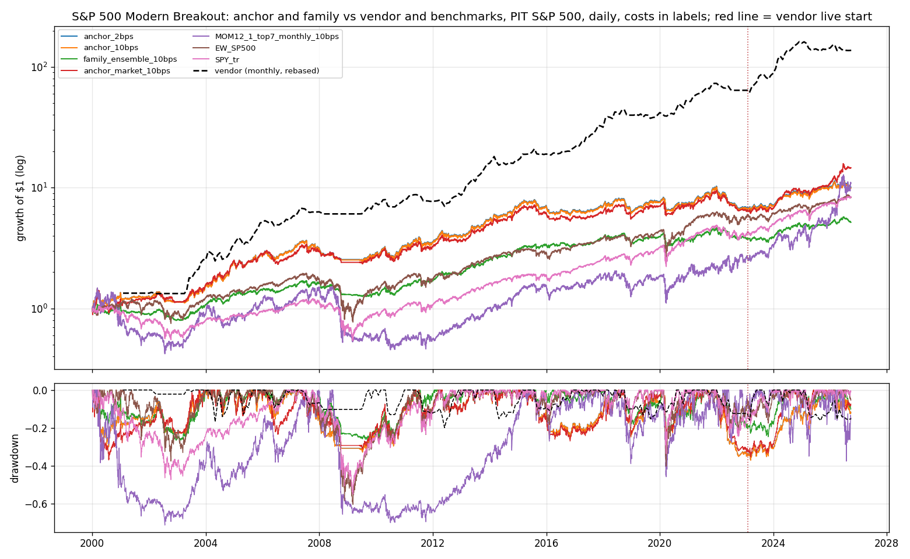
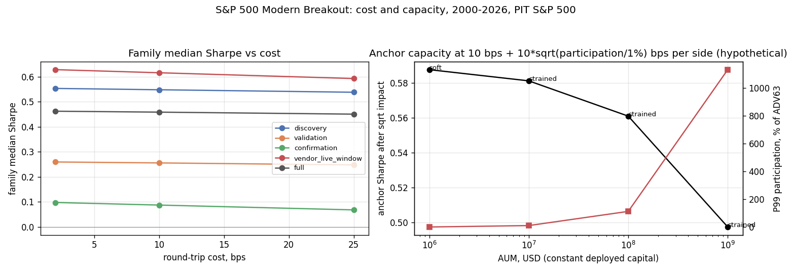

<!-- GENERATED FILE. EDIT THE CANONICAL KNOWLEDGE RECORD. -->

# SetupAlpha S&P 500 Modern Breakout claim audit

!!! warning "Research-only"
    This page summarizes saved research evidence. It does not authorize LIVE, allocation, or deployment.

## TL;DR

> **Verdict:** Vendor profile (20.6% CAGR, Sharpe 1.12, MaxDD -23.5%) is not reproduced by a frozen 32-variant generic S&P 500 breakout family (median 6.1%/0.46/-38% at 2 bps; best Sharpe 0.61). Breakout timing adds nothing over holding uptrending S&P stocks; the book is beta ~0.6 plus a momentum tilt with no significant alpha. Do not buy; do not trade.

> **Status:** `diagnostic`

> **Disposition:** `rejected`

> **Replication:** `not_reproducible`

## Research question

Determine whether a transparent frozen family of 32 generic long-only S&P 500 breakout books (new 252-day or all-time closing high inside an uptrend, trailing stop, 8% failure cut, day-limit entry at Close_T with a conservative 0.1% penetration fill, market-on-open exits, point-in-time membership, 2/10/25 bps round trip) reproduces the SetupAlpha Modern Breakout headline profile (CAGR 20.62%, Sharpe 1.12, MaxDD -23.5%, MAR 0.88, worst year -12.4%, 2001-2026), and whether the return comes from breakout timing rather than from holding uptrending S&P 500 stocks or momentum exposure, measured by a random-entry trend book with the same exits and slots, a date-level 63-session event-minus-universe test, equal-weight S&P 500, SPY, and a 12-1 momentum comparison.

## Exact setup

| Field | Value |
| --- | --- |
| Signal family | breakout_trend |
| Universe | ["S&P 500 Current & Past, point-in-time membership (Norgate), raw close >= $5"] |
| Decision | Close_T |
| Fill | day-limit buy at Close_T during T+1 (conservative 0.1% penetration); exits at Open_T+1 |
| Primary cost layer | central_research |
| Last reviewed | 2026-09-26T12:16:05+00:00 |

## Timing and overnight attribution

```text
information available: Close_T
primary executable fill: day-limit buy at Close_T during T+1 (conservative 0.1% penetration); exits at Open_T+1
```

If final `Close_T` data formed the signal, a hypothetical `Close_T` entry is diagnostic only unless a separate pre-close protocol was modeled. Comparing that diagnostic with `Open_(T+1)` and applying the compounded return identity shows whether the apparent edge occurred in the overnight gap. Missing attribution numbers mean **not tested**, not zero.

| Attribution field | Value |
| --- | --- |
| Status | tested |
| Diagnostic Path | Close_T to Open_T+64 |
| Executable Path | Open_T+1 to Open_T+64 |
| Method | Compounded overnight gap decomposition on date-level events plus conservative-limit vs touch vs market-on-open portfolio fills |
| Headline Result | No overnight leakage (gap ~0.0 pp); conservative vs touch limit fills differ by <0.01 Sharpe; market-on-open entries are better (Sharpe 0.66 vs 0.59 full, live-window CAGR 25.6% vs 11.9%) because the Close_T limit misses breakouts that never pull back. |
| Metrics | {"anchor_sharpe_conservative_10bps": 0.591, "anchor_sharpe_market_10bps": 0.664, "anchor_sharpe_touch_10bps": 0.596, "h252_spy200_close_entry_63s": 0.0251, "h252_spy200_exec_63s": 0.0251} |
| Artifact | pakal-research/reports/setupalpha_sp500_modern_breakout_audit/tables/execution_fill_model_comparison.csv |

## Primary metrics

| Metric | Value |
| --- | ---: |
| Period | 2000-01-03 to 2026-09-25 |
| Universe | S&P 500 PIT |
| Cost Layer | central_research (10 bps RT) |
| Cagr | 9.00% |
| Annualized Volatility | 17.00% |
| Sharpe | 0.591 |
| Maximum Drawdown | -37.20% |
| Turnover | about 1.8x equity per year (7.3 trades/yr, 182-session average hold) |

## Four separate verdicts

| Question | Conclusion |
| --- | --- |
| Source Replication | Rules unpublished (literal not_assessed). Profile not reproduced: vendor lies above all 32 variants; anchor h252/spy200/trail25/roc126/7 slots at 2 bps 9.1%/0.59/-37% (rank 2 of 32). |
| Predictive Value | Breakout events vs same-date uptrend members: -0.24..+0.13 pp over 63 sessions, BH q>=0.89; anchor at the 94th percentile of 50 random-entry trend books (6th in 2015-2020). |
| Economic Value | Anchor 10 bps 9.0%/0.59/-37% (SPY TR 8.3%/0.51/-55%); alpha vs SPY+UMD 3.5%/yr t 1.24; 84% of log growth in 2000-2014; 2022 -33%. |
| Promotion | Fails every frozen promotion gate; diagnostic. No forward shadow required. |

## Key findings

| Feature | Role | Direction | Status | Effect | Action |
| --- | --- | --- | --- | --- | --- |
| Close above 252-day / all-time prior high | entry signal | breakout -> higher 63-session return (hypothesised) | rejected | -0.24..+0.13 pp vs uptrend members over 63 sessions | do not use as alpha; uptrend membership carries the return |
| SPY > SMA200 entry regime | risk overlay | reduces bear-market exposure | diagnostic | anchor flat through 2001-02 and 2008-09 like the vendor | treat as exposure overlay only |
| limit entry at Close_T | execution | worse than market-on-open for breakouts | diagnostic | Sharpe 0.59 vs 0.66 (MOO); live window 11.9% vs 25.6% CAGR | forward hypothesis only |

## Visual evidence






## Limitations

- Vendor rules unpublished; exact product not tested.
- Vendor live returns self-reported.
- Dividends excluded (CAPITALSPECIAL) understate long returns by roughly 1-1.5%/yr.
- 219 anchor trades in 26 years: bootstrap Sharpe 90% interval 0.30-0.89.
- Limit price level (Close_T) is an assumption; the market-on-open variant bounds it.

## Next gates

- None required.
- Optional forward hypothesis (post-hoc): market-on-open vs limit entry in breakout books on future data.

## Sources

- `https://setupalpha.com/products/modern-breakout-realtest-strategy`
- `pakal-research/reports/setupalpha_catalog_audit/sources/modern-breakout-realtest-strategy.txt`
- `pakal-research/reports/setupalpha_sp500_modern_breakout_audit/data/source_vendor_claims_2026-09-26.json`

## Canonical artifacts

| Artifact | Pakal path |
| --- | --- |
| Concise Report | `pakal-research/reports/setupalpha_sp500_modern_breakout_audit/REPORT.md` |
| Full Report | `pakal-research/reports/setupalpha_sp500_modern_breakout_audit/REPORT_FULL.md` |
| Notebook | `pakal-research/setupalpha_sp500_modern_breakout_audit.ipynb` |
| Frozen Specification | `pakal-research/reports/setupalpha_sp500_modern_breakout_audit/research_spec_frozen.json` |
| Manifest | `pakal-research/reports/setupalpha_sp500_modern_breakout_audit/run_manifest.json` |
| Primary Source Code | `["pakal-research/setupalpha_sp500_modern_breakout_audit.py", "pakal-research/setupalpha_limit_trend_short_engine.py", "pakal-research/build_setupalpha_breakout_parabolic_artifacts.py", "pakal-research/build_setupalpha_breakout_parabolic_notebooks.py", "pakal-research/build_setupalpha_breakout_parabolic_manifests.py", "pakal-research/freeze_setupalpha_breakout_parabolic_specs.py"]` |
| Primary Tables | `["pakal-research/reports/setupalpha_sp500_modern_breakout_audit/tables/family_period_summary.csv", "pakal-research/reports/setupalpha_sp500_modern_breakout_audit/tables/event_edge_summary.csv", "pakal-research/reports/setupalpha_sp500_modern_breakout_audit/tables/random_control_percentiles.csv", "pakal-research/reports/setupalpha_sp500_modern_breakout_audit/tables/momentum_factor_regression.csv", "pakal-research/reports/setupalpha_sp500_modern_breakout_audit/tables/selection_bias.csv", "pakal-research/reports/setupalpha_sp500_modern_breakout_audit/tables/anchor_bootstrap.csv", "pakal-research/reports/setupalpha_sp500_modern_breakout_audit/tables/execution_fill_model_comparison.csv", "pakal-research/reports/setupalpha_sp500_modern_breakout_audit/tables/capacity_summary.csv", "pakal-research/reports/setupalpha_sp500_modern_breakout_audit/tables/annual_returns_vs_vendor.csv"]` |
| Primary Charts | `["pakal-research/reports/setupalpha_sp500_modern_breakout_audit/charts/family_vs_vendor_claim.png", "pakal-research/reports/setupalpha_sp500_modern_breakout_audit/charts/equity_drawdown_vs_vendor.png", "pakal-research/reports/setupalpha_sp500_modern_breakout_audit/charts/random_entry_control.png", "pakal-research/reports/setupalpha_sp500_modern_breakout_audit/charts/event_edge_by_period.png", "pakal-research/reports/setupalpha_sp500_modern_breakout_audit/charts/bootstrap_uncertainty.png", "pakal-research/reports/setupalpha_sp500_modern_breakout_audit/charts/annual_returns_vs_vendor.png", "pakal-research/reports/setupalpha_sp500_modern_breakout_audit/charts/cost_and_capacity.png"]` |
| Research State | `pakal-research/reports/setupalpha_sp500_modern_breakout_audit/research_state.json` |
| Hypothesis Registry | `pakal-research/reports/setupalpha_sp500_modern_breakout_audit/hypothesis_registry.json` |
| Experiment Ledger | `pakal-research/reports/setupalpha_sp500_modern_breakout_audit/experiment_ledger.jsonl` |
| Decision Log | `pakal-research/reports/setupalpha_sp500_modern_breakout_audit/decision_log.jsonl` |
| Source Rule Map | `pakal-research/reports/setupalpha_sp500_modern_breakout_audit/SOURCE_RULE_MAP.md` |
| Catalog Entry | `pakal-research/reports/setupalpha_sp500_modern_breakout_audit/catalog_entry.md` |
