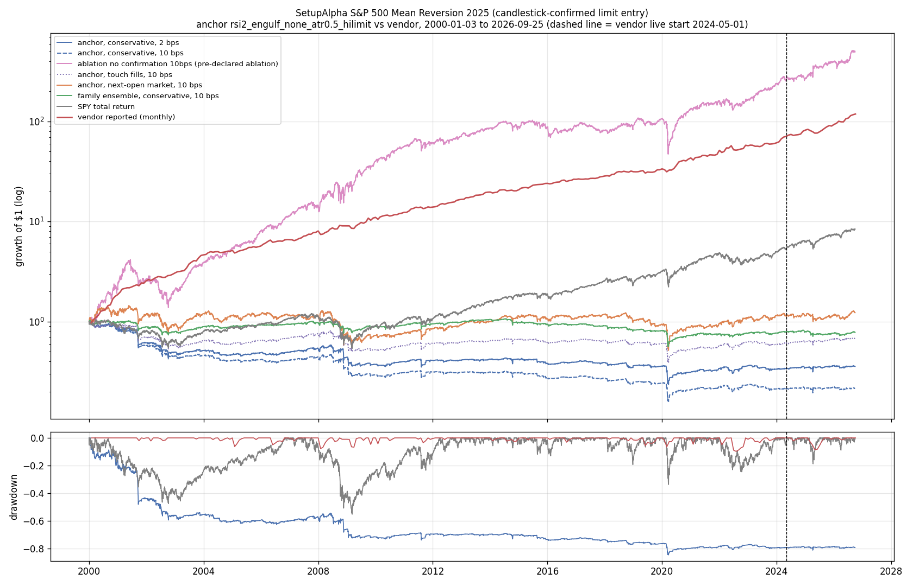
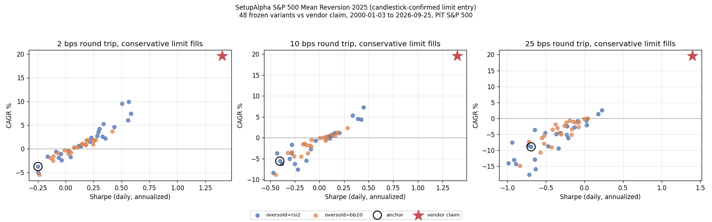

<!-- GENERATED FILE. EDIT THE CANONICAL KNOWLEDGE RECORD. -->

# SetupAlpha S&P 500 Mean Reversion 2025 (candlestick-confirmed limit entry) claim audit

!!! warning "Research-only"
    This page summarizes saved research evidence. It does not authorize LIVE, allocation, or deployment.

## TL;DR

> **Verdict:** Vendor profile (Sharpe 1.40, 19.6%) is not reachable by 48 transparent candlestick-confirmed limit-entry rules (median Sharpe 0.14 at 2 bps, best 0.59); confirmation removes the oversold edge and the anchor loses money. Do not buy; nothing to shadow from this product.

> **Status:** `diagnostic`

> **Disposition:** `rejected`

> **Replication:** `not_reproducible`

## Research question

Determine whether a transparent frozen family of generic long-only S&P 500 limit-entry mean-reversion rules (point-in-time membership, conservative limit fills, 2/10/25 bps round trip) reproduces the headline profile of the SetupAlpha product 'SetupAlpha S&P 500 Mean Reversion 2025 (candlestick-confirmed limit entry)' (CAGR 19.58%, Sharpe 1.4, worst year 5.4%), whether its return comes from the setup timing rather than from buying any S&P 500 name on a limit dip (date-equal event-minus-universe tests and a random-name limit control), and how much of it depends on optimistic limit fills (touch vs penetration vs next-open market).

## Exact setup

| Field | Value |
| --- | --- |
| Signal family | mean_reversion |
| Universe | ["S&P 500 Current & Past, point-in-time membership (Norgate), raw close >= $5"] |
| Decision | Close_T |
| Fill | day limit on T+1 (conservative 0.1% penetration); touch and Open_T+1 market reported |
| Primary cost layer | central_research |
| Last reviewed | 2026-09-26T12:21:17+00:00 |

## Timing and overnight attribution

```text
information available: Close_T
primary executable fill: day limit on T+1 (conservative 0.1% penetration); touch and Open_T+1 market reported
```

If final `Close_T` data formed the signal, a hypothetical `Close_T` entry is diagnostic only unless a separate pre-close protocol was modeled. Comparing that diagnostic with `Open_(T+1)` and applying the compounded return identity shows whether the apparent edge occurred in the overnight gap. Missing attribution numbers mean **not tested**, not zero.

| Attribution field | Value |
| --- | --- |
| Status | tested |
| Diagnostic Path | Close_T to Open_T+1+6 |
| Executable Path | Open_T+1 (market) or conservative limit fill to Open_T+1+6 |
| Method | Date-level event means of close-entry, open-entry, overnight gap and limit-filled returns |
| Headline Result | rsi2_engulf_none: close entry 0.23%, open entry 0.22%, gap 0.01%, limit-filled 0.18% (fill rate 39%) |
| Metrics | {"close_entry": 0.0023152970587175, "gap": 0.0001218338085697, "limit_filled": 0.0017850970198459, "open_entry": 0.0021828920253079} |
| Artifact | pakal-research/reports/setupalpha_sp500_mr2025_audit/tables/event_edge_summary.csv |

## Primary metrics

| Metric | Value |
| --- | ---: |
| Period | 2000-01-03 to 2026-09-25 |
| Universe | S&P 500 PIT |
| Cost Layer | central_research (10 bps RT), conservative limit fills |
| Cagr | -5.61% |
| Annualized Volatility | 12.41% |
| Sharpe | -0.402 |
| Maximum Drawdown | -84.58% |
| Turnover | 19.8 trades/month, average hold 2.5 sessions |

## Four separate verdicts

| Question | Conclusion |
| --- | --- |
| Source Replication | Rules unpublished (literal not_assessed). 48 transparent candlestick-confirmed limit-entry rules: median 0.7%/Sharpe 0.14 at 2 bps, best 0.59 vs vendor 19.6%/1.40 (not_reproducible; >1e7 trials needed). |
| Predictive Value | Confirmed-pattern events do not beat the same-date S&P 500 universe (-12..+6 bps over 6 sessions, q>=0.26); unconfirmed RSI2<10 does (+13 bps, q=0.003). |
| Economic Value | Anchor 10 bps: -5.6%/Sharpe -0.40/MaxDD -85%; family median 10 bps -0.6%/-0.02. Pre-declared no-confirmation ablation 26.2%/0.92/-67% (beta 1.05). |
| Promotion | Fails every leg of the frozen promotion rule; diagnostic, rejected. Do not buy; no shadow. |

## Key findings

| Feature | Role | Direction | Status | Effect | Action |
| --- | --- | --- | --- | --- | --- |
| Bullish reversal candle after oversold (engulfing, hammer, close above prior high) | entry confirmation | expected positive; observed zero or negative | rejected | event edge -12..+6 bps vs universe; ablation without candle Sharpe 0.92 vs 0.40 negative with | do not use candle confirmation with limit-below-close entries |
| RSI2<10 oversold (unconfirmed) | entry signal | low RSI2 -> higher 6-session return | diagnostic | +13 bps vs universe | covered by the Connors lane; no separate work |
| Limit-fill model | execution | touch fills inflate | diagnostic | +0.22 Sharpe family median (touch vs 0.1% penetration) | always report conservative fills for limit strategies |

## Visual evidence






## Limitations

- Vendor rules unpublished.
- Pattern and oversold definitions are ours.
- Daily bars cannot sequence intraday fills.
- Vendor live returns self-reported.
- Dividends excluded.

## Next gates

- None for the product.

## Sources

- `https://setupalpha.com/products/mean-reversion-2025-realtest-strategy`
- `pakal-research/reports/setupalpha_catalog_audit/sources/mean-reversion-2025-realtest-strategy.txt`

## Canonical artifacts

| Artifact | Pakal path |
| --- | --- |
| Concise Report | `pakal-research/reports/setupalpha_sp500_mr2025_audit/REPORT.md` |
| Full Report | `pakal-research/reports/setupalpha_sp500_mr2025_audit/REPORT_FULL.md` |
| Notebook | `pakal-research/setupalpha_sp500_mr2025_audit.ipynb` |
| Frozen Specification | `pakal-research/reports/setupalpha_sp500_mr2025_audit/research_spec_frozen.json` |
| Manifest | `pakal-research/reports/setupalpha_sp500_mr2025_audit/run_manifest.json` |
| Primary Source Code | `["pakal-research/setupalpha_sp500_limit_mr_audit.py", "pakal-research/build_setupalpha_sp500_limit_mr_artifacts.py"]` |
| Catalog Entry | `pakal-research/reports/setupalpha_sp500_mr2025_audit/catalog_entry.md` |
| Primary Tables | `["pakal-research/reports/setupalpha_sp500_mr2025_audit/tables/family_period_summary.csv", "pakal-research/reports/setupalpha_sp500_mr2025_audit/tables/event_edge_summary.csv", "pakal-research/reports/setupalpha_sp500_mr2025_audit/tables/fill_model_comparison.csv"]` |
| Primary Charts | `["pakal-research/reports/setupalpha_sp500_mr2025_audit/charts/family_vs_vendor_claim.png", "pakal-research/reports/setupalpha_sp500_mr2025_audit/charts/fill_model_gap.png", "pakal-research/reports/setupalpha_sp500_mr2025_audit/charts/equity_drawdown_vs_vendor.png"]` |
| Source Rule Map | `pakal-research/reports/setupalpha_sp500_mr2025_audit/SOURCE_RULE_MAP.md` |
| Hypothesis Registry | `pakal-research/reports/setupalpha_sp500_mr2025_audit/hypothesis_registry.json` |
| Experiment Ledger | `pakal-research/reports/setupalpha_sp500_mr2025_audit/experiment_ledger.jsonl` |
| Decision Log | `pakal-research/reports/setupalpha_sp500_mr2025_audit/decision_log.jsonl` |
| Research State | `pakal-research/reports/setupalpha_sp500_mr2025_audit/research_state.json` |
