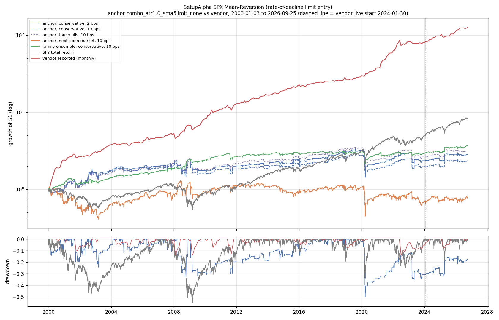
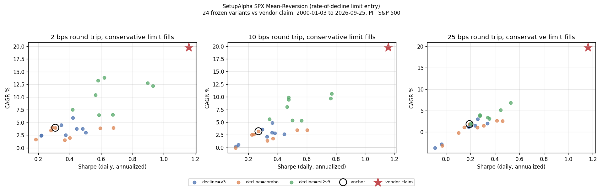

<!-- GENERATED FILE. EDIT THE CANONICAL KNOWLEDGE RECORD. -->

# SetupAlpha SPX Mean-Reversion (rate-of-decline limit entry) claim audit

!!! warning "Research-only"
    This page summarizes saved research evidence. It does not authorize LIVE, allocation, or deployment.

## TL;DR

> **Verdict:** Vendor profile (Sharpe 1.16, 19.8%) is not reachable (family median 0.43 at 2 bps, best 0.93, ~1e5 trials needed) and the vendor monthly series is uncorrelated with the family; decline signals add nothing at market entry, returns come from the limit discount and 2000-2002. Do not buy.

> **Status:** `diagnostic`

> **Disposition:** `rejected`

> **Replication:** `not_reproducible`

## Research question

Determine whether a transparent frozen family of generic long-only S&P 500 limit-entry mean-reversion rules (point-in-time membership, conservative limit fills, 2/10/25 bps round trip) reproduces the headline profile of the SetupAlpha product 'SetupAlpha SPX Mean-Reversion (rate-of-decline limit entry)' (CAGR 19.79%, Sharpe 1.16, worst year -2.3%), whether its return comes from the setup timing rather than from buying any S&P 500 name on a limit dip (date-equal event-minus-universe tests and a random-name limit control), and how much of it depends on optimistic limit fills (touch vs penetration vs next-open market).

## Exact setup

| Field | Value |
| --- | --- |
| Signal family | mean_reversion |
| Universe | ["S&P 500 Current & Past, point-in-time membership (Norgate), raw close >= $5"] |
| Decision | Close_T |
| Fill | day limit on T+1 (conservative 0.1% penetration); touch and Open_T+1 market reported |
| Primary cost layer | central_research |
| Last reviewed | 2026-09-26T12:21:17+00:00 |

## Timing and overnight attribution

```text
information available: Close_T
primary executable fill: day limit on T+1 (conservative 0.1% penetration); touch and Open_T+1 market reported
```

If final `Close_T` data formed the signal, a hypothetical `Close_T` entry is diagnostic only unless a separate pre-close protocol was modeled. Comparing that diagnostic with `Open_(T+1)` and applying the compounded return identity shows whether the apparent edge occurred in the overnight gap. Missing attribution numbers mean **not tested**, not zero.

| Attribution field | Value |
| --- | --- |
| Status | tested |
| Diagnostic Path | Close_T to Open_T+1+6 |
| Executable Path | Open_T+1 (market) or conservative limit fill to Open_T+1+6 |
| Method | Date-level event means of close-entry, open-entry, overnight gap and limit-filled returns |
| Headline Result | combo_none: close entry 0.25%, open entry 0.18%, gap 0.10%, limit-filled 0.82% (fill rate 17%) |
| Metrics | {"close_entry": 0.0025378609117929, "gap": 0.0009738407734087, "limit_filled": 0.0082103870331731, "open_entry": 0.0017511344438027} |
| Artifact | pakal-research/reports/setupalpha_sp500_rate_of_decline_audit/tables/event_edge_summary.csv |

## Primary metrics

| Metric | Value |
| --- | ---: |
| Period | 2000-01-03 to 2026-09-25 |
| Universe | S&P 500 PIT |
| Cost Layer | central_research (10 bps RT), conservative limit fills |
| Cagr | 3.22% |
| Annualized Volatility | 17.85% |
| Sharpe | 0.268 |
| Maximum Drawdown | -50.17% |
| Turnover | 3.7 trades/month, average hold 4.1 sessions |

## Four separate verdicts

| Question | Conclusion |
| --- | --- |
| Source Replication | Rules unpublished (literal not_assessed). 24 ATR-scaled rate-of-decline rules: median 4.0%/0.43 at 2 bps, best 13.8%/0.93 vs vendor 19.8%/1.16 (not_reproducible; ~1e5 trials needed); monthly correlation with vendor 0.03. |
| Predictive Value | No decline definition beats the same-date universe at market entry (-19..+16 bps over 6 sessions, q>=0.31); anchor at the 90th percentile of random-name limit controls. |
| Economic Value | Anchor 10 bps: 3.2%/Sharpe 0.27/MaxDD -50%; family median 3.3%/0.37. 79% of log growth 2000-2014; negative at 25 bps in validation. |
| Promotion | Fails the frozen promotion rule; diagnostic, rejected. Do not buy. |

## Key findings

| Feature | Role | Direction | Status | Effect | Action |
| --- | --- | --- | --- | --- | --- |
| ATR-scaled rate of decline (3-day, 10-day, RSI2 combo) | entry signal | expected positive; observed none | rejected | -19..+16 bps vs universe | no further work |
| Close>SMA200 overlay on crash buying | risk overlay | reduces drawdown | diagnostic | family median MaxDD -20% vs -56% | none |

## Visual evidence






## Limitations

- Decline thresholds are ours.
- 5x20% sizing magnifies single-name disasters.
- Vendor rules unpublished.
- Vendor live returns self-reported.
- Dividends excluded.

## Next gates

- None.

## Sources

- `https://setupalpha.com/products/spx-mean-reversion-realtest-strategy`
- `pakal-research/reports/setupalpha_catalog_audit/sources/spx-mean-reversion-realtest-strategy.txt`

## Canonical artifacts

| Artifact | Pakal path |
| --- | --- |
| Concise Report | `pakal-research/reports/setupalpha_sp500_rate_of_decline_audit/REPORT.md` |
| Full Report | `pakal-research/reports/setupalpha_sp500_rate_of_decline_audit/REPORT_FULL.md` |
| Notebook | `pakal-research/setupalpha_sp500_rate_of_decline_audit.ipynb` |
| Frozen Specification | `pakal-research/reports/setupalpha_sp500_rate_of_decline_audit/research_spec_frozen.json` |
| Manifest | `pakal-research/reports/setupalpha_sp500_rate_of_decline_audit/run_manifest.json` |
| Primary Source Code | `["pakal-research/setupalpha_sp500_limit_mr_audit.py", "pakal-research/build_setupalpha_sp500_limit_mr_artifacts.py"]` |
| Catalog Entry | `pakal-research/reports/setupalpha_sp500_rate_of_decline_audit/catalog_entry.md` |
| Primary Tables | `["pakal-research/reports/setupalpha_sp500_rate_of_decline_audit/tables/family_period_summary.csv", "pakal-research/reports/setupalpha_sp500_rate_of_decline_audit/tables/event_edge_summary.csv", "pakal-research/reports/setupalpha_sp500_rate_of_decline_audit/tables/fill_model_comparison.csv"]` |
| Primary Charts | `["pakal-research/reports/setupalpha_sp500_rate_of_decline_audit/charts/family_vs_vendor_claim.png", "pakal-research/reports/setupalpha_sp500_rate_of_decline_audit/charts/fill_model_gap.png", "pakal-research/reports/setupalpha_sp500_rate_of_decline_audit/charts/equity_drawdown_vs_vendor.png"]` |
| Source Rule Map | `pakal-research/reports/setupalpha_sp500_rate_of_decline_audit/SOURCE_RULE_MAP.md` |
| Hypothesis Registry | `pakal-research/reports/setupalpha_sp500_rate_of_decline_audit/hypothesis_registry.json` |
| Experiment Ledger | `pakal-research/reports/setupalpha_sp500_rate_of_decline_audit/experiment_ledger.jsonl` |
| Decision Log | `pakal-research/reports/setupalpha_sp500_rate_of_decline_audit/decision_log.jsonl` |
| Research State | `pakal-research/reports/setupalpha_sp500_rate_of_decline_audit/research_state.json` |
