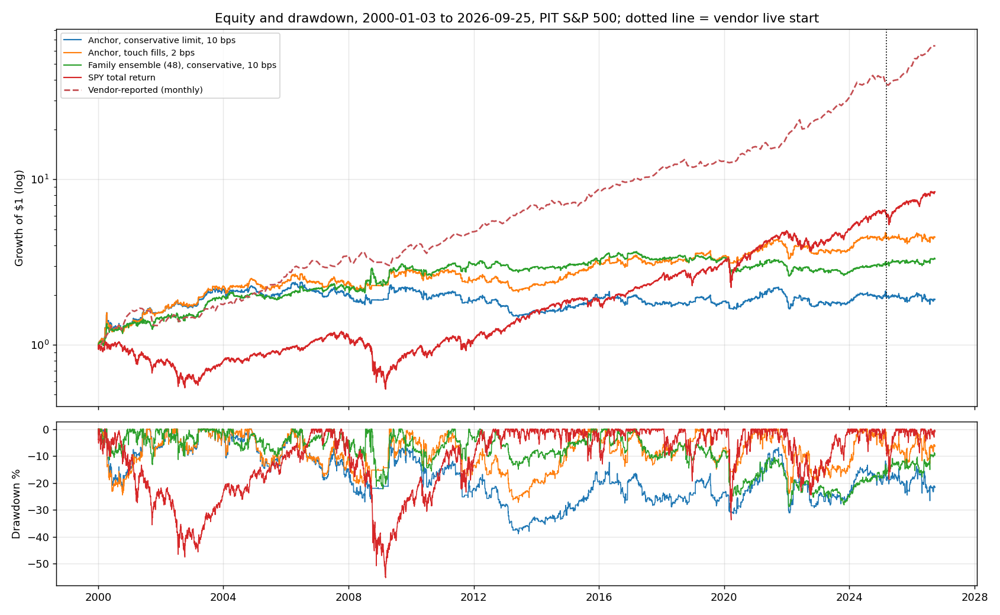
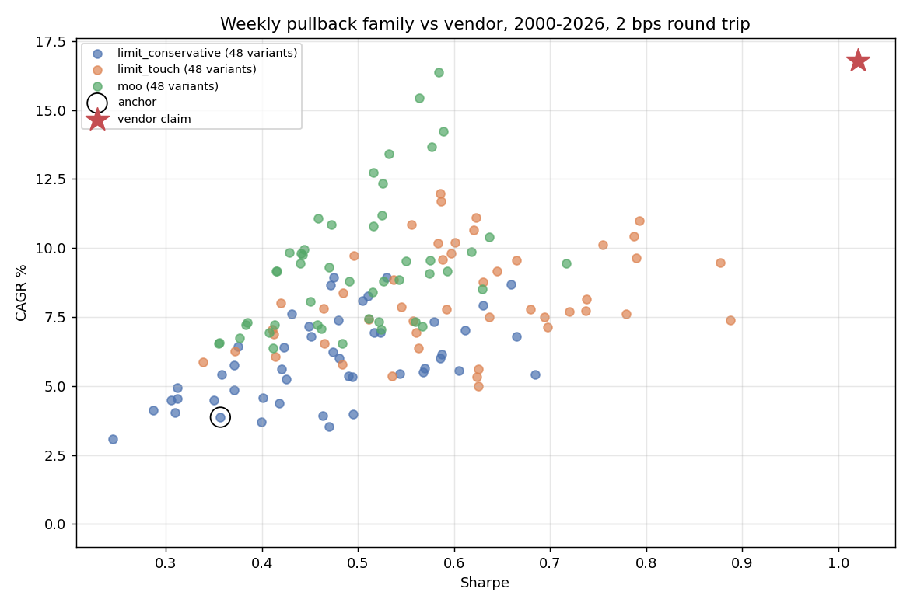

<!-- GENERATED FILE. EDIT THE CANONICAL KNOWLEDGE RECORD. -->

# SetupAlpha S&P 500 weekly pullback claim audit

!!! warning "Research-only"
    This page summarizes saved research evidence. It does not authorize LIVE, allocation, or deployment.

## TL;DR

> **Verdict:** Vendor claim not reproduced: a 48-variant generic weekly pullback family with conservative limit fills earns a median 5.6%/Sharpe 0.47 at vendor-like cost (best 0.69) versus the claimed 16.8%/1.02; the selection edge is weak and faded after 2008, touch fills inflate results, and the vendor's 39.6%/yr live window is uncorrelated with every generic variant. Do not buy; do not trade live.

> **Status:** `diagnostic`

> **Disposition:** `rejected`

> **Replication:** `not_reproducible`

## Research question

Determine whether a transparent frozen family of S&P 500 early-week-weakness rules (PIT membership, day-limit entries with conservative fills, Friday market-on-close exits, 2/10/25 bps) reproduces the SetupAlpha Weekly Pullback claim (CAGR 16.78%, Sharpe 1.02, MaxDD -23.5%, 2000-2026), and decompose its return into a calendar component (holding the universe over the same intra-week window), a selection component (weak stocks minus universe) and a limit-fill component (conservative vs touch vs market-on-open).

## Exact setup

| Field | Value |
| --- | --- |
| Signal family | mean_reversion_weekly_calendar |
| Universe | ["S&P 500 Current & Past, point-in-time membership (Norgate)"] |
| Decision | Close of first (or second) session of the ISO week |
| Fill | Next-session day limit (conservative) / Open_T+1 diagnostic |
| Primary cost layer | central_research |
| Last reviewed | 2026-09-26T12:04:49+00:00 |

## Timing and overnight attribution

```text
information available: Close of first (or second) session of the ISO week
primary executable fill: Next-session day limit (conservative) / Open_T+1 diagnostic
```

If final `Close_T` data formed the signal, a hypothetical `Close_T` entry is diagnostic only unless a separate pre-close protocol was modeled. Comparing that diagnostic with `Open_(T+1)` and applying the compounded return identity shows whether the apparent edge occurred in the overnight gap. Missing attribution numbers mean **not tested**, not zero.

| Attribution field | Value |
| --- | --- |
| Status | tested |
| Diagnostic Path | signal close to Friday close |
| Executable Path | next-session fill to the same Friday close |
| Method | Signal-level decomposition: close entry vs MOO vs conservative and touch limit fills |
| Headline Result | Close-entry (not executable) 0.28% vs MOO 0.22% vs conservative limit 0.26% (filled only) vs touch 0.34% for the anchor definition; limit fills suffer strong adverse selection (filled -0.8% vs unfilled +0.8% at MOO). |
| Metrics | {"anchor_def_close_entry": 0.0028, "anchor_def_conservative_limit": 0.0026, "anchor_def_moo": 0.0022, "anchor_def_touch_limit": 0.0034} |
| Artifact | pakal-research/reports/setupalpha_sp500_weekly_pullback_audit/tables/event_decomposition.csv |

## Primary metrics

| Metric | Value |
| --- | ---: |
| Period | 2000-01-03 to 2026-09-25 |
| Universe | S&P 500 PIT |
| Cost Layer | central_research (10 bps RT) |
| Cagr | 2.40% |
| Annualized Volatility | N/A |
| Sharpe | 0.247 |
| Maximum Drawdown | -38.90% |
| Turnover | ~7.4 round trips per month at 20% of equity |

## Four separate verdicts

| Question | Conclusion |
| --- | --- |
| Source Replication | Rules unpublished; generic family cannot reach the vendor profile (family max Sharpe 0.69 vs 1.02; >1e6 trials needed from this family's dispersion). Monthly correlation with vendor 0.14-0.17. |
| Predictive Value | Selection edge (weak stocks minus universe, same window) small: +8 bps for the anchor definition, q<=0.10 in 3/12 definitions; strongest pre-2008. Calendar: weekend plus Monday ~0, rest of week carries the weekly return. |
| Economic Value | Anchor conservative fills: 3.9%/0.36 at 2 bps, 2.4%/0.25 at 10 bps, negative at 25 bps; 83% of log growth in 2000-2014; negative in the vendor live window. |
| Promotion | Fails every promotion gate. Do not buy; do not trade. Post-hoc SPY weekday timing also rejected. |

## Key findings

| Feature | Role | Direction | Status | Effect | Action |
| --- | --- | --- | --- | --- | --- |
| week-to-date bottom decile | entry signal | weak -> slightly higher Tue-Fri return | diagnostic | +8 bps/week with SMA200, +15 bps without | no further work |
| day-limit entry below close | execution | discount offsets adverse selection | diagnostic | fill rate ~37%; filled names -0.8% vs unfilled +0.8% at MOO | always model conservative fills; distrust touch-fill backtests |
| weekday calendar | regime | weekend plus Monday ~0 | diagnostic | -0.9 bps/week (t -0.2) vs 15 bps Tue open-Fri close | do not trade on SPY (post-hoc H6 rejected) |

## Visual evidence






## Limitations

- Vendor rules hidden.
- Daily OHLC cannot order intraday high/low; take-profit barred on the entry session.
- Dividends excluded.
- Vendor live returns self-reported.

## Next gates

- None for this product.
- If the user wants a weekly cadence, test weekly-rebalanced momentum/trend or weekly VIX-regime rules instead (new frozen study).

## Sources

- `https://setupalpha.com/products/weekly-pullback-realtest-strategy`
- `pakal-research/reports/setupalpha_catalog_audit/sources/weekly-pullback-realtest-strategy.html`
- `pakal-research/reports/setupalpha_ndx_mean_reversion_audit/REPORT.md`

## Canonical artifacts

| Artifact | Pakal path |
| --- | --- |
| Concise Report | `pakal-research/reports/setupalpha_sp500_weekly_pullback_audit/REPORT.md` |
| Full Report | `pakal-research/reports/setupalpha_sp500_weekly_pullback_audit/REPORT_FULL.md` |
| Notebook | `pakal-research/setupalpha_sp500_weekly_pullback_audit.ipynb` |
| Frozen Specification | `pakal-research/reports/setupalpha_sp500_weekly_pullback_audit/research_spec_frozen.json` |
| Manifest | `pakal-research/reports/setupalpha_sp500_weekly_pullback_audit/run_manifest.json` |
| Primary Source Code | `["pakal-research/setupalpha_sp500_weekly_pullback_audit.py", "pakal-research/build_setupalpha_sp500_weekly_pullback_artifacts.py", "pakal-research/setupalpha_audit_toolkit.py"]` |
| Primary Tables | `["pakal-research/reports/setupalpha_sp500_weekly_pullback_audit/tables/family_period_summary.csv", "pakal-research/reports/setupalpha_sp500_weekly_pullback_audit/tables/event_decomposition.csv", "pakal-research/reports/setupalpha_sp500_weekly_pullback_audit/tables/selection_bias.csv", "pakal-research/reports/setupalpha_sp500_weekly_pullback_audit/tables/random_control_percentiles.csv", "pakal-research/reports/setupalpha_sp500_weekly_pullback_audit/tables/universe_window_summary.csv"]` |
| Primary Charts | `["pakal-research/reports/setupalpha_sp500_weekly_pullback_audit/charts/return_decomposition.png", "pakal-research/reports/setupalpha_sp500_weekly_pullback_audit/charts/family_vs_vendor_claim.png", "pakal-research/reports/setupalpha_sp500_weekly_pullback_audit/charts/equity_drawdown_vs_vendor.png", "pakal-research/reports/setupalpha_sp500_weekly_pullback_audit/charts/weekday_calendar.png"]` |
| Research State | `pakal-research/reports/setupalpha_sp500_weekly_pullback_audit/research_state.json` |
| Hypothesis Registry | `pakal-research/reports/setupalpha_sp500_weekly_pullback_audit/hypothesis_registry.json` |
| Experiment Ledger | `pakal-research/reports/setupalpha_sp500_weekly_pullback_audit/experiment_ledger.jsonl` |
| Decision Log | `pakal-research/reports/setupalpha_sp500_weekly_pullback_audit/decision_log.jsonl` |
| Source Rule Map | `pakal-research/reports/setupalpha_sp500_weekly_pullback_audit/SOURCE_RULE_MAP.md` |
