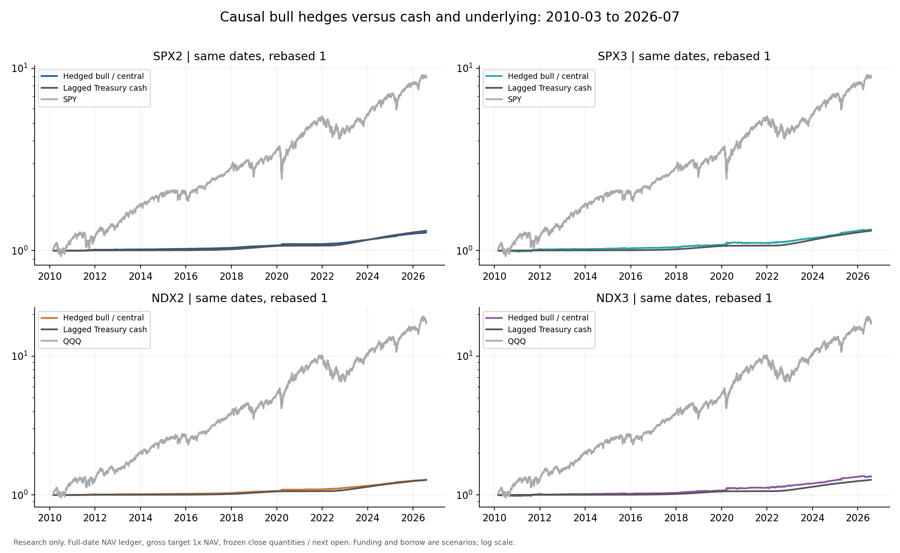
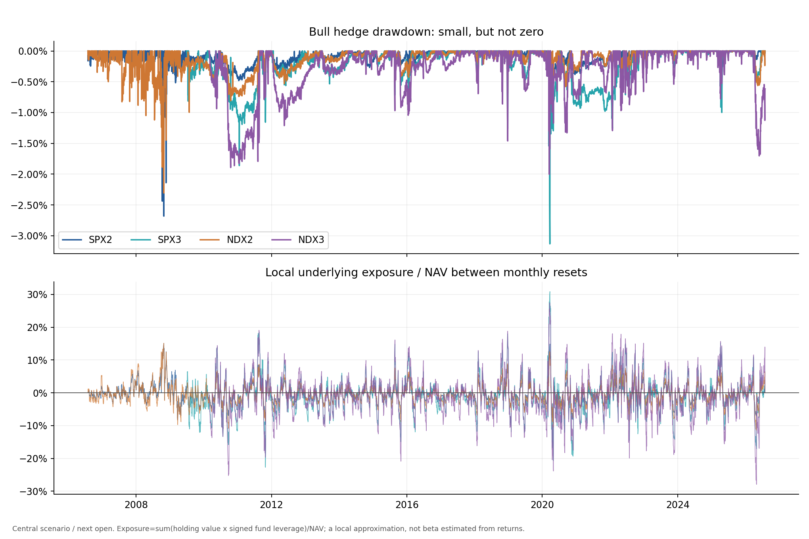

<!-- GENERATED FILE. EDIT THE CANONICAL KNOWLEDGE RECORD. -->

# שורט קרנות ממונפות: הון, פתיחה הבאה ועלויות מימון

!!! warning "Research-only"
    This page summarizes saved research evidence. It does not authorize LIVE, allocation, or deployment.

## TL;DR

> **Verdict:** No robust excess return is established: central bull hedges are close to cash, all four fail conservative costs, and leveraged pairs can breach the EOD margin proxy. Diagnostic only; do not promote.

> **Status:** `diagnostic`

> **Disposition:** `rejected`

> **Replication:** `not_reproducible`

## Research question

Does the source's bull-side advantage survive user-authorized NAV sizing and next-open execution after explicit dividend, cash, borrow and funding scenarios, compared with same-date cash and index hedges?

## Exact setup

| Field | Value |
| --- | --- |
| Signal family | leveraged_etf_hedged_short |
| Universe | ["Source-fixed SSO/SDS,UPRO/SPXU,QLD/QID,TQQQ/SQQQ; SPY/QQQ hedges"] |
| Decision | After month-end Close_T, quantities=weights*marked NAV/closing CAPITAL prices |
| Fill | Fixed quantities at next observed session Open_T+1; close-path diagnostic and terminalclose mark separately labeled |
| Primary cost layer | central_research |
| Last reviewed | 2026-08-28T19:47:21.753938+00:00 |

## Timing and overnight attribution

```text
information available: After month-end Close_T, quantities=weights*marked NAV/closing CAPITAL prices
primary executable fill: Fixed quantities at next observed session Open_T+1; close-path diagnostic and terminalclose mark separately labeled
```

If final `Close_T` data formed the signal, a hypothetical `Close_T` entry is diagnostic only unless a separate pre-close protocol was modeled. Comparing that diagnostic with `Open_(T+1)` and applying the compounded return identity shows whether the apparent edge occurred in the overnight gap. Missing attribution numbers mean **not tested**, not zero.

| Attribution field | Value |
| --- | --- |
| Status | completed_diagnostic |
| Diagnostic Path | Month-end closing fills with identical accounting |
| Executable Path | Approved close quantities ->nextopen, dailybar proxy only |
| Method | Compare full stateful paths plus local matched-quantity same-exit effect -delta_q*(open-close+entitlementdividend) |
| Headline Result | Bull central annualized delay drag about5..12bps; funding uncertainty is larger |
| Metrics | {"source_vs_executable_paths": "24construction/cost pairs with both timings", "variants": 24} |
| Artifact | pakal-research/reports/shorting_leveraged_etfs_empirical_study/tables/timing_attribution.csv |

## Primary metrics

| Metric | Value |
| --- | ---: |
| Period | 2006-07-31 to2026-07-31 |
| Universe | SSO short / SPY long; source reference case, not selected winner |
| Cost Layer | central_research |
| Cagr | 1.66% |
| Annualized Volatility | 1.65% |
| Sharpe | 1.005 |
| Maximum Drawdown | -2.68% |
| Turnover | 66.40% |

## Four separate verdicts

| Question | Conclusion |
| --- | --- |
| Source Replication | Exact source level replication not reproducible: denominator, FirstRate data and sourcecode absent. Authorized NAV/CAPITAL translation tested, not a falsification of the source. |
| Predictive Value | Not assessed; fixed hedge construction, no predictive filter or new signal. |
| Economic Value | Tested under explicit hypothetical costs and cash policies. Weak or negative central cash-excess, conservative failure, and some pair margin breaches. |
| Promotion | Diagnostic; promotion rejected. No untouched validation, actual borrow, measured fills or operational capacity. |

## Key findings

| Feature | Role | Direction | Status | Effect | Action |
| --- | --- | --- | --- | --- | --- |
| Source bull-short hedge | exposure | Low raw volatility but weak cash-excess | diagnostic | Common-period four-member CAGR-minus-cash range -0.1440 to+0.3528 percentage points/year; no positive corrected significance. | Keep all four as diagnostic evidence; do not pick the realized winner. |
| Cash and restricted collateral | economic_diagnostic | Funding terms materially change the conclusion | diagnostic | Native-history optimistic bull cash-excess+0.480..+0.759pp/year; conservative all four underperformcash. | Measure actual credit/debit terms before any advancement. |
| Fixed Close_T quantities at next open | timing | Small negative timing effect in the four bull hedges | diagnostic | Central next-open CAGR less than close diagnostic by about5..12 basis points/year. | Keep causal next-open sizing and disclose daily-bar fill limitations. |
| Monthly exposure drift and margin | risk | Source neutrality does not persist between resets | diagnostic | Central causal SPX3pair2 margin-breach days; NDX3pair18 days. On2018-12-24 local exposure about1.588 and1.611 NAV. | Reject survival claims for breached paths; no forced liquidation was modeled. |
| Selected-order ADV20 capacity | liquidity | Median participation conceals historical order tails | diagnostic | At10m initialAUM causalcentralbull maximum full-day ADV participation about36.37%,1.11%,24.24%,4.52%; two inception orders have insufficient20-day history. | Do not equate daily ADV with auction capacity or available borrow. |
| Dividend entitlement and funding availability | data_integrity | Explicit accounting prevents silent P&L errors | diagnostic | Independent reconstruction verified56paths,258916dailyrows,24808orderlegs; NAV error below2e-12. | Retain these data contracts; no price filling or unlagged rates. |

## Visual evidence






## Limitations

- This is an authorized internal NAV translation; exact source dollar-denominator, FirstRate data and code unavailable, so source level replication may be not_reproducible without falsifying its claim.
- Daily open is a proxy, not measured auction fill. No borrow availability, recall, execution fragmentation or settlement/operational parity.
- Source-fee snapshot is a constant scenario, not actual historical borrow.
- Cash rates are delayed current-vintageDGS3MO, not actual broker rates or historical vintage.
- Ex-date distribution cash is a payment-date proxy.
- Fixed surviving sourceETFuniverse; no complete delistedETFindustry test.
- No capacityimpact calibration or portfoliomarginaccount truth.
- Source has already exposed the complete evaluated history.
- Source-like comparison columns have different friction conventions and data; no exact numerical replication claimed.
- Calendar CAGR endpoints use lastreturndate minus firstreturndate, same convention for benchmark; firstreturn may span priorclose.

## Next gates

- {'test_id': 'FUTURE_MEASURED_BORROW_AND_CASH', 'status': 'proposed_not_started', 'rule': 'Before any new test, obtain point-in-time borrow fees, lendable quantities, recall events and actual cash/collateral terms. Freeze the same four bull hedges without selecting a winner, then test an unseen future period; no live orders or allocation are authorized.', 'search_space': 'Same4bull constructions; no new thresholds, no winner selection, futureunseenperiod', 'promotion_gates': ['Measured borrow and actual cash terms', 'Causal frozen quantities', 'No margin/recall survival failure', 'Positive cash-excess after cost and coherent family inference', 'New validation and confirmation opened once after freeze']}

## Sources

- `{"content_id": "sha256:ab702f274d2dc532fd4407382819ba6ad859f70a120875ccee867995127a8763", "location": "C:\\\\Users\\\\User\\\\Downloads\\\\Shorting Leveraged ETFs.pdf", "read_complete": true, "read_note": "All13pages read in prior stage; right-edge clipping documented; source claims already seen.", "role": "source weights, monthly rebalance, four pairs and reported costs", "source_id": "supplied_quantseeker"}`
- `{"content_id": "sha256:cdebf17a00b7fde68ebd8615b8c4ec68b67d52e45e3a205c22db36989ddea1e1", "location": "C:\\\\Users\\\\User\\\\Documents\\\\workspace\\\\pakal\\\\pakal-research\\\\reports\\\\shorting_leveraged_etfs_empirical_study\\\\ACCOUNTING_DATA_AUDIT.md", "read_complete": true, "role": "verified vendor dividend timing and conservative funding availability", "source_id": "accounting_audit"}`
- `{"full_original_Lin_paper_read": false, "location": "pakal-research/reports/shorting_leveraged_etfs_study/PRIMARY_SOURCE_REVIEW.md", "role": "Official borrow/margin and ideal financing mechanism", "source_id": "prior_primary_review"}`

## Canonical artifacts

| Artifact | Pakal path |
| --- | --- |
| Concise Report | `pakal-research/reports/shorting_leveraged_etfs_empirical_study/REPORT.md` |
| Full Report | `pakal-research/reports/shorting_leveraged_etfs_empirical_study/REPORT_FULL.md` |
| Notebook | `pakal-research/reports/shorting_leveraged_etfs_empirical_study/shorting_leveraged_etfs_empirical_study.ipynb` |
| Frozen Specification | `pakal-research/reports/shorting_leveraged_etfs_empirical_study/research_spec_frozen.json` |
| Manifest | `pakal-research/reports/shorting_leveraged_etfs_empirical_study/run_manifest.json` |
| Research State | `pakal-research/reports/shorting_leveraged_etfs_empirical_study/research_state.json` |
| Hypothesis Registry | `pakal-research/reports/shorting_leveraged_etfs_empirical_study/hypothesis_registry.json` |
| Experiment Ledger | `pakal-research/reports/shorting_leveraged_etfs_empirical_study/experiment_ledger.jsonl` |
| Decision Log | `pakal-research/reports/shorting_leveraged_etfs_empirical_study/decision_log.jsonl` |
| Source Rule Map | `pakal-research/reports/shorting_leveraged_etfs_empirical_study/SOURCE_RULE_MAP.md` |
| Primary Source Code | `["C:\\\\Users\\\\User\\\\Documents\\\\workspace\\\\pakal\\\\pakal-research\\\\shorting_leveraged_etfs_empirical_study.py"]` |
| Primary Tables | `["pakal-research/reports/shorting_leveraged_etfs_empirical_study/tables/case_summary.csv", "pakal-research/reports/shorting_leveraged_etfs_empirical_study/tables/subperiod_metrics.csv", "pakal-research/reports/shorting_leveraged_etfs_empirical_study/tables/hac_inference.csv", "pakal-research/reports/shorting_leveraged_etfs_empirical_study/tables/selected_order_participation.csv", "pakal-research/reports/shorting_leveraged_etfs_empirical_study/tables/daily_ledger.csv.gz", "pakal-research/reports/shorting_leveraged_etfs_empirical_study/tables/order_ledger.csv.gz"]` |
| Primary Charts | `["pakal-research/reports/shorting_leveraged_etfs_empirical_study/charts/common_period_equity.png", "pakal-research/reports/shorting_leveraged_etfs_empirical_study/charts/bull_drawdown_exposure.png", "pakal-research/reports/shorting_leveraged_etfs_empirical_study/charts/cash_excess_and_funding.png", "pakal-research/reports/shorting_leveraged_etfs_empirical_study/charts/construction_and_margin.png", "pakal-research/reports/shorting_leveraged_etfs_empirical_study/charts/rolling_market_dependence.png", "pakal-research/reports/shorting_leveraged_etfs_empirical_study/charts/capacity_proxy.png"]` |
