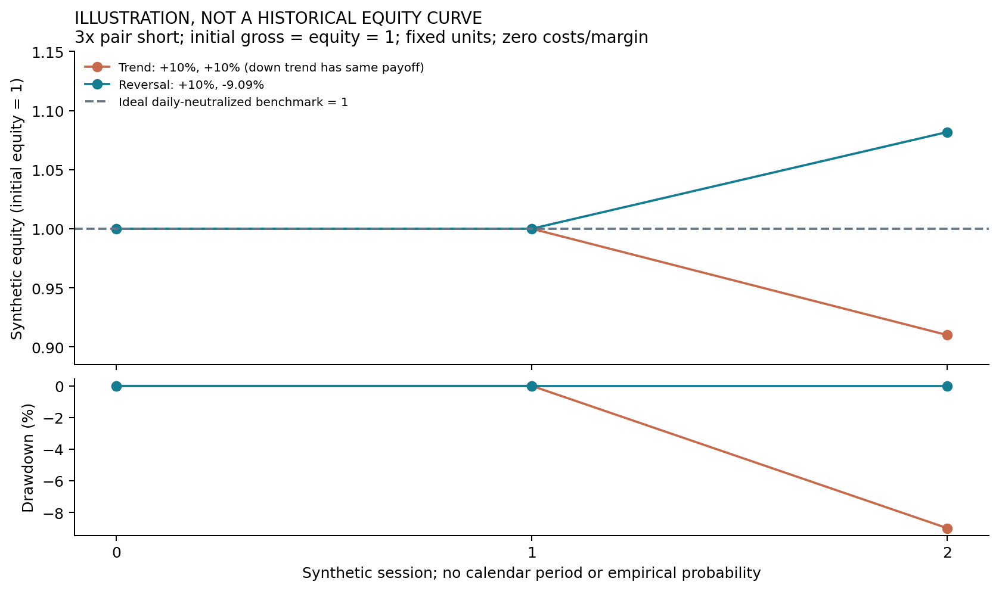
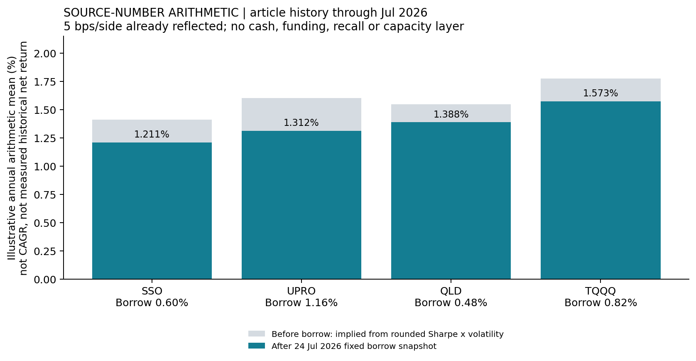

<!-- GENERATED FILE. EDIT THE CANONICAL KNOWLEDGE RECORD. -->

# שורט בקרנות ממונפות: שחיקה, סיכון מסלול ועלויות אמיתיות

!!! warning "Research-only"
    This page summarizes saved research evidence. It does not authorize LIVE, allocation, or deployment.

## TL;DR

> **Verdict:** Diagnostic only: volatility decay is not a free lunch; source fee arithmetic is consistent, but executable excess returns remain untested.

> **Status:** `diagnostic`

> **Disposition:** `inconclusive`

> **Replication:** `not_assessed`

## Research question

Do the article's static borrow adjustments reconcile arithmetically, and is positive volatility alone sufficient to make a beta-neutral LETF short profitable in an ideal two-day market?

## Exact setup

| Field | Value |
| --- | --- |
| Signal family | leveraged_etf_hedged_short |
| Universe | ["SSO/SDS and UPRO/SPXU with SPY; QLD/QID and TQQQ/SQQQ with QQQ, source-specified fixed instruments", "Ideal positive and inverse daily-reset funds at leverage 2 and 3"] |
| Decision | Synthetic reset boundary; historical Close_T quantities proposed but not implemented |
| Fill | No historical fills; proposed Open_T+1 requires confirmation |
| Primary cost layer | paper_like |
| Last reviewed | 2026-08-28T16:10:34.392446+00:00 |

## Timing and overnight attribution

```text
information available: Synthetic reset boundary; historical Close_T quantities proposed but not implemented
primary executable fill: No historical fills; proposed Open_T+1 requires confirmation
```

If final `Close_T` data formed the signal, a hypothetical `Close_T` entry is diagnostic only unless a separate pre-close protocol was modeled. Comparing that diagnostic with `Open_(T+1)` and applying the compounded return identity shows whether the apparent edge occurred in the overnight gap. Missing attribution numbers mean **not tested**, not zero.

| Attribution field | Value |
| --- | --- |
| Status | not_tested |
| Diagnostic Path | Source month-end close-to-close hedge |
| Executable Path | Proposed Close_T quantities -> Open_T+1 |
| Method | not_run |
| Headline Result | No timing attribution because the capital and fill contract is unresolved. |
| Metrics | {} |
| Artifact | N/A |

## Primary metrics

| Metric | Value |
| --- | ---: |
| Period | Two constructed sessions; no empirical strategy sample |
| Universe | Ideal 2x/3x bull and inverse funds plus ideal underlying |
| Cost Layer | paper_like |
| Cagr | N/A |
| Annualized Volatility | N/A |
| Sharpe | N/A |
| Maximum Drawdown | N/A |
| Turnover | N/A |

## Four separate verdicts

| Question | Conclusion |
| --- | --- |
| Source Replication | Static fee arithmetic reconciled; original historical strategy replication not assessed. |
| Predictive Value | Not tested; no unseen historical signal test or VIX filter. |
| Economic Value | Not established; no causal capital-based net backtest, historical borrow or account financing. |
| Promotion | Diagnostic only; conditional empirical translation requires timing/capital confirmation. |

## Key findings

| Feature | Role | Direction | Status | Effect | Action |
| --- | --- | --- | --- | --- | --- |
| Leveraged ETF compounding is path dependent | diagnostic | Trend hurts fixed-unit hedges; reversal helps | diagnostic | 3x pair: -9% on two +10% days; +8.1818% on a +10%/-9.0909% round trip. | Do not equate negative log-growth drag with riskless short profit. |
| Short bull LETF plus long underlying hedge | exposure | Source-reported strongest US version | diagnostic | Source daily Sharpe .85-.90 before borrow; not independently reproduced. | Preserve as source-derived construction; obtain causal cash/borrow evidence first. |
| Rebalance frequency and directional drift | risk | Daily ideal re-neutralization removes pure ideal return | diagnostic | 18 of 18 daily-neutralized constructed cells have zero payoff within 1e-12. | Treat as mechanism evidence, not an executable daily strategy. |
| Borrow fee, availability and recall | liquidity | Higher fees reduce returns; recall can break the hedge | diagnostic | Static target-weight drag .160-.290 annual percentage points across four bull examples. | Collect historical daily fees and available quantities; do not extrapolate one snapshot. |
| Prior-month VIX regime | regime | Source highest quartile stronger, lower quartiles not monotone | source_only_not_tested | Source chart only; no local VIX hypothesis tested. | Any tradable thresholds must be frozen on prior data, never full-sample quartiles. |
| Financing and cash excess-return reconciliation | diagnostic | Raw security-leg Sharpe may contain financing carry | diagnostic | Algebraic mechanism only; no empirical attribution or account calibration. | Compare NAV excess return with cash using an explicit proceeds/collateral ledger. |

## Visual evidence






## Limitations

- Source print is clipped at the right edge.
- Original Lin et al. 40-page paper could not be downloaded (HTTP 403); abstract only was reviewed externally.
- Source code and FirstRate input data absent; source starting dates and fixed-dollar versus NAV-scaled capital denominator unspecified.
- No historical strategy returns, causal fill simulation, measured borrow fees/availability, recalls, cash interest, margin or capacity analysis.
- 2025-2026 is source-seen history and not an untouched holdout for this research.
- Synthetic 10-percent moves are stress illustrations, not probability forecasts.
- Daily-reset exact cancellation excludes fund expenses, funding and tracking errors; real products need not cancel.

## Next gates

- {'test_id': 'NEXT_EMPIRICAL_CONTRACT', 'status': 'proposed_pending_user_confirmation', 'rule': 'Confirm an internal translation with initial equity 1, gross exposure 1 times current NAV, quantities fixed after Close_T and filled Open_T+1, no filling missing prices; then freeze cash, borrow, distributions, margin, and capital accounting before historical testing.', 'candidate_family': 'Four source bull-side hedges as a fixed ensemble, no realized winner selection', 'risk_gates': ['Separate source fixed-dollar diagnostic from NAV-scaled internal translation', 'Chronological discovery only for source-seen history', 'Daily mark-to-market including inactive and cash dates', 'Historical borrow, funding, distributions and margin', 'Untouched future validation and confirmation before promotion']}

## Sources

- `{"content_id": "sha256:ab702f274d2dc532fd4407382819ba6ad859f70a120875ccee867995127a8763", "location": "C:\\\\Users\\\\User\\\\Downloads\\\\Shorting Leveraged ETFs.pdf", "read_complete": true, "read_note": "All 13 rendered pages inspected. Right-edge truncation is present in the supplied print; tables and displayed equation are readable.", "role": "literal_source_rules_and_reported_values", "source_id": "quantseeker_pdf"}`
- `{"full_original_paper_read": false, "location": "PRIMARY_SOURCE_REVIEW.md", "metadata": "external_sources.json", "source_id": "official_source_review"}`

## Canonical artifacts

| Artifact | Pakal path |
| --- | --- |
| Concise Report | `pakal-research/reports/shorting_leveraged_etfs_study/REPORT.md` |
| Full Report | `pakal-research/reports/shorting_leveraged_etfs_study/REPORT_FULL.md` |
| Notebook | `pakal-research/reports/shorting_leveraged_etfs_study/shorting_leveraged_etfs_study.ipynb` |
| Frozen Specification | `pakal-research/reports/shorting_leveraged_etfs_study/research_spec_frozen.json` |
| Manifest | `pakal-research/reports/shorting_leveraged_etfs_study/run_manifest.json` |
| Primary Source Code | `["C:\\\\Users\\\\User\\\\Documents\\\\workspace\\\\pakal\\\\pakal-research\\\\shorting_leveraged_etfs_study.py"]` |
| Primary Tables | `["pakal-research/reports/shorting_leveraged_etfs_study/tables/source_arithmetic_audit.csv", "pakal-research/reports/shorting_leveraged_etfs_study/tables/synthetic_scenarios.csv", "pakal-research/reports/shorting_leveraged_etfs_study/tables/synthetic_equity_paths.csv"]` |
| Primary Charts | `["pakal-research/reports/shorting_leveraged_etfs_study/charts/source_reported_daily_sharpe.png", "pakal-research/reports/shorting_leveraged_etfs_study/charts/synthetic_path_payoffs.png", "pakal-research/reports/shorting_leveraged_etfs_study/charts/synthetic_equity_drawdown.png", "pakal-research/reports/shorting_leveraged_etfs_study/charts/static_borrow_arithmetic.png"]` |
| Research State | `pakal-research/reports/shorting_leveraged_etfs_study/research_state.json` |
| Hypothesis Registry | `pakal-research/reports/shorting_leveraged_etfs_study/hypothesis_registry.json` |
| Experiment Ledger | `pakal-research/reports/shorting_leveraged_etfs_study/experiment_ledger.jsonl` |
| Decision Log | `pakal-research/reports/shorting_leveraged_etfs_study/decision_log.jsonl` |
| Source Rule Map | `pakal-research/reports/shorting_leveraged_etfs_study/SOURCE_RULE_MAP.md` |
