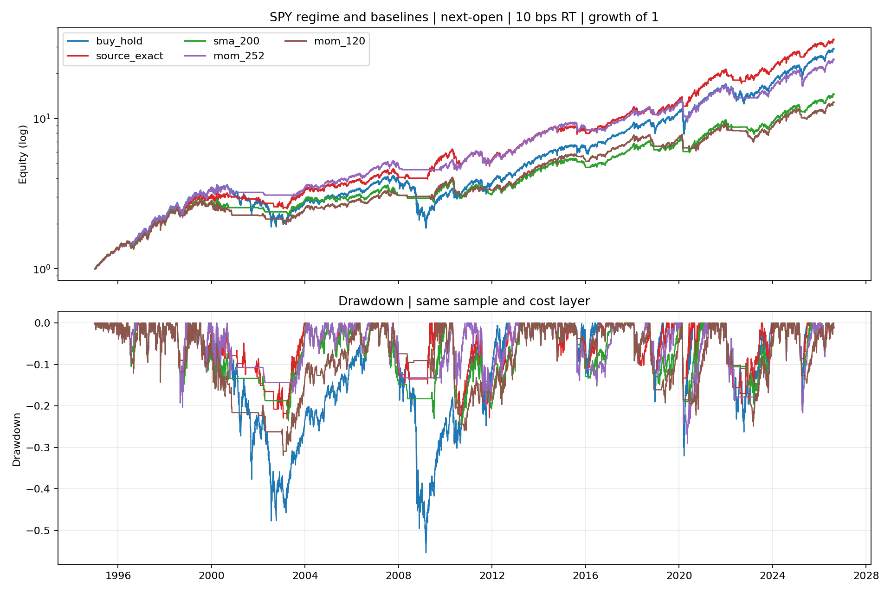
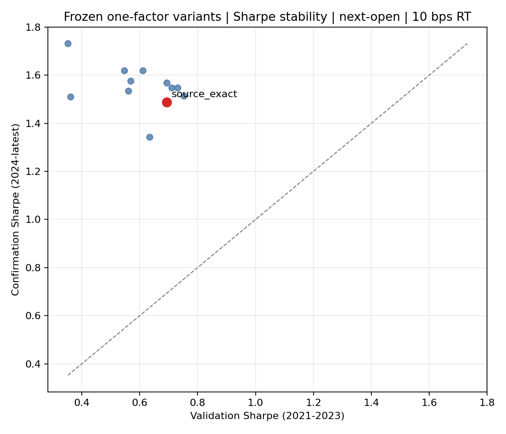

<!-- GENERATED FILE. EDIT THE CANONICAL KNOWLEDGE RECORD. -->

# SPY Adaptive Momentum Market Regime

!!! warning "Research-only"
    This page summarizes saved research evidence. It does not authorize LIVE, allocation, or deployment.

## TL;DR

> **Verdict:** PASS_RESEARCH_ONLY: the literal adaptive regime passed every frozen historical gate, but remains outside PAPER/LIVE.

> **Status:** `research_candidate`

> **Disposition:** `candidate`

> **Replication:** `directionally_replicated`

## Research question

Test Varadi's drawdown-adaptive SPY regime under causal next-open timing, costs, static baselines, and source-unseen periods.

## Exact setup

| Field | Value |
| --- | --- |
| Signal family | adaptive_time_series_momentum_regime |
| Universe | ["Fixed SPY ETF"] |
| Decision | After Close_T |
| Fill | Open_T+1 |
| Primary cost layer | central_research |
| Last reviewed | 2026-08-20T18:17:08+03:00 |

## Timing and overnight attribution

```text
information available: After Close_T
primary executable fill: Open_T+1
```

If final `Close_T` data formed the signal, a hypothetical `Close_T` entry is diagnostic only unless a separate pre-close protocol was modeled. Comparing that diagnostic with `Open_(T+1)` and applying the compounded return identity shows whether the apparent edge occurred in the overnight gap. Missing attribution numbers mean **not tested**, not zero.

| Attribution field | Value |
| --- | --- |
| Status | tested |
| Diagnostic Path | Close_T to Close_T+1, including pre-fill overnight |
| Executable Path | Open_T+1 to Close_T+1 plus held overnight Close_T+1 to Open_T+2 |
| Method | Exact compounded decomposition of both source-like close-to-close and primary open-to-open returns |
| Headline Result | Source-like full Sharpe 0.895; the held-overnight executable leg is reported separately in timing_attribution.csv. |
| Metrics | {} |
| Artifact | pakal-research/reports/spy_adaptive_momentum_regime_study/tables/timing_attribution.csv |

## Primary metrics

| Metric | Value |
| --- | ---: |
| Period | 1995-01-03 to 2026-08-17 |
| Universe | Fixed SPY ETF |
| Cost Layer | central_research |
| Cagr | 11.75% |
| Annualized Volatility | 13.43% |
| Sharpe | 0.894 |
| Maximum Drawdown | -23.13% |
| Turnover | 278.66% |

## Four separate verdicts

| Question | Conclusion |
| --- | --- |
| Source Replication | directionally_replicated |
| Predictive Value | Binary regime return separation is diagnostic; see state_evidence.csv. |
| Economic Value | PASS_RESEARCH_ONLY: the literal adaptive regime passed every frozen historical gate, but remains outside PAPER/LIVE. |
| Promotion | research_candidate; never PAPER/LIVE authority. |

## Key findings

| Feature | Role | Direction | Status | Effect | Action |
| --- | --- | --- | --- | --- | --- |
| Drawdown-severity adaptive EMA speed | market regime / risk overlay | larger relative drawdown increases alpha toward EMA50 | research_candidate | Full next-open central Sharpe 0.894 | Keep research-only; no registry or LIVE wiring. |

## Visual evidence






## Limitations

- Source fill, costs, percentile ties, seed, and exact sample are incomplete.
- 1995-2020 is source-contaminated discovery.
- Open auction execution and impact are unmeasured.
- Lower beta from cash time is not alpha proof.

## Next gates

- Freeze daily decisions in a forward shadow without changing parameters.
- Measure actual open spreads, fills, and basis risk before any PAPER review.

## Sources

- `C:\\Users\\User\\Downloads\\adaptive_mom_vardi_pt1.pdf`
- `C:\\Users\\User\\Downloads\\adaptive_mom_vardi_pt2.pdf`

## Canonical artifacts

| Artifact | Pakal path |
| --- | --- |
| Concise Report | `pakal-research/reports/spy_adaptive_momentum_regime_study/REPORT.md` |
| Full Report | `pakal-research/reports/spy_adaptive_momentum_regime_study/REPORT_FULL.md` |
| Notebook | `pakal-research/spy_adaptive_momentum_regime_study.ipynb` |
| Frozen Specification | `pakal-research/reports/spy_adaptive_momentum_regime_study/research_spec_frozen.json` |
| Manifest | `pakal-research/reports/spy_adaptive_momentum_regime_study/run_manifest.json` |
| Primary Source Code | `["pakal-research/spy_adaptive_momentum_regime_study.ipynb"]` |
| Primary Tables | `["pakal-research/reports/spy_adaptive_momentum_regime_study/tables/baseline_metrics.csv", "pakal-research/reports/spy_adaptive_momentum_regime_study/tables/variant_metrics.csv", "pakal-research/reports/spy_adaptive_momentum_regime_study/tables/timing_attribution.csv"]` |
| Primary Charts | `["pakal-research/reports/spy_adaptive_momentum_regime_study/charts/primary_equity_drawdown.png", "pakal-research/reports/spy_adaptive_momentum_regime_study/charts/rolling_spy_correlation.png", "pakal-research/reports/spy_adaptive_momentum_regime_study/charts/variant_validation_confirmation.png"]` |
| Research State | `pakal-research/reports/spy_adaptive_momentum_regime_study/research_state.json` |
| Hypothesis Registry | `pakal-research/reports/spy_adaptive_momentum_regime_study/hypothesis_registry.json` |
| Experiment Ledger | `pakal-research/reports/spy_adaptive_momentum_regime_study/experiment_ledger.jsonl` |
| Decision Log | `pakal-research/reports/spy_adaptive_momentum_regime_study/decision_log.jsonl` |
| Source Rule Map | `pakal-research/reports/spy_adaptive_momentum_regime_study/SOURCE_RULE_MAP.md` |
