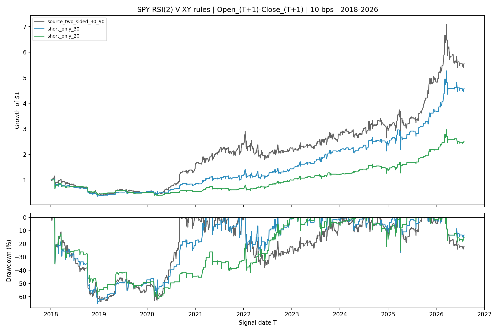
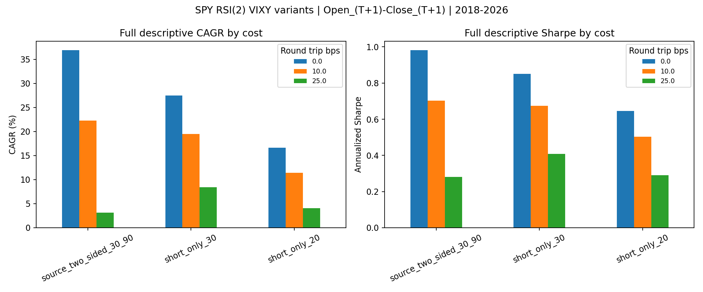

<!-- GENERATED FILE. EDIT THE CANONICAL KNOWLEDGE RECORD. -->

# SPY RSI(2) <=20 short-only VIXY follow-up

!!! warning "Research-only"
    This page summarizes saved research evidence. It does not authorize LIVE, allocation, or deployment.

## TL;DR

> **Verdict:** The post-result RSI<=20 short-only rule does not improve the already-seen historical baseline.

> **Status:** `forward_hypothesis`

> **Disposition:** `promising_component`

> **Replication:** `not_assessed`

## Research question

Compare the post-result <=20 short-only rule with the source rule under identical timing and costs.

## Exact setup

| Field | Value |
| --- | --- |
| Signal family | cross_market_short_volatility_mean_reversion |
| Universe | ["SPY signal proxy", "VIXY execution proxy"] |
| Decision | SPY Close_T |
| Fill | VIXY Open_(T+1) to Close_(T+1) |
| Primary cost layer | central_research |
| Last reviewed | 2026-08-19T15:39:05.5349241+03:00 |

## Timing and overnight attribution

```text
information available: SPY Close_T
primary executable fill: VIXY Open_(T+1) to Close_(T+1)
```

If final `Close_T` data formed the signal, a hypothetical `Close_T` entry is diagnostic only unless a separate pre-close protocol was modeled. Comparing that diagnostic with `Open_(T+1)` and applying the compounded return identity shows whether the apparent edge occurred in the overnight gap. Missing attribution numbers mean **not tested**, not zero.

| Attribution field | Value |
| --- | --- |
| Status | tested |
| Diagnostic Path | VIXY Close_T to Close_(T+1) |
| Executable Path | VIXY Open_(T+1) to Close_(T+1) |
| Method | Exact compounded overnight and intraday decomposition |
| Headline Result | Full-history candidate executable/diagnostic active-mean ratio 0.561. |
| Metrics | {"maximum_identity_error": 2.220446049250313e-16} |
| Artifact | tables/timing_summary.csv |

## Primary metrics

| Metric | Value |
| --- | ---: |
| Period | 2018-01-02 through 2026-07-31, all seen descriptive |
| Universe | SPY/VIXY proxy pair |
| Cost Layer | 10 bps aggregate round trip |
| Cagr | 11.44% |
| Annualized Volatility | 32.00% |
| Sharpe | 0.504 |
| Maximum Drawdown | -61.43% |
| Turnover | 36.19% |

## Four separate verdicts

| Question | Conclusion |
| --- | --- |
| Source Replication | Not a new source replication; this is a post-result controlled follow-up. |
| Predictive Value | Historical conditional economics only; no untouched predictive confirmation remains. |
| Economic Value | Candidate descriptive 10 bps CAGR 11.44%, Sharpe 0.504, max drawdown -61.43%. |
| Promotion | Forward shadow only; no PAPER, LIVE, or allocation authority. |

## Key findings

| Feature | Role | Direction | Status | Effect | Action |
| --- | --- | --- | --- | --- | --- |
| SPY Wilder RSI(2) <=20 | signal | short VIXY next session | forward_hypothesis | 0.35% | Prospective shadow only. |

## Visual evidence






## Limitations

- Post-result threshold selection
- No untouched holdout
- VIXY proxy rather than continuous VX
- No real borrow or auction-fill evidence
- No capacity evidence

## Next gates

- Freeze unchanged short_only_20 for genuinely future shadow dates.
- Measure borrow, spread, open/close fill, and selected-order capacity.

## Sources

- `parent study bitcoin_spx_vix_linked_signal_study`
- `C:\\Users\\User\\Documents\\workspace\\pakal\\pakal-research\\reports\\btc_overnight_vix_predictability_study\\tables\\signal_target_panel.csv`

## Canonical artifacts

| Artifact | Pakal path |
| --- | --- |
| Concise Report | `C:\\Users\\User\\Documents\\workspace\\pakal\\pakal-research\\reports\\spy_rsi20_short_only_followup\\REPORT.md` |
| Full Report | `C:\\Users\\User\\Documents\\workspace\\pakal\\pakal-research\\reports\\spy_rsi20_short_only_followup\\REPORT_FULL.md` |
| Notebook | `C:\\Users\\User\\Documents\\workspace\\pakal\\pakal-research\\spy_rsi20_short_only_followup.ipynb` |
| Frozen Specification | `C:\\Users\\User\\Documents\\workspace\\pakal\\pakal-research\\reports\\spy_rsi20_short_only_followup\\research_spec_frozen.json` |
| Manifest | `C:\\Users\\User\\Documents\\workspace\\pakal\\pakal-research\\reports\\spy_rsi20_short_only_followup\\run_manifest.json` |
| Primary Source Code | `["C:\\\\Users\\\\User\\\\Documents\\\\workspace\\\\pakal\\\\pakal-research\\\\spy_rsi20_short_only_followup.py"]` |
| Primary Tables | `["C:\\\\Users\\\\User\\\\Documents\\\\workspace\\\\pakal\\\\pakal-research\\\\reports\\\\spy_rsi20_short_only_followup\\\\tables\\\\performance_summary.csv", "C:\\\\Users\\\\User\\\\Documents\\\\workspace\\\\pakal\\\\pakal-research\\\\reports\\\\spy_rsi20_short_only_followup\\\\tables\\\\annual_returns_10bps.csv", "C:\\\\Users\\\\User\\\\Documents\\\\workspace\\\\pakal\\\\pakal-research\\\\reports\\\\spy_rsi20_short_only_followup\\\\tables\\\\timing_summary.csv"]` |
| Primary Charts | `["C:\\\\Users\\\\User\\\\Documents\\\\workspace\\\\pakal\\\\pakal-research\\\\reports\\\\spy_rsi20_short_only_followup\\\\charts\\\\equity_drawdown_comparison_10bps.png", "C:\\\\Users\\\\User\\\\Documents\\\\workspace\\\\pakal\\\\pakal-research\\\\reports\\\\spy_rsi20_short_only_followup\\\\charts\\\\cost_sensitivity_full.png", "C:\\\\Users\\\\User\\\\Documents\\\\workspace\\\\pakal\\\\pakal-research\\\\reports\\\\spy_rsi20_short_only_followup\\\\charts\\\\annual_returns_10bps.png", "C:\\\\Users\\\\User\\\\Documents\\\\workspace\\\\pakal\\\\pakal-research\\\\reports\\\\spy_rsi20_short_only_followup\\\\charts\\\\period_sharpe_10bps.png"]` |
