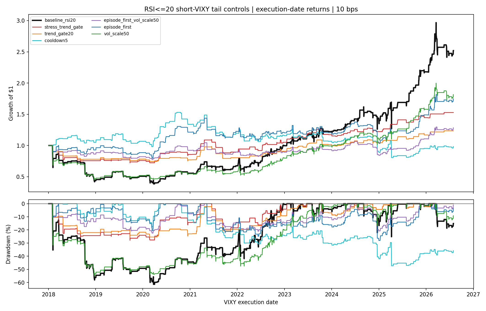
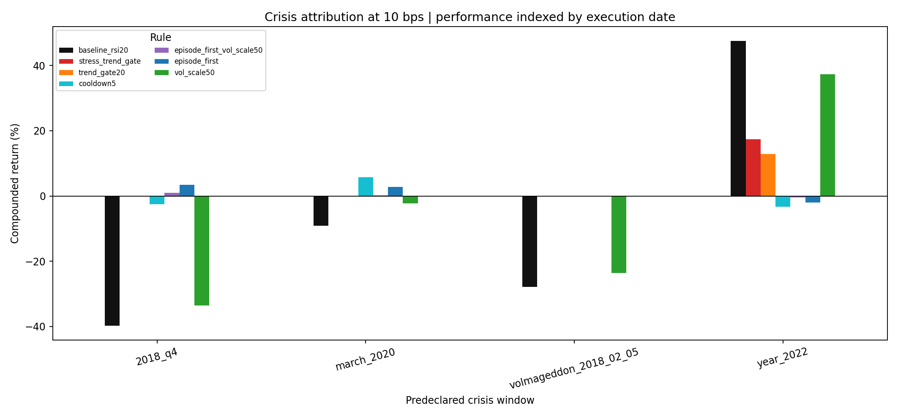

<!-- GENERATED FILE. EDIT THE CANONICAL KNOWLEDGE RECORD. -->

# SPY RSI(2) short-VIXY tail-risk control study

!!! warning "Research-only"
    This page summarizes saved research evidence. It does not authorize LIVE, allocation, or deployment.

## TL;DR

> **Verdict:** No frozen tail-control rule cleared every return, drawdown, tail, event-removed, and leave-one-year-out gate. Do not replace the baseline.

> **Status:** `diagnostic`

> **Disposition:** `rejected`

> **Replication:** `replicated`

## Research question

Determine whether a small set of transparent, causal tail-risk controls materially improves the already-seen executable 10 bps SPY RSI(2)<=20 short-VIXY rule without fitting thresholds to 2018 or relying only on deleting Volmageddon.

## Exact setup

| Field | Value |
| --- | --- |
| Signal family | SPY_RSI2_short_volatility_tail_control |
| Universe | ["SPY signal proxy", "VIX state proxy", "VIXY execution proxy"] |
| Decision | After final Close_T fields are known |
| Fill | VIXY Open_(T+1) to Close_(T+1) |
| Primary cost layer | central_research |
| Last reviewed | 2026-08-19T13:44:42+00:00 |

## Timing and overnight attribution

```text
information available: After final Close_T fields are known
primary executable fill: VIXY Open_(T+1) to Close_(T+1)
```

If final `Close_T` data formed the signal, a hypothetical `Close_T` entry is diagnostic only unless a separate pre-close protocol was modeled. Comparing that diagnostic with `Open_(T+1)` and applying the compounded return identity shows whether the apparent edge occurred in the overnight gap. Missing attribution numbers mean **not tested**, not zero.

| Attribution field | Value |
| --- | --- |
| Status | tested |
| Diagnostic Path | VIXY Close_T to Close_(T+1) |
| Executable Path | VIXY Open_(T+1) to Close_(T+1) |
| Method | Filter complete sessions, retain signal_date, index P&L by execution_date, and verify compounded overnight/intraday identity |
| Headline Result | Volmageddon is correctly attributed to execution date 2018-02-05 from signal date 2018-02-02. |
| Metrics | {"maximum_compounding_identity_error": 2.220446049250313e-16} |
| Unavailable Reason | N/A |
| Artifact | tables/timing_summary.csv |

## Primary metrics

| Metric | Value |
| --- | ---: |
| Period | 2018-01-02 through 2026-07-31; all seen |
| Universe | SPY/VIX/VIXY proxies |
| Cost Layer | central_research |
| Cagr | 11.42% |
| Annualized Volatility | 31.98% |
| Sharpe | 0.503 |
| Maximum Drawdown | -61.43% |
| Turnover | 36.14% |

## Four separate verdicts

| Question | Conclusion |
| --- | --- |
| Source Replication | Executable RSI<=20 baseline reconciled to immutable prior evidence. |
| Predictive Value | Not separately claimed; this is a stateful economic risk-overlay test. |
| Economic Value | No frozen tail-control rule cleared every return, drawdown, tail, event-removed, and leave-one-year-out gate. Do not replace the baseline. |
| Promotion | No production promotion; at most future frozen-rule shadow evidence. |

## Key findings

| Feature | Role | Direction | Status | Effect | Action |
| --- | --- | --- | --- | --- | --- |
| episode_first | risk_overlay | MDD reduction 0.5437; ES5 reduction 0.5625 | diagnostic | 0.5436623256084525 | do_not_advance |
| cooldown5 | risk_overlay | MDD reduction 0.2296; ES5 reduction 0.5840 | diagnostic | 0.22958409250590694 | do_not_advance |
| trend_gate20 | risk_overlay | MDD reduction 0.5816; ES5 reduction 0.8077 | diagnostic | 0.5816468766857488 | do_not_advance |
| stress_trend_gate | risk_overlay | MDD reduction 0.5454; ES5 reduction 0.7803 | diagnostic | 0.5453547865974487 | do_not_advance |
| vol_scale50 | risk_overlay | MDD reduction 0.1063; ES5 reduction 0.2419 | diagnostic | 0.10633938558321543 | do_not_advance |
| episode_first_vol_scale50 | risk_overlay | MDD reduction 0.6351; ES5 reduction 0.6490 | diagnostic | 0.6351260842198668 | do_not_advance |

## Visual evidence






## Limitations

- All 2018-2026 results are contaminated discovery/robustness.
- VIXY is not continuous VX, and daily official prices are not fill evidence.
- Borrow, recall, auction spread, impact, partial fills, and capacity are missing.
- Daily OHLC cannot support an unambiguous intraday-stop simulation.

## Next gates

- Observe the unchanged frozen rule on genuinely future dates without retuning.
- Measure borrow availability/fees, auction spreads/fills, recalls, impact, and selected-order capacity before any advancement.

## Sources

- `C:\\Users\\User\\Documents\\workspace\\pakal\\pakal-research\\reports\\spy_rsi20_short_only_followup\\research_spec_frozen.json`
- `C:/Users/User/Downloads/VIX-SPX.pdf`
- `C:\\Users\\User\\Documents\\workspace\\pakal\\pakal-research\\reports\\btc_overnight_vix_predictability_study\\tables\\signal_target_panel.csv`

## Canonical artifacts

| Artifact | Pakal path |
| --- | --- |
| Concise Report | `pakal-research/reports/spy_rsi20_vixy_tail_risk_control_study/REPORT.md` |
| Full Report | `pakal-research/reports/spy_rsi20_vixy_tail_risk_control_study/REPORT_FULL.md` |
| Notebook | `pakal-research/spy_rsi20_vixy_tail_risk_control_study.ipynb` |
| Frozen Specification | `pakal-research/reports/spy_rsi20_vixy_tail_risk_control_study/research_spec_frozen.json` |
| Manifest | `pakal-research/reports/spy_rsi20_vixy_tail_risk_control_study/run_manifest.json` |
| Primary Source Code | `["pakal-research/spy_rsi20_vixy_tail_risk_control_study.py"]` |
| Primary Tables | `["pakal-research/reports/spy_rsi20_vixy_tail_risk_control_study/tables/performance_summary.csv", "pakal-research/reports/spy_rsi20_vixy_tail_risk_control_study/tables/advancement_gate.csv", "pakal-research/reports/spy_rsi20_vixy_tail_risk_control_study/tables/crisis_summary_10bps.csv"]` |
| Primary Charts | `["pakal-research/reports/spy_rsi20_vixy_tail_risk_control_study/charts/equity_drawdown_10bps.png", "pakal-research/reports/spy_rsi20_vixy_tail_risk_control_study/charts/risk_return_gate_10bps.png", "pakal-research/reports/spy_rsi20_vixy_tail_risk_control_study/charts/crisis_attribution_10bps.png"]` |
| Research State | `pakal-research/reports/spy_rsi20_vixy_tail_risk_control_study/research_state.json` |
| Hypothesis Registry | `pakal-research/reports/spy_rsi20_vixy_tail_risk_control_study/hypothesis_registry.json` |
| Experiment Ledger | `pakal-research/reports/spy_rsi20_vixy_tail_risk_control_study/experiment_ledger.jsonl` |
| Decision Log | `pakal-research/reports/spy_rsi20_vixy_tail_risk_control_study/decision_log.jsonl` |
| Source Rule Map | `pakal-research/reports/spy_rsi20_vixy_tail_risk_control_study/SOURCE_RULE_MAP.md` |
