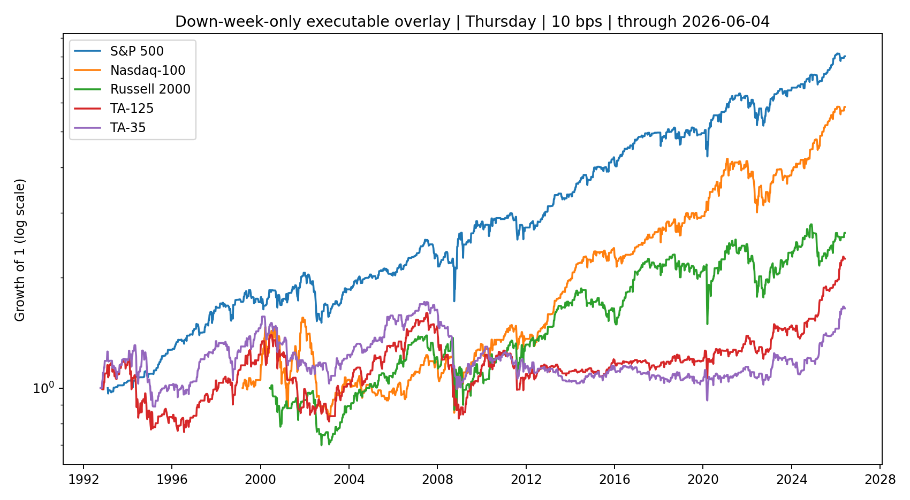
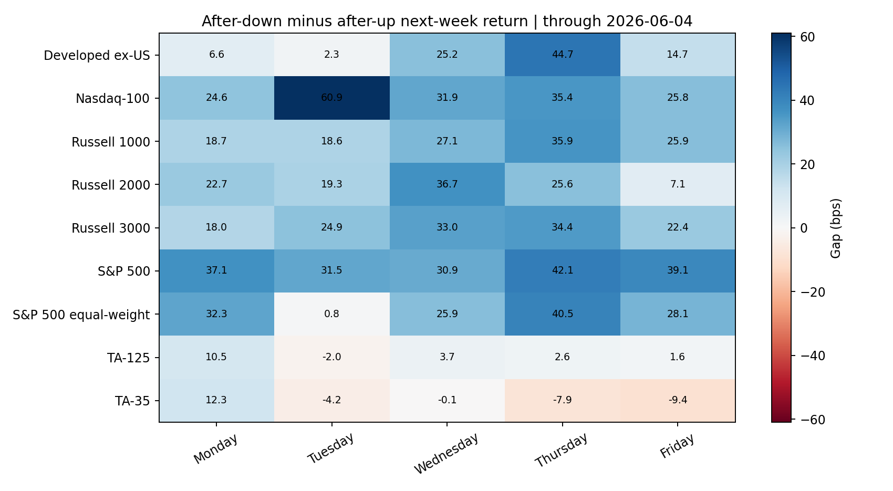

<!-- GENERATED FILE. EDIT THE CANONICAL KNOWLEDGE RECORD. -->

# Weekly equity-index mean reversion across US and Israeli markets

!!! warning "Research-only"
    This page summarizes saved research evidence. It does not authorize LIVE, allocation, or deployment.

## TL;DR

> **Verdict:** The conditional reversal is useful diagnostic evidence, but the predeclared promotion gate fails; do not turn it into an allocation rule yet.

> **Status:** `diagnostic`

> **Disposition:** `not_recorded`

> **Replication:** `not_recorded`

## Research question

Reproduce the paper's SPY weekly reversal and test causal cross-market transfer without live wiring.

## Exact setup

| Field | Value |
| --- | --- |
| Signal family | mean_reversion |
| Universe | ["S&P 500", "Nasdaq-100", "Russell 1000", "Russell 2000", "Russell 3000", "S&P 500 equal-weight", "Developed ex-US", "TA-125", "TA-35"] |
| Decision | Close_T |
| Fill | Open_T+1 to fixed next-anchor closing auction |
| Primary cost layer | central_research |
| Last reviewed | 2026-07-27T00:11:04.596100+03:00 |

## Timing and overnight attribution

```text
information available: Close_T
primary executable fill: Open_T+1 to fixed next-anchor closing auction
```

If final `Close_T` data formed the signal, a hypothetical `Close_T` entry is diagnostic only unless a separate pre-close protocol was modeled. Comparing that diagnostic with `Open_(T+1)` and applying the compounded return identity shows whether the apparent edge occurred in the overnight gap. Missing attribution numbers mean **not tested**, not zero.


## Primary metrics

| Metric | Value |
| --- | ---: |
| Period | 1993-01-29 through 2026-06-04 |
| Universe | SPY |
| Cost Layer | 10 bps round trip |
| Cagr | 6.43% |
| Annualized Volatility | 12.19% |
| Sharpe | 0.572 |
| Maximum Drawdown | -32.06% |
| Turnover | 4186.31% |

## Key findings

| Feature | Role | Direction | Status | Effect | Action |
| --- | --- | --- | --- | --- | --- |
| prior weekly return sign | entry signal and exposure state | larger next-week mean after a down week | diagnostic | SPY Thursday gap 42.1 bps | retain as research-only exposure diagnostic |
| prior weekly return magnitude | fixed-band diagnostic | negative bands have higher forward reward-to-risk | diagnostic | see Thursday fixed-band table | do not optimize thresholds |
| SMA200 and RV63 states | regime diagnostics | market-specific | diagnostic | see corrected regime tables | freeze any promising cell as a future hypothesis |

## Visual evidence






## Limitations

- paper close-to-close timing starts at the signal close
- no numeric exposure rule in the paper
- magnitude thresholds inferred from counts
- Yahoo Israeli series are price-index proxies
- auction fills, taxes, FX, and partial fills unresolved
- no substantial untouched SPY sample after publication

## Next gates

- untouched forward shadow with frozen Thursday rule
- select a tradable Israeli ETF or future and source total-return data
- measure opening and closing auction spreads, fills, and basis
- test fixed integration with a pre-existing trend sleeve only after forward evidence

## Sources

- `{"author": "Concretum Research", "date": "2026-06-05", "location": "C:\\\\Users\\\\User\\\\Downloads\\\\SPY_MR.pdf", "sha256": "49c391ad6b42e8be7dba724dbcd73baaf81c88a16678ad404543a57771c87204", "title": "Short-Term Reversal in the S&P 500"}`

## Canonical artifacts

| Artifact | Pakal path |
| --- | --- |
| Concise Report | `pakal-research/reports/spy_weekly_mean_reversion_cross_market/REPORT.md` |
| Full Report | `pakal-research/reports/spy_weekly_mean_reversion_cross_market/REPORT_FULL.md` |
| Notebook | `pakal-research/spy_weekly_mean_reversion_cross_market.ipynb` |
| Frozen Specification | `pakal-research/reports/spy_weekly_mean_reversion_cross_market/research_spec_frozen.json` |
| Manifest | `pakal-research/reports/spy_weekly_mean_reversion_cross_market/run_manifest.json` |
| Primary Source Code | `["pakal-research/spy_weekly_mean_reversion_cross_market.py"]` |
| Primary Tables | `["pakal-research/reports/spy_weekly_mean_reversion_cross_market/tables/sign_summary.csv", "pakal-research/reports/spy_weekly_mean_reversion_cross_market/tables/executable_summary.csv"]` |
| Primary Charts | `["pakal-research/reports/spy_weekly_mean_reversion_cross_market/charts/cross_market_anchor_gap_heatmap.png", "pakal-research/reports/spy_weekly_mean_reversion_cross_market/charts/central_overlay_equity.png"]` |
