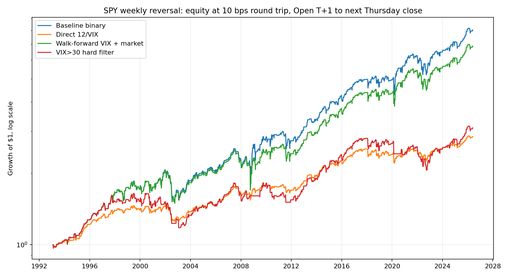
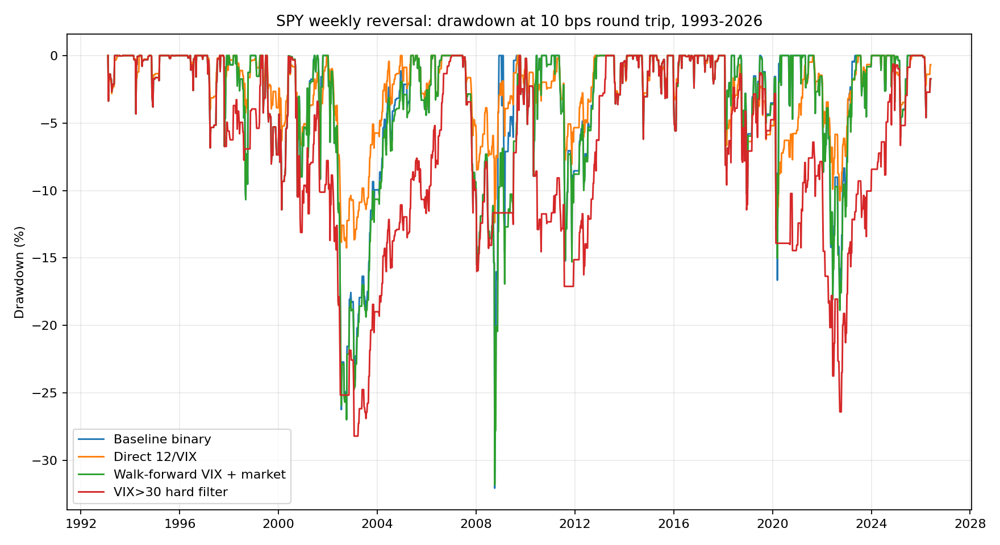

<!-- GENERATED FILE. EDIT THE CANONICAL KNOWLEDGE RECORD. -->

# SPY weekly mean-reversion VIX risk overlay

!!! warning "Research-only"
    This page summarizes saved research evidence. It does not authorize LIVE, allocation, or deployment.

## TL;DR

> **Verdict:** The fixed 12/VIX throttle did not pass every predeclared validation and confirmation gate. Keep VIX diagnostic only for this signal.

> **Status:** `diagnostic`

> **Disposition:** `not_recorded`

> **Replication:** `not_recorded`

## Research question

Determine whether a predeclared VIX exposure throttle materially reduces weekly SPY reversal tail risk while retaining at least 80% of baseline CAGR in validation and confirmation.

## Exact setup

| Field | Value |
| --- | --- |
| Signal family | weekly_mean_reversion |
| Universe | ["SPY S&P 500 ETF"] |
| Decision | after Thursday Close_T |
| Fill | next actual session Open_T+1 |
| Primary cost layer | central_research |
| Last reviewed | 2026-07-27T00:45:52.605104+03:00 |

## Timing and overnight attribution

```text
information available: after Thursday Close_T
primary executable fill: next actual session Open_T+1
```

If final `Close_T` data formed the signal, a hypothetical `Close_T` entry is diagnostic only unless a separate pre-close protocol was modeled. Comparing that diagnostic with `Open_(T+1)` and applying the compounded return identity shows whether the apparent edge occurred in the overnight gap. Missing attribution numbers mean **not tested**, not zero.


## Primary metrics

| Metric | Value |
| --- | ---: |
| Period | SPY inception through 2026-06-04 |
| Universe | SPY |
| Cost Layer | central_research |
| Cagr | 3.18% |
| Annualized Volatility | 6.05% |
| Sharpe | 0.549 |
| Maximum Drawdown | -14.26% |
| Turnover | 2624.16% |

## Key findings

| Feature | Role | Direction | Status | Effect | Action |
| --- | --- | --- | --- | --- | --- |
| VIX close | position-size normalizer | higher VIX lowers exposure monotonically | diagnostic | {"gate_pass_count": 4, "gate_total_count": 6} | keep_diagnostic_only |

## Visual evidence






## Limitations

- No substantial untouched post-paper confirmation sample exists.
- Yahoo VIX and SPY snapshots can be revised.
- Adjusted open/close proxies omit auction basis risk and partial fills.
- The fitted risk target is a noisy absolute weekly-return proxy.
- Capacity is not calibrated to actual opening or closing auction volume.

## Next gates

- Forward-shadow the frozen direct 12/VIX rule without changing it.
- Reconcile fills and auction-volume capacity before any deployment review.

## Sources

- `C:/Users/User/Downloads/SPY_MR.pdf`
- `pakal-research/reports/spy_weekly_mean_reversion_cross_market`
- `pakal-research/reports/hy_oas_vix_combined_risk_model_study`

## Canonical artifacts

| Artifact | Pakal path |
| --- | --- |
| Concise Report | `pakal-research/reports/spy_weekly_mean_reversion_vix_overlay/REPORT.md` |
| Full Report | `pakal-research/reports/spy_weekly_mean_reversion_vix_overlay/REPORT_FULL.md` |
| Notebook | `pakal-research/spy_weekly_mean_reversion_vix_overlay.ipynb` |
| Frozen Specification | `pakal-research/reports/spy_weekly_mean_reversion_vix_overlay/research_spec_frozen.json` |
| Manifest | `pakal-research/reports/spy_weekly_mean_reversion_vix_overlay/run_manifest.json` |
| Primary Source Code | `["pakal-research/spy_weekly_mean_reversion_vix_overlay.py"]` |
| Primary Tables | `["pakal-research/reports/spy_weekly_mean_reversion_vix_overlay/tables/performance_summary.csv", "pakal-research/reports/spy_weekly_mean_reversion_vix_overlay/tables/promotion_gate.csv"]` |
| Primary Charts | `["pakal-research/reports/spy_weekly_mean_reversion_vix_overlay/charts/central_equity.png", "pakal-research/reports/spy_weekly_mean_reversion_vix_overlay/charts/central_drawdown.png"]` |
