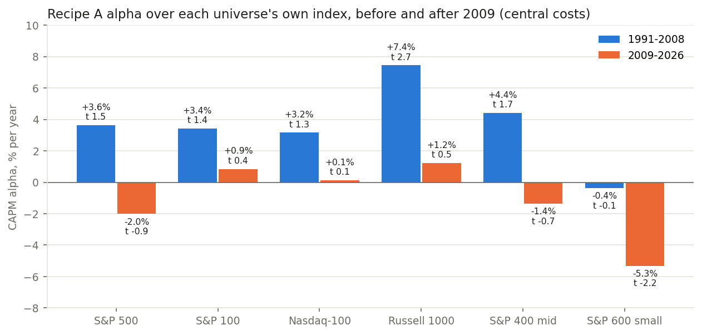
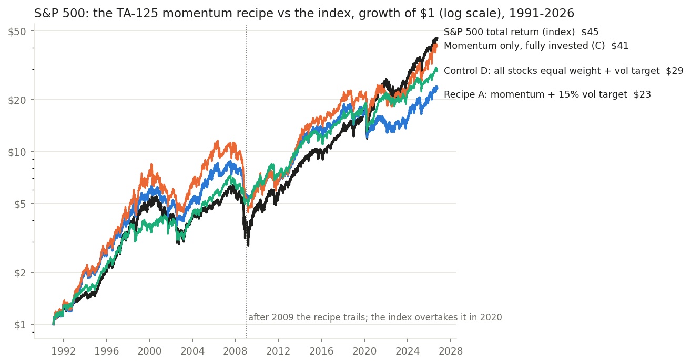

<!-- GENERATED FILE. EDIT THE CANONICAL KNOWLEDGE RECORD. -->

# TA-125 momentum recipe (12-1/6-1 blend, top-N buffer, inverse-vol, 15% vol target) ported to US PIT universes

!!! warning "Research-only"
    This page summarizes saved research evidence. It does not authorize LIVE, allocation, or deployment.

## TL;DR

> **Verdict:** REJECTED FOR THE US. On the S&P 500 the recipe earns Sharpe 0.47 vs 0.54 for the index; alpha is +0.9%/yr with t 0.55, positive only before 2009 and negative after. An equal-weight, vol-targeted S&P 500 without momentum does better (0.57). The only hint is the Russell 1000 (alpha +4.5%, t 2.4, Holm p 0.10), and it is almost entirely from 1991-2008. The vol target is useful risk control (DD -62% -> -41%) but not alpha.

> **Status:** `diagnostic`

> **Disposition:** `rejected`

> **Replication:** `not_transferable`

## Research question

Test whether the user's TA-125 momentum recipe (alpha t=4.0 on the TASE) earns alpha on US PIT universes, and separate momentum selection from the vol-target machinery.

## Exact setup

| Field | Value |
| --- | --- |
| Signal family | cross_sectional_momentum_vol_targeted |
| Universe | ["S&P 500, S&P 100, Nasdaq-100, Russell 1000, S&P 400, S&P 600 PIT (Norgate) incl. delisted; $5 raw floor; $1M median-63d turnover"] |
| Decision | Close_t at month end (selection) and week end (exposure check); signals are trailing ratios of TR-adjusted closes |
| Fill | Close_(t+1) MOC; robustness Open_(t+1) |
| Primary cost layer | central_research |
| Last reviewed | 2026-09-30T00:00:00+03:00 |

## Timing and overnight attribution

```text
information available: Close_t at month end (selection) and week end (exposure check); signals are trailing ratios of TR-adjusted closes
primary executable fill: Close_(t+1) MOC; robustness Open_(t+1)
```

If final `Close_T` data formed the signal, a hypothetical `Close_T` entry is diagnostic only unless a separate pre-close protocol was modeled. Comparing that diagnostic with `Open_(T+1)` and applying the compounded return identity shows whether the apparent edge occurred in the overnight gap. Missing attribution numbers mean **not tested**, not zero.

| Attribution field | Value |
| --- | --- |
| Status | tested |
| Diagnostic Path | none (portfolio test of a fixed recipe) |
| Executable Path | stateful daily engine with weekly exposure resizing, MOC fills |
| Method | frozen v1 spec, 54 runs, primary family 12 alpha tests with Holm |
| Headline Result | S&P 500 alpha +0.9%/yr t 0.55; 2009-2026 -2.0%/yr |
| Metrics | {"sp500_A_alpha_t_nw": 0.551086611889732, "sp500_A_sharpe": 0.4683894043043523} |
| Unavailable Reason | N/A |
| Artifact | pakal-research/reports/ta125_momentum_us_port/tables/primary_family_holm.csv |

## Primary metrics

| Metric | Value |
| --- | ---: |
| Period | 1991-02-01..2026-09-25 |
| Universe | S&P 500, recipe A (N=20, B=10, 15% vol target) |
| Cost Layer | central_research (5/10/20/40 bps per side by turnover tier) |
| Cagr | 9.23% |
| Annualized Volatility | 15.86% |
| Sharpe | 0.468 |
| Maximum Drawdown | -41.02% |
| Turnover | 830.09% |

## Four separate verdicts

| Question | Conclusion |
| --- | --- |
| Source Replication | not re-audited; transfer test only |
| Predictive Value | 12-1/6-1 momentum positive in US large caps 1991-2008, zero or negative 2009-2026 |
| Economic Value | none in the US after costs; the machinery adds no value over an equal-weight control |
| Promotion | none |

## Key findings

| Feature | Role | Direction | Status | Effect | Action |
| --- | --- | --- | --- | --- | --- |
| 12-1 + 6-1 percentile blend, top 20 with buffer 10, 5 per sector | N/A | N/A | N/A | N/A | N/A |
| 15% ex-ante vol target, weekly 5 pp band | N/A | N/A | N/A | N/A | N/A |
| SMA200 half exposure | N/A | N/A | N/A | N/A | N/A |

## Visual evidence






## Limitations

- GICS sector last-known, not PIT
- TASE break filter replaced by glitch guard
- delisting returns after the last bar not modelled
- TA-125 source result not re-audited

## Next gates

- No next test recorded.

## Sources

- `User-supplied TA-125 recipe (chat, 2026-09-30)`
- `Barroso & Santa-Clara 2015`
- `Moreira & Muir 2017`

## Canonical artifacts

| Artifact | Pakal path |
| --- | --- |
| Concise Report | `pakal-research/reports/ta125_momentum_us_port/REPORT.md` |
| Full Report | `pakal-research/reports/ta125_momentum_us_port/REPORT_FULL.md` |
| Notebook | `pakal-research/reports/ta125_momentum_us_port/ta125_momentum_us_port.ipynb` |
| Frozen Specification | `pakal-research/reports/ta125_momentum_us_port/research_spec_frozen.json` |
| Manifest | `pakal-research/reports/ta125_momentum_us_port/run_manifest.json` |
| Primary Source Code | `["pakal-research/ta125_momentum_us_port/t125us_lib.py", "pakal-research/ta125_momentum_us_port/t125us_run.py", "pakal-research/ta125_momentum_us_port/t125us_charts.py", "pakal-research/ta125_momentum_us_port/t125us_build_artifacts.py", "pakal-research/ta125_momentum_us_port/test_t125us_timing.py"]` |
| Primary Tables | `["pakal-research/reports/ta125_momentum_us_port/tables/primary_family_holm.csv", "pakal-research/reports/ta125_momentum_us_port/tables/stats_all.csv", "pakal-research/reports/ta125_momentum_us_port/tables/paired_differences.csv", "pakal-research/reports/ta125_momentum_us_port/tables/sp500_yearly_returns.csv"]` |
| Primary Charts | `["pakal-research/reports/ta125_momentum_us_port/charts/sp500_growth_of_1.png", "pakal-research/reports/ta125_momentum_us_port/charts/alpha_by_universe_era.png"]` |
