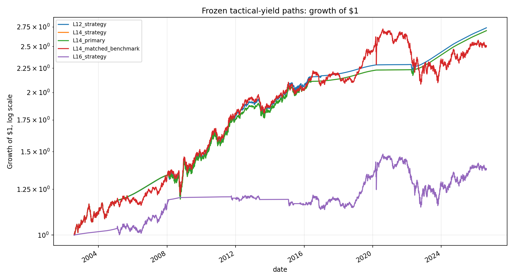
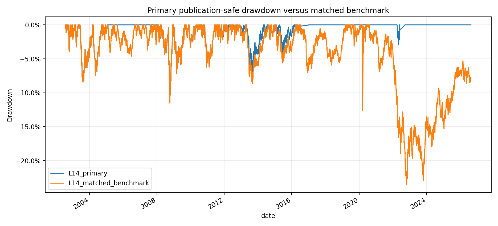

<!-- GENERATED FILE. EDIT THE CANONICAL KNOWLEDGE RECORD. -->

# T-Bills Most of the Time Tactical Yield Study

!!! warning "Research-only"
    This page summarizes saved research evidence. It does not authorize LIVE, allocation, or deployment.

## TL;DR

> **Verdict:** The transparent modern proxy directionally reproduces the source and the publication-safe full sample is economically favorable, but only two of four frozen subperiods improve Sharpe and multiplicity-aware inference is weak. Keep the rule diagnostic and freeze L14 for 24 untouched future monthly observations; do not advance to PAPER or LIVE.

> **Status:** `diagnostic`

> **Disposition:** `inconclusive`

> **Replication:** `directionally_replicated`

## Research question

Can the literal month-end term- and credit-premium median rule be directionally reproduced with transparent modern proxies, and does a publication-safe Open_T+1 translation beat a monthly 50/50 IEF/LQD benchmark after frozen costs and stability gates?

## Exact setup

| Field | Value |
| --- | --- |
| Signal family | historical_yield_spread_rank_tactical_bonds |
| Universe | ["Fixed modern ETF proxies: IEF and LQD; SPY appears only in a post-hoc report diagnostic"] |
| Decision | Month-end after a 17:15 ET cutoff using only yield observations conservatively modeled as public by then |
| Fill | Open_T+1 on the next Norgate session for the primary L14 path |
| Primary cost layer | central_research |
| Last reviewed | 2026-08-20T13:35:00+00:00 |

## Timing and overnight attribution

```text
information available: Month-end after a 17:15 ET cutoff using only yield observations conservatively modeled as public by then
primary executable fill: Open_T+1 on the next Norgate session for the primary L14 path
```

If final `Close_T` data formed the signal, a hypothetical `Close_T` entry is diagnostic only unless a separate pre-close protocol was modeled. Comparing that diagnostic with `Open_(T+1)` and applying the compounded return identity shows whether the apparent edge occurred in the overnight gap. Missing attribution numbers mean **not tested**, not zero.

| Attribution field | Value |
| --- | --- |
| Status | tested |
| Diagnostic Path | Allocate Smartly-like same-close Close_T execution with 20 bps round trip; timing-conflicted and non-verdict-owning |
| Executable Path | Publication-safe month-end decision followed by Open_T+1 execution with 10 bps round trip |
| Method | Frozen five-cell timing/cost ladder for each literal/control configuration, including same-close, market-vendor next-open, publication-safe next-open, and 25 bps survival paths |
| Headline Result | L14 CAGR 4.23%, Sharpe 0.562, daily max drawdown -11.51%; same-close L12 was only modestly stronger and remains diagnostic |
| Metrics | {"modeled_publication_violation_count": 0, "primary_L14_CAGR": 0.042342086786826494, "primary_L14_Sharpe": 0.5616616283034946, "same_close_L12_CAGR": 0.04301168539351585, "same_close_L12_Sharpe": 0.5730848639933401} |
| Unavailable Reason | Historical row-level FRED publication timestamps and a causal pre-close website execution protocol are unavailable. |
| Artifact | pakal-research/reports/tactical_yield_tbill_spread_study/tables/timing_audit.csv |

## Primary metrics

| Metric | Value |
| --- | ---: |
| Period | 2002-08-01 through 2026-08-19 |
| Universe | IEF/LQD total-return modern proxy with causal DGS10, DGS3MO and DAAA yield inputs |
| Cost Layer | central_research |
| Cagr | 4.23% |
| Annualized Volatility | 4.43% |
| Sharpe | 0.562 |
| Maximum Drawdown | -11.51% |
| Turnover | 61.33% |

## Four separate verdicts

| Question | Conclusion |
| --- | --- |
| Source Replication | directionally_replicated on modern IEF/LQD and public-yield proxies; exact 1930 Global Financial Data replication is unavailable |
| Predictive Value | not established as a distinct incremental forecast; the two spread states are highly clustered and term-only occurred once |
| Economic Value | historically favorable on the full modern sample after 10 bps round trip, but unstable across frozen subperiods and not statistically distinct after the 38-variant family correction |
| Promotion | diagnostic only; no allocation, PAPER, LIVE, or deployment authority |

## Key findings

| Feature | Role | Direction | Status | Effect | Action |
| --- | --- | --- | --- | --- | --- |
| Strictly-above inclusive-current expanding median of term and credit yield premia, with two 50% sleeves and residual T-bill cash | literal signal and sizing rule | The publication-safe L14 path improved CAGR by 0.31 percentage points, reduced volatility by 34.1%, and improved Sharpe by 0.218 versus monthly 50/50 IEF/LQD | diagnostic | 0.2175098130824329 | freeze L14 unchanged for 24 untouched future monthly observations |
| Source-declared 30/40/50/60/70 percentile cutoffs and 30-year, 50-year, or all-history rank windows | robustness neighborhood | All 11 publication-safe combined cells improved Sharpe and 10 of 11 improved CAGR | promising_component | N/A | retain as diagnostic support without selecting a realized winner |
| SPY market relationship on exact L14 active dates | post-hoc descriptive report diagnostic | Daily Pearson correlation -0.112, independently compounded monthly correlation 0.029, daily beta -0.026 | diagnostic | -0.11164 | report descriptively only; do not use for selection or promotion |

## Visual evidence






## Limitations

- Exact proprietary Global Financial Data histories from 1930 and the source's pre-ETF total-return construction are unavailable.
- DAAA and DBAA are long-maturity Moody's corporate yields and do not match LQD duration or composition.
- FRED inputs are current-vintage observations, not point-in-time vintages; historical release timestamps are conservatively modeled rather than observed row by row.
- The Norgate database timestamp moved from 14:58:15+03:00 during intake to 15:58:50+03:00 during execution. The exact executed IEF/LQD snapshot is preserved by SHA-256, but the run is not a byte-for-byte execution of the intake database state.
- Fixed current ETFs create an explicit modern-proxy survivorship limitation.
- The source reports history through February 2026, leaving no clean historical holdout and too few post-source months for confirmation.
- The two signals are highly clustered and term-only occurred once, so four-regime interpretation is weak.
- Taxes, realized fills, market impact, partial fills, operational failures, selected-order capacity, and live parity are unmeasured.

## Next gates

- Accumulate 24 complete untouched future monthly observations under the frozen L14 rule, publication model, Open_T+1 fill, 10 bps round-trip cost, and 50/50 IEF/LQD benchmark, then open the confirmation gate once without retuning.
- If that future gate passes, separately measure opening-auction fills, spreads, impact, operational parity, and AUM capacity bands before any deployment-level consideration.

## Sources

- `C:/Users/User/Downloads/TBILL_MOST_OF_THE_TIME.pdf#sha256=20a554eeb75def2d1420de2fb855fa382f6dfa8c0078851310076f76e3803a52`
- `C:/Users/User/Downloads/TBILL_MOST_OF_THE_TIME_PT2.pdf#sha256=e063b2ae5c9de4c7813b620723310a0c9a3fbce2a025ff45a9fd183fd16040b7`
- `User-linked ChatGPT conversation, secondary interpretive source only`
- `FRED DGS10, DGS3MO, DTB3, DAAA and DBAA current-vintage snapshots with hashes in data/source_inventory.json`
- `Norgate TOTALRETURN IEF/LQD execution snapshot sha256=df9756d6c94d8ce00f9ba449165355ce291f83a5f55912a08fe6ad7eb5635894`

## Canonical artifacts

| Artifact | Pakal path |
| --- | --- |
| Concise Report | `pakal-research/reports/tactical_yield_tbill_spread_study/REPORT.md` |
| Full Report | `pakal-research/reports/tactical_yield_tbill_spread_study/REPORT_FULL.md` |
| Hebrew Report | `pakal-research/reports/tactical_yield_tbill_spread_study/REPORT_HE.md` |
| Notebook | `pakal-research/notebooks/tactical_yield_tbill_spread_study_executed.ipynb` |
| Frozen Specification | `pakal-research/reports/tactical_yield_tbill_spread_study/research_spec_frozen.json` |
| Manifest | `pakal-research/reports/tactical_yield_tbill_spread_study/run_manifest.json` |
| Primary Source Code | `["pakal-research/tactical_yield_tbill_spread_study.py", "pakal-research/tactical_yield_spy_report_diagnostic.py", "pakal-research/build_tactical_yield_tbill_spread_notebook.py"]` |
| Primary Tables | `["pakal-research/reports/tactical_yield_tbill_spread_study/tables/variant_metrics.csv", "pakal-research/reports/tactical_yield_tbill_spread_study/tables/subperiod_metrics.csv", "pakal-research/reports/tactical_yield_tbill_spread_study/tables/primary_hac_inference.csv", "pakal-research/reports/tactical_yield_tbill_spread_study/tables/familywise_bootstrap.csv", "pakal-research/reports/tactical_yield_tbill_spread_study/tables/timing_audit.csv"]` |
| Primary Charts | `["pakal-research/reports/tactical_yield_tbill_spread_study/charts/equity_curve_primary.png", "pakal-research/reports/tactical_yield_tbill_spread_study/charts/drawdown_primary.png", "pakal-research/reports/tactical_yield_tbill_spread_study/charts/primary_subperiod_sharpe.png", "pakal-research/reports/tactical_yield_tbill_spread_study/charts/spy_rolling_correlation_126.png"]` |
| Research State | `pakal-research/reports/tactical_yield_tbill_spread_study/research_state.json` |
| Hypothesis Registry | `pakal-research/reports/tactical_yield_tbill_spread_study/hypothesis_registry.json` |
| Experiment Ledger | `pakal-research/reports/tactical_yield_tbill_spread_study/experiment_ledger.jsonl` |
| Decision Log | `pakal-research/reports/tactical_yield_tbill_spread_study/decision_log.jsonl` |
| Source Rule Map | `pakal-research/reports/tactical_yield_tbill_spread_study/SOURCE_RULE_MAP.md` |
