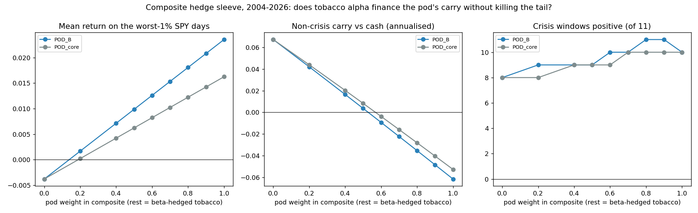
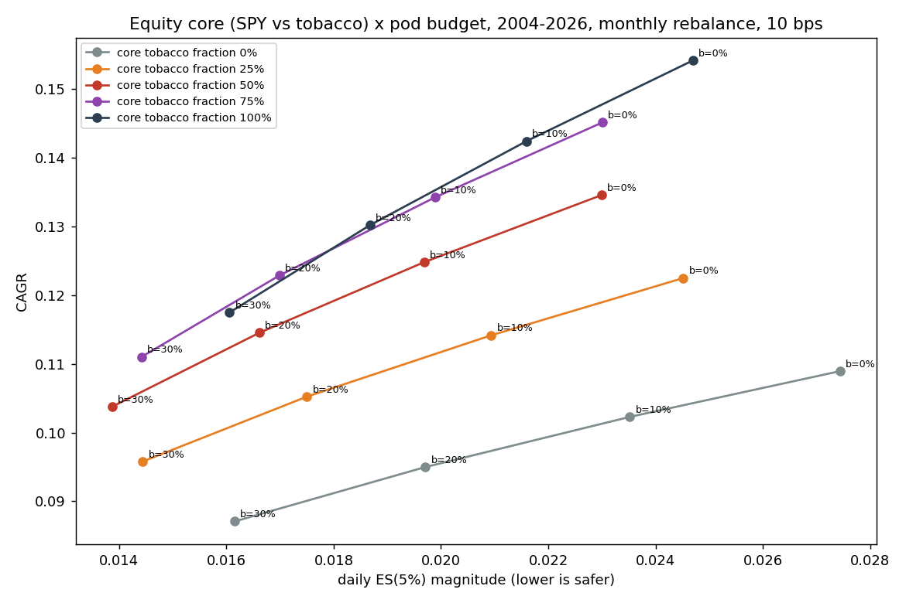

<!-- GENERATED FILE. EDIT THE CANONICAL KNOWLEDGE RECORD. -->

# Tobacco next to the crisis-trend pod: composite hedge sleeve, equity-core replacement, SMA200 rotation and robustness

!!! warning "Research-only"
    This page summarizes saved research evidence. It does not authorize LIVE, allocation, or deployment.

## TL;DR

> **Verdict:** Diagnostic; the tail-hedge rejection of round 1 survives equal-weighting, leave-one-out, single names and block bootstrap (worst-5% month mean CI90 [-8.5%, -5.2%]), and tobacco's crash cushion is fully explained by its beta (residual rank 16 of 48 industries). On the pod's headline metric (worst-5% rolling-63 SPY windows) pod B earns +15.9% with 94% hit while the tobacco basket loses -8.2% (18%). Rotating SPY -> tobacco below SMA200 fails (0/11 windows, COVID -33%, 2022 -29%) because the cushion is front-loaded: +3.3%/month relative in the first three months of a >=10% drawdown, +0.35% afterwards. Two roles exist outside the pod definition: a separate beta-hedged tobacco alpha sleeve (composite 80/20 pod/tobacco keeps 93% worst-day hit and 11/11 windows while halving carry to -3.5%/yr; 50/50 has P(CAGR<=0)=0.3% vs 26% for the pod but hit drops to 79% and 2018 is -17%), and a 25-50% tobacco share in the equity core (50/50 core + 30% pod: Sharpe 0.86 vs 0.62, MDD -28.5% vs -36.6%, 2022 -5.7% vs -14.6%), both bets on the sector premium with a regulatory tail. Keep the pod frozen; no PAPER/LIVE/allocation.

> **Status:** `diagnostic`

> **Disposition:** `tail_hedge_verdict_unchanged_2026-09-03; pod_definition_unchanged; optional_separate_beta_hedged_tobacco_alpha_sleeve`

> **Replication:** `not_recorded`

## Research question

No machine-readable objective was recorded.

## Exact setup

| Field | Value |
| --- | --- |
| Signal family | sector_defensive_equity_next_to_tail_hedge_pod |
| Universe | ["Round-1 tobacco basket paths (MO PM BTI IMBBY RAI LO UST VGR SWMAY, Norgate TOTALRETURN, Open_(T+1)) 1993-02..2026-08", "Crisis-trend pod daily paths (A core, B core + VIXM 25% in backwardation) 2004-01..2026-08", "Ken French 48-industry VW and EW 'Smoke' 1926-07..2026-06"] |
| Decision | After official Close_T (month-end membership and beta; SMA200 signal; drawdown and VIX states shifted one session) |
| Fill | Open_(T+1); primary mark Open_(T+2) |
| Primary cost layer | central_research |
| Last reviewed | 2026-09-03 |

## Timing and overnight attribution

```text
information available: After official Close_T (month-end membership and beta; SMA200 signal; drawdown and VIX states shifted one session)
primary executable fill: Open_(T+1); primary mark Open_(T+2)
```

If final `Close_T` data formed the signal, a hypothetical `Close_T` entry is diagnostic only unless a separate pre-close protocol was modeled. Comparing that diagnostic with `Open_(T+1)` and applying the compounded return identity shows whether the apparent edge occurred in the overnight gap. Missing attribution numbers mean **not tested**, not zero.


## Primary metrics

| Metric | Value |
| --- | ---: |
| Period | N/A |
| Universe | N/A |
| Cost Layer | N/A |
| Cagr | N/A |
| Annualized Volatility | N/A |
| Sharpe | N/A |
| Maximum Drawdown | N/A |
| Turnover | N/A |

## Key findings

| Feature | Role | Direction | Status | Effect | Action |
| --- | --- | --- | --- | --- | --- |
| Composite hedge sleeve: w x pod B + (1-w) x beta-hedged tobacco | carry financing for the tail-hedge pod | long pod, long tobacco alpha (market-neutral) | diagnostic | {"w0.5": {"carry": 0.00365069, "crises": "9/11", "hit": 0.789474, "worst1pct": 0.00987351}, "w0.8": {"carry": -0.0353442, "crises": "11/11", "hit": 0.929825, "worst1pct": 0.0180668}} | Do not change the pod; if carry financing is wanted, size a separate beta-hedged tobacco sleeve at 20-40% of pod notional. |
| Tobacco share in the equity core next to the pod | equity-core diversifier | long | diagnostic | {"core50_pod30": {"ES5": -0.0138701, "MDD": -0.285088, "Sharpe": 0.862079, "w2022": -0.0572142}, "coreSPY_pod30": {"ES5": -0.0161555, "MDD": -0.365746, "Sharpe": 0.623933, "w2022": -0.145512}} | If pursued, run a broad low-beta/quality equity-sleeve study (BAB, XLP, XLU, XLV, tobacco) with concentration and regulatory-event limits. |
| SMA200 rotation SPY -> tobacco | bear-market rotation rule | switch to tobacco when SPY < SMA200 | rejected | {"COVID": -0.332587, "MDD": -0.416764, "Sharpe": 0.594021, "bear2022": -0.290711, "crises": "0/11"} | None; the cushion is front-loaded and cannot be timed by trend, VIX or drawdown state. |
| Front-loaded cushion and crash-speed dependence (French 1926-2026) | mechanism diagnostic | relative outperformance rises with bear length; concentrated in the first 3 months of a >=10% drawdown | diagnostic | {"after3m_relative": 0.00346895, "first3m_hit": 0.791045, "first3m_relative": 0.0327627, "spearman_relative_vs_length": 0.4978243834933005} | None. |
| Robustness of the round-1 rejection | robustness | tobacco not a hedge | diagnostic | {"EW_smoke_worst5m": -0.0838, "french_worst5m_ci90": [-0.0846477, -0.0517882], "leave_one_out_crises": "3-4/14", "residual_rank_of_48": 16, "single_names_worst1pct_hit_range": "6-20%"} | Close the single-sector tail-hedge question. |

## Visual evidence






## Limitations

- All combinations evaluated on history already seen in round 1 and in the pod study; no holdout.
- Eleven pod-sample crisis windows; 2008 and 2020 dominate; the regulatory tail is two episodes.
- Composites and blends are linear without margin/gross limits; the composite assumes free daily rebalancing between legs.
- SPY short with 50 bps borrow and no empirical spread evidence.
- No tobacco options, no valuation-timed rotation sleeve, no non-US tobacco indices.

## Next gates

- If carry financing is wanted: shadow a separate beta-hedged tobacco sleeve at 20-40% of pod notional with real fills and borrow; keep the pod rule frozen.
- If an equity-core diversifier is wanted: broad low-beta/quality sleeve study with concentration and regulatory-event limits.
- Do not reopen tobacco-as-hedge or rotation rules.

## Sources

- `{"publisher": "pakal-research", "title": "Round 1: tobacco tail-hedge study", "url": "pakal-research/reports/tobacco_tail_hedge_study/REPORT.md", "year": 2026}`
- `{"publisher": "pakal-research", "title": "Crisis-trend pod study (core + VIXM 25% recommended)", "url": "pakal-research/reports/crisis_trend_pod_study/REPORT.md", "year": 2026}`
- `{"publisher": "Kenneth R. French Data Library", "title": "48 Industry Portfolios (VW and EW) and Fama-French factors", "url": "https://mba.tuck.dartmouth.edu/pages/faculty/ken.french/data_library.html", "year": 2026}`
- `{"publisher": "Politis & Romano / JASA", "title": "The stationary bootstrap", "url": "https://doi.org/10.1080/01621459.1994.10476870", "year": 1994}`
- `{"publisher": "AQR", "title": "Tail Risk Hedging: Contrasting Put and Trend Strategies", "url": "https://www.aqr.com/insights/research/white-papers/tail-risk-hedging-contrasting-put-and-trend-strategies", "year": 2020}`

## Canonical artifacts

| Artifact | Pakal path |
| --- | --- |
| Concise Report | `pakal-research/reports/tobacco_tail_hedge_round2_study/REPORT.md` |
| Full Report | `pakal-research/reports/tobacco_tail_hedge_round2_study/REPORT_FULL.md` |
| Notebook | `pakal-research/tobacco_tail_hedge_round2_study.ipynb` |
| Frozen Specification | `pakal-research/reports/tobacco_tail_hedge_round2_study/research_spec.json` |
| Manifest | `pakal-research/reports/tobacco_tail_hedge_round2_study/run_manifest.json` |
| Primary Source Code | `["pakal-research/tobacco_tail_hedge_round2_study.py", "pakal-research/build_tobacco_tail_hedge_round2_artifacts.py", "tests/test_tobacco_tail_hedge_round2_study.py"]` |
| Primary Tables | `["pakal-research/reports/tobacco_tail_hedge_round2_study/tables/composite_frontier.csv", "pakal-research/reports/tobacco_tail_hedge_round2_study/tables/core_replacement_grid.csv", "pakal-research/reports/tobacco_tail_hedge_round2_study/tables/rotation_rules.csv", "pakal-research/reports/tobacco_tail_hedge_round2_study/tables/rolling63_worst_pod_sample.csv", "pakal-research/reports/tobacco_tail_hedge_round2_study/tables/french_bootstrap.csv", "pakal-research/reports/tobacco_tail_hedge_round2_study/tables/french_window_speed.csv", "pakal-research/reports/tobacco_tail_hedge_round2_study/tables/french_drawdown_state.csv", "pakal-research/reports/tobacco_tail_hedge_round2_study/tables/single_name_dispersion.csv", "pakal-research/reports/tobacco_tail_hedge_round2_study/tables/leave_one_out_baskets.csv", "pakal-research/reports/tobacco_tail_hedge_round2_study/tables/exec_bootstrap.csv"]` |
| Primary Charts | `["pakal-research/reports/tobacco_tail_hedge_round2_study/charts/composite_frontier.png", "pakal-research/reports/tobacco_tail_hedge_round2_study/charts/rolling63_scatter.png", "pakal-research/reports/tobacco_tail_hedge_round2_study/charts/core_replacement.png", "pakal-research/reports/tobacco_tail_hedge_round2_study/charts/rotation_rules.png", "pakal-research/reports/tobacco_tail_hedge_round2_study/charts/french_window_speed.png", "pakal-research/reports/tobacco_tail_hedge_round2_study/charts/single_name_crisis.png"]` |
