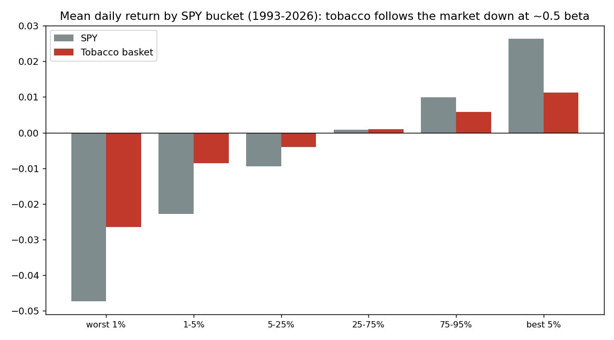
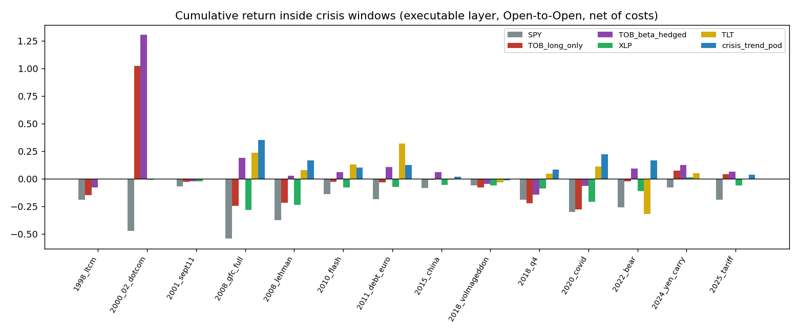

<!-- GENERATED FILE. EDIT THE CANONICAL KNOWLEDGE RECORD. -->

# Tobacco stocks as a tail hedge: defensive beta, not crash insurance

!!! warning "Research-only"
    This page summarizes saved research evidence. It does not authorize LIVE, allocation, or deployment.

## TL;DR

> **Verdict:** Rejected as a tail hedge; confirmed as a defensive sector. Over 1926-2026 tobacco has beta 0.62 with down-beta equal to up-beta (no convexity), mean -6.9% in the worst-5% market months (positive only 12% of the time) but +4.9% relative to the market (hit 82%), ranking #2 of 48 industries after gold. The executable basket 1993-2026 was negative in 11 of 14 crisis windows (-28% in COVID, -22% in Q4-2018) with tail beta rising to 0.81 on the worst-5% SPY days; a beta-hedged sleeve earns +7.5%/yr carry with zero correlation but has tail beta 0.29, 49% hit on the worst-1% days and a -51% idiosyncratic drawdown. The folklore comes from 2000-02 (+102% vs SPY -47%), a value rotation after two litigation years, not a hedging property. Belongs in the equity book as a low-beta sleeve, not in the tail-hedge pod.

> **Status:** `diagnostic`

> **Disposition:** `rejected_as_tail_hedge_2026-09-02; candidate_for_defensive_equity_sleeve`

> **Replication:** `not_recorded`

## Research question

No machine-readable objective was recorded.

## Exact setup

| Field | Value |
| --- | --- |
| Signal family | sector_defensive_equity_tail_hedge_claim |
| Universe | ["Ken French 48-industry VW 'Smoke' portfolio, daily and monthly, 1926-07..2026-06 (CRSP 202606)", "Norgate TOTALRETURN survivorship-free basket: MO PM BTI IMBBY RAI-201707 LO-201506 UST-200901 VGR-202410 SWMAY-200410, 1993-02..2026-08"] |
| Decision | After official Close_T; month-end equal-weight membership and trailing 252-session beta |
| Fill | Open_(T+1); primary mark Open_(T+2) |
| Primary cost layer | central_research |
| Last reviewed | 2026-09-02 |

## Timing and overnight attribution

```text
information available: After official Close_T; month-end equal-weight membership and trailing 252-session beta
primary executable fill: Open_(T+1); primary mark Open_(T+2)
```

If final `Close_T` data formed the signal, a hypothetical `Close_T` entry is diagnostic only unless a separate pre-close protocol was modeled. Comparing that diagnostic with `Open_(T+1)` and applying the compounded return identity shows whether the apparent edge occurred in the overnight gap. Missing attribution numbers mean **not tested**, not zero.


## Primary metrics

| Metric | Value |
| --- | ---: |
| Period | N/A |
| Universe | N/A |
| Cost Layer | N/A |
| Cagr | N/A |
| Annualized Volatility | N/A |
| Sharpe | N/A |
| Maximum Drawdown | N/A |
| Turnover | N/A |

## Key findings

| Feature | Role | Direction | Status | Effect | Action |
| --- | --- | --- | --- | --- | --- |
| Tobacco long-only as absolute tail hedge | tail_hedge_candidate | long | rejected | {"crises_positive": "3/14", "worst1pct_days_hit_1993_2026": 0.07058823529411765, "worst5m_mean_1926_2026": -0.06862833333333333} | Do not add to the tail-hedge pod. |
| Tobacco as defensive (relative) sector | defensive_equity | long | diagnostic | {"exec_Sharpe": 0.7933124019554937, "rank_of_48": 2.0, "relative_hit": 0.8166666666666667, "relative_mean_worst5m": 0.04870666666666667} | Evaluate inside the equity book as a low-beta/quality sleeve against XLP and BAB, with concentration limits. |
| Beta-hedged long tobacco / short SPY sleeve | hedge_sleeve_candidate | long tobacco, short beta x SPY | rejected_as_hedge | {"CAGR": 0.12000777554225905, "MDD": -0.5092154909668961, "Sharpe": 0.5777265927932135, "noncrisis_carry": 0.07506631504839123, "tail_beta": 0.29154686405275027, "worst1pct_hit": 0.4880952380952381} | Not a hedge; alpha sleeve only, with regulatory tail unhedged. |
| Down/up beta asymmetry (convexity) | diagnostic | beta_down < beta_up required | rejected | {"exec_daily_beta_down_minus_up_t": 2.0450289939244075, "french_beta_down_minus_up_t": -0.03859498177756501} | None. |

## Visual evidence






## Limitations

- Layer A is an industry index without costs; Layer B is an equal-weight basket of 4-8 names with high concentration.
- 24 bear windows but only 2000-02 and 2008 are long enough to weigh; fast windows are a handful of days.
- ADR members (BTI, IMBBY) carry FX exposure; the US-only variant is qualitatively identical.
- No empirical borrow or spread evidence for the SPY short; Norgate opens are research marks.
- No options on tobacco names and no valuation/dividend-timed rotation sleeve were tested.

## Next gates

- If a defensive-equity sleeve is wanted: compare the tobacco basket with XLP, low-beta and quality factors inside the equity book with concentration and regulatory-event limits.
- Do not reopen the tail-hedge question for single sectors; the crisis-trend pod remains the frozen forward hypothesis.

## Sources

- `{"publisher": "Kenneth R. French Data Library", "title": "48 Industry Portfolios (daily and monthly) and Fama-French factors", "url": "https://mba.tuck.dartmouth.edu/pages/faculty/ken.french/data_library.html", "year": 2026}`
- `{"publisher": "Norgate Data", "title": "Norgate Data US Equities and US Equities Delisted, TOTALRETURN", "url": "https://norgatedata.com/", "year": 2026}`
- `{"publisher": "Hong & Kacperczyk / JFE", "title": "The Price of Sin: The Effects of Social Norms on Markets", "url": "https://doi.org/10.1016/j.jfineco.2008.09.001", "year": 2009}`
- `{"publisher": "pakal-research", "title": "Crisis-trend pod study (frozen forward hypothesis)", "url": "pakal-research/reports/crisis_trend_pod_study/REPORT.md", "year": 2026}`

## Canonical artifacts

| Artifact | Pakal path |
| --- | --- |
| Concise Report | `pakal-research/reports/tobacco_tail_hedge_study/REPORT.md` |
| Full Report | `pakal-research/reports/tobacco_tail_hedge_study/REPORT_FULL.md` |
| Notebook | `pakal-research/tobacco_tail_hedge_study.ipynb` |
| Frozen Specification | `pakal-research/reports/tobacco_tail_hedge_study/research_spec.json` |
| Manifest | `pakal-research/reports/tobacco_tail_hedge_study/run_manifest.json` |
| Primary Source Code | `["pakal-research/tobacco_tail_hedge_study.py", "pakal-research/build_tobacco_tail_hedge_artifacts.py", "tests/test_tobacco_tail_hedge_study.py"]` |
| Primary Tables | `["pakal-research/reports/tobacco_tail_hedge_study/tables/french_industry_tail_table.csv", "pakal-research/reports/tobacco_tail_hedge_study/tables/french_crisis_windows.csv", "pakal-research/reports/tobacco_tail_hedge_study/tables/exec_sleeve_summary_central.csv", "pakal-research/reports/tobacco_tail_hedge_study/tables/exec_crisis_windows_central.csv", "pakal-research/reports/tobacco_tail_hedge_study/tables/exec_conditional_response_central.csv", "pakal-research/reports/tobacco_tail_hedge_study/tables/exec_overlay_budget_central.csv"]` |
| Primary Charts | `["pakal-research/reports/tobacco_tail_hedge_study/charts/french_cross_section.png", "pakal-research/reports/tobacco_tail_hedge_study/charts/exec_crisis_windows.png", "pakal-research/reports/tobacco_tail_hedge_study/charts/exec_conditional_response.png", "pakal-research/reports/tobacco_tail_hedge_study/charts/exec_overlay_budget.png"]` |
