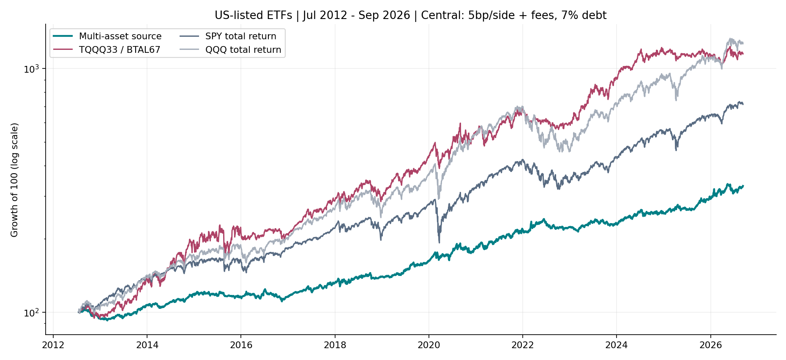
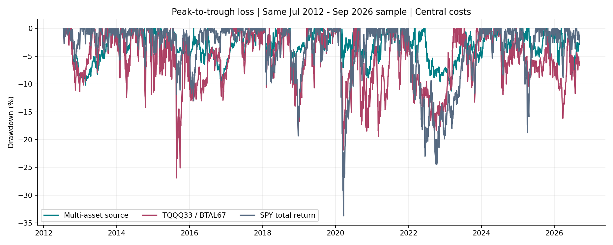

<!-- GENERATED FILE. EDIT THE CANONICAL KNOWLEDGE RECORD. -->

# BTAL and multi-asset trend: lower drawdown, unstable return advantage

!!! warning "Research-only"
    This page summarizes saved research evidence. It does not authorize LIVE, allocation, or deployment.

## TL;DR

> **Verdict:** Diagnostic promising risk-reduction component, not a proven universal upgrade. Validation10.62%CAGR/11.25%DD versus original23.12%/21.87% fails frozen75% return retention. Later309sessions22.89% total versus1.04% reverses relative returns; short and previously contextualized history. BTAL-specific and volatility-sizing advantages not robust. No operational promotion.

> **Status:** `diagnostic`

> **Disposition:** `promising_component`

> **Replication:** `not_reproducible`

## Research question

Does the literal four-slot trend allocation with BTAL reduce losses while retaining net value versus an annual33/67TQQQ-BTAL comparator?

## Exact setup

| Field | Value |
| --- | --- |
| Signal family | ETF_multiasset_trend_anti_beta |
| Universe | ["FixedUS-listedQLD,BTAL,GLD,TLT,DBC; comparatorTQQQ,BTAL; referencesSPY,QQQ"] |
| Decision | CompletedCloseT; weeklyentries,dailytrendexits,annualfull liquidation. |
| Fill | PriorT-fixed nextClose entries and defaultnextOpenexits; namedtimingcontrols. |
| Primary cost layer | central_research |
| Last reviewed | 2026-09-13T20:45:22.405421+00:00 |

## Timing and overnight attribution

```text
information available: CompletedCloseT; weeklyentries,dailytrendexits,annualfull liquidation.
primary executable fill: PriorT-fixed nextClose entries and defaultnextOpenexits; namedtimingcontrols.
```

If final `Close_T` data formed the signal, a hypothetical `Close_T` entry is diagnostic only unless a separate pre-close protocol was modeled. Comparing that diagnostic with `Open_(T+1)` and applying the compounded return identity shows whether the apparent edge occurred in the overnight gap. Missing attribution numbers mean **not tested**, not zero.

| Attribution field | Value |
| --- | --- |
| Status | tested |
| Diagnostic Path | Same signed fill quantity at decisionCloseT |
| Executable Path | NextOpen tosameNextClose endpoint |
| Method | Exact compounded overnight/intraday identity and signed dollar differences; no portfolio rerun. |
| Headline Result | Split-consistent signed execution-reference decomposition, not incremental alpha. |
| Metrics | {"decision_to_fill_dollars": -22590.567319869995, "decision_to_open_dollars": -16597.854679107666, "fills": 363, "interpretation": "Signed same-quantity reference costs, positive is worse execution than earlier reference; not incremental strategy profit.", "max_compound_residual": 2.220446049250313e-16, "name": "primary_source_close", "open_to_close_dollars": -1065.429871559143, "period": "full_common"} |
| Artifact | C:/Users/User/Documents/workspace/pakal/pakal-research/reports/tradequantix_btal_multiasset_study/tables/timing_summary.csv |

## Primary metrics

| Metric | Value |
| --- | ---: |
| Period | 2019-01-01:2025-06-17 |
| Universe | US-listedQLD,BTAL,GLD,TLT,DBC maximum4 |
| Cost Layer | central_research |
| Cagr | 10.62% |
| Annualized Volatility | 10.21% |
| Sharpe | 1.042 |
| Maximum Drawdown | -11.25% |
| Turnover | 700.21% |

## Four separate verdicts

| Question | Conclusion |
| --- | --- |
| Source Replication | Source44/03/05 read completely; missing curves and settings prevent exact reproduction. |
| Predictive Value | Lower realized drawdown across windows; no universal superior return or isolated BTAL alpha proof. |
| Economic Value | Positive central and stressed mechanical paths with ex-date cash approximation; failed75% validation return-retention gate. |
| Promotion | No operational promotion; insufficient independent duration and fill/event/capacity evidence. |

## Key findings

| Feature | Role | Direction | Status | Effect | Action |
| --- | --- | --- | --- | --- | --- |
| multiasset_SMA200 | portfolio_construction | Lower drawdown with material validation return sacrifice | diagnostic | N/A | Retain as research diagnostic; no operational implementation |
| BTAL | universe | No consistent isolated added value | diagnostic | N/A | Retain as research diagnostic; no operational implementation |
| vol5_20_100 | sizing | Compare matched equal25% capital control | diagnostic | N/A | Retain as research diagnostic; no operational implementation |
| annual_liquidation | turnover_control | Full exit is not annual resize | diagnostic | N/A | Retain as research diagnostic; no operational implementation |
| four_vs_five_slots | portfolio_construction | Source declaration order changes composition | diagnostic | N/A | Retain as research diagnostic; no operational implementation |

## Visual evidence






## Limitations

- Absentauthorplots/trades/enddate/version/stickysettings;notexactreplication
- Fivefund/4slots,weeklyprose/dailyexit,annualrebalance/liquidation conflicts
- BTAL338missingearly sessions through2018-10-02; observedvolapproximation
- NoBTALpre2011;2005changinguniversenotfivefund2008proof
- BTALpassive-to-active2022-02-14
- Currentvintage,authorselection,validationseen,relatedmarketperiodsalreadyseen
- Confirmationunder2years
- Rawquoteexecutionwithouttickrounding;auction/partialfillsunproved
- Exdateaccrualnotactualpaymentcash;CAPeventsnotindependentlycertified
- Zerocashyield,nocalibratedimpact
- Annual33/67exactdate/roundingtranslation
- Knownregularcalendar lacksadhocannouncementtimestamps
- Observed primary early BTAL annual gross demand88.37% ofADV63 (67.14% atlinear100kNAV scale);5/15bp frictions are not calibrated executable impact.
- Primary326 held sessions withmissingBTALquote,max13consecutive;zero >20 staleNAVdoesnotmeancompleteobservedvaluation.

## Next gates

- Preserve fixed definitions for genuinely new post2026-09-10 history; no nearby retuning.
- Verify MOC order timing/cutoffs, distribution payment liquidity and capacity before any execution claim.
- Treat the lower-risk allocation as a portfolio component only after separate incremental value analysis.

## Sources

- `C:\\Users\\User\\Documents\\workspace\\0_papers\\TradeQuantiX_PDFs\\TradeQuantiX_PDFs_WHITE\\all-weather-portfolio-research-part-418.pdf`
- `C:\\Users\\User\\Documents\\workspace\\0_papers\\TradeQuantiX_PDFs\\TradeQuantiX_PDFs_WHITE\\all-weather-portfolio-research-part.pdf`
- `C:\\Users\\User\\Documents\\workspace\\0_papers\\TradeQuantiX_PDFs\\TradeQuantiX_PDFs_WHITE\\this-strategy-is-stable-during-adverse.pdf`

## Canonical artifacts

| Artifact | Pakal path |
| --- | --- |
| Concise Report | `C:/Users/User/Documents/workspace/pakal/pakal-research/reports/tradequantix_btal_multiasset_study/REPORT.md` |
| Full Report | `C:/Users/User/Documents/workspace/pakal/pakal-research/reports/tradequantix_btal_multiasset_study/REPORT_FULL.md` |
| Notebook | `C:/Users/User/Documents/workspace/pakal/pakal-research/reports/tradequantix_btal_multiasset_study/research.ipynb` |
| Frozen Specification | `C:/Users/User/Documents/workspace/pakal/pakal-research/reports/tradequantix_btal_multiasset_study/research_spec_frozen.json` |
| Manifest | `C:/Users/User/Documents/workspace/pakal/pakal-research/reports/tradequantix_btal_multiasset_study/run_manifest.json` |
| Research State | `C:/Users/User/Documents/workspace/pakal/pakal-research/reports/tradequantix_btal_multiasset_study/research_state.json` |
| Hypothesis Registry | `C:/Users/User/Documents/workspace/pakal/pakal-research/reports/tradequantix_btal_multiasset_study/hypothesis_registry.json` |
| Experiment Ledger | `C:/Users/User/Documents/workspace/pakal/pakal-research/reports/tradequantix_btal_multiasset_study/experiment_ledger.jsonl` |
| Decision Log | `C:/Users/User/Documents/workspace/pakal/pakal-research/reports/tradequantix_btal_multiasset_study/decision_log.jsonl` |
| Source Rule Map | `C:/Users/User/Documents/workspace/pakal/pakal-research/reports/tradequantix_btal_multiasset_study/SOURCE_RULE_MAP.md` |
| Primary Source Code | `["C:/Users/User/Documents/workspace/pakal/pakal-research/tradequantix_btal_engine.py", "C:/Users/User/Documents/workspace/pakal/pakal-research/tradequantix_btal_features.py", "C:/Users/User/Documents/workspace/pakal/pakal-research/tradequantix_btal_run.py", "C:/Users/User/Documents/workspace/pakal/pakal-research/tradequantix_btal_analyze.py"]` |
| Primary Tables | `["C:/Users/User/Documents/workspace/pakal/pakal-research/reports/tradequantix_btal_multiasset_study/tables/period_metrics.csv", "C:/Users/User/Documents/workspace/pakal/pakal-research/reports/tradequantix_btal_multiasset_study/tables/bootstrap_paired_family24.csv", "C:/Users/User/Documents/workspace/pakal/pakal-research/reports/tradequantix_btal_multiasset_study/tables/capacity_summary.csv", "C:/Users/User/Documents/workspace/pakal/pakal-research/reports/tradequantix_btal_multiasset_study/tables/timing_summary.csv"]` |
| Primary Charts | `["C:/Users/User/Documents/workspace/pakal/pakal-research/reports/tradequantix_btal_multiasset_study/charts/equity.png", "C:/Users/User/Documents/workspace/pakal/pakal-research/reports/tradequantix_btal_multiasset_study/charts/drawdown.png", "C:/Users/User/Documents/workspace/pakal/pakal-research/reports/tradequantix_btal_multiasset_study/charts/rolling_correlation.png", "C:/Users/User/Documents/workspace/pakal/pakal-research/reports/tradequantix_btal_multiasset_study/charts/controls.png"]` |
