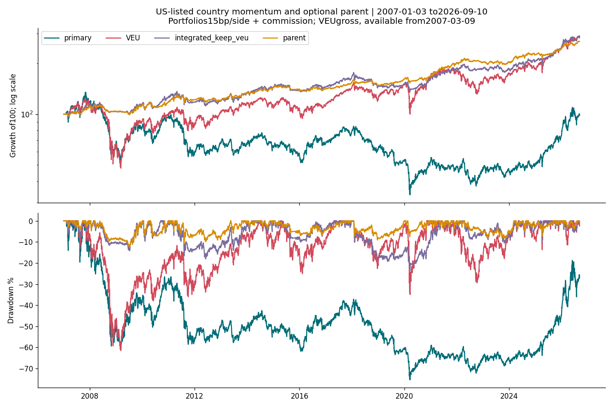

<!-- GENERATED FILE. EDIT THE CANONICAL KNOWLEDGE RECORD. -->

# Country ETF momentum: failed validation and concentrated later rebound

!!! warning "Research-only"
    This page summarizes saved research evidence. It does not authorize LIVE, allocation, or deployment.

## TL;DR

> **Verdict:** Rejected tested country rotation and optional-parent addition: negative primary validation, weaker integrated validation, later profits concentrated and insufficient to overturn failed frozen gates. No trading promotion.

> **Status:** `diagnostic`

> **Disposition:** `rejected`

> **Replication:** `not_reproducible`

## Research question

Does predeclared top3country momentum add net value over VEU, and do optional countries improve the unchanged F022parent?

## Exact setup

| Field | Value |
| --- | --- |
| Signal family | country_etf_momentum |
| Universe | ["28source countryETFs trading inUSA;14parent funds;SPY/QQQ references; actual histories only"] |
| Decision | Scheduled month-end completed CloseT |
| Fill | Next market session Open, one-session DAY |
| Primary cost layer | central_research |
| Last reviewed | 2026-09-14T16:02:38.023197+00:00 |

## Timing and overnight attribution

```text
information available: Scheduled month-end completed CloseT
primary executable fill: Next market session Open, one-session DAY
```

If final `Close_T` data formed the signal, a hypothetical `Close_T` entry is diagnostic only unless a separate pre-close protocol was modeled. Comparing that diagnostic with `Open_(T+1)` and applying the compounded return identity shows whether the apparent edge occurred in the overnight gap. Missing attribution numbers mean **not tested**, not zero.

| Attribution field | Value |
| --- | --- |
| Status | tested |
| Diagnostic Path | Same signedfillquantity decisionclose toexecutiondayclose |
| Executable Path | Same signedfillquantity nextopen tosameclose |
| Method | Grosssigned-shareopeninggap+intradayidentity,split-effectiveunits |
| Headline Result | -204.20gap-5861.99intraday=-6066.19USD;not fullportfolioP&L |
| Metrics | {"after_open_dollars": -5861.986816883087, "decision_to_close_dollars": -6066.187706947327, "fills": 1072, "identity_error_max": 0.0, "opening_gap_dollars": -204.2008900642395} |
| Artifact | C:/Users/User/Documents/workspace/pakal/pakal-research/reports/tradequantix_country_rotation_interpretation_study/tables/same_quantity_timing.csv |

## Primary metrics

| Metric | Value |
| --- | ---: |
| Period | 2019-01-02:2024-12-20 |
| Universe | 28US-listedcountryETFs,top3,actualhistories |
| Cost Layer | central_research |
| Cagr | -3.71% |
| Annualized Volatility | 22.09% |
| Sharpe | -0.060 |
| Maximum Drawdown | -49.50% |
| Turnover | 1408.91% |

## Four separate verdicts

| Question | Conclusion |
| --- | --- |
| Source Replication | Not reproducible; standaloneweights/liquidity/timing absent. Explicit user-authorized interpretation. |
| Predictive Value | Negative validation and stronglaterregimechange; no stablepositivepairedvalue. |
| Economic Value | StandalonevalidationCAGR-3.7126%,MDD-49.4988%;integrated5.9063%vsparent7.1602%withworseDD. Laterrebounddoesnotoverturnfrozengates. |
| Promotion | Rejected tested definitions; no trading/allocation or same-history tuning. |

## Key findings

| Feature | Role | Direction | Status | Effect | Action |
| --- | --- | --- | --- | --- | --- |
| ROC120+60+30top3 | rank | Predeclared | diagnostic | Validation-3.71%CAGR;later99.78%total | Rejecttestedpromotion;retaincatalogandnegativeevidence |
| ADV20>=1m | universe | Predeclared | diagnostic | No primary staleNAV;withoutfilter32.93%stale | Rejecttestedpromotion;retaincatalogandnegativeevidence |
| Optional top3countries | portfolio_construction | Predeclared | diagnostic | ValidationCAGR5.91%vsparent7.16%,MDD12.96%vs8.24% | Rejecttestedpromotion;retaincatalogandnegativeevidence |
| Countryconcentration | diagnostic | Predeclared | diagnostic | EWY48.68%oflaternetdollarprofit | Rejecttestedpromotion;retaincatalogandnegativeevidence |

## Visual evidence




## Limitations

- Declared interpretation,not exact author code
- Currentvintage fixed survivor basket and previously seen source/related history
- Early changing basket; BITOsince2021 andDBMFsince2019 only
- DBMF27zero-volume bars;trading requirespositivevolume;OHLCnotfillproof
- Exdate dividend accrual not actual pay-date liquidity
- CAPITAL distribution gaps intentional;noGBTC
- Zero cashyield;cost/impact estimates not calibrated
- Monthly known regular calendar,unexpected closure may skip a decision
- Missing orders expire;held quotes carried only for valuation
- Later window under2years;no allocation/live authority
- Country1mADV20/equalthirds/monthlyschedule are internalassumptions
- 200warmup/positivesigma readiness evenequalweights areinternalconventions
- VEUretentionandcountrytop3aftergates areinternalchoices
- Unknownliquidityreservesheld;knownfailureexitsprecedeotherunreadyinputs
- Primary countryrotation differs from risk-scaledoptionalparent; neithercontrol isolates purecountryalpha
- F022parent outcomes includingcapacityweaknessalreadyseen
- Country series contain467aggregate internal missing instrument-sessions, largestQAT168 andARGT55; no filling. Observed-close volatility may span multiple market sessions yet uses sqrt252 annualization; inherited convention, not daily continuity proof.
- Standaloneand integratedfrozengates fail
- No-liquiditycontrolhas32.93%staleNAVvalidation
- VEUcomparison starts2007-03-09;not pre-inceptionreturns
- LaterprofitconcentratedinKorea

## Next gates

- No same-historytuning;keepcountrycatalogandproceedtonextresearchfamily.

## Sources

- `{"content_id": "sha256:e4f358ee2e9256db3fbcc9c1b6900623475bfd0b0cca3bb7bc9a64ac5682b1a7", "location": "C:/Users/User/Documents/workspace/0_papers/TradeQuantiX_PDFs/TradeQuantiX_PDFs_WHITE/all-weather-portfolio-research-part-f13.pdf", "read_complete": true, "read_receipt": "C:/Users/User/Documents/workspace/pakal/pakal-research/reports/tradequantix_country_rotation_study/SOURCE_RULE_MAP.md", "role": "Previously completely read source mechanism; exact implementation unavailable", "source_id": "4"}`

## Canonical artifacts

| Artifact | Pakal path |
| --- | --- |
| Source Rule Map | `C:/Users/User/Documents/workspace/pakal/pakal-research/reports/tradequantix_country_rotation_interpretation_study/SOURCE_RULE_MAP.md` |
| Hypothesis Registry | `C:/Users/User/Documents/workspace/pakal/pakal-research/reports/tradequantix_country_rotation_interpretation_study/hypothesis_registry.json` |
| Experiment Ledger | `C:/Users/User/Documents/workspace/pakal/pakal-research/reports/tradequantix_country_rotation_interpretation_study/experiment_ledger.jsonl` |
| Decision Log | `C:/Users/User/Documents/workspace/pakal/pakal-research/reports/tradequantix_country_rotation_interpretation_study/decision_log.jsonl` |
| Frozen Specification | `C:/Users/User/Documents/workspace/pakal/pakal-research/reports/tradequantix_country_rotation_interpretation_study/research_spec_frozen.json` |
| Concise Report | `C:/Users/User/Documents/workspace/pakal/pakal-research/reports/tradequantix_country_rotation_interpretation_study/REPORT.md` |
| Full Report | `C:/Users/User/Documents/workspace/pakal/pakal-research/reports/tradequantix_country_rotation_interpretation_study/REPORT_FULL.md` |
| Knowledge Record | `C:/Users/User/Documents/workspace/pakal/pakal-research/reports/tradequantix_country_rotation_interpretation_study/knowledge_record.json` |
| Manifest | `C:/Users/User/Documents/workspace/pakal/pakal-research/reports/tradequantix_country_rotation_interpretation_study/run_manifest.json` |
| Research State | `C:/Users/User/Documents/workspace/pakal/pakal-research/reports/tradequantix_country_rotation_interpretation_study/research_state.json` |
| Notebook | `C:/Users/User/Documents/workspace/pakal/pakal-research/reports/tradequantix_country_rotation_interpretation_study/research.ipynb` |
| Primary Source Code | `["C:/Users/User/Documents/workspace/pakal/pakal-research/tradequantix_country_interpretation_engine.py", "C:/Users/User/Documents/workspace/pakal/pakal-research/tradequantix_country_interpretation_run.py", "C:/Users/User/Documents/workspace/pakal/pakal-research/tradequantix_country_interpretation_data.py"]` |
| Primary Tables | `["C:/Users/User/Documents/workspace/pakal/pakal-research/reports/tradequantix_country_rotation_interpretation_study/tables/period_metrics.csv"]` |
| Primary Charts | `["C:/Users/User/Documents/workspace/pakal/pakal-research/reports/tradequantix_country_rotation_interpretation_study/charts/equity_drawdown.png"]` |
