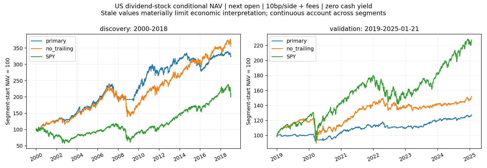
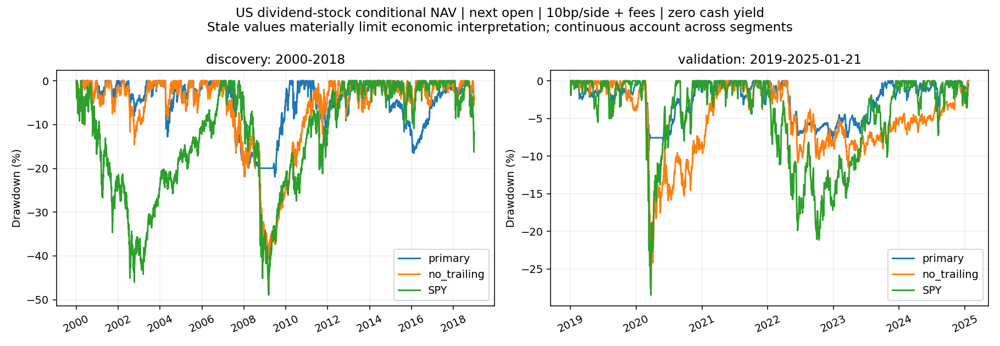

<!-- GENERATED FILE. EDIT THE CANONICAL KNOWLEDGE RECORD. -->

# מניות דיבידנד יציב בארה״ב — יציאה ושווי לא ודאי

!!! warning "Research-only"
    This page summarizes saved research evidence. It does not authorize LIVE, allocation, or deployment.

## TL;DR

> **Verdict:** אין קידום: היציאה הקטינה ירידות במודל, אך שימור התשואה נכשל בבדיקה ושווי ניכר נשען על מחירים ישנים. הערך הכלכלי אינו מוכרע.

> **Status:** `diagnostic`

> **Disposition:** `inconclusive`

> **Replication:** `not_reproducible`

## Research question

Does the25%close-confirmed trailing exit reduce drawdown by at least15% while retaining at least75%of positive net annual growth versus identical stable-dividend selection without that exit, across discovery and locked validation?

## Exact setup

| Field | Value |
| --- | --- |
| Signal family | dividend_stability_trend_exit |
| Universe | ["All frozen current/delisted US IDs; current Equity category, historical major listing; >=4event union is necessary history pruning only"] |
| Decision | Close_T, exact previous-SPX-session yield |
| Fill | Next actual open; missing entry expires and exit persists |
| Primary cost layer | central_research |
| Last reviewed | 2026-09-14T23:45:21.894588+00:00 |

## Timing and overnight attribution

```text
information available: Close_T, exact previous-SPX-session yield
primary executable fill: Next actual open; missing entry expires and exit persists
```

If final `Close_T` data formed the signal, a hypothetical `Close_T` entry is diagnostic only unless a separate pre-close protocol was modeled. Comparing that diagnostic with `Open_(T+1)` and applying the compounded return identity shows whether the apparent edge occurred in the overnight gap. Missing attribution numbers mean **not tested**, not zero.

| Attribution field | Value |
| --- | --- |
| Status | tested |
| Diagnostic Path | decision Close to same actual exit |
| Executable Path | next Open to same actual exit |
| Method | Multiplicative CAPITAL-price-only closed-lot identity; distributions separate; no funded same-close account |
| Headline Result | 143 closed lots identity passes;20 open lots censored; does not resolve stale terminal value. |
| Metrics | [{"decision_close_to_same_exit": 0.07126676859183101, "entry_gap": -8.57972287805482e-05, "exit_phase": "discovery", "open_to_same_exit": 0.072409891427443}, {"decision_close_to_same_exit": -0.019132050339894142, "entry_gap": 0.0011490844120679998, "exit_phase": "validation", "open_to_same_exit": -0.02075531010951851}] |
| Artifact | C:\\Users\\User\\Documents\\workspace\\pakal\\pakal-research\\reports\\tradequantix_dividend_stability_interpretation_study\\tables\\PRIMARY_LOTS_ATTRIBUTION.csv |

## Primary metrics

| Metric | Value |
| --- | ---: |
| Period | 2019-01-01/2025-01-21; continuous from2000;confirmationclosed |
| Universe | US listed stable-dividend stocks, current-category caveat |
| Cost Layer | central_research |
| Cagr | 4.06% |
| Annualized Volatility | 5.67% |
| Sharpe | 0.733 |
| Maximum Drawdown | -9.25% |
| Turnover | 53.77% |

## Four separate verdicts

| Question | Conclusion |
| --- | --- |
| Source Replication | Withheld source formulas; internal interpretation, not exact reproduction. |
| Predictive Value | No independent forecasting claim; prior-seen history and stale valuation. |
| Economic Value | Conditional risk reduction; validation growth retention and sample gates fail; uncertain NAV exceeds frozen ceiling. |
| Promotion | No promotion; confirmationclosed, no winner substitution. |

## Key findings

| Feature | Role | Direction | Status | Effect | Action |
| --- | --- | --- | --- | --- | --- |
| 25% close-confirmed trailing exit | exit | reduce drawdown and retain75%growth | diagnostic | Validation CAGR4.06%versus7.16%;DD-9.25%versus-27.57% | No promotion; resolve terminal proceeds before a new frozen study |

## Visual evidence






## Limitations

- Literal source calculation is unavailable; both PDFs were previously read completely (14+22 pages), with15 central pages visually inspected. This is an authorized predeclared internal interpretation, not an exact reproduction or falsification of the withheld source.
- At least four source configurations are displayed; total author development search is unknown. Related US market histories were already viewed by the larger program. Date-ordered phases are not claimed to be untouched market evidence.
- US current/delisted permanent-ID inventory is broad; current Equity subtype (including ADRs/investment companies) is not demonstrated historical PIT classification. Major-listing histories do not prove actual venue, order eligibility or auction liquidity.
- All v5 accepted fields have matched within-security database stamps. Acquisition was designed as asynchronous; zero measured cross-ID stamp dispersion does not independently prove a globally atomic snapshot. This is current-vintage data, not archived decision-time replay.
- Prior full-span/overlap response endpoint and index contradictions remain. The recovered full-span dated vendor response is a conditional event convention; no issuer-by-issuer ex-date certification is claimed.
- CAPITAL-unit value and ordinary conversion are conditional vendor-adjustment models. Pure-split invariance has synthetic evidence; complex rights/reconstructions, fractional delivery and raw-share settlement remain unverified.
- Missing event-date adjustment factors or material total/ordinary-unit conflicts remain unknown. Positive events stay dated and can block entry/trigger an exit; unknown amounts never become assumed ordinary cash.
- Ordinary payment at K+30/60days is assumed, not actual historical pay-date evidence. Nonordinary/unknown-classification rights carry conditional proxy value and cannot fund primary entries. Their proxy NAV value may affect slot sizing.
- Unquoted holdings use explicitly flagged carried marks reduced for newly recognized distributions. There is no future last-bar liquidation, terminal payment invention or synthetic fill. Stale/rights value is uncertain; marked book value is not recoverable cash proof.
- Opening fills are daily-bar research proxies. Costs, debt, volume-based capacity and no partial-fill/reject modeling are not actual broker or auction evidence. No tax, withdrawal, inflation-linked income, allocation or LIVE claim follows.
- 14/20 final holdings have stale quotes;finaluncertainNAV31.38%. Risk and return are conditional book-value diagnostics.

## Next gates

- No confirmation under failed frozen gate. Verified terminal proceeds/corporate-action rights contract required before a new predeclared study.

## Sources

- `{"location": "C:\\\\Users\\\\User\\\\Documents\\\\workspace\\\\0_papers\\\\TradeQuantiX_PDFs\\\\TradeQuantiX_PDFs_WHITE\\\\case-study-dividend-investing-part-f11.pdf", "pages": 14, "read_complete": true, "role": "literal source and disclosed withheld implementation", "sha256": "8411153a912559c2b9735dcdf821852be28b75576c6421ac24dbd57f37cab9a1", "source_id": "TQ06"}`
- `{"location": "C:\\\\Users\\\\User\\\\Documents\\\\workspace\\\\0_papers\\\\TradeQuantiX_PDFs\\\\TradeQuantiX_PDFs_WHITE\\\\case-study-dividend-investing-part.pdf", "pages": 22, "read_complete": true, "role": "literal source and disclosed withheld implementation", "sha256": "35b1af75d0738d1ee8d9e51f3f3f99d5c92cdfeee197de14e1a3baf537a2f8c7", "source_id": "TQ07"}`

## Canonical artifacts

| Artifact | Pakal path |
| --- | --- |
| Concise Report | `C:\\Users\\User\\Documents\\workspace\\pakal\\pakal-research\\reports\\tradequantix_dividend_stability_interpretation_study\\REPORT.md` |
| Full Report | `C:\\Users\\User\\Documents\\workspace\\pakal\\pakal-research\\reports\\tradequantix_dividend_stability_interpretation_study\\REPORT_FULL.md` |
| Notebook | `C:\\Users\\User\\Documents\\workspace\\pakal\\pakal-research\\reports\\tradequantix_dividend_stability_interpretation_study\\F020_DECISION.ipynb` |
| Frozen Specification | `C:\\Users\\User\\Documents\\workspace\\pakal\\pakal-research\\reports\\tradequantix_dividend_stability_interpretation_study\\research_spec_frozen.json` |
| Manifest | `C:\\Users\\User\\Documents\\workspace\\pakal\\pakal-research\\reports\\tradequantix_dividend_stability_interpretation_study\\run_manifest.json` |
| Research State | `C:\\Users\\User\\Documents\\workspace\\pakal\\pakal-research\\reports\\tradequantix_dividend_stability_interpretation_study\\research_state.json` |
| Hypothesis Registry | `C:\\Users\\User\\Documents\\workspace\\pakal\\pakal-research\\reports\\tradequantix_dividend_stability_interpretation_study\\hypothesis_registry.json` |
| Experiment Ledger | `C:\\Users\\User\\Documents\\workspace\\pakal\\pakal-research\\reports\\tradequantix_dividend_stability_interpretation_study\\experiment_ledger.jsonl` |
| Decision Log | `C:\\Users\\User\\Documents\\workspace\\pakal\\pakal-research\\reports\\tradequantix_dividend_stability_interpretation_study\\decision_log.jsonl` |
| Source Rule Map | `C:\\Users\\User\\Documents\\workspace\\pakal\\pakal-research\\reports\\tradequantix_dividend_stability_interpretation_study\\SOURCE_RULE_MAP.md` |
| Primary Source Code | `["C:\\\\Users\\\\User\\\\Documents\\\\workspace\\\\pakal\\\\pakal-research\\\\tradequantix_dividend_capital_account.py"]` |
| Primary Tables | `["C:\\\\Users\\\\User\\\\Documents\\\\workspace\\\\pakal\\\\pakal-research\\\\reports\\\\tradequantix_dividend_stability_interpretation_study\\\\tables\\\\ALL_METRICS.csv"]` |
| Primary Charts | `["C:\\\\Users\\\\User\\\\Documents\\\\workspace\\\\pakal\\\\pakal-research\\\\reports\\\\tradequantix_dividend_stability_interpretation_study\\\\charts\\\\equity.png", "C:\\\\Users\\\\User\\\\Documents\\\\workspace\\\\pakal\\\\pakal-research\\\\reports\\\\tradequantix_dividend_stability_interpretation_study\\\\charts\\\\drawdown.png", "C:\\\\Users\\\\User\\\\Documents\\\\workspace\\\\pakal\\\\pakal-research\\\\reports\\\\tradequantix_dividend_stability_interpretation_study\\\\charts\\\\uncertainty.png"]` |
