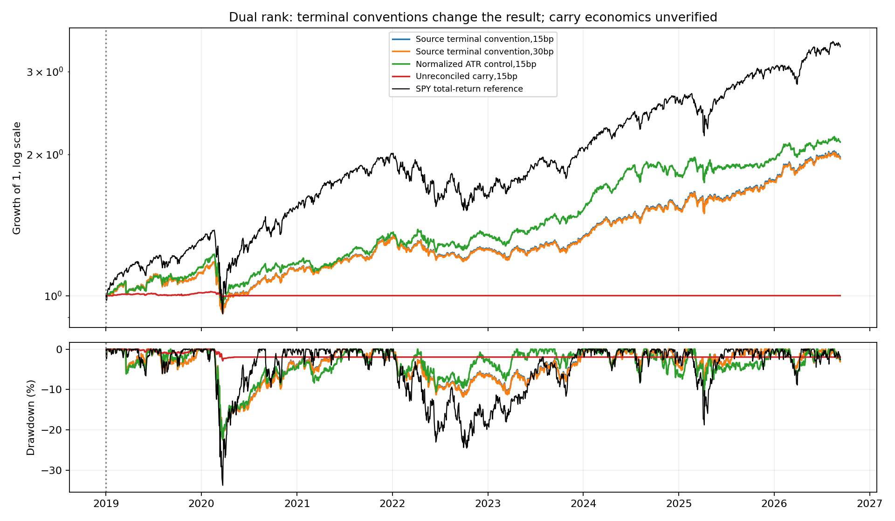
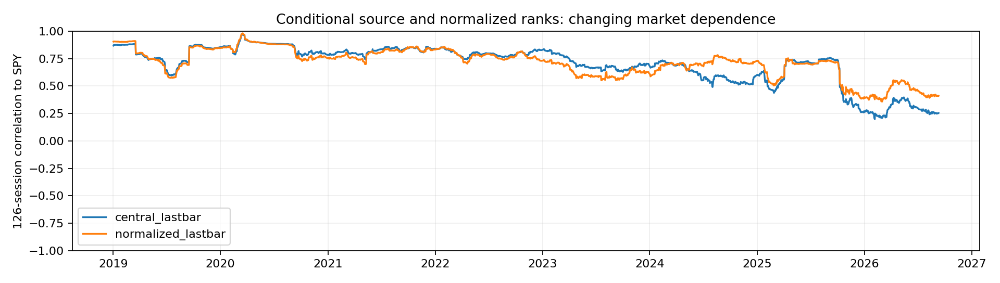

<!-- GENERATED FILE. EDIT THE CANONICAL KNOWLEDGE RECORD. -->

# TradeQuantiX dual-rank USA trend: no promotion, terminal economics unresolved

!!! warning "Research-only"
    This page summarizes saved research evidence. It does not authorize LIVE, allocation, or deployment.

## TL;DR

> **Verdict:** No promotion. Primary carry has60.7231% stale NAV with all20 slots unresolved. Conditional lastbar underperforms SPY in2019-2025 and fails half-drawdown claim there. Nominal-scale correction improves long history but not all periods; terminal economics remain inconclusive.

> **Status:** `diagnostic`

> **Disposition:** `inconclusive`

> **Replication:** `not_reproducible`

## Research question

Test source56 two-sleeve claim of SPY-like returns with half drawdown under PIT timing and economic accounting.

## Exact setup

| Field | Value |
| --- | --- |
| Signal family | low_volatility_and_nominal_ATR_momentum |
| Universe | ["USA PIT pooled Nasdaq100 OR S&P100 in both sleeves"] |
| Decision | Completed Close_T; daily candidates and strict peak-close exits, fixed combined equity and floor shares |
| Fill | Next Open_T+1; exits before entries, same-name reentry allowed with separate fees. EX_POST terminal close isolated. |
| Primary cost layer | central_research |
| Last reviewed | 2026-09-13T16:41:36.972812+00:00 |

## Timing and overnight attribution

```text
information available: Completed Close_T; daily candidates and strict peak-close exits, fixed combined equity and floor shares
primary executable fill: Next Open_T+1; exits before entries, same-name reentry allowed with separate fees. EX_POST terminal close isolated.
```

If final `Close_T` data formed the signal, a hypothetical `Close_T` entry is diagnostic only unless a separate pre-close protocol was modeled. Comparing that diagnostic with `Open_(T+1)` and applying the compounded return identity shows whether the apparent edge occurred in the overnight gap. Missing attribution numbers mean **not tested**, not zero.

| Attribution field | Value |
| --- | --- |
| Status | diagnostic |
| Diagnostic Path | Decision-close prices for same actual ordinary filled changes |
| Executable Path | Next-open proxies for same changes |
| Method | Signed delta_q*(Open_next-Close_decision), split-consistent; excludes terminal tickets and retains same-exit quantities |
| Headline Result | Opening prices improve aggregate conditional central fills by25035USD,17.71bp of turnover; not alternateportfolio return |
| Metrics | {"attribution": "Same actual ordinary quantities; prior-close versus next-open prices. Ex-post terminal tickets excluded.", "gap_bps": -17.708749648161827, "name": "central_lastbar", "ordinary_notional": 14137080.515814466, "ordinary_tickets": 872, "same_open_roundtrips": 33, "signed_gap_dollars": -25035.001961046488, "terminal_notional": 3502417.1910705306, "terminal_tickets": 76} |
| Unavailable Reason | Source is already NextOpen; actual auction fill evidence absent |
| Artifact | C:/Users/User/Documents/workspace/pakal/pakal-research/reports/tradequantix_dual_rank_trend_study/tables/timing_attribution.csv |

## Primary metrics

| Metric | Value |
| --- | ---: |
| Period | 2019-2025 frozen primary central_carry; ECONOMICALLY INVALID terminal marks |
| Universe | Two pooled PIT USA stock sleeves |
| Cost Layer | central_research |
| Cagr | N/A |
| Annualized Volatility | N/A |
| Sharpe | N/A |
| Maximum Drawdown | N/A |
| Turnover | N/A |

## Four separate verdicts

| Question | Conclusion |
| --- | --- |
| Source Replication | Source ordinary rules reconstructed; original author-build/terminal/benchmark parity unavailable |
| Predictive Value | Nominal-scale correction improves long history but not short later window; eight ablations pruned |
| Economic Value | Primary economic metrics invalid. Conditional2019-2025 central8.37%CAGR/.74Sharpe/-22.30%MDD versusSPY17.19%/.90/-33.72% |
| Promotion | No promotion; accounting and recent source benchmark gates fail |

## Key findings

| Feature | Role | Direction | Status | Effect | Action |
| --- | --- | --- | --- | --- | --- |
| inverseNATR_10_20_40 | rank | Conditional evidence only | diagnostic | N/A | Resolve settlement before economic promotion or frozen ablation continuation |
| ROC_over_dollarATR | rank | Conditional evidence only | diagnostic | N/A | Resolve settlement before economic promotion or frozen ablation continuation |
| normalized_ROC_over_NATR | diagnostic | Conditional evidence only | diagnostic | N/A | Resolve settlement before economic promotion or frozen ablation continuation |
| either_indexROC200 | entry_regime | Conditional evidence only | diagnostic | N/A | Resolve settlement before economic promotion or frozen ablation continuation |
| close_trailing25 | exit | Conditional evidence only | diagnostic | N/A | Resolve settlement before economic promotion or frozen ablation continuation |
| vol5_25_100_no_resize | sizing | Conditional evidence only | diagnostic | N/A | Resolve settlement before economic promotion or frozen ablation continuation |
| same_open_reentry | execution | Conditional evidence only | diagnostic | N/A | Resolve settlement before economic promotion or frozen ablation continuation |

## Visual evidence






## Limitations

- Primary all20slots stale across18delisted names atfinal,60.7231%NAV; no settlement ledger
- Source-lastbar has56earlierterminaltickets plus20active endpointtickets; hindsight convention
- DollarATR score is nominal-price dependent; normalized control is not source
- Sourceauthorbuild/endpoints/fullsearch and exact benchmarkdividendroundtrip parity unverified
- Suppliedscoreties, ATRseed and fractional-share auction execution notexactparity
- Source-seen history;120sessionlaterperiod not independent long validation
- Daily openproxy, cashyield0, no calibrated impact/partialfills orcapacity bands
- No-resize portfolio allows substantial drifting name concentration

## Next gates

- Repair dated terminal cash and acquirer-share settlement before causal economic inference
- Preserve nominal-scale control and eight pruned variants; no post-result retuning
- Independent long history and actual auction/order-capacity evidence before promotion

## Sources

- `Source56 trading-system-investigation-series-634.pdf`
- `https://mhptrading.com/docs/topics/idh-topic1071.htm`
- `https://mhptrading.com/docs/topics/idh-topic1090.htm`
- `https://mhptrading.com/docs/topics/idh-topic2630.htm`

## Canonical artifacts

| Artifact | Pakal path |
| --- | --- |
| Concise Report | `C:/Users/User/Documents/workspace/pakal/pakal-research/reports/tradequantix_dual_rank_trend_study/REPORT.md` |
| Full Report | `C:/Users/User/Documents/workspace/pakal/pakal-research/reports/tradequantix_dual_rank_trend_study/REPORT_FULL.md` |
| Notebook | `C:/Users/User/Documents/workspace/pakal/pakal-research/reports/tradequantix_dual_rank_trend_study/research.ipynb` |
| Frozen Specification | `C:/Users/User/Documents/workspace/pakal/pakal-research/reports/tradequantix_dual_rank_trend_study/research_spec_frozen.json` |
| Manifest | `C:/Users/User/Documents/workspace/pakal/pakal-research/reports/tradequantix_dual_rank_trend_study/run_manifest.json` |
| Primary Source Code | `["C:/Users/User/Documents/workspace/pakal/pakal-research/tradequantix_dual_rank_engine.py", "C:/Users/User/Documents/workspace/pakal/pakal-research/tradequantix_dual_rank_features.py", "C:/Users/User/Documents/workspace/pakal/pakal-research/tradequantix_dual_rank_run.py"]` |
| Primary Tables | `["C:/Users/User/Documents/workspace/pakal/pakal-research/reports/tradequantix_dual_rank_trend_study/tables/period_metrics.csv", "C:/Users/User/Documents/workspace/pakal/pakal-research/reports/tradequantix_dual_rank_trend_study/tables/submitted_participation.csv", "C:/Users/User/Documents/workspace/pakal/pakal-research/reports/tradequantix_dual_rank_trend_study/tables/timing_attribution.csv"]` |
| Primary Charts | `["C:/Users/User/Documents/workspace/pakal/pakal-research/reports/tradequantix_dual_rank_trend_study/charts/equity_drawdown.png", "C:/Users/User/Documents/workspace/pakal/pakal-research/reports/tradequantix_dual_rank_trend_study/charts/stale_accounting.png", "C:/Users/User/Documents/workspace/pakal/pakal-research/reports/tradequantix_dual_rank_trend_study/charts/rolling_correlation.png"]` |
| Research State | `C:/Users/User/Documents/workspace/pakal/pakal-research/reports/tradequantix_dual_rank_trend_study/research_state.json` |
| Hypothesis Registry | `C:/Users/User/Documents/workspace/pakal/pakal-research/reports/tradequantix_dual_rank_trend_study/hypothesis_registry.json` |
| Experiment Ledger | `C:/Users/User/Documents/workspace/pakal/pakal-research/reports/tradequantix_dual_rank_trend_study/experiment_ledger.jsonl` |
| Decision Log | `C:/Users/User/Documents/workspace/pakal/pakal-research/reports/tradequantix_dual_rank_trend_study/decision_log.jsonl` |
| Source Rule Map | `C:/Users/User/Documents/workspace/pakal/pakal-research/reports/tradequantix_dual_rank_trend_study/SOURCE_RULE_MAP.md` |
