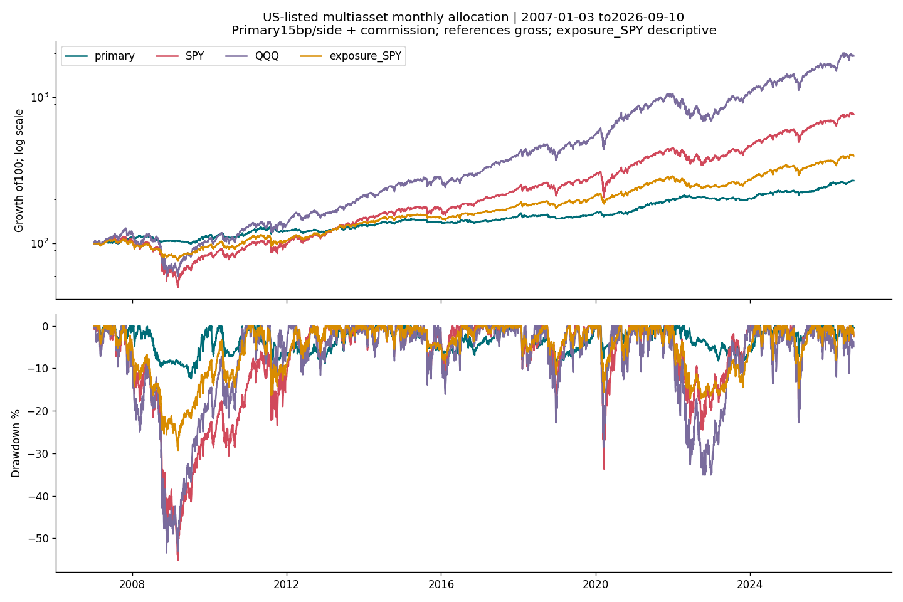

<!-- GENERATED FILE. EDIT THE CANONICAL KNOWLEDGE RECORD. -->

# Monthly multiasset trend allocation: lower drawdown, failed return-retention gate

!!! warning "Research-only"
    This page summarizes saved research evidence. It does not authorize LIVE, allocation, or deployment.

## TL;DR

> **Verdict:** Diagnostic risk-reduction component; primary fails frozen economic continuation gate and early DBMF selected-order liquidity is material. No trading promotion.

> **Status:** `diagnostic`

> **Disposition:** `promising_component`

> **Replication:** `not_reproducible`

## Research question

Does the declared monthly14ETF trend/volatility interpretation offer persistent net risk-adjusted value, rather than simply less market exposure?

## Exact setup

| Field | Value |
| --- | --- |
| Signal family | multiasset_trend_volatility_allocation |
| Universe | ["Intended14US-listedETFs;13fundcontrol omitsDBMF;actualBITOsince2021,zeroGBTCproxy"] |
| Decision | Scheduled month-end completed CloseT |
| Fill | Next market session Open, one-session DAY |
| Primary cost layer | central_research |
| Last reviewed | 2026-09-14T15:35:55.747502+00:00 |

## Timing and overnight attribution

```text
information available: Scheduled month-end completed CloseT
primary executable fill: Next market session Open, one-session DAY
```

If final `Close_T` data formed the signal, a hypothetical `Close_T` entry is diagnostic only unless a separate pre-close protocol was modeled. Comparing that diagnostic with `Open_(T+1)` and applying the compounded return identity shows whether the apparent edge occurred in the overnight gap. Missing attribution numbers mean **not tested**, not zero.

| Attribution field | Value |
| --- | --- |
| Status | tested |
| Diagnostic Path | Same signed filled shares from decision close to execution day close |
| Executable Path | Same signed filled shares from next open to same close |
| Method | q*(O-C_T)+q*(C_D-O)=q*(C_D-C_T);effective split units;grossdollars |
| Headline Result | Openinggap4024.14+afteropen5144.71=9168.86USD;not portfolio P&L |
| Metrics | {"after_open_dollars": 5144.713289267569, "decision_to_close_dollars": 9168.855929683774, "fills": 1893, "identity_error_max": 0.0, "opening_gap_dollars": 4024.1426404162053} |
| Artifact | C:/Users/User/Documents/workspace/pakal/pakal-research/reports/tradequantix_dynamic_allocation_interpretation_study/tables/same_quantity_timing.csv |

## Primary metrics

| Metric | Value |
| --- | ---: |
| Period | 2019-01-02:2024-12-20 |
| Universe | 14US-listedETF actual histories |
| Cost Layer | central_research |
| Cagr | 7.16% |
| Annualized Volatility | 6.82% |
| Sharpe | 1.049 |
| Maximum Drawdown | -8.24% |
| Turnover | 271.97% |

## Four separate verdicts

| Question | Conclusion |
| --- | --- |
| Source Replication | Not reproducible; numeric target and original dynamic implementation absent. User-authorized interpretation. |
| Predictive Value | No demonstrated positive paired advantage over descriptive exposure-SPY; seen history. |
| Economic Value | Positive net returns and lower drawdown; failed frozen50%SPYreturnretentiongate,earlyDBMFcapacitypressure. |
| Promotion | Diagnostic only; no trading or allocation. |

## Key findings

| Feature | Role | Direction | Status | Effect | Action |
| --- | --- | --- | --- | --- | --- |
| SMA200 | risk_overlay | Predeclared | diagnostic | Validation drawdown8.24% versus19.47%withouttrend; confounded by retained composition | Keep as diagnostic risk component |
| Volatility5/20/100 | sizing | Predeclared | diagnostic | Equal10%control raises validation return10.07% and drawdown10.43% | Do not claim unique sizing superiority |
| DBMF | universe | Predeclared | diagnostic | Adds0.20ppvalidationCAGR; worst selected request12.29%ADV | No capacity approval |
| ROC120+60+30 | rank | Predeclared | diagnostic | Global replacement weaker validation,stronger later | No consistent rank upgrade |

## Visual evidence




## Limitations

- Declared interpretation,not exact author code
- Currentvintage fixed survivor basket and previously seen source/related history
- Early changing basket; BITOsince2021 andDBMFsince2019 only
- DBMF27zero-volume bars;trading requirespositivevolume;OHLCnotfillproof
- Exdate dividend accrual not actual pay-date liquidity
- CAPITAL distribution gaps intentional;noGBTC
- Zero cashyield;cost/impact estimates not calibrated
- Monthly known regular calendar,unexpected closure may skip a decision
- Missing orders expire;held quotes carried only for valuation
- Later window under2years;no allocation/live authority
- No-trend control changes eventual universe through incumbent retention
- Frozen economic gate fails
- Early DBMF selected instruction reaches12.29%ADV

## Next gates

- Only a newly frozen liquidity/cash protocol on new evidence; no same-history tuning.

## Sources

- `{"content_id": "sha256:564a13cd2d1c1c9461590b192c464a03fccfd3f550886b645bb4d7afe9b39877", "location": "C:/Users/User/Documents/workspace/0_papers/TradeQuantiX_PDFs/TradeQuantiX_PDFs_WHITE/all-weather-portfolio-research-part-418.pdf", "read_complete": true, "read_receipt": "C:/Users/User/Documents/workspace/pakal/pakal-research/reports/tradequantix_dynamic_allocation_study/SOURCE_RULE_MAP.md", "role": "Previously completely read source mechanism; exact implementation unavailable", "source_id": "3"}`
- `{"content_id": "sha256:e4f358ee2e9256db3fbcc9c1b6900623475bfd0b0cca3bb7bc9a64ac5682b1a7", "location": "C:/Users/User/Documents/workspace/0_papers/TradeQuantiX_PDFs/TradeQuantiX_PDFs_WHITE/all-weather-portfolio-research-part-f13.pdf", "read_complete": true, "read_receipt": "C:/Users/User/Documents/workspace/pakal/pakal-research/reports/tradequantix_dynamic_allocation_study/SOURCE_RULE_MAP.md", "role": "Previously completely read source mechanism; exact implementation unavailable", "source_id": "4"}`
- `{"content_id": "sha256:d8ff880f222dce08135b75f58d3d5dbc8243075d559ae1c8b27116b864122c4b", "location": "C:/Users/User/Documents/workspace/0_papers/TradeQuantiX_PDFs/TradeQuantiX_PDFs_WHITE/all-weather-portfolio-research-part.pdf", "read_complete": true, "read_receipt": "C:/Users/User/Documents/workspace/pakal/pakal-research/reports/tradequantix_dynamic_allocation_study/SOURCE_RULE_MAP.md", "role": "Previously completely read source mechanism; exact implementation unavailable", "source_id": "5"}`

## Canonical artifacts

| Artifact | Pakal path |
| --- | --- |
| Source Rule Map | `C:/Users/User/Documents/workspace/pakal/pakal-research/reports/tradequantix_dynamic_allocation_interpretation_study/SOURCE_RULE_MAP.md` |
| Hypothesis Registry | `C:/Users/User/Documents/workspace/pakal/pakal-research/reports/tradequantix_dynamic_allocation_interpretation_study/hypothesis_registry.json` |
| Experiment Ledger | `C:/Users/User/Documents/workspace/pakal/pakal-research/reports/tradequantix_dynamic_allocation_interpretation_study/experiment_ledger.jsonl` |
| Decision Log | `C:/Users/User/Documents/workspace/pakal/pakal-research/reports/tradequantix_dynamic_allocation_interpretation_study/decision_log.jsonl` |
| Frozen Specification | `C:/Users/User/Documents/workspace/pakal/pakal-research/reports/tradequantix_dynamic_allocation_interpretation_study/research_spec_frozen.json` |
| Concise Report | `C:/Users/User/Documents/workspace/pakal/pakal-research/reports/tradequantix_dynamic_allocation_interpretation_study/REPORT.md` |
| Full Report | `C:/Users/User/Documents/workspace/pakal/pakal-research/reports/tradequantix_dynamic_allocation_interpretation_study/REPORT_FULL.md` |
| Knowledge Record | `C:/Users/User/Documents/workspace/pakal/pakal-research/reports/tradequantix_dynamic_allocation_interpretation_study/knowledge_record.json` |
| Manifest | `C:/Users/User/Documents/workspace/pakal/pakal-research/reports/tradequantix_dynamic_allocation_interpretation_study/run_manifest.json` |
| Notebook | `C:/Users/User/Documents/workspace/pakal/pakal-research/reports/tradequantix_dynamic_allocation_interpretation_study/research.ipynb` |
| Primary Source Code | `["C:/Users/User/Documents/workspace/pakal/pakal-research/tradequantix_dynamic_interpretation_engine.py", "C:/Users/User/Documents/workspace/pakal/pakal-research/tradequantix_dynamic_interpretation_run.py", "C:/Users/User/Documents/workspace/pakal/pakal-research/tradequantix_dynamic_interpretation_data.py"]` |
| Primary Tables | `["C:/Users/User/Documents/workspace/pakal/pakal-research/reports/tradequantix_dynamic_allocation_interpretation_study/tables/period_metrics.csv"]` |
| Primary Charts | `["C:/Users/User/Documents/workspace/pakal/pakal-research/reports/tradequantix_dynamic_allocation_interpretation_study/charts/equity_drawdown.png"]` |
| Research State | `C:/Users/User/Documents/workspace/pakal/pakal-research/reports/tradequantix_dynamic_allocation_interpretation_study/research_state.json` |
