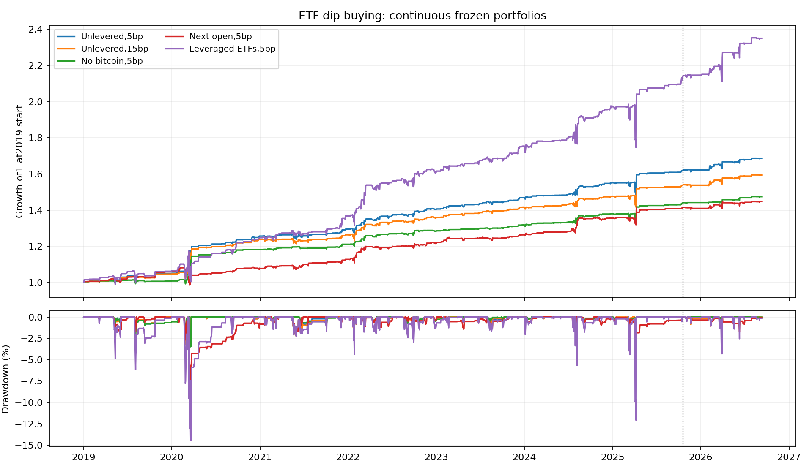
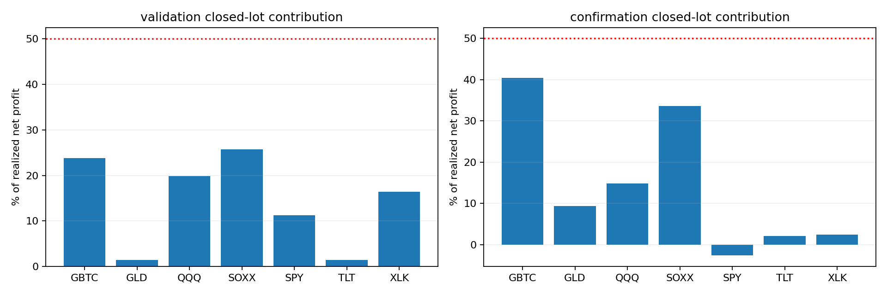

<!-- GENERATED FILE. EDIT THE CANONICAL KNOWLEDGE RECORD. -->

# TradeQuantiX USA ETF dip buying: promising component, auction and GBTC limits

!!! warning "Research-only"
    This page summarizes saved research evidence. It does not authorize LIVE, allocation, or deployment.

## TL;DR

> **Verdict:** Promising USA ETF dip-buying component for further research. Fixed costs and no-BTC control remain positive. No trading promotion: source-seen history, short confirmation, unverified auctions and GBTC distribution feature contamination.

> **Status:** `research_candidate`

> **Disposition:** `promising_component`

> **Replication:** `directionally_replicated`

## Research question

Test literal preplaced LOC dip buying and predeclared costs, timing and asset controls.

## Exact setup

| Field | Value |
| --- | --- |
| Signal family | ETF_short_horizon_mean_reversion |
| Universe | ["USA-listed fixed7ETF basket", "USA leveraged replacements", "Predeclared noBTC and actual-inception IBIT controls"] |
| Decision | Close_T fixed limits and quantities; only downward known-split fee adjustment next open |
| Fill | Close_T+1 LOC proxy; separate Open_T+2 after qualifying close control |
| Primary cost layer | central_research |
| Last reviewed | 2026-09-13T15:27:58.850965+00:00 |

## Timing and overnight attribution

```text
information available: Close_T fixed limits and quantities; only downward known-split fee adjustment next open
primary executable fill: Close_T+1 LOC proxy; separate Open_T+2 after qualifying close control
```

If final `Close_T` data formed the signal, a hypothetical `Close_T` entry is diagnostic only unless a separate pre-close protocol was modeled. Comparing that diagnostic with `Open_(T+1)` and applying the compounded return identity shows whether the apparent edge occurred in the overnight gap. Missing attribution numbers mean **not tested**, not zero.

| Attribution field | Value |
| --- | --- |
| Status | diagnostic |
| Diagnostic Path | Actual LOCentry to same actual LOCexit |
| Executable Path | FollowingOPENentry to same actual LOCexit |
| Method | Matched1998closedlots,split-scaledprices,lostentrydividends; originalfeesheldfixed |
| Headline Result | Delayingentry reduces summedclosedlotprofit231329to203762USD; no alternativeportfolio claim |
| Metrics | {"causal_note": "Source preplaced LOC can be causal. This measures forfeited entry overnight return; full nextopen variant also delays exits and changes inventory.", "closed_trades": 1998, "delayed_same_exit_pnl": 203761.60114500407, "entry_gap_cost": 27184.664264212515, "lost_dividend": 382.94660755991936, "matched_trades": 1998, "source_net_pnl": 231329.2120167766} |
| Unavailable Reason | Actual auction fill and full reoptimized portfolio not inferred |
| Artifact | C:/Users/User/Documents/workspace/pakal/pakal-research/reports/tradequantix_etf_bollinger_reversion_study/tables/paired_same_exit_timing.csv |

## Primary metrics

| Metric | Value |
| --- | ---: |
| Period | 2019-01-01:2025-10-17 source-seen |
| Universe | Published7ETF basket with GBTC caveats |
| Cost Layer | central_research |
| Cagr | 7.36% |
| Annualized Volatility | 6.16% |
| Sharpe | 1.184 |
| Maximum Drawdown | -4.51% |
| Turnover | 816.91% |

## Four separate verdicts

| Question | Conclusion |
| --- | --- |
| Source Replication | Direction and approximate magnitude reproduced; exact engine/endpoint parity unverified |
| Predictive Value | Positive predeclared source-seen controls; short confirmation insufficient |
| Economic Value | Central7.36% CAGR,stress6.55%,noBTC5.50% during2019-Oct2025 |
| Promotion | No operational promotion; new history, actual auctions and corporate actions required |

## Key findings

| Feature | Role | Direction | Status | Effect | Action |
| --- | --- | --- | --- | --- | --- |
| BB5_10_20 | entry_limit | Positive basket acrosscosttiers | diagnostic | N/A | Preserve frozen controls; no winnerselection |
| ADX10_gt30 | setup_filter | Lower exposure and betterlaterSharpe thannoADX | diagnostic | N/A | Preserve frozen controls; no winnerselection |
| prior_high_LOC | exit | Medianholding3sessions | diagnostic | N/A | Preserve frozen controls; no winnerselection |
| equal_21sleeves | portfolio_construction | EnsemblebeatsBB10latebutnotdiscovery | diagnostic | N/A | Preserve frozen controls; no winnerselection |
| noBTC_IBIT_controls | universe | PositivewithGBTCremoved | diagnostic | N/A | Preserve frozen controls; no winnerselection |
| prior_LOC_vs_nextopen | execution | Delayweakensreturns | diagnostic | N/A | Preserve frozen controls; no winnerselection |

## Visual evidence






## Limitations

- Source-seen history and223session short postpublication window
- GBTC missingJuly2024distribution signal continuity; pre2024OTCLOC unproved
- Official auctionprints,cutoffacceptance,partialfills andcapacity unverified
- Wilderseed andLimitExtraNextClose exactsourceparity unverified
- Cashinterest0; sourceETFselection andunknown priorsearch
- Filled-demand only; no complete submitted-order ledger

## Next gates

- ReconcileGBTCdistribution andindicatorhistory before fullbasket claims; existingnoBTC/IBIT controls remainpredeclared
- Verify venue-specific orderacceptance and officialauctionprints usingresearch-only data
- Freeze portfolioincrementalstudy withcapitalsharing onlyafterdependenciesready; require>=2yrnewhistory

## Sources

- `Source31 portfolio-development-series-part-660.pdf`
- `https://mhptrading.com/docs/topics/idh-topic1850.htm`
- `https://www.sec.gov/Archives/edgar/data/1588489/000095017024089327/gbtc-20240731.htm`

## Canonical artifacts

| Artifact | Pakal path |
| --- | --- |
| Concise Report | `C:/Users/User/Documents/workspace/pakal/pakal-research/reports/tradequantix_etf_bollinger_reversion_study/REPORT.md` |
| Full Report | `C:/Users/User/Documents/workspace/pakal/pakal-research/reports/tradequantix_etf_bollinger_reversion_study/REPORT_FULL.md` |
| Notebook | `C:/Users/User/Documents/workspace/pakal/pakal-research/reports/tradequantix_etf_bollinger_reversion_study/research.ipynb` |
| Frozen Specification | `C:/Users/User/Documents/workspace/pakal/pakal-research/reports/tradequantix_etf_bollinger_reversion_study/research_spec_frozen.json` |
| Manifest | `C:/Users/User/Documents/workspace/pakal/pakal-research/reports/tradequantix_etf_bollinger_reversion_study/run_manifest.json` |
| Primary Source Code | `["C:/Users/User/Documents/workspace/pakal/pakal-research/tradequantix_etf_bollinger_engine.py", "C:/Users/User/Documents/workspace/pakal/pakal-research/tradequantix_etf_bollinger_data.py", "C:/Users/User/Documents/workspace/pakal/pakal-research/tradequantix_etf_bollinger_run.py"]` |
| Primary Tables | `["C:/Users/User/Documents/workspace/pakal/pakal-research/reports/tradequantix_etf_bollinger_reversion_study/tables/period_metrics.csv", "C:/Users/User/Documents/workspace/pakal/pakal-research/reports/tradequantix_etf_bollinger_reversion_study/tables/paired_same_exit_timing.csv", "C:/Users/User/Documents/workspace/pakal/pakal-research/reports/tradequantix_etf_bollinger_reversion_study/tables/executed_demand_adv.csv"]` |
| Primary Charts | `["C:/Users/User/Documents/workspace/pakal/pakal-research/reports/tradequantix_etf_bollinger_reversion_study/charts/equity_drawdown.png", "C:/Users/User/Documents/workspace/pakal/pakal-research/reports/tradequantix_etf_bollinger_reversion_study/charts/asset_contribution.png"]` |
| Research State | `C:/Users/User/Documents/workspace/pakal/pakal-research/reports/tradequantix_etf_bollinger_reversion_study/research_state.json` |
| Hypothesis Registry | `C:/Users/User/Documents/workspace/pakal/pakal-research/reports/tradequantix_etf_bollinger_reversion_study/hypothesis_registry.json` |
| Experiment Ledger | `C:/Users/User/Documents/workspace/pakal/pakal-research/reports/tradequantix_etf_bollinger_reversion_study/experiment_ledger.jsonl` |
| Decision Log | `C:/Users/User/Documents/workspace/pakal/pakal-research/reports/tradequantix_etf_bollinger_reversion_study/decision_log.jsonl` |
| Source Rule Map | `C:/Users/User/Documents/workspace/pakal/pakal-research/reports/tradequantix_etf_bollinger_reversion_study/SOURCE_RULE_MAP.md` |
