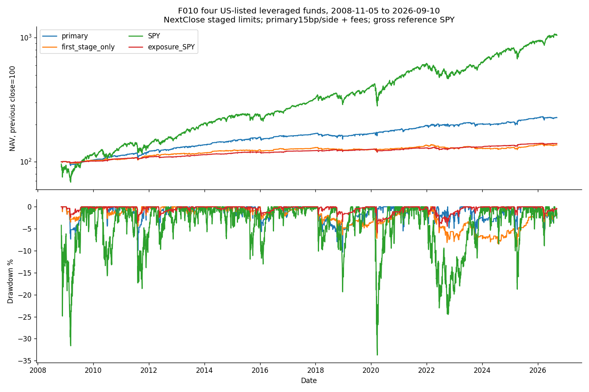

<!-- GENERATED FILE. EDIT THE CANONICAL KNOWLEDGE RECORD. -->

# Staged ETF dip buying: original numerical-underfill diagnostic

!!! warning "Research-only"
    This page summarizes saved research evidence. It does not authorize LIVE, allocation, or deployment.

## TL;DR

> **Verdict:** Original30evaluations retained as numerical-underfill diagnostic: affordable() could discard one affordable share when rechecking its exact reserve. Cash accounting is valid but declared maximal sizing is not conformant. A separate documented corrective replay is required; no promotion.

> **Status:** `diagnostic`

> **Disposition:** `inconclusive`

> **Replication:** `not_reproducible`

## Research question

Does a declared four-fund staged inverse-z dip strategy retain net value and tolerable drawdown, and do child entries add value beyond the first tranche?

## Exact setup

| Field | Value |
| --- | --- |
| Signal family | staged_etf_mean_reversion |
| Universe | ["Four source-selected US-listed funds SPXL,TMF,TQQQ,UGL; GBTC omitted, three unredistributed slots"] |
| Decision | Completed CloseT; opening-known split/sell-liability safety only reduces prior instructions |
| Fill | NextClose DAY buy limit, C_D<=limit fixed atT |
| Primary cost layer | central_research |
| Last reviewed | 2026-09-14T16:45:10.560707+00:00 |

## Timing and overnight attribution

```text
information available: Completed CloseT; opening-known split/sell-liability safety only reduces prior instructions
primary executable fill: NextClose DAY buy limit, C_D<=limit fixed atT
```

If final `Close_T` data formed the signal, a hypothetical `Close_T` entry is diagnostic only unless a separate pre-close protocol was modeled. Comparing that diagnostic with `Open_(T+1)` and applying the compounded return identity shows whether the apparent edge occurred in the overnight gap. Missing attribution numbers mean **not tested**, not zero.

| Attribution field | Value |
| --- | --- |
| Status | not_tested |
| Diagnostic Path | Selection-conditioned pre-fill CloseT to CloseD identity only |
| Executable Path | No alternative nextOpen portfolio evaluated; source buys atNextClose |
| Method | Saved filled signed-share dollar decomposition, not causal open counterfactual |
| Headline Result | The day-before-fill movement is not earned strategy return |
| Metrics | {"after_open_dollars": -465185.596238749, "decision_to_close_dollars": -797381.745423102, "fills": 2046, "identity_error_max": 1.4210854715202004e-14, "interpretation": "Pre-fill selected movement only, not earned return or open strategy", "opening_gap_dollars": -332196.14918435307} |
| Artifact | C:/Users/User/Documents/workspace/pakal/pakal-research/reports/tradequantix_etf_zscore_interpretation_study/tables/same_quantity_timing.csv |

## Primary metrics

| Metric | Value |
| --- | ---: |
| Period | 2019-01-02:2026-04-02 |
| Universe | Four source-selected US-listed funds SPXL,TMF,TQQQ,UGL; GBTC omitted, three unredistributed slots |
| Cost Layer | central_research |
| Cagr | 4.81% |
| Annualized Volatility | 8.19% |
| Sharpe | 0.614 |
| Maximum Drawdown | -6.69% |
| Turnover | 767.84% |

## Four separate verdicts

| Question | Conclusion |
| --- | --- |
| Source Replication | Unavailable exact source, explicit interpretation |
| Predictive Value | No pristine independent prediction claim; fixed survivor basket and short later period |
| Economic Value | Original30evaluations retained as numerical-underfill diagnostic: affordable() could discard one affordable share when rechecking its exact reserve. Cash accounting is valid but declared maximal sizing is not conformant. A separate documented corrective replay is required; no promotion. |
| Promotion | Research-only diagnostic; no trading approval |

## Key findings

| Feature | Role | Direction | Status | Effect | Action |
| --- | --- | --- | --- | --- | --- |
| Inverse-z three-stage EMA recovery | entry | Long dip buying | diagnostic | Validation CAGR0.048124, MDD-0.066906 | No trading implementation; preserve result and avoid same-history tuning |

## Visual evidence




## Limitations

- Not exact author replication; clipped TargetPrice/LLV and final UGL body are interpreted
- GBTC excluded for unresolved economics; no renormalization except named control
- Current-vintage fixed survivor basket and author-selected parameters; no true PITselection claim
- Original cache omitted currency/security_name and stable before-after vintage; retained prior QA, no invented metadata
- No padding; ex-date entitlement cash is not pay-date liquidity proof
- Daily closes do not prove closing-auction access, partial fills or quantity capacity
- Fractional post-split claims held, no cash-in-lieu model
- Short post-publication window and related seen history
- No calibrated impact, cash yield or independent execution proof
- Same-quantity pre-fill timing identity is selection-conditioned and not trading return
- Frozen gate failures: 

## Next gates

- New independently frozen evidence only; do not retune seen history

## Sources

- `{"content_id": "sha256:ff7aa17a0d5dc873837309212086161dd5b82b01d8a8e6637903fdb2d6ea44cc", "location": "C:/Users/User/Documents/workspace/0_papers/TradeQuantiX_PDFs/TradeQuantiX_PDFs_WHITE/etf-mean-reversion-methods-four-systems.pdf", "read_complete": true, "role": "Source mechanism, incomplete author code; full read receipt in prior F010 intake", "source_id": "14"}`

## Canonical artifacts

| Artifact | Pakal path |
| --- | --- |
| Source Rule Map | `C:/Users/User/Documents/workspace/pakal/pakal-research/reports/tradequantix_etf_zscore_interpretation_study/SOURCE_RULE_MAP.md` |
| Hypothesis Registry | `C:/Users/User/Documents/workspace/pakal/pakal-research/reports/tradequantix_etf_zscore_interpretation_study/hypothesis_registry.json` |
| Experiment Ledger | `C:/Users/User/Documents/workspace/pakal/pakal-research/reports/tradequantix_etf_zscore_interpretation_study/experiment_ledger.jsonl` |
| Decision Log | `C:/Users/User/Documents/workspace/pakal/pakal-research/reports/tradequantix_etf_zscore_interpretation_study/decision_log.jsonl` |
| Frozen Specification | `C:/Users/User/Documents/workspace/pakal/pakal-research/reports/tradequantix_etf_zscore_interpretation_study/research_spec_frozen.json` |
| Concise Report | `C:/Users/User/Documents/workspace/pakal/pakal-research/reports/tradequantix_etf_zscore_interpretation_study/REPORT.md` |
| Full Report | `C:/Users/User/Documents/workspace/pakal/pakal-research/reports/tradequantix_etf_zscore_interpretation_study/REPORT_FULL.md` |
| Knowledge Record | `C:/Users/User/Documents/workspace/pakal/pakal-research/reports/tradequantix_etf_zscore_interpretation_study/knowledge_record.json` |
| Manifest | `C:/Users/User/Documents/workspace/pakal/pakal-research/reports/tradequantix_etf_zscore_interpretation_study/run_manifest.json` |
| Research State | `C:/Users/User/Documents/workspace/pakal/pakal-research/reports/tradequantix_etf_zscore_interpretation_study/research_state.json` |
| Notebook | `C:/Users/User/Documents/workspace/pakal/pakal-research/reports/tradequantix_etf_zscore_interpretation_study/research.ipynb` |
| Primary Source Code | `["C:/Users/User/Documents/workspace/pakal/pakal-research/tradequantix_etf_zscore_interpretation_engine.py"]` |
| Primary Tables | `["C:/Users/User/Documents/workspace/pakal/pakal-research/reports/tradequantix_etf_zscore_interpretation_study/tables/period_metrics.csv"]` |
| Primary Charts | `["C:/Users/User/Documents/workspace/pakal/pakal-research/reports/tradequantix_etf_zscore_interpretation_study/charts/equity_drawdown.png"]` |
