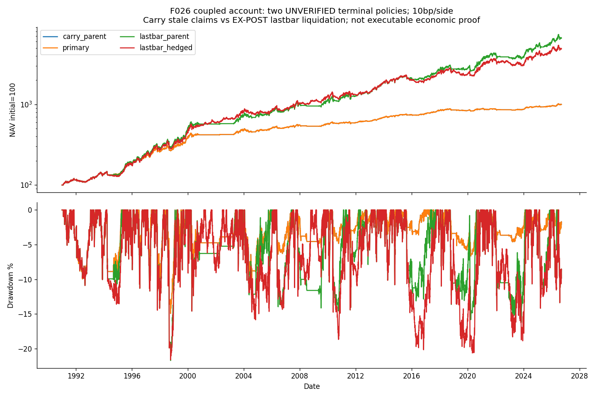

<!-- GENERATED FILE. EDIT THE CANONICAL KNOWLEDGE RECORD. -->

# Coupled momentum-flat ETF short hedge: terminal-policy sensitivity

!!! warning "Research-only"
    This page summarizes saved research evidence. It does not authorize LIVE, allocation, or deployment.

## TL;DR

> **Verdict:** Unresolved terminal accounting prevents economic approval; the fixed coupled hedge fails its conditional hedge-role gate. Diagnostic/inconclusive, no trading promotion.

> **Status:** `diagnostic`

> **Disposition:** `inconclusive`

> **Replication:** `not_reproducible`

## Research question

Does a coupled momentum-flat ETF short hedge improve matched parent risk under explicit source repairs, borrowing costs and both unresolved terminal policies?

## Exact setup

| Field | Value |
| --- | --- |
| Signal family | coupled_momentum_flat_hedge |
| Universe | ["USA historical S&P100,Russell1000,Nasdaq100; matching US-listed SPY,IWB,QQQ hedge"] |
| Decision | Completed CloseT actual parent holdings and combinedlong+shortNAV; knownregularweeklycalendar |
| Fill | NextOpen fixed signed target; parent executes then hedge, no re-evaluation from Dparentfills |
| Primary cost layer | central_research |
| Last reviewed | 2026-09-14T18:53:46.145798+00:00 |

## Timing and overnight attribution

```text
information available: Completed CloseT actual parent holdings and combinedlong+shortNAV; knownregularweeklycalendar
primary executable fill: NextOpen fixed signed target; parent executes then hedge, no re-evaluation from Dparentfills
```

If final `Close_T` data formed the signal, a hypothetical `Close_T` entry is diagnostic only unless a separate pre-close protocol was modeled. Comparing that diagnostic with `Open_(T+1)` and applying the compounded return identity shows whether the apparent edge occurred in the overnight gap. Missing attribution numbers mean **not tested**, not zero.

| Attribution field | Value |
| --- | --- |
| Status | not_tested |
| Diagnostic Path | No alternative atCloseTportfolio |
| Executable Path | FixedTsignedtargets atobservednextOpen |
| Method | Saved selectedhedge q*(OpenD-CloseT) only |
| Headline Result | Pre-fill gap is not extraearnedprofit |
| Artifact | C:/Users/User/Documents/workspace/pakal/pakal-research/reports/tradequantix_flat_hedge_interpretation_study/tables/hedge_timing.csv |

## Primary metrics

| Metric | Value |
| --- | ---: |
| Period | 2019-01-01:2025-12-31 |
| Universe | USA historical S&P100,Russell1000,Nasdaq100; matching US-listed SPY,IWB,QQQ hedge |
| Cost Layer | central_research |
| Cagr | N/A |
| Annualized Volatility | N/A |
| Sharpe | N/A |
| Maximum Drawdown | N/A |
| Turnover | N/A |

## Four separate verdicts

| Question | Conclusion |
| --- | --- |
| Source Replication | Clipped operators and source caller-context drift interpreted, no exact author parity |
| Predictive Value | Conditional hedge role only; trigger depends on unverified parent settlement |
| Economic Value | Unresolved terminal accounting prevents economic approval; the fixed coupled hedge fails its conditional hedge-role gate. Diagnostic/inconclusive, no trading promotion. |
| Promotion | No trading or allocation promotion |

## Key findings

| Feature | Role | Direction | Status | Effect | Action |
| --- | --- | --- | --- | --- | --- |
| Actual parent-flat coupled hedge | risk_overlay | Short ETF while corresponding stock sleeve flat | diagnostic | See matched conditional pairs, not verified economic return | Repair terminalentitlements before any operationaldecision |

## Visual evidence




## Limitations

- Both parentterminalpolicies unverified; carryblocksflat/expostliquidationseesfuture
- Clippedsourceoperators andwronglongdriftreference completedexplicitly
- SourcehedgecostsandnegativeRoundbuildparityunproved
- Restrictedproceeds/debt/borrowareresearchscenarios, no broker margin/locate/buyinproof
- Calendarprior-row dividendcash notpaymentdates; complexCAPevents unresolved
- Knownregularweeklycalendar lacksadhocannouncementtimestamps; parentmonthendkernel inherited
- Nextopenwholefill/zerovolumewitness notpartialfillproof
- Relatedhistoryand2026corpus alreadyseen; shortlaterperiod
- DirectshortPnL andpairedportfoliodifference differ becauseNAVchangesparentpositions

## Next gates

- Resolve dated parent merger/delisting proceeds and successor shares, then frozen coupled rerun; no same-history parameter rescue

## Sources

- `{"content_id": "sha256:32a02ebe2612efb3853c736bfb1711fb7d704289b55240fbe196e72d81249ec8", "location": "C:/Users/User/Documents/workspace/0_papers/TradeQuantiX_PDFs/TradeQuantiX_PDFs_WHITE/portfolio-development-series-part-140.pdf", "read_complete": true, "role": "200page complete intake; source25hedge,29correctedparent,34superseded,28allocation,32repeat", "source_id": "25"}`
- `{"content_id": "sha256:6ceb9a69c2924ab0eb45dd153a4a72433d667c0e44c0d92f1fb281a33b56d9fc", "location": "C:/Users/User/Documents/workspace/0_papers/TradeQuantiX_PDFs/TradeQuantiX_PDFs_WHITE/portfolio-development-series-part-28e.pdf", "read_complete": true, "role": "200page complete intake; source25hedge,29correctedparent,34superseded,28allocation,32repeat", "source_id": "29"}`
- `{"content_id": "sha256:6420a421cc9c53978ad4fbec07a69a032f971865cd340c5806c37c11a2c6646f", "location": "C:/Users/User/Documents/workspace/0_papers/TradeQuantiX_PDFs/TradeQuantiX_PDFs_WHITE/portfolio-development-series-part-bfd.pdf", "read_complete": true, "role": "200page complete intake; source25hedge,29correctedparent,34superseded,28allocation,32repeat", "source_id": "34"}`
- `{"content_id": "sha256:5a64f7dd4e2ace0969d6a01ea80692e2dd50882e2f7222cdc39c7705f005d472", "location": "C:/Users/User/Documents/workspace/0_papers/TradeQuantiX_PDFs/TradeQuantiX_PDFs_WHITE/portfolio-development-series-part-278.pdf", "read_complete": true, "role": "200page complete intake; source25hedge,29correctedparent,34superseded,28allocation,32repeat", "source_id": "28"}`
- `{"content_id": "sha256:eb74bd771c8e82ce489ce5992064d0011d11e97558d47bd98a92a589f5d4ddfe", "location": "C:/Users/User/Documents/workspace/0_papers/TradeQuantiX_PDFs/TradeQuantiX_PDFs_WHITE/portfolio-development-series-part-7f7.pdf", "read_complete": true, "role": "200page complete intake; source25hedge,29correctedparent,34superseded,28allocation,32repeat", "source_id": "32"}`

## Canonical artifacts

| Artifact | Pakal path |
| --- | --- |
| Source Rule Map | `C:/Users/User/Documents/workspace/pakal/pakal-research/reports/tradequantix_flat_hedge_interpretation_study/SOURCE_RULE_MAP.md` |
| Hypothesis Registry | `C:/Users/User/Documents/workspace/pakal/pakal-research/reports/tradequantix_flat_hedge_interpretation_study/hypothesis_registry.json` |
| Experiment Ledger | `C:/Users/User/Documents/workspace/pakal/pakal-research/reports/tradequantix_flat_hedge_interpretation_study/experiment_ledger.jsonl` |
| Decision Log | `C:/Users/User/Documents/workspace/pakal/pakal-research/reports/tradequantix_flat_hedge_interpretation_study/decision_log.jsonl` |
| Frozen Specification | `C:/Users/User/Documents/workspace/pakal/pakal-research/reports/tradequantix_flat_hedge_interpretation_study/research_spec_frozen.json` |
| Concise Report | `C:/Users/User/Documents/workspace/pakal/pakal-research/reports/tradequantix_flat_hedge_interpretation_study/REPORT.md` |
| Full Report | `C:/Users/User/Documents/workspace/pakal/pakal-research/reports/tradequantix_flat_hedge_interpretation_study/REPORT_FULL.md` |
| Knowledge Record | `C:/Users/User/Documents/workspace/pakal/pakal-research/reports/tradequantix_flat_hedge_interpretation_study/knowledge_record.json` |
| Manifest | `C:/Users/User/Documents/workspace/pakal/pakal-research/reports/tradequantix_flat_hedge_interpretation_study/run_manifest.json` |
| Research State | `C:/Users/User/Documents/workspace/pakal/pakal-research/reports/tradequantix_flat_hedge_interpretation_study/research_state.json` |
| Notebook | `C:/Users/User/Documents/workspace/pakal/pakal-research/reports/tradequantix_flat_hedge_interpretation_study/research.ipynb` |
| Primary Source Code | `["C:/Users/User/Documents/workspace/pakal/pakal-research/tradequantix_flat_hedge_interpretation_engine.py"]` |
| Primary Tables | `["C:/Users/User/Documents/workspace/pakal/pakal-research/reports/tradequantix_flat_hedge_interpretation_study/tables/period_metrics.csv"]` |
| Primary Charts | `["C:/Users/User/Documents/workspace/pakal/pakal-research/reports/tradequantix_flat_hedge_interpretation_study/charts/equity_drawdown.png"]` |
