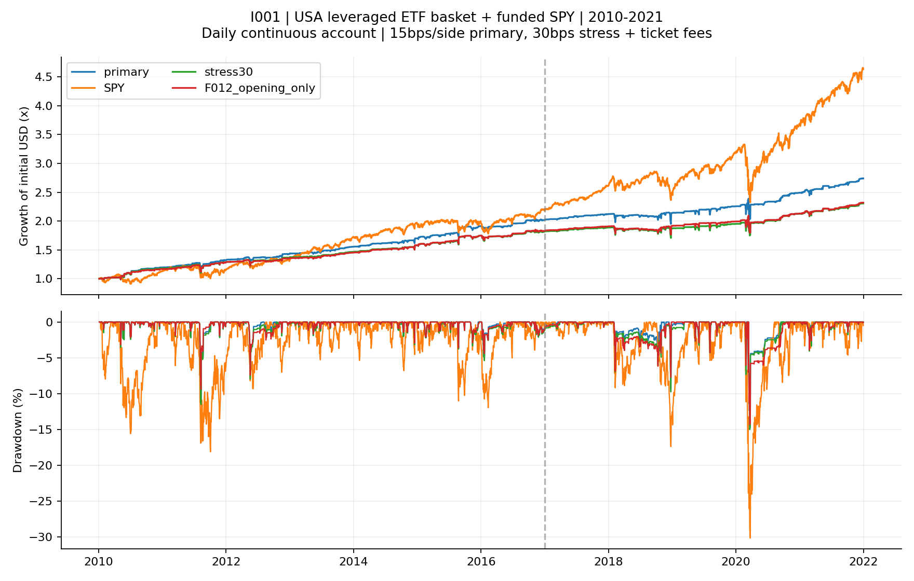

<!-- GENERATED FILE. EDIT THE CANONICAL KNOWLEDGE RECORD. -->

# Four dip-buying systems in one shared cash account

!!! warning "Research-only"
    This page summarizes saved research evidence. It does not authorize LIVE, allocation, or deployment.

## TL;DR

> **Verdict:** Positive conditional historical growth and lower drawdown; validation retains38.5%of funded SPY growth and fails MAR, so later remainsclosed and no promotion.

> **Status:** `diagnostic`

> **Disposition:** `inconclusive`

> **Replication:** `not_reproducible`

## Research question

Assess four fixed dip-buying child primary definitions sharing actual cash and NAV; test sensitivity to priority, cost and dividend liquidity without selecting a historical winner.

## Exact setup

| Field | Value |
| --- | --- |
| Signal family | multi_system_etf_mean_reversion |
| Universe | ["USA-listed source-selected leveraged ETFs:SPXL,TMF,TQQQ,UGL; F012/F013 additionallySOXL,TECL. GBTC disabled, no substitution."] |
| Decision | At completed close T every family uses the same real NAV, completed own real/shadow states and observed features. |
| Fill | Fixed T limit valid only on immediate next SPY session D. F010/F011/F013 closing-limit proxy; F012 opening-gap or later low-touch limit, optional T-fixed attached close exit. SPY immediate next opening only, downward-only quantity clip. |
| Primary cost layer | central_research |
| Last reviewed | 2026-09-15T05:34:11.972153+00:00 |

## Timing and overnight attribution

```text
information available: At completed close T every family uses the same real NAV, completed own real/shadow states and observed features.
primary executable fill: Fixed T limit valid only on immediate next SPY session D. F010/F011/F013 closing-limit proxy; F012 opening-gap or later low-touch limit, optional T-fixed attached close exit. SPY immediate next opening only, downward-only quantity clip.
```

If final `Close_T` data formed the signal, a hypothetical `Close_T` entry is diagnostic only unless a separate pre-close protocol was modeled. Comparing that diagnostic with `Open_(T+1)` and applying the compounded return identity shows whether the apparent edge occurred in the overnight gap. Missing attribution numbers mean **not tested**, not zero.

| Attribution field | Value |
| --- | --- |
| Status | tested |
| Diagnostic Path | Selected priorClose to same actual exit |
| Executable Path | Hypothetical selected opening to same exit; no funded opening strategy |
| Method | Fixed-quantity signed movement and same-exit closed-lot gross price decomposition; not causal selection |
| Headline Result | Pre-fill movement is not earned return; open lots censored, distributions/costs separate |
| Metrics | {"capacity": [{"initial_aum_scale_at_01pct": 2145.1956423350557, "initial_aum_scale_at_05pct": 10725.978211675278, "initial_aum_scale_at_1pct": 21451.956423350555, "kind": "submitted", "max_participation": 0.04661579486109226, "meaning": "Conditional fixed-path gross demand, not approved AUM; unknown rows excluded only from numeric ratio and retained explicitly.", "p99_participation": 0.018200162097213975, "rows": 10666, "unknown_adv_rows": 73}, {"initial_aum_scale_at_01pct": 3807.7372571217993, "initial_aum_scale_at_05pct": 19038.686285608997, "initial_aum_scale_at_1pct": 38077.372571217995, "kind": "filled", "max_participation": 0.02626231623859158, "meaning": "Conditional fixed-path gross demand, not approved AUM; unknown rows excluded only from numeric ratio and retained explicitly.", "p99_participation": 0.008572981942060031, "rows": 2810, "unknown_adv_rows": 15}], "closed_lots": 2581, "component_net_pnl": {"F010": 44194.777479121316, "F011": 35304.35939898959, "F012": 43734.1985906615, "F013": 50581.68860173407}, "created_from_saved_ledgers": true, "market_evaluations_added": 0, "open_lots": 1, "phase_list": ["discovery", "validation"], "primary_real_fills": 5163, "timing_caveat": "Selected pre-fill movement, not earned return or causal alternative open strategy. Same-exit closed-lot gross paths omit distributions, listed separately; open lots censored.", "timing_identity_max": 2.842170943040401e-14, "timing_missing_open_rows": 0, "timing_rows": 4360, "timing_signed_intraday": -414069.9534124604, "timing_signed_overnight": -332396.124957873} |
| Artifact | C:/Users/User/Documents/workspace/pakal/pakal-research/reports/tradequantix_four_system_shared_account_study/tables/diagnostics/closed_and_censored_lots.csv |

## Primary metrics

| Metric | Value |
| --- | ---: |
| Period | 2017-01-03:2021-12-31 |
| Universe | USA six leveraged ETFs;60active identities |
| Cost Layer | central_research |
| Cagr | 6.26% |
| Annualized Volatility | 13.27% |
| Sharpe | 0.524 |
| Maximum Drawdown | -15.01% |
| Turnover | 868.75% |

## Four separate verdicts

| Question | Conclusion |
| --- | --- |
| Source Replication | Unavailable exact source; declared60active interpretation |
| Predictive Value | No independent forecast claim; source-selected survivor basket and prior-seenhistory |
| Economic Value | השילוב הפנימי רווחי היסטורית ובעל ירידה נמוכה יותר, אך נכשל בתנאי ההמשך בתקופת הבדיקה. יש ערך מחקרי למנגנוני קניית הירידות; לא הוכחה עדיפות לתיק המאוחד בתנאים שנקבעו. |
| Promotion | No trading or allocation approval |

## Key findings

| Feature | Role | Direction | Status | Effect | Action |
| --- | --- | --- | --- | --- | --- |
| Fixed four-system integration | portfolio construction | long dip buying | diagnostic | Validation CAGR6.26%,MDD-15.01%,SPY16.26%/-30.17% | Preserve conditional components; no winner substitution or promotion |

## Visual evidence




## Limitations

- Source not reproducible; internal60active interpretation is distinct from literal72source identities.
- Current-vintage source-survivor universe and all component periods previously seen; later is procedural holdback only.
- Daily touch/closing-auction/full-bar validity proxies do not prove executable queue or partial fills.
- Dividend timing inherited from prior observed row, not verified historical paydates. Unquoted ex-date marks flagged conditional.
- Split-unit bridging, fractional rights and terminal marks are not broker delivery/cash evidence.
- No positive cash yield, taxes, live capacity or portfolio allocation conclusion.

## Next gates

- New prospective, independently specified portfolio objective and execution evidence; no retuning of seen historical cells.

## Sources

- `{"content_id": "sha256:24e379d16a103d5bd0565af2354bb938d0c99e0d3332d282b617abe24166e91b", "location": "C:/Users/User/Documents/workspace/0_papers/TradeQuantiX_PDFs/TradeQuantiX_PDFs_WHITE/ETF Mean Reversion Methods - Mean Reversion Mini-Portfolio Creation - Part 2.pdf", "read_complete": true, "role": "Source orchestration and child definitions; prior complete readings reused", "source_id": "source12"}`
- `{"content_id": "sha256:5845a929391428355f0194154db5d11bd41ddcf95804b2796ba2c1ab87e778ee", "location": "C:/Users/User/Documents/workspace/0_papers/TradeQuantiX_PDFs/TradeQuantiX_PDFs_WHITE/ETF Mean Reversion Methods Four Systems Built for the Dip - Part 1.pdf", "read_complete": true, "role": "Source orchestration and child definitions; prior complete readings reused", "source_id": "source13"}`
- `{"content_id": "sha256:ff7aa17a0d5dc873837309212086161dd5b82b01d8a8e6637903fdb2d6ea44cc", "location": "C:/Users/User/Documents/workspace/0_papers/TradeQuantiX_PDFs/TradeQuantiX_PDFs_WHITE/etf-mean-reversion-methods-four-systems.pdf", "read_complete": true, "role": "Source orchestration and child definitions; prior complete readings reused", "source_id": "source14"}`

## Canonical artifacts

| Artifact | Pakal path |
| --- | --- |
| Concise Report | `C:/Users/User/Documents/workspace/pakal/pakal-research/reports/tradequantix_four_system_shared_account_study/REPORT.md` |
| Full Report | `C:/Users/User/Documents/workspace/pakal/pakal-research/reports/tradequantix_four_system_shared_account_study/REPORT_FULL.md` |
| Notebook | `C:/Users/User/Documents/workspace/pakal/pakal-research/reports/tradequantix_four_system_shared_account_study/I001_DECISION.ipynb` |
| Knowledge Record | `C:/Users/User/Documents/workspace/pakal/pakal-research/reports/tradequantix_four_system_shared_account_study/knowledge_record.json` |
| Manifest | `C:/Users/User/Documents/workspace/pakal/pakal-research/reports/tradequantix_four_system_shared_account_study/run_manifest.json` |
| Tables | `C:/Users/User/Documents/workspace/pakal/pakal-research/reports/tradequantix_four_system_shared_account_study/tables` |
| Charts | `C:/Users/User/Documents/workspace/pakal/pakal-research/reports/tradequantix_four_system_shared_account_study/charts` |
| Source Rule Map | `C:/Users/User/Documents/workspace/pakal/pakal-research/reports/tradequantix_four_system_shared_account_study/SOURCE_RULE_MAP.md` |
| Hypothesis Registry | `C:/Users/User/Documents/workspace/pakal/pakal-research/reports/tradequantix_four_system_shared_account_study/hypothesis_registry.json` |
| Experiment Ledger | `C:/Users/User/Documents/workspace/pakal/pakal-research/reports/tradequantix_four_system_shared_account_study/experiment_ledger.jsonl` |
| Decision Log | `C:/Users/User/Documents/workspace/pakal/pakal-research/reports/tradequantix_four_system_shared_account_study/decision_log.jsonl` |
| Frozen Specification | `C:/Users/User/Documents/workspace/pakal/pakal-research/reports/tradequantix_four_system_shared_account_study/research_spec_frozen.json` |
| Research State | `C:/Users/User/Documents/workspace/pakal/pakal-research/reports/tradequantix_four_system_shared_account_study/research_state.json` |
| Primary Source Code | `["C:/Users/User/Documents/workspace/pakal/pakal-research/tradequantix_i001_account.py"]` |
| Primary Tables | `["C:/Users/User/Documents/workspace/pakal/pakal-research/reports/tradequantix_four_system_shared_account_study/tables/diagnostics/all_metrics.csv"]` |
| Primary Charts | `["C:/Users/User/Documents/workspace/pakal/pakal-research/reports/tradequantix_four_system_shared_account_study/charts/equity_drawdown.png"]` |
