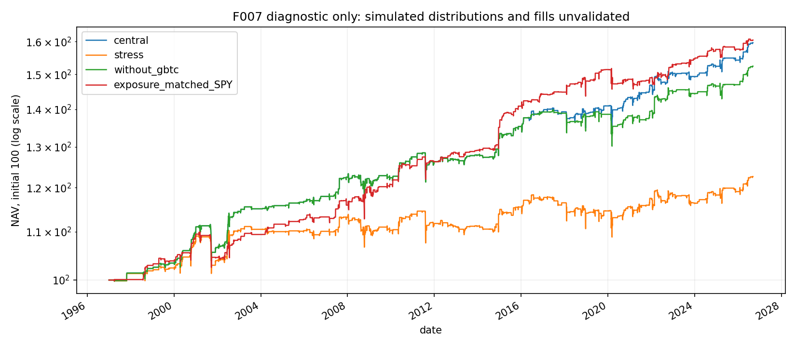
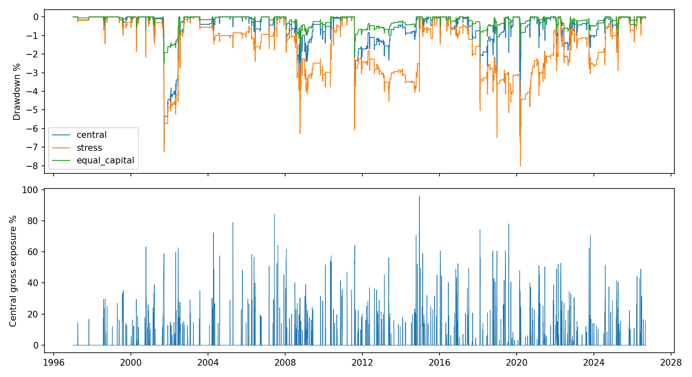

<!-- GENERATED FILE. EDIT THE CANONICAL KNOWLEDGE RECORD. -->

# Five-ETF dip buying: modest cost-sensitive diagnostic, low continuation priority

!!! warning "Research-only"
    This page summarizes saved research evidence. It does not authorize LIVE, allocation, or deployment.

## TL;DR

> **Verdict:** Diagnostic, low-priority continuation: positive but cost-sensitive; no consistent full-history advantage over a descriptive exposure-matched SPY reference; economic accounting and execution remain unvalidated.

> **Status:** `diagnostic`

> **Disposition:** `inconclusive`

> **Replication:** `not_reproducible`

## Research question

Does the unchanged five-ETF source price-signal translation remain positive under fixed cash, cost and intraday-order controls? Diagnostic economics only.

## Exact setup

| Field | Value |
| --- | --- |
| Signal family | etf_limit_mean_reversion |
| Universe | ["QQQ", "SPY", "GLD", "TLT", "GBTC"] |
| Decision | Completed observed Close T; prior-close vacant slots, ranking and quantities. |
| Fill | Fixed DAY limit at T+1; one-cent penetration; no unfilled candidate backfill. Prior-high target intraday for sleeves1/2 and LOC for3; BarsHeld>10 queues next observed close; age1 at entry close, exit E+11. |
| Primary cost layer | central_research |
| Last reviewed | 2026-09-14T04:53:38.574403+00:00 |

## Timing and overnight attribution

```text
information available: Completed observed Close T; prior-close vacant slots, ranking and quantities.
primary executable fill: Fixed DAY limit at T+1; one-cent penetration; no unfilled candidate backfill. Prior-high target intraday for sleeves1/2 and LOC for3; BarsHeld>10 queues next observed close; age1 at entry close, exit E+11.
```

If final `Close_T` data formed the signal, a hypothetical `Close_T` entry is diagnostic only unless a separate pre-close protocol was modeled. Comparing that diagnostic with `Open_(T+1)` and applying the compounded return identity shows whether the apparent edge occurred in the overnight gap. Missing attribution numbers mean **not tested**, not zero.

| Attribution field | Value |
| --- | --- |
| Status | tested |
| Diagnostic Path | Same actual time-exit quantity valued at original decision close |
| Executable Path | Following observed open and actual closing exit |
| Method | Signed sale quantity times price changes; overnight+intraday sums to total. |
| Headline Result | Only5central time exits; signed total cost -492.2142USD, insufficient timing evidence. |
| Metrics | {"count": 5, "signed_cost": -492.21422576904297} |
| Artifact | C:/Users/User/Documents/workspace/pakal/pakal-research/reports/tradequantix_graveyard_etf_diagnostic_closeout/tables/time_exit_attribution.csv |

## Primary metrics

| Metric | Value |
| --- | ---: |
| Period | 2020-01-02:2025-12-15 |
| Universe | QQQ,SPY,GLD,TLT,GBTC |
| Cost Layer | central_research |
| Cagr | 1.53% |
| Annualized Volatility | 3.24% |
| Sharpe | 0.485 |
| Maximum Drawdown | -4.24% |
| Turnover | 675.59% |

## Four separate verdicts

| Question | Conclusion |
| --- | --- |
| Source Replication | Conditional Capital signal translation; missing exact author runtime/chart and economic accounting prevent exact replication. |
| Predictive Value | Positive directional price-trading result; stress weakens it and full-history exposure-matched comparison is not superior. |
| Economic Value | Unvalidated diagnostic:2020-2025centralCAGR1.53098%,stress0.64319%; full-historycentral1.59133% vs cost-free descriptive reference1.60889%. |
| Promotion | No trading or economic promotion; do not tune further on seen data. |

## Key findings

| Feature | Role | Direction | Status | Effect | Action |
| --- | --- | --- | --- | --- | --- |
| MA10/ADX dip | entry | Fixed source direction; no selected replacement | diagnostic | N/A | Low-priority continuation; require new evidence rather than same-history tuning. |
| ROC rank | rank | Fixed source direction; no selected replacement | diagnostic | N/A | Low-priority continuation; require new evidence rather than same-history tuning. |
| ATR limit | entry_execution | Fixed source direction; no selected replacement | diagnostic | N/A | Low-priority continuation; require new evidence rather than same-history tuning. |
| Volatility sizing | risk_overlay | Fixed source direction; no selected replacement | diagnostic | N/A | Low-priority continuation; require new evidence rather than same-history tuning. |
| Capital signal convention | diagnostic | Fixed source direction; no selected replacement | diagnostic | N/A | Low-priority continuation; require new evidence rather than same-history tuning. |

## Visual evidence






## Limitations

- Current documentation is not exact historical author runtime proof.
- CAPITAL gap retention is source-consistent; economic payout is distinct.
- 2017 cached eventual cash/rights and2024 delivered-share accounting unresolved.
- Daily OHLC cannot prove OTC/auction or same-day bracket fill order.
- Printed and narrative capital differ.
- Author-specific indicator seeds/search count and missing charts prevent exact reproduction.
- Related studies and event windows already seen; postpublication period short, not pristine.
- Loader constructs causal observed features through cache endpoint; no later portfolio path is inspected before its phase.
- Post-run schema view is not a new pre-run freeze; original receipts remain authoritative.

## Next gates

- Verify actual distribution cash/rights and OTC/auction execution before any economic claim.
- If new external evidence justifies revival, freeze a new independent study rather than retuning seen paths.

## Sources

- `{"content_id": "sha256:b58986be5652e19f5ca6484eb4c9a865f4745abe766caeaefc7fe74752b05f83", "location": "C:/Users/User/Documents/workspace/0_papers/TradeQuantiX_PDFs/TradeQuantiX_PDFs_WHITE/digging-up-an-old-trading-system-67b.pdf", "read_complete": true, "role": "Complete-read receipt reused; ETF pp54-60 reread; no author chart available.", "source_id": "9"}`

## Canonical artifacts

| Artifact | Pakal path |
| --- | --- |
| Concise Report | `C:/Users/User/Documents/workspace/pakal/pakal-research/reports/tradequantix_graveyard_etf_diagnostic_closeout/REPORT.md` |
| Full Report | `C:/Users/User/Documents/workspace/pakal/pakal-research/reports/tradequantix_graveyard_etf_diagnostic_closeout/REPORT_FULL.md` |
| Notebook | `C:/Users/User/Documents/workspace/pakal/pakal-research/reports/tradequantix_graveyard_etf_diagnostic_closeout/research.ipynb` |
| Frozen Specification | `C:/Users/User/Documents/workspace/pakal/pakal-research/reports/tradequantix_graveyard_etf_diagnostic_closeout/research_spec_frozen.json` |
| Manifest | `C:/Users/User/Documents/workspace/pakal/pakal-research/reports/tradequantix_graveyard_etf_diagnostic_closeout/run_manifest.json` |
| Research State | `C:/Users/User/Documents/workspace/pakal/pakal-research/reports/tradequantix_graveyard_etf_diagnostic_closeout/research_state.json` |
| Hypothesis Registry | `C:/Users/User/Documents/workspace/pakal/pakal-research/reports/tradequantix_graveyard_etf_diagnostic_closeout/hypothesis_registry.json` |
| Experiment Ledger | `C:/Users/User/Documents/workspace/pakal/pakal-research/reports/tradequantix_graveyard_etf_diagnostic_closeout/experiment_ledger.jsonl` |
| Decision Log | `C:/Users/User/Documents/workspace/pakal/pakal-research/reports/tradequantix_graveyard_etf_diagnostic_closeout/decision_log.jsonl` |
| Source Rule Map | `C:/Users/User/Documents/workspace/pakal/pakal-research/reports/tradequantix_graveyard_etf_diagnostic_closeout/SOURCE_RULE_MAP.md` |
| Schema Specification | `C:/Users/User/Documents/workspace/pakal/pakal-research/reports/tradequantix_graveyard_etf_diagnostic_closeout/research_spec_schema_view.json` |
| Primary Source Code | `["C:/Users/User/Documents/workspace/pakal/pakal-research/tradequantix_graveyard_etf_engine.py", "C:/Users/User/Documents/workspace/pakal/pakal-research/tradequantix_graveyard_etf_features.py", "C:/Users/User/Documents/workspace/pakal/pakal-research/tradequantix_graveyard_etf_diagnostic_run.py"]` |
| Primary Tables | `["C:/Users/User/Documents/workspace/pakal/pakal-research/reports/tradequantix_graveyard_etf_diagnostic_closeout/tables/all_metrics.csv", "C:/Users/User/Documents/workspace/pakal/pakal-research/reports/tradequantix_graveyard_etf_diagnostic_closeout/tables/benchmark_metrics.csv", "C:/Users/User/Documents/workspace/pakal/pakal-research/reports/tradequantix_graveyard_etf_diagnostic_closeout/tables/selected_instruction_capacity.csv", "C:/Users/User/Documents/workspace/pakal/pakal-research/reports/tradequantix_graveyard_etf_diagnostic_closeout/tables/event_holdings.csv"]` |
| Primary Charts | `["C:/Users/User/Documents/workspace/pakal/pakal-research/reports/tradequantix_graveyard_etf_diagnostic_closeout/charts/equity.png", "C:/Users/User/Documents/workspace/pakal/pakal-research/reports/tradequantix_graveyard_etf_diagnostic_closeout/charts/drawdown_exposure.png", "C:/Users/User/Documents/workspace/pakal/pakal-research/reports/tradequantix_graveyard_etf_diagnostic_closeout/charts/market_comparison.png"]` |
