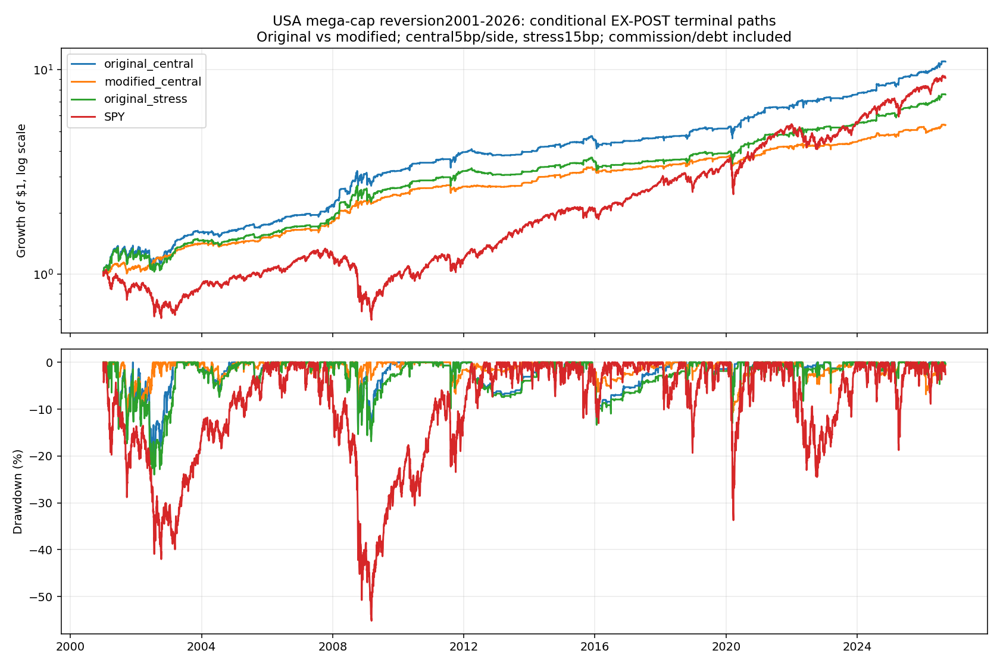
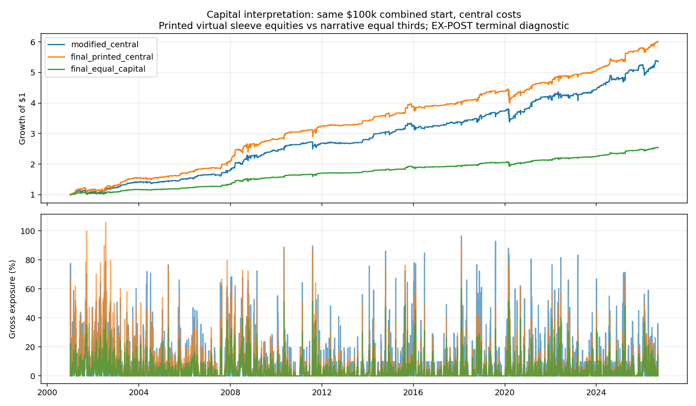

<!-- GENERATED FILE. EDIT THE CANONICAL KNOWLEDGE RECORD. -->

# TradeQuantiX original mega-cap mean reversion: promising component; later modifications weaker

!!! warning "Research-only"
    This page summarizes saved research evidence. It does not authorize LIVE, allocation, or deployment.

## TL;DR

> **Verdict:** Promising original low-average-exposure component, retained as forward hypothesis; no trading promotion. Original survives central/stress costs and both later windows, while modified and final three-sleeve routes weaken recent performance. Primary has no stale holdings, but almost10% worst-day loss, assumed limit/auction fills and184-session confirmation prevent promotion.

> **Status:** `forward_hypothesis`

> **Disposition:** `promising_component`

> **Replication:** `not_reproducible`

## Research question

Reproduce original source10 rules under causal reservations and distinguish later source sizing/capital/cost changes.

## Exact setup

| Field | Value |
| --- | --- |
| Signal family | mega_cap_limit_mean_reversion |
| Universe | ["USA historical NDX OR OEX,666 stocks with dated membership;USD"] |
| Decision | Completed CloseT features, rank, quantity, target and prior-close vacant-slot reservation. |
| Fill | Next-session DAY buy limit; prior-H target intraday or precomputed LOC;11th observed-night preplanned MOC time exit. Contingent same-open controls diagnostic. |
| Primary cost layer | central_research |
| Last reviewed | 2026-09-13T19:02:28.640888+00:00 |

## Timing and overnight attribution

```text
information available: Completed CloseT features, rank, quantity, target and prior-close vacant-slot reservation.
primary executable fill: Next-session DAY buy limit; prior-H target intraday or precomputed LOC;11th observed-night preplanned MOC time exit. Contingent same-open controls diagnostic.
```

If final `Close_T` data formed the signal, a hypothetical `Close_T` entry is diagnostic only unless a separate pre-close protocol was modeled. Comparing that diagnostic with `Open_(T+1)` and applying the compounded return identity shows whether the apparent edge occurred in the overnight gap. Missing attribution numbers mean **not tested**, not zero.

| Attribution field | Value |
| --- | --- |
| Status | tested |
| Diagnostic Path | Same scheduled time-exit shares at decision close |
| Executable Path | Following observed open and actual following close exit |
| Method | Signed raw split-consistent quantity*(Open-Close_T) and quantity*(Close_D-Open), plus exact compounded price-ratio decomposition. Same actual exits, not alternative portfolio. |
| Headline Result | 41 time exits: overnight signed cost3299.57USD and intraday4455.40USD. Positive means worse execution relative to reference. |
| Metrics | {"interpretation": "Positive signed q*(actual-reference) is worse. Scheduled time exits compare identical exit quantity at decision close, following observed open and actual execution. Fill-conditioned cash attribution is not an alternative portfolio or alpha.", "intraday_dollars": -3506096.3078271337, "name": "primary_original_carry", "ordinary_fills": 3703, "overnight_dollars": -2349871.070028564, "terminal_fills": 0, "time_exit_fills": 41, "time_exit_intraday_dollars": 4455.399011135101, "time_exit_notional": 1622718.2518672943, "time_exit_overnight_dollars": 3299.5679483413696, "time_exit_total_dollars": 7754.966959476471, "total_timing_dollars": -5855967.377855698} |
| Artifact | C:/Users/User/Documents/workspace/pakal/pakal-research/reports/tradequantix_graveyard_mega_cap_study/tables/timing_summary.csv |

## Primary metrics

| Metric | Value |
| --- | ---: |
| Period | 2020-01-01:2025-12-15 |
| Universe | PIT NDX OR OEX |
| Cost Layer | central_research |
| Cagr | 11.26% |
| Annualized Volatility | 11.15% |
| Sharpe | 1.015 |
| Maximum Drawdown | -12.55% |
| Turnover | 1295.96% |

## Four separate verdicts

| Question | Conclusion |
| --- | --- |
| Source Replication | Original rules translated, exact author curve unavailable because PDF figures are absent and source runtime unspecified. |
| Predictive Value | Oversold entry, momentum ranking and limit execution have distinct roles; removal increases exposure/tails. Later modifications not uniformly better. |
| Economic Value | Primary2020–2025Dec CAGR11.2634%, Sharpe1.015, MDD-12.5523%, mean exposure7.7180%; later184session total12.5210%. No stale primary positions. |
| Promotion | Forward hypothesis only;184 sessions below frozen two-year confirmation gate, actual order/capacity and portfolio value still unverified. |

## Key findings

| Feature | Role | Direction | Status | Effect | Action |
| --- | --- | --- | --- | --- | --- |
| MA3_discount | entry | See all predeclared controls; no replacement winner | forward_hypothesis | N/A | Keep original as forward hypothesis; no further tuning on seen periods |
| ADX | entry | See all predeclared controls; no replacement winner | diagnostic | N/A | Keep original as forward hypothesis; no further tuning on seen periods |
| ROC252 | rank | See all predeclared controls; no replacement winner | forward_hypothesis | N/A | Keep original as forward hypothesis; no further tuning on seen periods |
| ATR5_entry_limit | entry_execution | See all predeclared controls; no replacement winner | forward_hypothesis | N/A | Keep original as forward hypothesis; no further tuning on seen periods |
| prior_high_exit | exit | See all predeclared controls; no replacement winner | diagnostic | N/A | Keep original as forward hypothesis; no further tuning on seen periods |
| volatility_sizing | risk_overlay | See all predeclared controls; no replacement winner | diagnostic | N/A | Keep original as forward hypothesis; no further tuning on seen periods |
| source_three_sleeves | portfolio_construction | See all predeclared controls; no replacement winner | diagnostic | N/A | Keep original as forward hypothesis; no further tuning on seen periods |

## Visual evidence






## Limitations

- Author charts/metrics mostly absent; exact source curve and original development search unknown.
- Source2020–2025 validation already seen; only184 later sessions, related corpus seen.
- DailyOHLC target path, one-cent excursion and full auction/limit fills are assumptions.
- Printed virtual full-account sleeve capital differs from narrative thirds; source slippage prose differs from code.
- Primary worst day nearly-10%; low average exposure does not imply low peak risk.
- Zero stale holdings is a checked path property, not universal proof of every corporate-action entitlement.
- Source smoothing/rounding/runtime parity unverified; price-slippage/commission feedback approximated by cash friction.
- Recorded gross OCO demand is not actual simultaneous volume; persistent time resubmission dates and impact unverified.

## Next gates

- Preserve original source rules and collect genuinely new observations beyond current endpoint.
- Validate limit/LOC/MOC cutoff, queue, penetration and partial-fill assumptions with intraday order evidence.
- Freeze portfolio incremental-value test with common capital and causal shared cash; no automatic allocation.
- Examine crisis concentration and actual auction depth before setting capacity.

## Sources

- `C:/Users/User/Documents/workspace/0_papers/TradeQuantiX_PDFs/TradeQuantiX_PDFs_WHITE/digging-up-an-old-trading-system.pdf`
- `C:/Users/User/Documents/workspace/0_papers/TradeQuantiX_PDFs/TradeQuantiX_PDFs_WHITE/digging-up-an-old-trading-system-67b.pdf`

## Canonical artifacts

| Artifact | Pakal path |
| --- | --- |
| Concise Report | `C:/Users/User/Documents/workspace/pakal/pakal-research/reports/tradequantix_graveyard_mega_cap_study/REPORT.md` |
| Full Report | `C:/Users/User/Documents/workspace/pakal/pakal-research/reports/tradequantix_graveyard_mega_cap_study/REPORT_FULL.md` |
| Notebook | `C:/Users/User/Documents/workspace/pakal/pakal-research/reports/tradequantix_graveyard_mega_cap_study/research.ipynb` |
| Frozen Specification | `C:/Users/User/Documents/workspace/pakal/pakal-research/reports/tradequantix_graveyard_mega_cap_study/research_spec_frozen.json` |
| Manifest | `C:/Users/User/Documents/workspace/pakal/pakal-research/reports/tradequantix_graveyard_mega_cap_study/run_manifest.json` |
| Primary Source Code | `["C:/Users/User/Documents/workspace/pakal/pakal-research/tradequantix_graveyard_engine.py", "C:/Users/User/Documents/workspace/pakal/pakal-research/tradequantix_graveyard_features.py", "C:/Users/User/Documents/workspace/pakal/pakal-research/tradequantix_graveyard_run.py"]` |
| Primary Tables | `["C:/Users/User/Documents/workspace/pakal/pakal-research/reports/tradequantix_graveyard_mega_cap_study/tables/period_metrics.csv", "C:/Users/User/Documents/workspace/pakal/pakal-research/reports/tradequantix_graveyard_mega_cap_study/tables/bootstrap_descriptive.csv", "C:/Users/User/Documents/workspace/pakal/pakal-research/reports/tradequantix_graveyard_mega_cap_study/tables/capacity_summary.csv", "C:/Users/User/Documents/workspace/pakal/pakal-research/reports/tradequantix_graveyard_mega_cap_study/tables/timing_summary.csv"]` |
| Primary Charts | `["C:/Users/User/Documents/workspace/pakal/pakal-research/reports/tradequantix_graveyard_mega_cap_study/charts/equity_drawdown.png", "C:/Users/User/Documents/workspace/pakal/pakal-research/reports/tradequantix_graveyard_mega_cap_study/charts/rolling_correlation.png", "C:/Users/User/Documents/workspace/pakal/pakal-research/reports/tradequantix_graveyard_mega_cap_study/charts/stale_accounting.png", "C:/Users/User/Documents/workspace/pakal/pakal-research/reports/tradequantix_graveyard_mega_cap_study/charts/capital_comparison.png"]` |
| Research State | `C:/Users/User/Documents/workspace/pakal/pakal-research/reports/tradequantix_graveyard_mega_cap_study/research_state.json` |
| Hypothesis Registry | `C:/Users/User/Documents/workspace/pakal/pakal-research/reports/tradequantix_graveyard_mega_cap_study/hypothesis_registry.json` |
| Experiment Ledger | `C:/Users/User/Documents/workspace/pakal/pakal-research/reports/tradequantix_graveyard_mega_cap_study/experiment_ledger.jsonl` |
| Decision Log | `C:/Users/User/Documents/workspace/pakal/pakal-research/reports/tradequantix_graveyard_mega_cap_study/decision_log.jsonl` |
| Source Rule Map | `C:/Users/User/Documents/workspace/pakal/pakal-research/reports/tradequantix_graveyard_mega_cap_study/SOURCE_RULE_MAP.md` |
