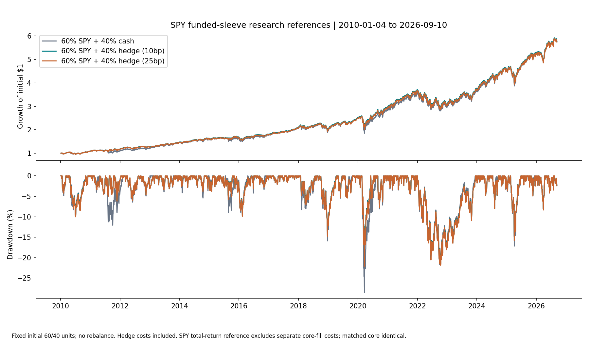
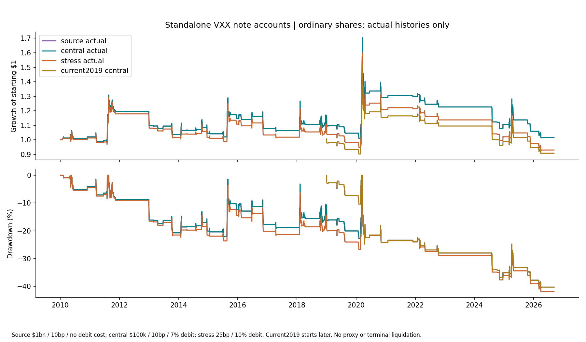

<!-- GENERATED FILE. EDIT THE CANONICAL KNOWLEDGE RECORD. -->

# VIX versus VIX3M hedge: SPY validation protection, failed later confirmation

!!! warning "Research-only"
    This page summarizes saved research evidence. It does not authorize LIVE, allocation, or deployment.

## TL;DR

> **Verdict:** Diagnostic/inconclusive hedge component. Primary SPY validation risk/cost gate passes; QQQ transfer fails and short later SPY protection direction fails. No operational promotion or full source reproduction.

> **Status:** `diagnostic`

> **Disposition:** `inconclusive`

> **Replication:** `not_reproducible`

## Research question

Does the printed VIX-minus-VIX3M hedge produce useful downside protection after actual-note execution costs, without substituting synthetic opening prices or ignoring its full available note history?

## Exact setup

| Field | Value |
| --- | --- |
| Signal family | US_VIX_term_structure_long_ETN |
| Universe | ["VXX-201901 permanent443394; currentVXX permanent2358501; never stitched"] |
| Decision | CloseT observed VIX/VIX3M and CAPITALvol5/25/100 |
| Fill | NextsessionrawOpen; priorfixedshares, ordinary entryonly sizing |
| Primary cost layer | central_research |
| Last reviewed | 2026-09-13T22:02:46.402331+00:00 |

## Timing and overnight attribution

```text
information available: CloseT observed VIX/VIX3M and CAPITALvol5/25/100
primary executable fill: NextsessionrawOpen; priorfixedshares, ordinary entryonly sizing
```

If final `Close_T` data formed the signal, a hypothetical `Close_T` entry is diagnostic only unless a separate pre-close protocol was modeled. Comparing that diagnostic with `Open_(T+1)` and applying the compounded return identity shows whether the apparent edge occurred in the overnight gap. Missing attribution numbers mean **not tested**, not zero.

| Attribution field | Value |
| --- | --- |
| Status | tested |
| Diagnostic Path | Decisionclose to sameactualexit, baselineepisodes only |
| Executable Path | Actualnextopen to sameexit |
| Method | CAPconsistentcompoundedgap/intraday/remaininghold identity |
| Headline Result | Signalreactsaftervolspikes butmeanpreentrygapnegative; earlierentrynotautomaticallybetter |
| Metrics | {"closed_episodes_per_case": 62, "maximum_identity_residual": 2.22e-16, "right_censored_per_case": 1} |
| Artifact | C:/Users/User/Documents/workspace/pakal/pakal-research/reports/tradequantix_long_volatility_study/tables/baseline/timing_attribution.csv |

## Primary metrics

| Metric | Value |
| --- | ---: |
| Period | 2019-01-01:2026-02-02 |
| Universe | 60%initialSPYTR plus40%100kVXXaccount; fixedinitialunits |
| Cost Layer | central_research |
| Cagr | 14.47% |
| Annualized Volatility | 15.03% |
| Sharpe | 0.977 |
| Maximum Drawdown | -21.59% |
| Turnover | N/A |

## Four separate verdicts

| Question | Conclusion |
| --- | --- |
| Source Replication | 218pages read; missing proxy/curve and exactruntime prevent full reproduction. |
| Predictive Value | Conditional crisis protection, not universal standalone alpha. |
| Economic Value | SPYfixedfundedsleeve validation gatepasses but QQQ andlaterdirectionfail; attribution convention, not fullaccount execution. |
| Promotion | No operational promotion. |

## Key findings

| Feature | Role | Direction | Status | Effect | Action |
| --- | --- | --- | --- | --- | --- |
| VIXminusVIX3M | signal | Conditional crisis protection | diagnostic | N/A | Retainresearchonly; no live change |
| population_vol5_25_100 | sizing | Sourceentryonly quantity; noisolatedsizingalpha claim | diagnostic | N/A | Retainresearchonly; no live change |
| fixed40percenthedgesleeve | portfolio_construction | Failslaterprotectiondirection | diagnostic | N/A | Retainresearchonly; no live change |
| actual_note_year_selector | universe | No silent predecessor splicing | diagnostic | N/A | Retainresearchonly; no live change |

## Visual evidence






## Limitations

- UnrecoveredVIXPROXYpre2010; close-onlyCSVsyntheticOpen=Close is timingconflicted
- Authorstandaloneplot/trades/enddate absent; localguide notauthorbuildparity
- Source1bnzero-debt assumptionunverified; sourcecurrent15yearweightselectionunknown
- VIX3Mprelaunch/backfilledhistorylineage; currentvintage, sourcehistoryandotherstudiesseen
- Noautomaticrollover; originalnoteJan30,2019maturitycash unprovided
- Fractionalsplitentitlements notcash-in-lieu ledger; rawvolume33fractionalvendorrows
- 2022issuancesuspension actualmarketprices retained; noindicativevalue substitution
- Unknownsignal/noquote policiesexplicittranslations; historicalcalendarunplannedclosureorderhandlingunproved
- Fullmultinational companionportfolio not reproduced; related30/40%definitions separate
- Laterwindowunderyear; no untouchedstatisticalpromotion
- No tick/auctionqueue/partialfill/empiricalimpact proof; no brokerorders
- Primarylaterprotection fails;QQQtransferfails
- Fixedinitialsleevesdrift;benchmarktotalreturn convention notconsolidatedaccount
- All35evaluations sourcehistoryseen; bootstrapdiagnosticnotmultiplicitycorrectedalpha

## Next gates

- Preservefixeddefinitions fornewunseenhistory
- Prospectivefixed actualportfolio comparison withconsolidatedaccounting, auctioncosts andrightsledger

## Sources

- `C:\\Users\\User\\Documents\\workspace\\0_papers\\TradeQuantiX_PDFs\\TradeQuantiX_PDFs_WHITE\\multi-strategy-portfolio-allocation.pdf`
- `C:\\Users\\User\\Documents\\workspace\\0_papers\\TradeQuantiX_PDFs\\TradeQuantiX_PDFs_WHITE\\portfolio-development-series-part-140.pdf`
- `C:\\Users\\User\\Documents\\workspace\\0_papers\\TradeQuantiX_PDFs\\TradeQuantiX_PDFs_WHITE\\portfolio-development-series-part-278.pdf`
- `C:\\Users\\User\\Documents\\workspace\\0_papers\\TradeQuantiX_PDFs\\TradeQuantiX_PDFs_WHITE\\portfolio-development-series-part-7f7.pdf`
- `C:\\Users\\User\\Documents\\workspace\\0_papers\\TradeQuantiX_PDFs\\TradeQuantiX_PDFs_WHITE\\tradetronix-portfolio-update-1112024.pdf`
- `C:\\Users\\User\\Documents\\workspace\\0_papers\\TradeQuantiX_PDFs\\TradeQuantiX_PDFs_WHITE\\tradetronix-portfolio-update-9102024.pdf`
- `C:\\Users\\User\\Documents\\workspace\\0_papers\\TradeQuantiX_PDFs\\TradeQuantiX_PDFs_WHITE\\why-would-i-trade-a-losing-system.pdf`

## Canonical artifacts

| Artifact | Pakal path |
| --- | --- |
| Concise Report | `C:/Users/User/Documents/workspace/pakal/pakal-research/reports/tradequantix_long_volatility_study/REPORT.md` |
| Full Report | `C:/Users/User/Documents/workspace/pakal/pakal-research/reports/tradequantix_long_volatility_study/REPORT_FULL.md` |
| Notebook | `C:/Users/User/Documents/workspace/pakal/pakal-research/reports/tradequantix_long_volatility_study/research.ipynb` |
| Frozen Specification | `C:/Users/User/Documents/workspace/pakal/pakal-research/reports/tradequantix_long_volatility_study/research_spec_frozen.json` |
| Manifest | `C:/Users/User/Documents/workspace/pakal/pakal-research/reports/tradequantix_long_volatility_study/run_manifest.json` |
| Research State | `C:/Users/User/Documents/workspace/pakal/pakal-research/reports/tradequantix_long_volatility_study/research_state.json` |
| Hypothesis Registry | `C:/Users/User/Documents/workspace/pakal/pakal-research/reports/tradequantix_long_volatility_study/hypothesis_registry.json` |
| Experiment Ledger | `C:/Users/User/Documents/workspace/pakal/pakal-research/reports/tradequantix_long_volatility_study/experiment_ledger.jsonl` |
| Decision Log | `C:/Users/User/Documents/workspace/pakal/pakal-research/reports/tradequantix_long_volatility_study/decision_log.jsonl` |
| Source Rule Map | `C:/Users/User/Documents/workspace/pakal/pakal-research/reports/tradequantix_long_volatility_study/SOURCE_RULE_MAP.md` |
| Primary Source Code | `["C:/Users/User/Documents/workspace/pakal/pakal-research/tradequantix_long_volatility_analyze.py", "C:/Users/User/Documents/workspace/pakal/pakal-research/tradequantix_long_volatility_closeout.py", "C:/Users/User/Documents/workspace/pakal/pakal-research/tradequantix_long_volatility_data.py", "C:/Users/User/Documents/workspace/pakal/pakal-research/tradequantix_long_volatility_deliver.py", "C:/Users/User/Documents/workspace/pakal/pakal-research/tradequantix_long_volatility_diagnose.py", "C:/Users/User/Documents/workspace/pakal/pakal-research/tradequantix_long_volatility_engine.py", "C:/Users/User/Documents/workspace/pakal/pakal-research/tradequantix_long_volatility_features.py", "C:/Users/User/Documents/workspace/pakal/pakal-research/tradequantix_long_volatility_freeze.py", "C:/Users/User/Documents/workspace/pakal/pakal-research/tradequantix_long_volatility_freeze_round.py", "C:/Users/User/Documents/workspace/pakal/pakal-research/tradequantix_long_volatility_prefix_verify.py", "C:/Users/User/Documents/workspace/pakal/pakal-research/tradequantix_long_volatility_round.py", "C:/Users/User/Documents/workspace/pakal/pakal-research/tradequantix_long_volatility_run.py", "C:/Users/User/Documents/workspace/pakal/pakal-research/tradequantix_long_volatility_timing.py"]` |
| Primary Tables | `["C:/Users/User/Documents/workspace/pakal/pakal-research/reports/tradequantix_long_volatility_study/tables/full_metrics.csv", "C:/Users/User/Documents/workspace/pakal/pakal-research/reports/tradequantix_long_volatility_study/tables/gate_results.csv", "C:/Users/User/Documents/workspace/pakal/pakal-research/reports/tradequantix_long_volatility_study/tables/capacity_summary.csv", "C:/Users/User/Documents/workspace/pakal/pakal-research/reports/tradequantix_long_volatility_study/tables/paired_bootstrap.csv", "C:/Users/User/Documents/workspace/pakal/pakal-research/reports/tradequantix_long_volatility_study/tables/market_relationship.csv"]` |
| Primary Charts | `["C:/Users/User/Documents/workspace/pakal/pakal-research/reports/tradequantix_long_volatility_study/charts/paired_drawdown_gates.png", "C:/Users/User/Documents/workspace/pakal/pakal-research/reports/tradequantix_long_volatility_study/charts/rolling_correlation.png", "C:/Users/User/Documents/workspace/pakal/pakal-research/reports/tradequantix_long_volatility_study/charts/spy_funded_equity_drawdown.png", "C:/Users/User/Documents/workspace/pakal/pakal-research/reports/tradequantix_long_volatility_study/charts/standalone_equity_drawdown.png", "C:/Users/User/Documents/workspace/pakal/pakal-research/reports/tradequantix_long_volatility_study/charts/submitted_capacity_log.png"]` |
| Cumulative Specification | `C:/Users/User/Documents/workspace/pakal/pakal-research/reports/tradequantix_long_volatility_study/research_spec_cumulative.json` |
