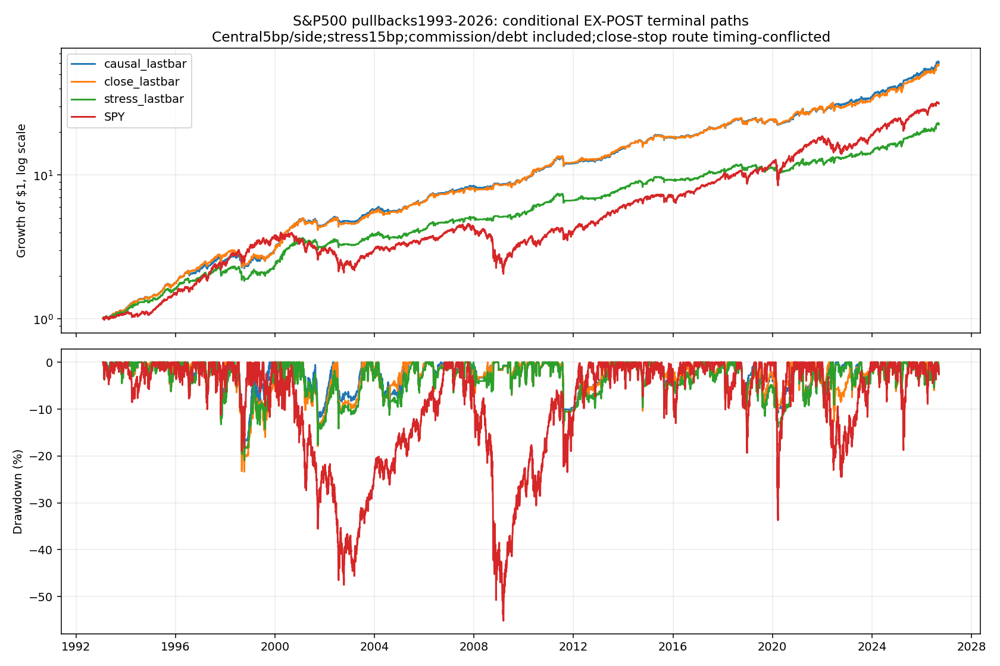
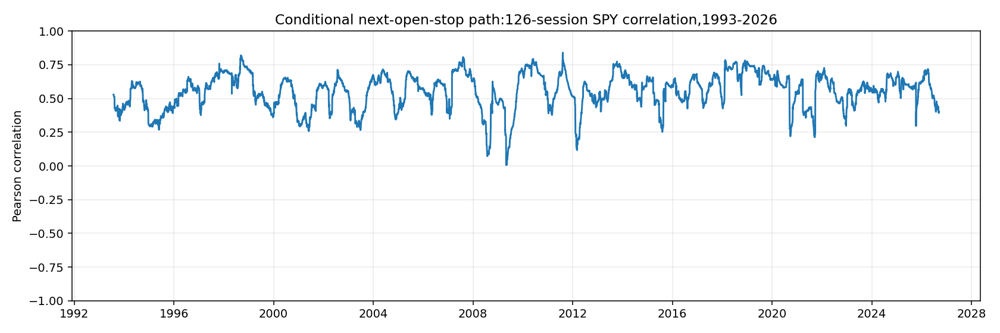

<!-- GENERATED FILE. EDIT THE CANONICAL KNOWLEDGE RECORD. -->

# TradeQuantiX S&P500 momentum pullback: promising conditional evidence, no promotion

!!! warning "Research-only"
    This page summarizes saved research evidence. It does not authorize LIVE, allocation, or deployment.

## TL;DR

> **Verdict:** Conditional promising component, diagnostic/inconclusive; no promotion. Next-open stops and prior-close slots preserve positive results, including467 post-publication sessions. Primary terminal economics remain unverified, sourcezero-window/buildparity unresolved, exposure-matched family intervals includezero andrecorded demand reaches7.51%ADV63.

> **Status:** `diagnostic`

> **Disposition:** `inconclusive`

> **Replication:** `timing_conflicted`

## Research question

Test final Part2 momentum pullback under next-open stop execution, prior-close entry reservations, costs andfixed later-source controls.

## Exact setup

| Field | Value |
| --- | --- |
| Signal family | momentum_pullback_mean_reversion |
| Universe | ["USA historical S&P500,PIT1301stocks;USD"] |
| Decision | CompletedCloseT setup/rank/quantity andstrictprior-close vacant-slot reservations; no heldnames selected. |
| Fill | Advance next-session buy limit; entryday target basedonOrderLimit, lateractualentryprice; prior-stop breach observedCloseD -> unconditional firstavailableOpenD+1. Sourceclose/opening-slot variantsdiagnostic. |
| Primary cost layer | central_research |
| Last reviewed | 2026-09-13T18:23:07.891463+00:00 |

## Timing and overnight attribution

```text
information available: CompletedCloseT setup/rank/quantity andstrictprior-close vacant-slot reservations; no heldnames selected.
primary executable fill: Advance next-session buy limit; entryday target basedonOrderLimit, lateractualentryprice; prior-stop breach observedCloseD -> unconditional firstavailableOpenD+1. Sourceclose/opening-slot variantsdiagnostic.
```

If final `Close_T` data formed the signal, a hypothetical `Close_T` entry is diagnostic only unless a separate pre-close protocol was modeled. Comparing that diagnostic with `Open_(T+1)` and applying the compounded return identity shows whether the apparent edge occurred in the overnight gap. Missing attribution numbers mean **not tested**, not zero.

| Attribution field | Value |
| --- | --- |
| Status | tested |
| Diagnostic Path | Samequeued-exitquantity at completedtriggerClose |
| Executable Path | Firstavailable nextOpen ofthe sameexitquantity |
| Method | Signeddelta_q*(Open-Close_trigger),knownsplitconsistent;EXPOSTexcluded. Wholepathclose/nextopencontrols reportedseparately. |
| Headline Result | 1589conditionalcentralqueuedstops;aggregate nextopenprice advantage159565USD,about7.40bp oftheir215.75mUSDreference turnover. Notadditionalstrategyreturn orguaranteedgapbenefit. |
| Metrics | {"interpretation": "Positive signed q*(actual-reference) is worse. Queued stops compare identicalexitquantity triggerClose toactualnextavailableOpen. Allfill totals are fill-conditioned,not alternateportfolio alpha.", "intraday_dollars": -17845726.90019451, "name": "causal_lastbar", "ordinary_fills": 9895, "overnight_dollars": -9967822.059654403, "queued_stop_fills": 1589, "queued_stop_gap_dollars": -159564.92508557567, "queued_stop_notional": 215748749.822933, "terminal_fills": 11, "total_timing_dollars": -27813548.95984891} |
| Artifact | C:/Users/User/Documents/workspace/pakal/pakal-research/reports/tradequantix_momentum_pullback_study/tables/timing_summary.csv |

## Primary metrics

| Metric | Value |
| --- | ---: |
| Period | 2019-01-01:2024-10-28 primary_nextopen_carry;unverifiedterminalclaims |
| Universe | HistoricalPITS&P500 |
| Cost Layer | central_research |
| Cagr | N/A |
| Annualized Volatility | N/A |
| Sharpe | N/A |
| Maximum Drawdown | N/A |
| Turnover | N/A |

## Four separate verdicts

| Question | Conclusion |
| --- | --- |
| Source Replication | Named source-close/opening-replenishment diagnostics only; final-auction stop conflict andunknownHHVzero/buildparity remain. |
| Predictive Value | Positive conditional low-exposure component; next-open stop survives, andnoentrydaytarget doesnotdestroyresults. Longer/fewer-slot/deeper/SMAcontrols notuniformlysuperior. |
| Economic Value | Primary metrics unavailable. Conditional2019-2024Oct central9.82%CAGR/.94Sharpe/-10.78%DD vsSPY17.41%/.90/-33.72%;467sessionlater47.25%total vs33.15%. |
| Promotion | No promotion; fixdatedsettlement,sourceexecution andcapacityevidence; familyintervalsincludezero andlaterwindowunder2years. |

## Key findings

| Feature | Role | Direction | Status | Effect | Action |
| --- | --- | --- | --- | --- | --- |
| ROC150 | entry_and_rank | Conditionalpositive;noeconomicpromotion | diagnostic | N/A | Retainliteralrulesandrepairsettlement/executionbefore furtherresearchselection |
| RSI3_ADX10 | entry | Conditionalpositive;noeconomicpromotion | diagnostic | N/A | Retainliteralrulesandrepairsettlement/executionbefore furtherresearchselection |
| prior_close_slots | execution | Conditionalpositive;noeconomicpromotion | diagnostic | N/A | Retainliteralrulesandrepairsettlement/executionbefore furtherresearchselection |
| next_open_stop | exit_timing | Conditionalpositive;noeconomicpromotion | diagnostic | N/A | Retainliteralrulesandrepairsettlement/executionbefore furtherresearchselection |
| entryday_target_zero_window | diagnostic | Conditionalpositive;noeconomicpromotion | diagnostic | N/A | Retainliteralrulesandrepairsettlement/executionbefore furtherresearchselection |
| later_source_deeper_longer_five_slots_SMA | diagnostic | Conditionalpositive;noeconomicpromotion | diagnostic | N/A | Retainliteralrulesandrepairsettlement/executionbefore furtherresearchselection |

## Visual evidence






## Limitations

- Primary FFB/PET claims45,565.50USD,peak19.1932%NAV,end1.223685%;two slots unresolvedfor decades.
- No exactRealTestHHVzero/age/rounding/TA-Lib/buildparity; disablingentrydaystop isexplicittranslation, prioroffsetcontrolseparate.
- Sourceclosingstop andopeningexitfreedslot followedbysameopeninggapbuy lackexecutionproof.
- Dailycandle targetpath andfullfills remainassumptions;sourceFillPrice/slippage feedback notcashfrictionparity.
- Reported19683sourcejointcells plusunknownadaptivework;467postpublication sessionsunder2years andrelatedcorpushistoryseen.
- Capacityledger omitsunexecutedpendingstop/timeanduntriggeredclosingstopbrackets;selectedrecords max7.51%ADV;noimpactcalibration orAUMceiling.
- EX_POSTlastbar includesactiveglobalendpointandcancloseentryday;notdatedsettlement.
- 1998 conditionalcentral DD19.54% andnegativeyear illustrate regime/tailrisk.
- Closedtradecashflows excludeseparatedividends/debtallocation;notnetexpectancy.

## Next gates

- ReconcileFFB/PET datedcash/acquirersharemergers forprimaryeconomicpath.
- Validatezero-window andentrydaytarget/order routing withlicenseddeclaredruntime andintradaydata.
- Verifygrosssame-namedemand, auction/limitdepth andcompleteoutstandingorderledger; thenfreezeimpactmodel.
- Continueuntouchedfutureconfirmation andportfolioincrementaltest onlyafteraccountingrepair; do notretune currentwinners.

## Sources

- `C:/Users/User/Documents/workspace/0_papers/TradeQuantiX_PDFs/TradeQuantiX_PDFs_WHITE/trading-system-investigation-series-388.pdf`
- `C:/Users/User/Documents/workspace/0_papers/TradeQuantiX_PDFs/TradeQuantiX_PDFs_WHITE/trading-system-investigation-series-02d.pdf`
- `C:/Users/User/Documents/workspace/0_papers/TradeQuantiX_PDFs/TradeQuantiX_PDFs_WHITE/trading-system-investigation-series-a19.pdf`

## Canonical artifacts

| Artifact | Pakal path |
| --- | --- |
| Concise Report | `C:/Users/User/Documents/workspace/pakal/pakal-research/reports/tradequantix_momentum_pullback_study/REPORT.md` |
| Full Report | `C:/Users/User/Documents/workspace/pakal/pakal-research/reports/tradequantix_momentum_pullback_study/REPORT_FULL.md` |
| Notebook | `C:/Users/User/Documents/workspace/pakal/pakal-research/reports/tradequantix_momentum_pullback_study/research.ipynb` |
| Frozen Specification | `C:/Users/User/Documents/workspace/pakal/pakal-research/reports/tradequantix_momentum_pullback_study/research_spec_frozen.json` |
| Manifest | `C:/Users/User/Documents/workspace/pakal/pakal-research/reports/tradequantix_momentum_pullback_study/run_manifest.json` |
| Primary Source Code | `["C:/Users/User/Documents/workspace/pakal/pakal-research/tradequantix_pullback_engine.py", "C:/Users/User/Documents/workspace/pakal/pakal-research/tradequantix_pullback_features.py", "C:/Users/User/Documents/workspace/pakal/pakal-research/tradequantix_pullback_data.py", "C:/Users/User/Documents/workspace/pakal/pakal-research/tradequantix_pullback_run.py"]` |
| Primary Tables | `["C:/Users/User/Documents/workspace/pakal/pakal-research/reports/tradequantix_momentum_pullback_study/tables/period_metrics.csv", "C:/Users/User/Documents/workspace/pakal/pakal-research/reports/tradequantix_momentum_pullback_study/tables/timing_summary.csv", "C:/Users/User/Documents/workspace/pakal/pakal-research/reports/tradequantix_momentum_pullback_study/tables/capacity_summary.csv", "C:/Users/User/Documents/workspace/pakal/pakal-research/reports/tradequantix_momentum_pullback_study/tables/bootstrap_descriptive.csv"]` |
| Primary Charts | `["C:/Users/User/Documents/workspace/pakal/pakal-research/reports/tradequantix_momentum_pullback_study/charts/equity_drawdown.png", "C:/Users/User/Documents/workspace/pakal/pakal-research/reports/tradequantix_momentum_pullback_study/charts/rolling_correlation.png", "C:/Users/User/Documents/workspace/pakal/pakal-research/reports/tradequantix_momentum_pullback_study/charts/stale_accounting.png"]` |
| Research State | `C:/Users/User/Documents/workspace/pakal/pakal-research/reports/tradequantix_momentum_pullback_study/research_state.json` |
| Hypothesis Registry | `C:/Users/User/Documents/workspace/pakal/pakal-research/reports/tradequantix_momentum_pullback_study/hypothesis_registry.json` |
| Experiment Ledger | `C:/Users/User/Documents/workspace/pakal/pakal-research/reports/tradequantix_momentum_pullback_study/experiment_ledger.jsonl` |
| Decision Log | `C:/Users/User/Documents/workspace/pakal/pakal-research/reports/tradequantix_momentum_pullback_study/decision_log.jsonl` |
| Source Rule Map | `C:/Users/User/Documents/workspace/pakal/pakal-research/reports/tradequantix_momentum_pullback_study/SOURCE_RULE_MAP.md` |
