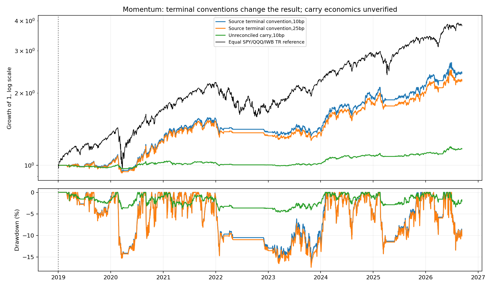
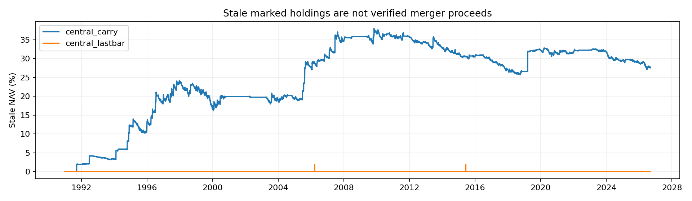

<!-- GENERATED FILE. EDIT THE CANONICAL KNOWLEDGE RECORD. -->

# TradeQuantiX corrected USA momentum: terminal economics unresolved

!!! warning "Research-only"
    This page summarizes saved research evidence. It does not authorize LIVE, allocation, or deployment.

## TL;DR

> **Verdict:** Inconclusive terminal economics; no promotion. Primary causal carry fails the stale-NAV gate. Positive source-lastbar returns require hindsight liquidation and do not establish executable alpha.

> **Status:** `diagnostic`

> **Disposition:** `inconclusive`

> **Replication:** `not_reproducible`

## Research question

Test corrected three-sleeve momentum under causal timing, PIT membership, costs and terminal accounting.

## Exact setup

| Field | Value |
| --- | --- |
| Signal family | volatility_normalized_equity_momentum |
| Universe | ["USA PIT S&P100", "USA PIT Russell1000", "USA PIT Nasdaq100"] |
| Decision | Observed Close_T; monthly entry/resize/eligibility, daily negative-momentum exit |
| Fill | Open_T+1 for ordinary targets. EX_POST last-file-bar close is separately labeled diagnostic. |
| Primary cost layer | central_research |
| Last reviewed | 2026-09-13T16:09:42.358957+00:00 |

## Timing and overnight attribution

```text
information available: Observed Close_T; monthly entry/resize/eligibility, daily negative-momentum exit
primary executable fill: Open_T+1 for ordinary targets. EX_POST last-file-bar close is separately labeled diagnostic.
```

If final `Close_T` data formed the signal, a hypothetical `Close_T` entry is diagnostic only unless a separate pre-close protocol was modeled. Comparing that diagnostic with `Open_(T+1)` and applying the compounded return identity shows whether the apparent edge occurred in the overnight gap. Missing attribution numbers mean **not tested**, not zero.

| Attribution field | Value |
| --- | --- |
| Status | diagnostic |
| Diagnostic Path | Decision close prices for same ordinary filled share changes |
| Executable Path | Actual next-open proxies for same share changes |
| Method | Signed quantity times split-consistent open-minus-decision-close; excludes ex-post terminal tickets |
| Headline Result | Conditional central ordinary opening gap 3.63bp of turnover; not alternative-portfolio return |
| Metrics | {"attribution": "Same actual ordinary quantities; prior-close versus next-open prices. Ex-post terminal tickets excluded.", "gap_bps": 3.626770918697942, "name": "central_lastbar", "ordinary_notional": 359297141.4666158, "ordinary_tickets": 13675, "signed_gap_dollars": 130308.84238424226, "terminal_notional": 6446569.138932988, "terminal_tickets": 120} |
| Unavailable Reason | No independent auction execution evidence; source already next-open |
| Artifact | C:/Users/User/Documents/workspace/pakal/pakal-research/reports/tradequantix_momentum_usa_study/tables/timing_attribution.csv |

## Primary metrics

| Metric | Value |
| --- | ---: |
| Period | 2019-2025; frozen primary central_carry, ECONOMICALLY INVALID stale marks |
| Universe | Three PIT USA stock sleeves |
| Cost Layer | central_research |
| Cagr | N/A |
| Annualized Volatility | N/A |
| Sharpe | N/A |
| Maximum Drawdown | N/A |
| Turnover | N/A |

## Four separate verdicts

| Question | Conclusion |
| --- | --- |
| Source Replication | Rules reconstructed; numerical source charts absent and terminal/internal fee parity unresolved |
| Predictive Value | Not established; eight mechanism controls pruned by predeclared data gate |
| Economic Value | Primary carry invalid:28.95% stale NAV at2025. Conditional lastbar11.35%CAGR versus18.97%ETF reference, with smaller drawdown |
| Promotion | No promotion; dated corporate-action settlement required |

## Key findings

| Feature | Role | Direction | Status | Effect | Action |
| --- | --- | --- | --- | --- | --- |
| normalized_momentum | rank | Unisolated; planned ablation pruned | diagnostic | N/A | Repair terminal ledger before frozen ablation tests |
| tanh_strength | sizing | Unisolated; planned ablation pruned | diagnostic | N/A | Repair terminal ledger before frozen ablation tests |
| indexSMA200 | eligibility | Unisolated; planned ablation pruned | diagnostic | N/A | Repair terminal ledger before frozen ablation tests |
| vol5_25_100 | sizing | Unisolated; planned ablation pruned | diagnostic | N/A | Repair terminal ledger before frozen ablation tests |
| rank15_20_deadband10 | turnover | Unisolated; planned ablation pruned | diagnostic | N/A | Repair terminal ledger before frozen ablation tests |
| PIT_breadth | source_correction | Unisolated; planned ablation pruned | diagnostic | N/A | Repair terminal ledger before frozen ablation tests |

## Visual evidence






## Limitations

- Primary carry has28.95% stale NAV at2025 and27.65% atfinal; no dated terminal settlement ledger
- Lastbar path uses hindsight liquidation and45active endpoint tickets
- Source numerical charts absent; internal DynamicSizing fee-leg parity unresolved
- Source-seen history;120session later sample insufficient and not globally untouched
- IWB two missing2000sessions prevent complete early ETF comparisons
- Daily open proxies; actual auction prints,partial fills and impact not established
- Cashyield0; currently observed vendor membership/action revisions not original vintages

## Next gates

- Obtain dated merger/delisting cash and acquirer-share entitlements and executable disposition
- Reconcile frozen primary before reopening eight pruned mechanism controls
- Require independent long history and actual auction/capacity evidence before promotion

## Sources

- `Source29 portfolio-development-series-part-28e.pdf`
- `Source34 portfolio-development-series-part-bfd.pdf`
- `https://mhptrading.com/docs/topics/idh-topic1390.htm`
- `https://mhptrading.com/docs/topics/idh-topic1340.htm`

## Canonical artifacts

| Artifact | Pakal path |
| --- | --- |
| Concise Report | `C:/Users/User/Documents/workspace/pakal/pakal-research/reports/tradequantix_momentum_usa_study/REPORT.md` |
| Full Report | `C:/Users/User/Documents/workspace/pakal/pakal-research/reports/tradequantix_momentum_usa_study/REPORT_FULL.md` |
| Notebook | `C:/Users/User/Documents/workspace/pakal/pakal-research/reports/tradequantix_momentum_usa_study/research.ipynb` |
| Frozen Specification | `C:/Users/User/Documents/workspace/pakal/pakal-research/reports/tradequantix_momentum_usa_study/research_spec_frozen.json` |
| Manifest | `C:/Users/User/Documents/workspace/pakal/pakal-research/reports/tradequantix_momentum_usa_study/run_manifest.json` |
| Primary Source Code | `["C:/Users/User/Documents/workspace/pakal/pakal-research/tradequantix_momentum_engine.py", "C:/Users/User/Documents/workspace/pakal/pakal-research/tradequantix_momentum_features.py", "C:/Users/User/Documents/workspace/pakal/pakal-research/tradequantix_momentum_run.py", "C:/Users/User/Documents/workspace/pakal/pakal-research/tradequantix_momentum_data.py"]` |
| Primary Tables | `["C:/Users/User/Documents/workspace/pakal/pakal-research/reports/tradequantix_momentum_usa_study/tables/period_metrics.csv", "C:/Users/User/Documents/workspace/pakal/pakal-research/reports/tradequantix_momentum_usa_study/tables/submitted_participation.csv", "C:/Users/User/Documents/workspace/pakal/pakal-research/reports/tradequantix_momentum_usa_study/tables/timing_attribution.csv"]` |
| Primary Charts | `["C:/Users/User/Documents/workspace/pakal/pakal-research/reports/tradequantix_momentum_usa_study/charts/equity_drawdown.png", "C:/Users/User/Documents/workspace/pakal/pakal-research/reports/tradequantix_momentum_usa_study/charts/stale_accounting.png"]` |
| Research State | `C:/Users/User/Documents/workspace/pakal/pakal-research/reports/tradequantix_momentum_usa_study/research_state.json` |
| Hypothesis Registry | `C:/Users/User/Documents/workspace/pakal/pakal-research/reports/tradequantix_momentum_usa_study/hypothesis_registry.json` |
| Experiment Ledger | `C:/Users/User/Documents/workspace/pakal/pakal-research/reports/tradequantix_momentum_usa_study/experiment_ledger.jsonl` |
| Decision Log | `C:/Users/User/Documents/workspace/pakal/pakal-research/reports/tradequantix_momentum_usa_study/decision_log.jsonl` |
| Source Rule Map | `C:/Users/User/Documents/workspace/pakal/pakal-research/reports/tradequantix_momentum_usa_study/SOURCE_RULE_MAP.md` |
