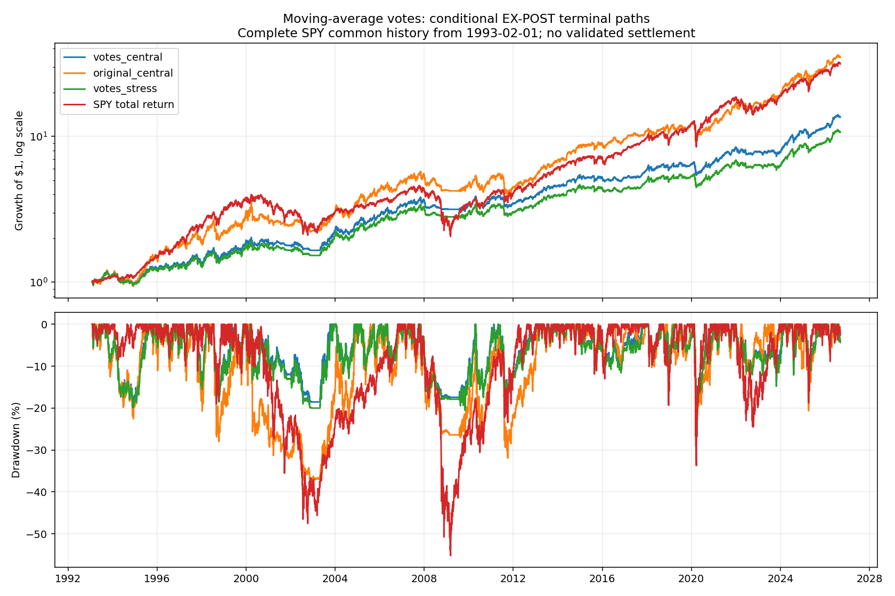
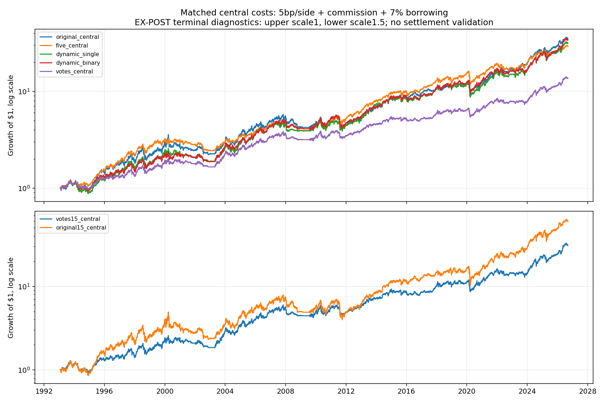

<!-- GENERATED FILE. EDIT THE CANONICAL KNOWLEDGE RECORD. -->

# TradeQuantiX moving-average votes: conditional risk reduction, unresolved terminal economics

!!! warning "Research-only"
    This page summarizes saved research evidence. It does not authorize LIVE, allocation, or deployment.

## TL;DR

> **Verdict:** Diagnostic/inconclusive; no promotion. Primary vote carry economics unavailable because unresolved delisting/merger rights consume slots and stale NAV. Conditional EXPOST votes lower exposure and drawdown but fail to establish a robust improvement over matched original and weekly single-pair controls. Exact source curve and runtime lot parity unavailable.

> **Status:** `diagnostic`

> **Disposition:** `inconclusive`

> **Replication:** `not_reproducible`

## Research question

Separate the source vote effect from weekly resizing, five-sleeve diversification, reduced costs and leverage.

## Exact setup

| Field | Value |
| --- | --- |
| Signal family | OEX_log_moving_average_vote_trend |
| Universe | ["USA historical OEX membership;242 current and past stocks;USD"] |
| Decision | Completed CloseT; prior-close slots; five log-SMA votes; daily25% close stop and scheduled weekly target changes >5%. |
| Fill | Following raw open; reductions before increases; DAY new entries, persistent held requests; EXPOST terminal controls explicitly noncausal. |
| Primary cost layer | central_research |
| Last reviewed | 2026-09-13T20:04:14.972192+00:00 |

## Timing and overnight attribution

```text
information available: Completed CloseT; prior-close slots; five log-SMA votes; daily25% close stop and scheduled weekly target changes >5%.
primary executable fill: Following raw open; reductions before increases; DAY new entries, persistent held requests; EXPOST terminal controls explicitly noncausal.
```

If final `Close_T` data formed the signal, a hypothetical `Close_T` entry is diagnostic only unless a separate pre-close protocol was modeled. Comparing that diagnostic with `Open_(T+1)` and applying the compounded return identity shows whether the apparent edge occurred in the overnight gap. Missing attribution numbers mean **not tested**, not zero.

| Attribution field | Value |
| --- | --- |
| Status | tested |
| Diagnostic Path | Same signed filled order at split-consistent decision CloseT |
| Executable Path | Same signed order at following observed raw open |
| Method | Signed quantity*(Open-decisionClose); all ordinary filled instructions, no alternative portfolio. |
| Headline Result | Conditional votes signed overnight cost -26173.07USD across 8492 ordinary fills; positive is worse than reference. |
| Metrics | {"commission": 15106.078046819435, "friction": 45553.76527674882, "interpretation": "All ordinary fills at raw open. Positive signed q*(Open-split-consistent decisionClose) is worse than the same signed order at reference close. Includes only filled instructions; no intraday profit, alternative portfolio or alpha claim.", "kind": "all", "name": "votes_central", "ordinary_fills": 8492, "overnight_dollars": -26173.070693833783, "reference_notional": 91110480.0868224, "terminal_fills": 23, "total_timing_dollars": -26173.070693833783} |
| Artifact | C:/Users/User/Documents/workspace/pakal/pakal-research/reports/tradequantix_moving_average_vote_study/tables/timing_summary.csv |

## Primary metrics

| Metric | Value |
| --- | ---: |
| Period | 2020-01-01:2025-06-23 |
| Universe | Historical OEX |
| Cost Layer | central_research |
| Cagr | N/A |
| Annualized Volatility | N/A |
| Sharpe | N/A |
| Maximum Drawdown | N/A |
| Turnover | N/A |

## Four separate verdicts

| Question | Conclusion |
| --- | --- |
| Source Replication | Full source read; author curves/dates absent and dynamic internal-lot parity unproved. |
| Predictive Value | Conditional votes reduce exposure and drawdown; robust standalone improvement over simpler matched controls not established. |
| Economic Value | Primary economic metrics unavailable: stale claims occupy slots. Lastbar diagnostic assumes hindsight liquidation, not verified settlement. |
| Promotion | No operational promotion; repair entitlements and runtime parity first. |

## Key findings

| Feature | Role | Direction | Status | Effect | Action |
| --- | --- | --- | --- | --- | --- |
| log_SMA_vote | sizing | Conditional; no promoted winner | diagnostic | N/A | Resolve rights and runtime parity before economic promotion |
| weekly_resize | portfolio_construction | Conditional; no promoted winner | diagnostic | N/A | Resolve rights and runtime parity before economic promotion |
| five_sleeves | portfolio_construction | Conditional; no promoted winner | diagnostic | N/A | Resolve rights and runtime parity before economic promotion |
| inverse_dollar_rank | rank | Conditional; no promoted winner | diagnostic | N/A | Resolve rights and runtime parity before economic promotion |
| scale_and_costs | risk_overlay | Conditional; no promoted winner | diagnostic | N/A | Resolve rights and runtime parity before economic promotion |
| terminal_claims | data | Conditional; no promoted winner | diagnostic | N/A | Resolve rights and runtime parity before economic promotion |

## Visual evidence






## Limitations

- Author plots and exact end dates missing; two minimally repaired clipped parentheses; prior source search unknown.
- Primary unresolved claims and slot blockage make economic performance unavailable.
- EXPOST lastbar cash is diagnostic hindsight, not actual settlement.
- Dynamic aggregate episode peak and aggregate-ticket fees not exact RealTest internal-lot parity.
- No hard cash cap; source leverage and lower slippage confound ensemble claim.
- Dividend cash-credit dates and capital-equivalent adjustment factors are not complete rights/payment ledgers.
- Confirmation below two years; prior related corpus seen, multiple-testing tails unstable.
- Persistent accepted orders retain initial intended date; no calibrated impact or partial-fill evidence.

## Next gates

- Reconstruct causal terminal entitlements, proceeds, successor shares and slot release.
- Validate dynamic internal-lot stop age, partial sales, rounding and commission parity.
- Preserve fixed rules for genuinely new history after current endpoint; do not tune the revealed holdouts.

## Sources

- `C:/Users/User/Documents/workspace/0_papers/TradeQuantiX_PDFs/TradeQuantiX_PDFs_WHITE/conquering-curve-fitting-a-game-changing.pdf`

## Canonical artifacts

| Artifact | Pakal path |
| --- | --- |
| Concise Report | `C:/Users/User/Documents/workspace/pakal/pakal-research/reports/tradequantix_moving_average_vote_study/REPORT.md` |
| Full Report | `C:/Users/User/Documents/workspace/pakal/pakal-research/reports/tradequantix_moving_average_vote_study/REPORT_FULL.md` |
| Notebook | `C:/Users/User/Documents/workspace/pakal/pakal-research/reports/tradequantix_moving_average_vote_study/research.ipynb` |
| Frozen Specification | `C:/Users/User/Documents/workspace/pakal/pakal-research/reports/tradequantix_moving_average_vote_study/research_spec_frozen.json` |
| Manifest | `C:/Users/User/Documents/workspace/pakal/pakal-research/reports/tradequantix_moving_average_vote_study/run_manifest.json` |
| Primary Source Code | `["C:/Users/User/Documents/workspace/pakal/pakal-research/tradequantix_vote_engine.py", "C:/Users/User/Documents/workspace/pakal/pakal-research/tradequantix_vote_features.py", "C:/Users/User/Documents/workspace/pakal/pakal-research/tradequantix_vote_calendar.py", "C:/Users/User/Documents/workspace/pakal/pakal-research/tradequantix_vote_run.py"]` |
| Primary Tables | `["C:/Users/User/Documents/workspace/pakal/pakal-research/reports/tradequantix_moving_average_vote_study/tables/period_metrics.csv", "C:/Users/User/Documents/workspace/pakal/pakal-research/reports/tradequantix_moving_average_vote_study/tables/bootstrap_descriptive.csv", "C:/Users/User/Documents/workspace/pakal/pakal-research/reports/tradequantix_moving_average_vote_study/tables/capacity_summary.csv", "C:/Users/User/Documents/workspace/pakal/pakal-research/reports/tradequantix_moving_average_vote_study/tables/timing_summary.csv"]` |
| Primary Charts | `["C:/Users/User/Documents/workspace/pakal/pakal-research/reports/tradequantix_moving_average_vote_study/charts/equity_drawdown.png", "C:/Users/User/Documents/workspace/pakal/pakal-research/reports/tradequantix_moving_average_vote_study/charts/matched_comparison.png", "C:/Users/User/Documents/workspace/pakal/pakal-research/reports/tradequantix_moving_average_vote_study/charts/rolling_correlation.png", "C:/Users/User/Documents/workspace/pakal/pakal-research/reports/tradequantix_moving_average_vote_study/charts/stale_accounting.png"]` |
| Research State | `C:/Users/User/Documents/workspace/pakal/pakal-research/reports/tradequantix_moving_average_vote_study/research_state.json` |
| Hypothesis Registry | `C:/Users/User/Documents/workspace/pakal/pakal-research/reports/tradequantix_moving_average_vote_study/hypothesis_registry.json` |
| Experiment Ledger | `C:/Users/User/Documents/workspace/pakal/pakal-research/reports/tradequantix_moving_average_vote_study/experiment_ledger.jsonl` |
| Decision Log | `C:/Users/User/Documents/workspace/pakal/pakal-research/reports/tradequantix_moving_average_vote_study/decision_log.jsonl` |
| Source Rule Map | `C:/Users/User/Documents/workspace/pakal/pakal-research/reports/tradequantix_moving_average_vote_study/SOURCE_RULE_MAP.md` |
