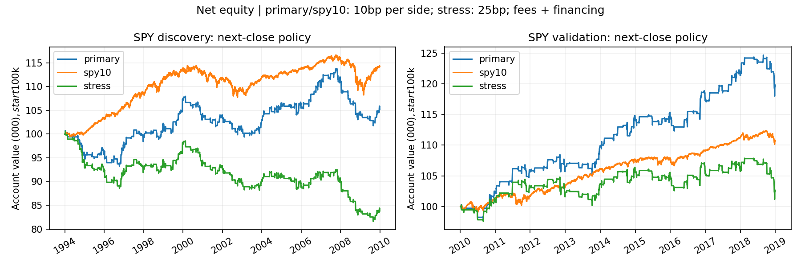

<!-- GENERATED FILE. EDIT THE CANONICAL KNOWLEDGE RECORD. -->

# עונתיות SPY לפני חגים — פרשנות ציבורית

!!! warning "Research-only"
    This page summarizes saved research evidence. It does not authorize LIVE, allocation, or deployment.

## TL;DR

> **Verdict:** הפרשנות לחגים אינה מקודמת: תוצאה חיובית ב־2010–2018, אך חלשה ורגישה לעלות ב־1994–2009, ויחס התשואה לסיכון נכשל מול ההשוואה בשתי התקופות.

> **Status:** `diagnostic`

> **Disposition:** `rejected`

> **Replication:** `not_reproducible`

## Research question

Does a public-calendar SPY pre-federal-holiday interpretation add stable net return per unit of risk versus a predeclared 10% SPY/cash comparator?

## Exact setup

| Field | Value |
| --- | --- |
| Signal family | holiday_seasonality |
| Universe | ["SPY US-listed ETF / NYSE Arca"] |
| Decision | 20:00 New York on calendar D, using Close<=D |
| Fill | Future observed Close; entry expiry, persistent exit intent |
| Primary cost layer | central_research |
| Last reviewed | 2026-09-14T22:13:04.537059+00:00 |

## Timing and overnight attribution

```text
information available: 20:00 New York on calendar D, using Close<=D
primary executable fill: Future observed Close; entry expiry, persistent exit intent
```

If final `Close_T` data formed the signal, a hypothetical `Close_T` entry is diagnostic only unless a separate pre-close protocol was modeled. Comparing that diagnostic with `Open_(T+1)` and applying the compounded return identity shows whether the apparent edge occurred in the overnight gap. Missing attribution numbers mean **not tested**, not zero.

| Attribution field | Value |
| --- | --- |
| Status | tested |
| Diagnostic Path | previousClose to same primary lot exit |
| Executable Path | nextOpen to same primary lot exit |
| Method | Exact gross fixed-lot multiplicative decomposition; nextClose strategy versus entry-open sensitivity separately |
| Headline Result | Entry-open account sensitivity does not rescue the frozen gate. |
| Metrics | [{"entry_session_intraday": -0.0006469503727725, "nextclose_to_exit": 0.0011008687651528, "nextopen_to_same_exit": 0.0004381445070221, "omitted_entry_overnight": 0.0008205175741694, "phase": "discovery", "previousclose_to_exit": 0.0012734418591875}, {"entry_session_intraday": 3.960533660658856e-05, "nextclose_to_exit": 0.0047833528145586, "nextopen_to_same_exit": 0.004835854493343, "omitted_entry_overnight": 9.098875547885588e-05, "phase": "validation", "previousclose_to_exit": 0.0049215440464925}] |
| Artifact | C:\\Users\\User\\Documents\\workspace\\pakal\\pakal-research\\reports\\tradequantix_preholiday_interpretation_study\\tables\\PRIMARY_LOTS_ATTRIBUTION.csv |

## Primary metrics

| Metric | Value |
| --- | ---: |
| Period | 2010-01-04/2018-12-31; discovery1994-2009 separately; confirmationnotopened |
| Universe | SPY |
| Cost Layer | central_research |
| Cagr | 2.03% |
| Annualized Volatility | 2.69% |
| Sharpe | 0.761 |
| Maximum Drawdown | -5.37% |
| Turnover | 1145.03% |

## Four separate verdicts

| Question | Conclusion |
| --- | --- |
| Source Replication | Author calendar/defaults absent; explicit internal interpretation only. |
| Predictive Value | Regime-dependent; primary corrected HAC alpha not significant; source already saw history. |
| Economic Value | 2010-2018 positive, but discovery weak/stress negative and Sharpe gate fails both. |
| Promotion | No promotion; confirmation and UPRO not evaluated. |

## Key findings

| Feature | Role | Direction | Status | Effect | Action |
| --- | --- | --- | --- | --- | --- |
| preholiday calendar distance | signal | long before federal holidays | diagnostic | Primary CAGR0.32%discovery/2.03%validation | Do not promote tested primary |

## Visual evidence




## Limitations

- Author calendar and execution/account defaults unavailable. Literal replication not_reproducible. User authorized an internal public-calendar interpretation without author code.
- Prior complete source review covered all 51 pages and code images pp34-50; preserved source contract is reused, not a claim of rereading every page this turn.
- Author saw 1993-2026 and tried at least 10 entry offsets, 20 bins, 11 holiday subsets, 3 vectors, 1000 random simulations, and 2 assets; total author search unknown. Broad program already viewed related US history. Chronological slices are not fully untouched discovery.
- One-trade-per-holiday/tranche guard, persistent exit intent, observed-date events, daily decision clock, raw-price accounting, integer quantities, global entry headroom and cash rules are internal choices.
- 1.5 entry headroom uses decision prices before fees. Realized gross can exceed 1.5; no modeled maintenance-margin liquidation.
- Data are current-vintage Norgate, not archived decision-time snapshots. SPY alone has no membership-selection problem but is chosen retrospectively as a surviving liquid ETF.
- Positive Dividend on pre-ex vendor row accrues only next observed session. Every raw total distribution is treated as cash. Ordinary-only sensitivity excludes two residual events (1996 and 2004); taxonomy and all actual historical pay dates are not independently verified.
- Following-month last NYSE session models cash pay. SEC 2006 SPDR prospectus supports quarterly next-month pay and a Nov15 2004 special ex-date with Dec2 payment; application across all history is an assumption.
- Zero cash yield and taxes excluded; 7% constant debt financing is an assumption. SPY raw/CAP equality supports no split transformation in this sample; engine is not a generic corporate-action engine.
- Observed official-looking daily OHLC and aggregate volume are not auction fills, broker cutoff, partial-fill, impact or capacity proof.
- UPRO source volatility multiplier is ambiguous (2.5 versus 3). No UPRO result in this SPY study. If SPY fails locked economic gate, stop leveraged extension; if it passes, a separate pre-result extension contract is required.
- No leverage, allocation, production or real-money trading authorization follows from this research.

## Next gates

- No next backtest on the closed confirmation under failed gate; new mechanism requires separate frozen future hypothesis.

## Sources

- `{"location": "C:\\\\Users\\\\User\\\\Documents\\\\workspace\\\\0_papers\\\\TradeQuantiX_PDFs\\\\TradeQuantiX_PDFs_WHITE\\\\market-effect-research-holiday-seasonality.pdf", "prior_read_evidence": {"bytes": 7602, "path": "C:/Users/User/Documents/workspace/pakal/pakal-research/reports/tradequantix_preholiday_study/source_contract.json", "sha256": "c3244ecd435d53e3d138f9aeccd508c52d4d516eefa4a31f56ad05ef8ca70efd"}, "read_complete": true, "role": "literal rules with explicit gaps", "sha256": "bd85ee7349412bc681e3720e6042742d18b49c114ea63485b2f3b2555945cf6d", "source_id": "TQ20"}`

## Canonical artifacts

| Artifact | Pakal path |
| --- | --- |
| Concise Report | `C:\\Users\\User\\Documents\\workspace\\pakal\\pakal-research\\reports\\tradequantix_preholiday_interpretation_study\\REPORT.md` |
| Full Report | `C:\\Users\\User\\Documents\\workspace\\pakal\\pakal-research\\reports\\tradequantix_preholiday_interpretation_study\\REPORT_FULL.md` |
| Notebook | `C:\\Users\\User\\Documents\\workspace\\pakal\\pakal-research\\reports\\tradequantix_preholiday_interpretation_study\\F021_DECISION.ipynb` |
| Frozen Specification | `C:\\Users\\User\\Documents\\workspace\\pakal\\pakal-research\\reports\\tradequantix_preholiday_interpretation_study\\research_spec_frozen.json` |
| Manifest | `C:\\Users\\User\\Documents\\workspace\\pakal\\pakal-research\\reports\\tradequantix_preholiday_interpretation_study\\run_manifest.json` |
| Primary Source Code | `["C:\\\\Users\\\\User\\\\Documents\\\\workspace\\\\pakal\\\\pakal-research\\\\tradequantix_preholiday_engine.py"]` |
| Primary Tables | `["C:\\\\Users\\\\User\\\\Documents\\\\workspace\\\\pakal\\\\pakal-research\\\\reports\\\\tradequantix_preholiday_interpretation_study\\\\tables\\\\ALL_METRICS.csv"]` |
| Primary Charts | `["C:\\\\Users\\\\User\\\\Documents\\\\workspace\\\\pakal\\\\pakal-research\\\\reports\\\\tradequantix_preholiday_interpretation_study\\\\charts\\\\equity.png"]` |
| Research State | `C:\\Users\\User\\Documents\\workspace\\pakal\\pakal-research\\reports\\tradequantix_preholiday_interpretation_study\\research_state.json` |
| Hypothesis Registry | `C:\\Users\\User\\Documents\\workspace\\pakal\\pakal-research\\reports\\tradequantix_preholiday_interpretation_study\\hypothesis_registry.json` |
| Experiment Ledger | `C:\\Users\\User\\Documents\\workspace\\pakal\\pakal-research\\reports\\tradequantix_preholiday_interpretation_study\\experiment_ledger.jsonl` |
| Decision Log | `C:\\Users\\User\\Documents\\workspace\\pakal\\pakal-research\\reports\\tradequantix_preholiday_interpretation_study\\decision_log.jsonl` |
| Source Rule Map | `C:\\Users\\User\\Documents\\workspace\\pakal\\pakal-research\\reports\\tradequantix_preholiday_interpretation_study\\SOURCE_RULE_MAP.md` |
