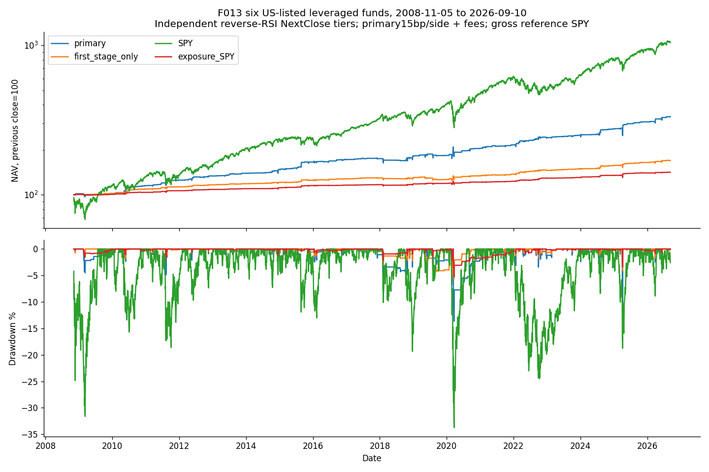

<!-- GENERATED FILE. EDIT THE CANONICAL KNOWLEDGE RECORD. -->

# Independent inverse-RSI closing-entry tiers

!!! warning "Research-only"
    This page summarizes saved research evidence. It does not authorize LIVE, allocation, or deployment.

## TL;DR

> **Verdict:** Declared six-fund independent RSI tier interpretation passes the frozen economic gate but remains diagnostic because auction/source/short-later evidence is incomplete.

> **Status:** `diagnostic`

> **Disposition:** `promising_component`

> **Replication:** `not_reproducible`

## Research question

Do independently funded reverse-RSI closing tiers retain net value under explicit missing-spacing policies and realistic cash restrictions?

## Exact setup

| Field | Value |
| --- | --- |
| Signal family | independent_rsi_tier_mean_reversion |
| Universe | ["SOXL,SPXL,TECL,TMF,TQQQ,UGL; six US-listed funds, three GBTC budgets unallocated"] |
| Decision | Completed CloseT, all limits/quantities/state frozen for D; opening split and liability checks only reduce instructions |
| Fill | NextClose DAY buy, C_D<=T-limit in D units |
| Primary cost layer | central_research |
| Last reviewed | 2026-09-14T18:10:26.437899+00:00 |

## Timing and overnight attribution

```text
information available: Completed CloseT, all limits/quantities/state frozen for D; opening split and liability checks only reduce instructions
primary executable fill: NextClose DAY buy, C_D<=T-limit in D units
```

If final `Close_T` data formed the signal, a hypothetical `Close_T` entry is diagnostic only unless a separate pre-close protocol was modeled. Comparing that diagnostic with `Open_(T+1)` and applying the compounded return identity shows whether the apparent edge occurred in the overnight gap. Missing attribution numbers mean **not tested**, not zero.

| Attribution field | Value |
| --- | --- |
| Status | not_tested |
| Diagnostic Path | Selection-conditioned pre-fill CloseT to CloseD identity only |
| Executable Path | No alternative nextOpen portfolio evaluated; source buys atNextClose |
| Method | Saved filled signed-share dollar decomposition, not causal open counterfactual |
| Headline Result | The day-before-fill movement is not earned strategy return |
| Metrics | {"after_open_dollars": -538373.951880455, "decision_to_close_dollars": -955600.4575741291, "fills": 1686, "identity_error_max": 0.0, "interpretation": "Pre-fill selected movement only, not earned return or open strategy", "opening_gap_dollars": -417226.5056936741} |
| Artifact | C:/Users/User/Documents/workspace/pakal/pakal-research/reports/tradequantix_rsi_tiers_interpretation_study/tables/same_quantity_timing.csv |

## Primary metrics

| Metric | Value |
| --- | ---: |
| Period | 2019-01-02:2026-04-02 |
| Universe | SOXL,SPXL,TECL,TMF,TQQQ,UGL; six US-listed funds, three GBTC budgets unallocated |
| Cost Layer | central_research |
| Cagr | 8.26% |
| Annualized Volatility | 12.12% |
| Sharpe | 0.714 |
| Maximum Drawdown | -13.62% |
| Turnover | 489.90% |

## Four separate verdicts

| Question | Conclusion |
| --- | --- |
| Source Replication | Unavailable exact source, explicit interpretation |
| Predictive Value | No pristine independent prediction claim; fixed survivor basket and short later period |
| Economic Value | Declared six-fund independent RSI tier interpretation passes the frozen economic gate but remains diagnostic because auction/source/short-later evidence is incomplete. |
| Promotion | Research-only diagnostic; no trading approval |

## Key findings

| Feature | Role | Direction | Status | Effect | Action |
| --- | --- | --- | --- | --- | --- |
| Inverse-RSI independent tiers with prior-high recovery | entry | Long dip buying | diagnostic | Validation CAGR0.082572, MDD-0.136236 | No trading implementation; preserve result and avoid same-history tuning |

## Visual evidence




## Limitations

- Four cap/floor tails and quantity/runtime details remain unavailable; internal formulas explicitly declared
- GBTC economics unresolved, three budgets remain cash
- Fixed author-selected survivors, current vendor vintage, unknown author parameter search
- Cache lacks currency/security name and stable before-after vintage proof; no invented metadata
- Entitlement cash proxy is not dividend payment-date liquidity evidence
- Auction cutoff, partial fills, venue acceptance and calibrated impact unproven
- Fractional split claims held without cash-in-lieu settlement model
- Short later window and related market studies already seen
- Prior-exposure SPY is not matched leverage, factors or trading costs
- Frozen gate failures: 

## Next gates

- New independently frozen evidence only; do not retune seen history

## Sources

- `{"content_id": "sha256:ff7aa17a0d5dc873837309212086161dd5b82b01d8a8e6637903fdb2d6ea44cc", "location": "C:/Users/User/Documents/workspace/0_papers/TradeQuantiX_PDFs/TradeQuantiX_PDFs_WHITE/etf-mean-reversion-methods-four-systems.pdf", "read_complete": true, "role": "System4; full read receipts and additional sources retained in original F013 intake", "source_id": "14"}`

## Canonical artifacts

| Artifact | Pakal path |
| --- | --- |
| Source Rule Map | `C:/Users/User/Documents/workspace/pakal/pakal-research/reports/tradequantix_rsi_tiers_interpretation_study/SOURCE_RULE_MAP.md` |
| Hypothesis Registry | `C:/Users/User/Documents/workspace/pakal/pakal-research/reports/tradequantix_rsi_tiers_interpretation_study/hypothesis_registry.json` |
| Experiment Ledger | `C:/Users/User/Documents/workspace/pakal/pakal-research/reports/tradequantix_rsi_tiers_interpretation_study/experiment_ledger.jsonl` |
| Decision Log | `C:/Users/User/Documents/workspace/pakal/pakal-research/reports/tradequantix_rsi_tiers_interpretation_study/decision_log.jsonl` |
| Frozen Specification | `C:/Users/User/Documents/workspace/pakal/pakal-research/reports/tradequantix_rsi_tiers_interpretation_study/research_spec_frozen.json` |
| Concise Report | `C:/Users/User/Documents/workspace/pakal/pakal-research/reports/tradequantix_rsi_tiers_interpretation_study/REPORT.md` |
| Full Report | `C:/Users/User/Documents/workspace/pakal/pakal-research/reports/tradequantix_rsi_tiers_interpretation_study/REPORT_FULL.md` |
| Knowledge Record | `C:/Users/User/Documents/workspace/pakal/pakal-research/reports/tradequantix_rsi_tiers_interpretation_study/knowledge_record.json` |
| Manifest | `C:/Users/User/Documents/workspace/pakal/pakal-research/reports/tradequantix_rsi_tiers_interpretation_study/run_manifest.json` |
| Research State | `C:/Users/User/Documents/workspace/pakal/pakal-research/reports/tradequantix_rsi_tiers_interpretation_study/research_state.json` |
| Notebook | `C:/Users/User/Documents/workspace/pakal/pakal-research/reports/tradequantix_rsi_tiers_interpretation_study/research.ipynb` |
| Primary Source Code | `["C:/Users/User/Documents/workspace/pakal/pakal-research/tradequantix_rsi_tiers_interpretation_engine.py"]` |
| Primary Tables | `["C:/Users/User/Documents/workspace/pakal/pakal-research/reports/tradequantix_rsi_tiers_interpretation_study/tables/period_metrics.csv"]` |
| Primary Charts | `["C:/Users/User/Documents/workspace/pakal/pakal-research/reports/tradequantix_rsi_tiers_interpretation_study/charts/equity_drawdown.png"]` |
