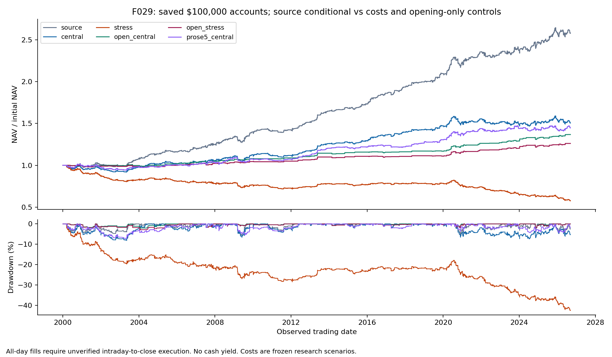
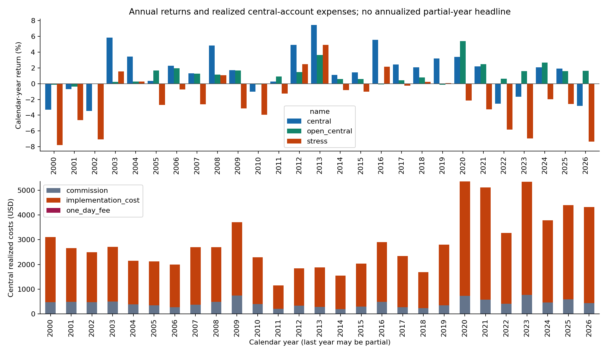

<!-- GENERATED FILE. EDIT THE CANONICAL KNOWLEDGE RECORD. -->

# US intraday short reversal: cost failure; sparse opening-only hypothesis

!!! warning "Research-only"
    This page summarizes saved research evidence. It does not authorize LIVE, allocation, or deployment.

## TL;DR

> **Verdict:** Reject current promotion of the all-day source translation: hard-friction validation fails and later central return is negative. Opening-only is a separate promising forward hypothesis, but its validation sample78 fails the frozen100trade gate; later20trades cannot rescue it. Conditional daily-bar fills, historical short eligibility and auction execution remain unverified.

> **Status:** `diagnostic`

> **Disposition:** `rejected`

> **Replication:** `timing_conflicted`

## Research question

Does the final R1000 short reversal retain economic value after realistic-cost sensitivity and causal entry-timing diagnostics?

## Exact setup

| Field | Value |
| --- | --- |
| Signal family | US_R1000_short_intraday_overextension |
| Universe | ["Russell1000 current-and-past with contemporaneous member_rui"] |
| Decision | CloseT observed features, prior-close rank/ten-slot reservation and equity sizing |
| Fill | NextD opening gap or conditional intraday short limit; coverDclose; separate opening-only hypothesis |
| Primary cost layer | central_research |
| Last reviewed | 2026-09-14T00:28:39.926511+00:00 |

## Timing and overnight attribution

```text
information available: CloseT observed features, prior-close rank/ten-slot reservation and equity sizing
primary executable fill: NextD opening gap or conditional intraday short limit; coverDclose; separate opening-only hypothesis
```

If final `Close_T` data formed the signal, a hypothetical `Close_T` entry is diagnostic only unless a separate pre-close protocol was modeled. Comparing that diagnostic with `Open_(T+1)` and applying the compounded return identity shows whether the apparent edge occurred in the overnight gap. Missing attribution numbers mean **not tested**, not zero.

| Attribution field | Value |
| --- | --- |
| Status | tested |
| Diagnostic Path | Tclose andDopen anchors to sameDclose conditional on future successful limitfill |
| Executable Path | Separate full opening-only account; auction/short eligibility conditional |
| Method | Split-consistent multiplicative overnight/intraday identity; price attribution separate from costed cash account |
| Headline Result | Full-day late fills may miss closing cutoff; independent opening-only account positive but sparse |
| Metrics | {"later_open_trades": 20, "validation_open_trades": 78} |
| Artifact | C:/Users/User/Documents/workspace/pakal/pakal-research/reports/tradequantix_short_daytrade_study/tables/final_analysis/timing_attribution.parquet |

## Primary metrics

| Metric | Value |
| --- | ---: |
| Period | 2019-01-01:2025-05-29 |
| Universe | PIT Russell1000; continuous100k-initial account |
| Cost Layer | central_research |
| Cagr | 1.04% |
| Annualized Volatility | 3.90% |
| Sharpe | 0.285 |
| Maximum Drawdown | -7.33% |
| Turnover | 2441.56% |

## Four separate verdicts

| Question | Conclusion |
| --- | --- |
| Source Replication | Literal final rules translated after documented arithmetic repair; exact source curve unavailable, daily close execution conditional |
| Predictive Value | Opening-only positive in fixed periods but validation78trades fails100minimum;20latertrades insufficient independent evidence |
| Economic Value | Hard-friction validation negative; later centralnegative; no portfolio value-add studied |
| Promotion | Reject current promotion; fixed opening-only forward hypothesis only |

## Key findings

| Feature | Role | Direction | Status | Effect | Action |
| --- | --- | --- | --- | --- | --- |
| ADX7_and_upcandle | entry | Strong positive daily move above4% andADX35 | diagnostic | N/A | Preserve fixed opening-only hypothesis; reject current trading promotion |
| ROC7 | ranking | Highest7barreturn first | diagnostic | N/A | Preserve fixed opening-only hypothesis; reject current trading promotion |
| H_plus_ATR7 | entry | Require further rise aboveT high | diagnostic | N/A | Preserve fixed opening-only hypothesis; reject current trading promotion |
| vol20_10_3 | sizing | 5%target/30%name cap | diagnostic | N/A | Preserve fixed opening-only hypothesis; reject current trading promotion |
| open_only | execution | Openinggap qualifies; ignorelaterhigh | diagnostic | N/A | Preserve fixed opening-only hypothesis; reject current trading promotion |

## Visual evidence






## Limitations

- Missing source table pixels and exact dates prevent numeric curve parity.
- 4%code versus5%prose chart variant unknown. Author full search unknown.
- WilderLibraryseed/precision, historicaltick schedule and openingLimitExtra equality parity not verified.
- No historical locate/loanfee/recall/SSR/NBBO/intradaytiming/auction data.
- DailyHigh touch mayoccur afterMOCdeadline; assumed cover can hide overnight halt losses.
- 30%per-name pre-gap cap permits aggregate exposure over100%; real margin/partialfill feasibility unproved.
- Frozen current-vintage corporate-action normalization is not a historical decision archive.
- Laterperiod short and market history seen by otherresearch; cannot claim global untouchedconfirmation.
- Initial two defective arithmetic attempts retained and excluded final economic claims
- Validation source-seen and later short history not globally untouched
- Uniform cent ticks do not reconstruct historical fractional tick schedules
- Historical short eligibility/auction fill, partial fill and failed-close overnight accounting unavailable
- Selected ADV missing during early warmup; no calibrated economic capacity
- Opening-only validation sample below frozen minimum; central later returnnegative

## Next gates

- Keep opening-only unchanged for new independent observations with actual short eligibility and opening/closing execution records
- No parameter rescue on already seen validation; international transfer needs local PIT membership/ticks/auctions/borrow

## Sources

- `C:\\Users\\User\\Documents\\workspace\\0_papers\\TradeQuantiX_PDFs\\TradeQuantiX_PDFs_WHITE\\tradetronix-portfolio-update-1112024.pdf`
- `C:\\Users\\User\\Documents\\workspace\\0_papers\\TradeQuantiX_PDFs\\TradeQuantiX_PDFs_WHITE\\trading-system-investigation-series-02d.pdf`
- `C:\\Users\\User\\Documents\\workspace\\0_papers\\TradeQuantiX_PDFs\\TradeQuantiX_PDFs_WHITE\\trading-system-investigation-series-7d2.pdf`
- `C:\\Users\\User\\Documents\\workspace\\0_papers\\TradeQuantiX_PDFs\\TradeQuantiX_PDFs_WHITE\\trading-system-investigation-series-c5e.pdf`

## Canonical artifacts

| Artifact | Pakal path |
| --- | --- |
| Concise Report | `C:/Users/User/Documents/workspace/pakal/pakal-research/reports/tradequantix_short_daytrade_study/REPORT.md` |
| Full Report | `C:/Users/User/Documents/workspace/pakal/pakal-research/reports/tradequantix_short_daytrade_study/REPORT_FULL.md` |
| Notebook | `C:/Users/User/Documents/workspace/pakal/pakal-research/reports/tradequantix_short_daytrade_study/research.ipynb` |
| Frozen Specification | `C:/Users/User/Documents/workspace/pakal/pakal-research/reports/tradequantix_short_daytrade_study/research_spec_execution_v3.json` |
| Manifest | `C:/Users/User/Documents/workspace/pakal/pakal-research/reports/tradequantix_short_daytrade_study/run_manifest.json` |
| Research State | `C:/Users/User/Documents/workspace/pakal/pakal-research/reports/tradequantix_short_daytrade_study/research_state.json` |
| Hypothesis Registry | `C:/Users/User/Documents/workspace/pakal/pakal-research/reports/tradequantix_short_daytrade_study/hypothesis_registry.json` |
| Experiment Ledger | `C:/Users/User/Documents/workspace/pakal/pakal-research/reports/tradequantix_short_daytrade_study/experiment_ledger.jsonl` |
| Decision Log | `C:/Users/User/Documents/workspace/pakal/pakal-research/reports/tradequantix_short_daytrade_study/decision_log.jsonl` |
| Source Rule Map | `C:/Users/User/Documents/workspace/pakal/pakal-research/reports/tradequantix_short_daytrade_study/SOURCE_RULE_MAP.md` |
| Primary Source Code | `["C:/Users/User/Documents/workspace/pakal/pakal-research/tradequantix_short_daytrade_analyze.py", "C:/Users/User/Documents/workspace/pakal/pakal-research/tradequantix_short_daytrade_arithmetic_amendment.py", "C:/Users/User/Documents/workspace/pakal/pakal-research/tradequantix_short_daytrade_closeout.py", "C:/Users/User/Documents/workspace/pakal/pakal-research/tradequantix_short_daytrade_confirmation_receipt.py", "C:/Users/User/Documents/workspace/pakal/pakal-research/tradequantix_short_daytrade_data.py", "C:/Users/User/Documents/workspace/pakal/pakal-research/tradequantix_short_daytrade_deliver.py", "C:/Users/User/Documents/workspace/pakal/pakal-research/tradequantix_short_daytrade_diagnose.py", "C:/Users/User/Documents/workspace/pakal/pakal-research/tradequantix_short_daytrade_engine.py", "C:/Users/User/Documents/workspace/pakal/pakal-research/tradequantix_short_daytrade_features.py", "C:/Users/User/Documents/workspace/pakal/pakal-research/tradequantix_short_daytrade_flow.py", "C:/Users/User/Documents/workspace/pakal/pakal-research/tradequantix_short_daytrade_freeze.py", "C:/Users/User/Documents/workspace/pakal/pakal-research/tradequantix_short_daytrade_freeze_round.py", "C:/Users/User/Documents/workspace/pakal/pakal-research/tradequantix_short_daytrade_gates.py", "C:/Users/User/Documents/workspace/pakal/pakal-research/tradequantix_short_daytrade_independent_audit.py", "C:/Users/User/Documents/workspace/pakal/pakal-research/tradequantix_short_daytrade_round.py", "C:/Users/User/Documents/workspace/pakal/pakal-research/tradequantix_short_daytrade_run.py", "C:/Users/User/Documents/workspace/pakal/pakal-research/tradequantix_short_daytrade_schema_amendment.py"]` |
| Primary Tables | `["C:/Users/User/Documents/workspace/pakal/pakal-research/reports/tradequantix_short_daytrade_study/tables/final_analysis/annual_returns.csv", "C:/Users/User/Documents/workspace/pakal/pakal-research/reports/tradequantix_short_daytrade_study/tables/final_analysis/benchmark_common_window.csv", "C:/Users/User/Documents/workspace/pakal/pakal-research/reports/tradequantix_short_daytrade_study/tables/final_analysis/bootstrap.csv", "C:/Users/User/Documents/workspace/pakal/pakal-research/reports/tradequantix_short_daytrade_study/tables/final_analysis/capacity.csv", "C:/Users/User/Documents/workspace/pakal/pakal-research/reports/tradequantix_short_daytrade_study/tables/final_analysis/concentration.csv", "C:/Users/User/Documents/workspace/pakal/pakal-research/reports/tradequantix_short_daytrade_study/tables/final_analysis/evaluation_index.csv", "C:/Users/User/Documents/workspace/pakal/pakal-research/reports/tradequantix_short_daytrade_study/tables/final_analysis/full_metrics.csv", "C:/Users/User/Documents/workspace/pakal/pakal-research/reports/tradequantix_short_daytrade_study/tables/final_analysis/market_relationship.csv", "C:/Users/User/Documents/workspace/pakal/pakal-research/reports/tradequantix_short_daytrade_study/tables/final_analysis/phase_metrics.csv", "C:/Users/User/Documents/workspace/pakal/pakal-research/reports/tradequantix_short_daytrade_study/tables/final_analysis/rolling_correlation.csv", "C:/Users/User/Documents/workspace/pakal/pakal-research/reports/tradequantix_short_daytrade_study/tables/final_analysis/symbol_contributions.csv", "C:/Users/User/Documents/workspace/pakal/pakal-research/reports/tradequantix_short_daytrade_study/tables/final_analysis/timing_summary.csv", "C:/Users/User/Documents/workspace/pakal/pakal-research/reports/tradequantix_short_daytrade_study/tables/final_analysis/trade_distribution.csv"]` |
| Primary Charts | `["C:/Users/User/Documents/workspace/pakal/pakal-research/reports/tradequantix_short_daytrade_study/charts/annual_costs.png", "C:/Users/User/Documents/workspace/pakal/pakal-research/reports/tradequantix_short_daytrade_study/charts/equity_drawdown.png", "C:/Users/User/Documents/workspace/pakal/pakal-research/reports/tradequantix_short_daytrade_study/charts/rolling_correlation.png", "C:/Users/User/Documents/workspace/pakal/pakal-research/reports/tradequantix_short_daytrade_study/charts/timing.png"]` |
