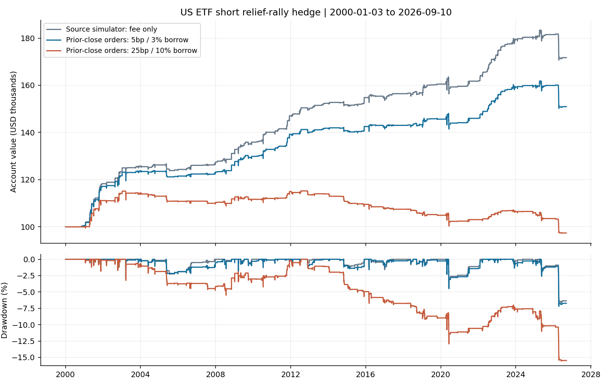
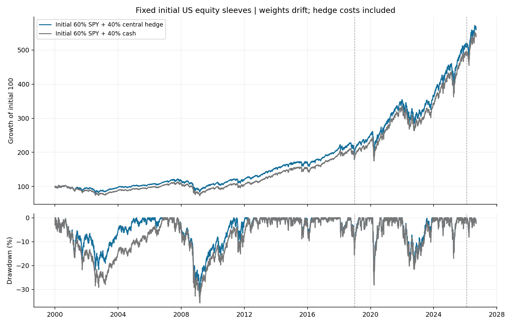

<!-- GENERATED FILE. EDIT THE CANONICAL KNOWLEDGE RECORD. -->

# Short ETF relief rallies: positive central returns, failed hedge validation

!!! warning "Research-only"
    This page summarizes saved research evidence. It does not authorize LIVE, allocation, or deployment.

## TL;DR

> **Verdict:** Rejected for the tested hedge role. Central standalone relief-rally returns are positive but cost-sensitive; validation risk gates and later primary return-drag gate fail. Most later SPY protection versus original cash comes from inherited hedge capital. No operational promotion.

> **Status:** `diagnostic`

> **Disposition:** `rejected`

> **Replication:** `timing_conflicted`

## Research question

Do the printed four short ETF relief-rally sleeves provide useful protection after prior-close order reservation, short distributions and borrowing costs?

## Exact setup

| Field | Value |
| --- | --- |
| Signal family | US_ETF_short_relief_rally_inverse_RSI |
| Universe | ["Literal fixed five US-listed ETFs: SPY,QQQ,TLT,VEA,IWM"] |
| Decision | Completed CloseT: ownSMA200, inverseRSI limits, reciprocal momentum, equity-based quantity and slot reservation |
| Fill | Next-session closing auction LOC within costed price bound; scheduled E+11 MOC; source slot simulation diagnostic |
| Primary cost layer | central_research |
| Last reviewed | 2026-09-13T23:17:59.330484+00:00 |

## Timing and overnight attribution

```text
information available: Completed CloseT: ownSMA200, inverseRSI limits, reciprocal momentum, equity-based quantity and slot reservation
primary executable fill: Next-session closing auction LOC within costed price bound; scheduled E+11 MOC; source slot simulation diagnostic
```

If final `Close_T` data formed the signal, a hypothetical `Close_T` entry is diagnostic only unless a separate pre-close protocol was modeled. Comparing that diagnostic with `Open_(T+1)` and applying the compounded return identity shows whether the apparent edge occurred in the overnight gap. Missing attribution numbers mean **not tested**, not zero.

| Attribution field | Value |
| --- | --- |
| Status | tested |
| Diagnostic Path | DecisionCloseT and Dopen to same actual exit; conditioned on later successful LOC fill |
| Executable Path | Actual selected nextCloseD LOC to same exit |
| Method | CAP split-consistent compounded overnight/intraday/holding identity; price-only short endpoint attribution separate from costed account |
| Headline Result | Mean pre-entry rise1.61%; next-close-to-exit short price return+.63%; earlier anchor comparisons are hindsight-conditioned, not alternate executable strategies |
| Metrics | {"censored_episodes": 0, "central": {"actual_fill_to_fill_short_return_mean": 0.0053443713573260235, "actual_fill_to_fill_short_return_median": 0.004920049200492049, "censored": 0, "closed": 717, "config": "central", "diagnostic_entries": 0, "episodes": 717, "holding_calendar_days_mean": 3.8465829846582986, "holding_calendar_days_median": 3.0, "holding_observed_sessions_mean": 2.5620641562064157, "holding_observed_sessions_median": 2.0, "positive_pre_entry_moves": 714, "pre_entry_intraday_price_return_mean": 0.009311420496406465, "pre_entry_intraday_price_return_median": 0.006306424087815676, "pre_entry_overnight_price_return_mean": 0.006737459111278939, "pre_entry_overnight_price_return_median": 0.004982045155126569, "pre_entry_total_price_return_mean": 0.016078075490978967, "pre_entry_total_price_return_median": 0.011811238865640172, "sample": "all", "short_from_entry_close_to_exit_close_mean": 0.006345399903258715, "short_from_entry_close_to_exit_close_median": 0.00590116554460185, "short_from_entry_open_to_exit_close_mean": -0.002850576489967893, "short_from_entry_open_to_exit_close_median": -0.0005767332432737859, "short_from_information_close_to_exit_close_mean": -0.00957909377751891, "short_from_information_close_to_exit_close_median": -0.005633112763641979}, "closed_episodes": 717, "maximum_identity_residual": 4.440892098500626e-16} |
| Artifact | C:/Users/User/Documents/workspace/pakal/pakal-research/reports/tradequantix_short_etf_hedge_study/tables/timing_attribution.csv |

## Primary metrics

| Metric | Value |
| --- | ---: |
| Period | 2019-01-01:2026-02-02 |
| Universe | Fixed initial150kSPYTR+100kcentralshortETFaccount; weights drift |
| Cost Layer | central_research |
| Cagr | 14.06% |
| Annualized Volatility | 15.43% |
| Sharpe | 0.932 |
| Maximum Drawdown | -26.20% |
| Turnover | N/A |

## Four separate verdicts

| Question | Conclusion |
| --- | --- |
| Source Replication | 197source pages read; source close-slot reuse is timing-conflicted and exact curve/runtime unavailable |
| Predictive Value | Sparse short relief-rally component; positive central return is not independently validated alpha |
| Economic Value | Primary validation risk and later drag gates fail; phase-matched cash removes most apparent later SPY protection |
| Promotion | No operational promotion |

## Key findings

| Feature | Role | Direction | Status | Effect | Action |
| --- | --- | --- | --- | --- | --- |
| own_SMA200_and_RRSI | signal | Short strong rebounds in downtrends | diagnostic | N/A | Do not promote as a hedge from this study |
| reciprocal_ROC_rank | ranking | Literal reciprocal score including negative branch | diagnostic | N/A | Do not promote as a hedge from this study |
| four_independent_sleeves | portfolio_construction | No sequential tranche requirement | diagnostic | N/A | Do not promote as a hedge from this study |
| prior_close_reservation | execution | Avoid conditional future slot release | diagnostic | N/A | Do not promote as a hedge from this study |
| phase_matched_cash | diagnostic | Most later SPY protection attributable to inherited capital | diagnostic | N/A | Do not promote as a hedge from this study |

## Visual evidence






## Limitations

- Author standalone numerical curve/end date/trades absent; 4.4% drawdown prose is not a matching benchmark
- Source simulator close-exit capacity reuse is timing-conflicted
- Exact RealTest seed/build/ties/nonpositive RRSI edge behavior not replicated
- No historical borrow/locate/recall, NBBO, official SSR flags or auction execution data
- Current vendor adjustments not point-in-time archive; fixed ETF list selected by author
- Exdate short dividend debit approximates payment liquidity; no payment-date in-lieu tax ledger
- Fractional split rights retained and flagged, not verified executable cash-in-lieu
- Research borrow APR on market value is not an exact IBKR collateral/rate calculation
- No final liquidation or fabricated missing quotes; histories before ETF inception unavailable
- Source three-hedge combined portfolio and dependent F026 momentum sleeve not reproduced
- All source/related history already seen; later confirmation short
- Causal timing does not establish auction accessibility, complete fills or trading readiness
- Primary paired gates fail; stress full-account return negative
- Legacy cash explains most later protection; H4 created after validation and before confirmation
- SSR controls have no realized bite: all36rejected requests would expire without fills
- 20undated endpoint intentions across five causal accounts; included as incomplete selected demand
- Mechanical ADV scale thresholds are not calibrated impact or economic AUM limits
- Native strict event schema rejects13fractional-minute duration fields; original append-only log preserved. Official strict validation passes a lossless integer-minute audit projection with original precision retained; see SCHEMA_VALIDATION.md.

## Next gates

- Preserve fixed rules for new independent observations; no threshold rescue on seen periods
- Any actual portfolio comparison needs matching prior capital and verified borrow/auction execution; no immediate allocation

## Sources

- `C:\\Users\\User\\Documents\\workspace\\0_papers\\TradeQuantiX_PDFs\\TradeQuantiX_PDFs_WHITE\\multi-strategy-portfolio-allocation.pdf`
- `C:\\Users\\User\\Documents\\workspace\\0_papers\\TradeQuantiX_PDFs\\TradeQuantiX_PDFs_WHITE\\portfolio-development-series-part-140.pdf`
- `C:\\Users\\User\\Documents\\workspace\\0_papers\\TradeQuantiX_PDFs\\TradeQuantiX_PDFs_WHITE\\portfolio-development-series-part-278.pdf`
- `C:\\Users\\User\\Documents\\workspace\\0_papers\\TradeQuantiX_PDFs\\TradeQuantiX_PDFs_WHITE\\portfolio-development-series-part-7f7.pdf`
- `C:\\Users\\User\\Documents\\workspace\\0_papers\\TradeQuantiX_PDFs\\TradeQuantiX_PDFs_WHITE\\tradetronix-portfolio-update-1112024.pdf`

## Canonical artifacts

| Artifact | Pakal path |
| --- | --- |
| Concise Report | `C:/Users/User/Documents/workspace/pakal/pakal-research/reports/tradequantix_short_etf_hedge_study/REPORT.md` |
| Full Report | `C:/Users/User/Documents/workspace/pakal/pakal-research/reports/tradequantix_short_etf_hedge_study/REPORT_FULL.md` |
| Notebook | `C:/Users/User/Documents/workspace/pakal/pakal-research/reports/tradequantix_short_etf_hedge_study/research.ipynb` |
| Frozen Specification | `C:/Users/User/Documents/workspace/pakal/pakal-research/reports/tradequantix_short_etf_hedge_study/research_spec_frozen.json` |
| Manifest | `C:/Users/User/Documents/workspace/pakal/pakal-research/reports/tradequantix_short_etf_hedge_study/run_manifest.json` |
| Research State | `C:/Users/User/Documents/workspace/pakal/pakal-research/reports/tradequantix_short_etf_hedge_study/research_state.json` |
| Hypothesis Registry | `C:/Users/User/Documents/workspace/pakal/pakal-research/reports/tradequantix_short_etf_hedge_study/hypothesis_registry.json` |
| Experiment Ledger | `C:/Users/User/Documents/workspace/pakal/pakal-research/reports/tradequantix_short_etf_hedge_study/experiment_ledger.jsonl` |
| Decision Log | `C:/Users/User/Documents/workspace/pakal/pakal-research/reports/tradequantix_short_etf_hedge_study/decision_log.jsonl` |
| Source Rule Map | `C:/Users/User/Documents/workspace/pakal/pakal-research/reports/tradequantix_short_etf_hedge_study/SOURCE_RULE_MAP.md` |
| Primary Source Code | `["C:/Users/User/Documents/workspace/pakal/pakal-research/tradequantix_short_etf_hedge_analyze.py", "C:/Users/User/Documents/workspace/pakal/pakal-research/tradequantix_short_etf_hedge_compare.py", "C:/Users/User/Documents/workspace/pakal/pakal-research/tradequantix_short_etf_hedge_data.py", "C:/Users/User/Documents/workspace/pakal/pakal-research/tradequantix_short_etf_hedge_deliver.py", "C:/Users/User/Documents/workspace/pakal/pakal-research/tradequantix_short_etf_hedge_diagnose.py", "C:/Users/User/Documents/workspace/pakal/pakal-research/tradequantix_short_etf_hedge_engine.py", "C:/Users/User/Documents/workspace/pakal/pakal-research/tradequantix_short_etf_hedge_features.py", "C:/Users/User/Documents/workspace/pakal/pakal-research/tradequantix_short_etf_hedge_flow.py", "C:/Users/User/Documents/workspace/pakal/pakal-research/tradequantix_short_etf_hedge_freeze.py", "C:/Users/User/Documents/workspace/pakal/pakal-research/tradequantix_short_etf_hedge_freeze_round.py", "C:/Users/User/Documents/workspace/pakal/pakal-research/tradequantix_short_etf_hedge_legacy_control.py", "C:/Users/User/Documents/workspace/pakal/pakal-research/tradequantix_short_etf_hedge_prefix.py", "C:/Users/User/Documents/workspace/pakal/pakal-research/tradequantix_short_etf_hedge_preflight.py", "C:/Users/User/Documents/workspace/pakal/pakal-research/tradequantix_short_etf_hedge_round.py", "C:/Users/User/Documents/workspace/pakal/pakal-research/tradequantix_short_etf_hedge_round_engine.py", "C:/Users/User/Documents/workspace/pakal/pakal-research/tradequantix_short_etf_hedge_round_features.py", "C:/Users/User/Documents/workspace/pakal/pakal-research/tradequantix_short_etf_hedge_round_preflight.py", "C:/Users/User/Documents/workspace/pakal/pakal-research/tradequantix_short_etf_hedge_run.py", "C:/Users/User/Documents/workspace/pakal/pakal-research/tradequantix_short_etf_hedge_timing.py"]` |
| Primary Tables | `["C:/Users/User/Documents/workspace/pakal/pakal-research/reports/tradequantix_short_etf_hedge_study/tables/full_metrics.csv", "C:/Users/User/Documents/workspace/pakal/pakal-research/reports/tradequantix_short_etf_hedge_study/tables/evaluation_index.csv", "C:/Users/User/Documents/workspace/pakal/pakal-research/reports/tradequantix_short_etf_hedge_study/tables/capacity_summary.csv", "C:/Users/User/Documents/workspace/pakal/pakal-research/reports/tradequantix_short_etf_hedge_study/tables/market_relationship.csv", "C:/Users/User/Documents/workspace/pakal/pakal-research/reports/tradequantix_short_etf_hedge_study/tables/legacy_cash_attribution/comparisons.csv"]` |
| Primary Charts | `["C:/Users/User/Documents/workspace/pakal/pakal-research/reports/tradequantix_short_etf_hedge_study/charts/hedge_equity_drawdown.png", "C:/Users/User/Documents/workspace/pakal/pakal-research/reports/tradequantix_short_etf_hedge_study/charts/legacy_cash_attribution.png", "C:/Users/User/Documents/workspace/pakal/pakal-research/reports/tradequantix_short_etf_hedge_study/charts/market_relationship.png", "C:/Users/User/Documents/workspace/pakal/pakal-research/reports/tradequantix_short_etf_hedge_study/charts/spy_equity_drawdown.png"]` |
| Schema Validation | `C:/Users/User/Documents/workspace/pakal/pakal-research/reports/tradequantix_short_etf_hedge_study/SCHEMA_VALIDATION.md` |
