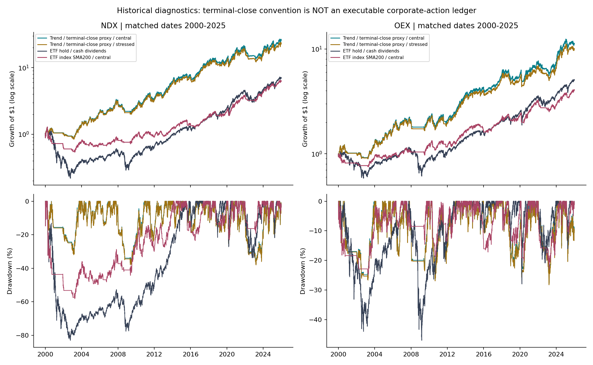
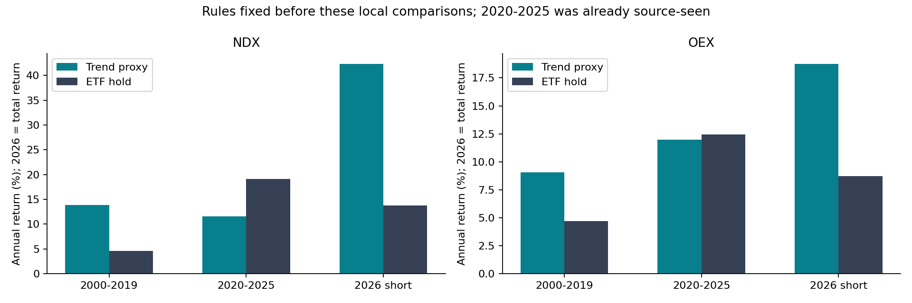

<!-- GENERATED FILE. EDIT THE CANONICAL KNOWLEDGE RECORD. -->

# TradeQuantiX Simple Trend USA: failed recent benchmark gate and corporate-action limits

!!! warning "Research-only"
    This page summarizes saved research evidence. It does not authorize LIVE, allocation, or deployment.

## TL;DR

> **Verdict:** Do not advance this USA implementation: source-style central variants fail the2020-2025 benchmark gate, and ex-post terminal closes prevent causal portfolio claims.

> **Status:** `diagnostic`

> **Disposition:** `rejected`

> **Replication:** `not_reproducible`

## Research question

Test source USA trend rules with PIT membership, causal regular fills and disclosed terminal treatment

## Exact setup

| Field | Value |
| --- | --- |
| Signal family | long_equity_trend_momentum_volatility_sizing |
| Universe | ["USA Nasdaq100 PIT", "USA S&P100 PIT"] |
| Decision | Close_T |
| Fill | Open_T+1 for ordinary signals; EX_POST_SOURCE_END_OF_DATA_CLOSE for terminal diagnostic |
| Primary cost layer | central_research |
| Last reviewed | 2026-09-13T10:33:01.446260+00:00 |

## Timing and overnight attribution

```text
information available: Close_T
primary executable fill: Open_T+1 for ordinary signals; EX_POST_SOURCE_END_OF_DATA_CLOSE for terminal diagnostic
```

If final `Close_T` data formed the signal, a hypothetical `Close_T` entry is diagnostic only unless a separate pre-close protocol was modeled. Comparing that diagnostic with `Open_(T+1)` and applying the compounded return identity shows whether the apparent edge occurred in the overnight gap. Missing attribution numbers mean **not tested**, not zero.

| Attribution field | Value |
| --- | --- |
| Status | diagnostic |
| Diagnostic Path | Prior close prices for same actually filled quantities |
| Executable Path | Next open prices on same quantities; terminal exceptions excluded |
| Method | Signed gap notional / traded notional; no alternate portfolio |
| Headline Result | Opening gaps favorable9.40bpNDX/4.88bpOEX; terminal exits remain ex-post |
| Metrics | {"ndx_gap_bps": -9.40292006, "oex_gap_bps": -4.87816726} |
| Unavailable Reason | Full causal terminal-event attribution unavailable |
| Artifact | tables/timing_and_participation.csv |

## Primary metrics

| Metric | Value |
| --- | ---: |
| Period | 2020-2025 source-seen diagnostic |
| Universe | USA Nasdaq100 PIT |
| Cost Layer | central_research |
| Cagr | 11.52% |
| Annualized Volatility | 22.96% |
| Sharpe | 0.591 |
| Maximum Drawdown | -37.51% |
| Turnover | 355.46% |

## Four separate verdicts

| Question | Conclusion |
| --- | --- |
| Source Replication | Rules translated, but source metrics missing and engine/corporate-action parity incomplete |
| Predictive Value | Not isolated; source-seen history and no significant paired advantage |
| Economic Value | Conditional source-style results fail2020-2025 matched ETF gate in both universes |
| Promotion | Rejected; research-only |

## Key findings

| Feature | Role | Direction | Status | Effect | Action |
| --- | --- | --- | --- | --- | --- |
| stock_SMA200 | entry_exit | Source rule; independent marginal effect not isolated | diagnostic | N/A | Do not promote; preserve as research component |
| index_SMA200_entry_only | entry_filter | Source rule; independent marginal effect not isolated | diagnostic | N/A | Do not promote; preserve as research component |
| ROC200 | ranking | Source rule; independent marginal effect not isolated | diagnostic | N/A | Do not promote; preserve as research component |
| volatility_5_25_100 | sizing | Source rule; independent marginal effect not isolated | diagnostic | N/A | Do not promote; preserve as research component |
| monthly_25pct_deadband | turnover_control | Source rule; independent marginal effect not isolated | diagnostic | N/A | Do not promote; preserve as research component |
| terminal_corporate_action_ledger | accounting | Source rule; independent marginal effect not isolated | diagnostic | N/A | Do not promote; preserve as research component |

## Visual evidence






## Limitations

- Published numeric figures absent in supplied PDF; numeric source parity cannot be established.
- All long history already seen by source; short post-publication slice cannot establish independence.
- Capital-adjusted equivalent-share corporate-action mapping is not broker-reconciled; cash/acquirer delisting terms absent.
- No intraday open auction liquidity, fills, market impact calibration or historical margin schedule.
- OEX standalone removes multi-market /NumMarkets allocation; explicit translation, not a source USA combined portfolio.
- Observed bars without padding may differ from RealTest vendor calendar/padding defaults.
- Aggregate per-symbol commission approximation may differ from RealTest lot reduction bookkeeping.
- Source-lastbar exits use terminal-series knowledge
- 2020-2025 benchmark gate failed;2026 short
- ETF dividends retained as cash; reinvested-dividend comparator not tested

## Next gates

- Only reopen with timestamped merger/delist consideration and actual decision-time order protocol
- Frozen prospective matched ETF comparator with reinvested dividends; no rescue tuning on seen history

## Sources

- `Investigating a Simple Trend Idea Part2,2026-01-19`
- `Part1,2026-01-05`
- `https://www.mhptrading.com/docs/topics/idh-topic12722.htm`

## Canonical artifacts

| Artifact | Pakal path |
| --- | --- |
| Concise Report | `C:/Users/User/Documents/workspace/pakal/pakal-research/reports/tradequantix_simple_trend_usa_study/REPORT.md` |
| Full Report | `C:/Users/User/Documents/workspace/pakal/pakal-research/reports/tradequantix_simple_trend_usa_study/REPORT_FULL.md` |
| Notebook | `C:/Users/User/Documents/workspace/pakal/pakal-research/reports/tradequantix_simple_trend_usa_study/tradequantix_simple_trend_usa.ipynb` |
| Frozen Specification | `C:/Users/User/Documents/workspace/pakal/pakal-research/reports/tradequantix_simple_trend_usa_study/research_spec_amendment_01.json` |
| Manifest | `C:/Users/User/Documents/workspace/pakal/pakal-research/reports/tradequantix_simple_trend_usa_study/run_manifest.json` |
| Primary Source Code | `["C:/Users/User/Documents/workspace/pakal/pakal-research/tradequantix_simple_trend_engine.py", "C:/Users/User/Documents/workspace/pakal/pakal-research/tradequantix_simple_trend_data.py", "C:/Users/User/Documents/workspace/pakal/pakal-research/tradequantix_simple_trend_run.py"]` |
| Primary Tables | `["C:/Users/User/Documents/workspace/pakal/pakal-research/reports/tradequantix_simple_trend_usa_study/tables/period_metrics.csv", "C:/Users/User/Documents/workspace/pakal/pakal-research/reports/tradequantix_simple_trend_usa_study/tables/timing_and_participation.csv"]` |
| Primary Charts | `["C:/Users/User/Documents/workspace/pakal/pakal-research/reports/tradequantix_simple_trend_usa_study/charts/equity_drawdown.png", "C:/Users/User/Documents/workspace/pakal/pakal-research/reports/tradequantix_simple_trend_usa_study/charts/period_comparison.png"]` |
| Research State | `C:/Users/User/Documents/workspace/pakal/pakal-research/reports/tradequantix_simple_trend_usa_study/research_state.json` |
| Hypothesis Registry | `C:/Users/User/Documents/workspace/pakal/pakal-research/reports/tradequantix_simple_trend_usa_study/hypothesis_registry.json` |
| Experiment Ledger | `C:/Users/User/Documents/workspace/pakal/pakal-research/reports/tradequantix_simple_trend_usa_study/experiment_ledger.jsonl` |
| Decision Log | `C:/Users/User/Documents/workspace/pakal/pakal-research/reports/tradequantix_simple_trend_usa_study/decision_log.jsonl` |
| Source Rule Map | `C:/Users/User/Documents/workspace/pakal/pakal-research/reports/tradequantix_simple_trend_usa_study/SOURCE_RULE_MAP.md` |
