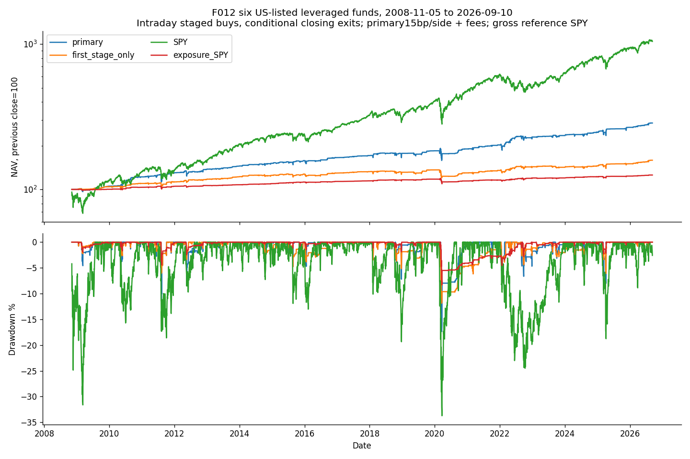

<!-- GENERATED FILE. EDIT THE CANONICAL KNOWLEDGE RECORD. -->

# ATR-stretch ETF intraday buying with inverse-RSI closing exits

!!! warning "Research-only"
    This page summarizes saved research evidence. It does not authorize LIVE, allocation, or deployment.

## TL;DR

> **Verdict:** Declared six-fund staged intraday ETF interpretation passes the frozen economic gate but remains diagnostic because auction/source/short-later evidence is incomplete.

> **Status:** `diagnostic`

> **Disposition:** `promising_component`

> **Replication:** `not_reproducible`

## Research question

Does a declared six-fund staged intraday ATR-stretch/RSI-exit strategy retain net value and tolerable drawdown, and do child entries add value beyond the first tranche?

## Exact setup

| Field | Value |
| --- | --- |
| Signal family | staged_etf_mean_reversion |
| Universe | ["Six source-selected US-listed funds SOXL,SPXL,TECL,TMF,TQQQ,UGL; GBTC omitted, three unredistributed slots"] |
| Decision | Completed CloseT; opening-known split/sell-liability safety only reduces prior instructions |
| Fill | T-fixed DAY intradaybuy: O_D<=L fillatO_D, else Low_D<=L fillatL; opening_only control omits later touch |
| Primary cost layer | central_research |
| Last reviewed | 2026-09-14T17:44:55.765131+00:00 |

## Timing and overnight attribution

```text
information available: Completed CloseT; opening-known split/sell-liability safety only reduces prior instructions
primary executable fill: T-fixed DAY intradaybuy: O_D<=L fillatO_D, else Low_D<=L fillatL; opening_only control omits later touch
```

If final `Close_T` data formed the signal, a hypothetical `Close_T` entry is diagnostic only unless a separate pre-close protocol was modeled. Comparing that diagnostic with `Open_(T+1)` and applying the compounded return identity shows whether the apparent edge occurred in the overnight gap. Missing attribution numbers mean **not tested**, not zero.

| Attribution field | Value |
| --- | --- |
| Status | not_tested |
| Diagnostic Path | Selection-conditioned CloseT to actual fill identity, not extraPnL |
| Executable Path | opening_only tests predeclared opening eligibility; no actual intraday timestamps/auctioncutoff proof |
| Method | Saved filled signed-share dollar decomposition, not causal open counterfactual |
| Headline Result | Pre-entry movement is not earned; actual intraday PnL and roundtrip costs separately reconciled |
| Metrics | {"after_open_dollars": -414604.56632999756, "decision_to_close_dollars": -715822.0288568366, "fills": 2418, "identity_error_max": 1.1368683772161603e-13, "interpretation": "Selected signed-fill identity only; actual intraday roundtrip PnL separately audited", "opening_gap_dollars": -301217.46252683905} |
| Artifact | C:/Users/User/Documents/workspace/pakal/pakal-research/reports/tradequantix_sma_atr_rsi_interpretation_study/tables/same_quantity_timing.csv |

## Primary metrics

| Metric | Value |
| --- | ---: |
| Period | 2019-01-02:2026-04-02 |
| Universe | Six source-selected US-listed funds SOXL,SPXL,TECL,TMF,TQQQ,UGL; GBTC omitted, three unredistributed slots |
| Cost Layer | central_research |
| Cagr | 6.22% |
| Annualized Volatility | 11.01% |
| Sharpe | 0.603 |
| Maximum Drawdown | -17.36% |
| Turnover | 664.96% |

## Four separate verdicts

| Question | Conclusion |
| --- | --- |
| Source Replication | Unavailable exact source, explicit interpretation |
| Predictive Value | No pristine independent prediction claim; EODexposure omits new intraday risk, fixed survivor basket, shortlater |
| Economic Value | Declared six-fund staged intraday ETF interpretation passes the frozen economic gate but remains diagnostic because auction/source/short-later evidence is incomplete. |
| Promotion | Research-only diagnostic; no trading approval |

## Key findings

| Feature | Role | Direction | Status | Effect | Action |
| --- | --- | --- | --- | --- | --- |
| ATR-stretch three-stage inverse-RSI recovery | entry | Long dip buying | diagnostic | Validation CAGR0.062188, MDD-0.173646 | No trading implementation; preserve result and avoid same-history tuning |

## Visual evidence




## Limitations

- Not exact author replication; clipped child LLV/band tail and final SOXL3 body are interpreted
- GBTC excluded for unresolved economics; no renormalization
- Current-vintage fixed survivor basket and author-selected parameters; no true PITselection claim
- Original cache omitted currency/security_name and stable before-after vintage; retained prior QA, no invented metadata
- No padding; ex-date entitlement cash is not pay-date liquidity proof
- Daily closes do not prove closing-auction access, partial fills or quantity capacity
- Fractional post-split claims held, no cash-in-lieu model
- Short post-publication window and related seen history
- Prior EOD-exposureSPY omits newly entered intraday risk and same-dayroundtrips; paired excess is not risk-adjusted incremental alpha
- Same-day closing exit assumes conditionalorder eligibility; dailyOHLC cannot establish entry before auction cutoff
- InverseRSI local seed and bothlimit tickrounding are explicit conventions, not native parity
- No calibrated impact, cash yield or independent execution proof
- Same-quantity selected timing identity is not a substitute for actual roundtrip PnL
- Frozen gate failures: 

## Next gates

- New independently frozen evidence only; do not retune seen history

## Sources

- `{"content_id": "sha256:ff7aa17a0d5dc873837309212086161dd5b82b01d8a8e6637903fdb2d6ea44cc", "location": "C:/Users/User/Documents/workspace/0_papers/TradeQuantiX_PDFs/TradeQuantiX_PDFs_WHITE/etf-mean-reversion-methods-four-systems.pdf", "read_complete": true, "role": "Source mechanism, incomplete author code; full read receipt in prior F012 intake", "source_id": "14"}`

## Canonical artifacts

| Artifact | Pakal path |
| --- | --- |
| Source Rule Map | `C:/Users/User/Documents/workspace/pakal/pakal-research/reports/tradequantix_sma_atr_rsi_interpretation_study/SOURCE_RULE_MAP.md` |
| Hypothesis Registry | `C:/Users/User/Documents/workspace/pakal/pakal-research/reports/tradequantix_sma_atr_rsi_interpretation_study/hypothesis_registry.json` |
| Experiment Ledger | `C:/Users/User/Documents/workspace/pakal/pakal-research/reports/tradequantix_sma_atr_rsi_interpretation_study/experiment_ledger.jsonl` |
| Decision Log | `C:/Users/User/Documents/workspace/pakal/pakal-research/reports/tradequantix_sma_atr_rsi_interpretation_study/decision_log.jsonl` |
| Frozen Specification | `C:/Users/User/Documents/workspace/pakal/pakal-research/reports/tradequantix_sma_atr_rsi_interpretation_study/research_spec_frozen.json` |
| Concise Report | `C:/Users/User/Documents/workspace/pakal/pakal-research/reports/tradequantix_sma_atr_rsi_interpretation_study/REPORT.md` |
| Full Report | `C:/Users/User/Documents/workspace/pakal/pakal-research/reports/tradequantix_sma_atr_rsi_interpretation_study/REPORT_FULL.md` |
| Knowledge Record | `C:/Users/User/Documents/workspace/pakal/pakal-research/reports/tradequantix_sma_atr_rsi_interpretation_study/knowledge_record.json` |
| Manifest | `C:/Users/User/Documents/workspace/pakal/pakal-research/reports/tradequantix_sma_atr_rsi_interpretation_study/run_manifest.json` |
| Research State | `C:/Users/User/Documents/workspace/pakal/pakal-research/reports/tradequantix_sma_atr_rsi_interpretation_study/research_state.json` |
| Notebook | `C:/Users/User/Documents/workspace/pakal/pakal-research/reports/tradequantix_sma_atr_rsi_interpretation_study/research.ipynb` |
| Primary Source Code | `["C:/Users/User/Documents/workspace/pakal/pakal-research/tradequantix_sma_atr_rsi_interpretation_engine.py"]` |
| Primary Tables | `["C:/Users/User/Documents/workspace/pakal/pakal-research/reports/tradequantix_sma_atr_rsi_interpretation_study/tables/period_metrics.csv"]` |
| Primary Charts | `["C:/Users/User/Documents/workspace/pakal/pakal-research/reports/tradequantix_sma_atr_rsi_interpretation_study/charts/equity_drawdown.png"]` |
