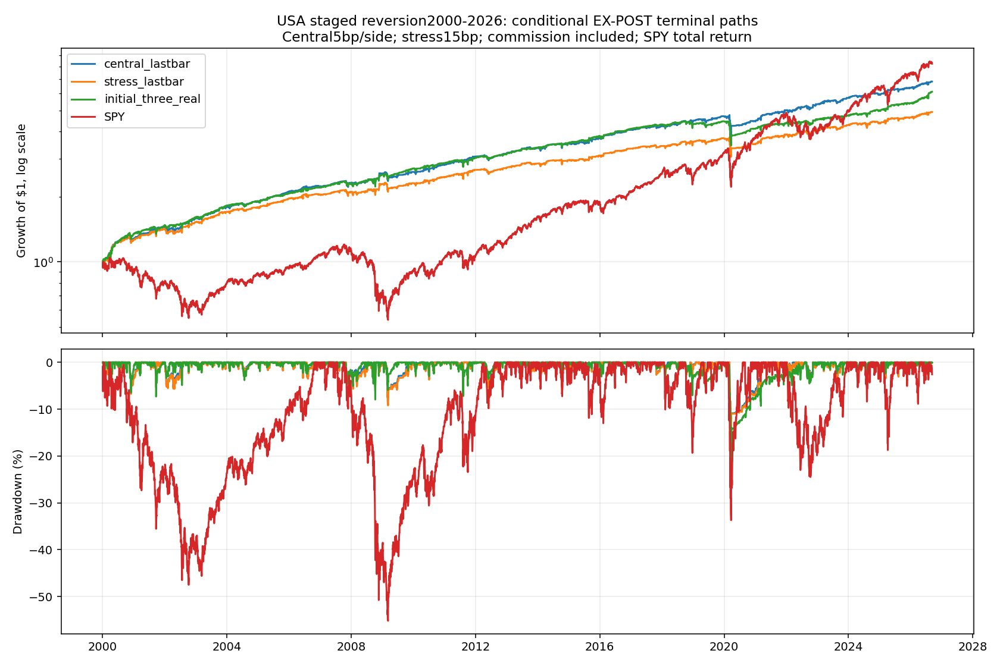
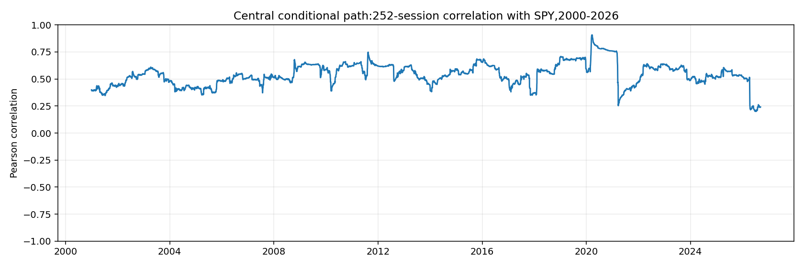

<!-- GENERATED FILE. EDIT THE CANONICAL KNOWLEDGE RECORD. -->

# TradeQuantiX staged USA mega-cap reversion: conditional component, no promotion

!!! warning "Research-only"
    This page summarizes saved research evidence. It does not authorize LIVE, allocation, or deployment.

## TL;DR

> **Verdict:** No promotion. Positive conditional low-exposure component, weaker in2019-2025. Primary carry retains unresolved real settlement and three stale ghost slots; exact RealTest parent-window parity unavailable. Ten frozen configurations do not establish independent economic value.

> **Status:** `diagnostic`

> **Disposition:** `inconclusive`

> **Replication:** `not_reproducible`

## Research question

Assess low-exposure staged reversion under frozen source-window, costs, source-version and accounting controls.

## Exact setup

| Field | Value |
| --- | --- |
| Signal family | staged_mean_reversion |
| Universe | ["USA historical Nasdaq100 OR S&P100, PIT membership for first stage only;666 stocks"] |
| Decision | Completed Close_T features, parent state, equity and quantity; morning T+1 selection may use opening-exit-released slots only. |
| Fill | Stage1 advance next-close LOC, stages2/3 next-close MOC; independent prior EMA12 next-session sell limits. EX_POST lastbar liquidation isolated. |
| Primary cost layer | central_research |
| Last reviewed | 2026-09-13T17:45:27.814412+00:00 |

## Timing and overnight attribution

```text
information available: Completed Close_T features, parent state, equity and quantity; morning T+1 selection may use opening-exit-released slots only.
primary executable fill: Stage1 advance next-close LOC, stages2/3 next-close MOC; independent prior EMA12 next-session sell limits. EX_POST lastbar liquidation isolated.
```

If final `Close_T` data formed the signal, a hypothetical `Close_T` entry is diagnostic only unless a separate pre-close protocol was modeled. Comparing that diagnostic with `Open_(T+1)` and applying the compounded return identity shows whether the apparent edge occurred in the overnight gap. Missing attribution numbers mean **not tested**, not zero.

| Attribution field | Value |
| --- | --- |
| Status | tested |
| Diagnostic Path | Decision-close reference for the same actual ordinary filled quantities |
| Executable Path | Modeled next-session open/auction/limit fill for the same quantities |
| Method | Signed delta_q*(fill-decisionClose)=delta_q*(Open-decisionClose)+delta_q*(fill-Open); split-consistent; terminal tickets excluded. |
| Headline Result | Conditional central fill-conditioned timing advantage995370USD over full growing-account path:440167 overnight and555204 intraday. This is not alternate portfolio profit or signal alpha. |
| Metrics | {"interpretation": "Signed q*(actual-decision): positive is worse. Fill-conditioned same quantities; no alternate portfolio.", "intraday_dollars": -555203.6398585129, "name": "central_lastbar", "ordinary_real_fills": 6449, "overnight_dollars": -440166.8118228912, "terminal_real_fills": 5, "total_timing_dollars": -995370.451681404} |
| Artifact | C:/Users/User/Documents/workspace/pakal/pakal-research/reports/tradequantix_staged_mega_cap_reversion_study/tables/timing_summary.csv |

## Primary metrics

| Metric | Value |
| --- | ---: |
| Period | 2019-2025 primary_carry; economic metrics unavailable |
| Universe | USA PIT mega-cap staged reversion |
| Cost Layer | central_research |
| Cagr | N/A |
| Annualized Volatility | N/A |
| Sharpe | N/A |
| Maximum Drawdown | N/A |
| Turnover | N/A |

## Four separate verdicts

| Question | Conclusion |
| --- | --- |
| Source Replication | Named causal translation only; RealTest license error2 prevents exact runtime parity. |
| Predictive Value | Positive conditional paths; later performance weakens, windows matter, alternative rankings/source versions do not win uniformly. |
| Economic Value | Primary metrics unavailable. Conditional central2019-2025 CAGR5.17%,Sharpe0.62,MDD-18.64%;SPY17.19%,0.90,-33.72%. |
| Promotion | No promotion; diagnostic/inconclusive. |

## Key findings

| Feature | Role | Direction | Status | Effect | Action |
| --- | --- | --- | --- | --- | --- |
| reverse_population_z12 | entry | Conditional positive; no validated causal economics | diagnostic | N/A | Resolve source-window and settlement evidence before promotion |
| ghost_parent_low_window | state | Conditional positive; no validated causal economics | diagnostic | N/A | Resolve source-window and settlement evidence before promotion |
| EMA12_limit | exit | Conditional positive; no validated causal economics | diagnostic | N/A | Resolve source-window and settlement evidence before promotion |
| dollarATR_momentum | rank | Conditional positive; no validated causal economics | diagnostic | N/A | Resolve source-window and settlement evidence before promotion |
| initial_three_real | diagnostic | Conditional positive; no validated causal economics | diagnostic | N/A | Resolve source-window and settlement evidence before promotion |

## Visual evidence






## Limitations

- No dated delisting/merger settlement ledger; final2.3715% stale real NAV plus3/10 stale ghost slots.
- RealTest source LLV/Extern age-window semantics unverified after license error2.
- Source replaced real stage1 after inspecting validation; actual author search unknown.
- Initial three-real source also changes slots, weights and start date; not an isolated ghost ablation.
- Source lastbar uses hindsight vendor final rows including active global endpoint and same-day roundtrips.
- All10 configurations predeclared but source-seen2019-2025; later120 sessions insufficient independent confirmation.
- No actual auction cutoff/partial-fill/impact or capacity ceiling evidence; nominal dollarATR ranks scale with share price.
- Closed-trade cashflow table excludes dividends and is not net expectancy. Candidate rejection/rank selection not fully independently reconstructed.

## Next gates

- Obtain dated terminal cash and acquirer-share settlement for real and ghost positions.
- Validate source parent-window behavior using a licensed runtime and frozen synthetic witnesses.
- Use future independent history for any new hypothesis; no current winner retuning.
- Validate auction execution and incremental portfolio contribution only after accounting repair.

## Sources

- `Source26 portfolio-development-series-part-144.pdf;42 pages;2025-07-21`
- `SOURCE_RULE_MAP.md and ENGINE_SEMANTICS_AUDIT.md contain precise code and official documentation references`

## Canonical artifacts

| Artifact | Pakal path |
| --- | --- |
| Concise Report | `C:/Users/User/Documents/workspace/pakal/pakal-research/reports/tradequantix_staged_mega_cap_reversion_study/REPORT.md` |
| Full Report | `C:/Users/User/Documents/workspace/pakal/pakal-research/reports/tradequantix_staged_mega_cap_reversion_study/REPORT_FULL.md` |
| Notebook | `C:/Users/User/Documents/workspace/pakal/pakal-research/reports/tradequantix_staged_mega_cap_reversion_study/research.ipynb` |
| Frozen Specification | `C:/Users/User/Documents/workspace/pakal/pakal-research/reports/tradequantix_staged_mega_cap_reversion_study/research_spec_frozen.json` |
| Manifest | `C:/Users/User/Documents/workspace/pakal/pakal-research/reports/tradequantix_staged_mega_cap_reversion_study/run_manifest.json` |
| Primary Source Code | `["C:/Users/User/Documents/workspace/pakal/pakal-research/tradequantix_staged_engine.py", "C:/Users/User/Documents/workspace/pakal/pakal-research/tradequantix_staged_features.py", "C:/Users/User/Documents/workspace/pakal/pakal-research/tradequantix_staged_run.py"]` |
| Primary Tables | `["C:/Users/User/Documents/workspace/pakal/pakal-research/reports/tradequantix_staged_mega_cap_reversion_study/tables/period_metrics.csv", "C:/Users/User/Documents/workspace/pakal/pakal-research/reports/tradequantix_staged_mega_cap_reversion_study/tables/capacity_summary.csv", "C:/Users/User/Documents/workspace/pakal/pakal-research/reports/tradequantix_staged_mega_cap_reversion_study/tables/timing_summary.csv", "C:/Users/User/Documents/workspace/pakal/pakal-research/reports/tradequantix_staged_mega_cap_reversion_study/tables/audit_all_checks.csv"]` |
| Primary Charts | `["C:/Users/User/Documents/workspace/pakal/pakal-research/reports/tradequantix_staged_mega_cap_reversion_study/charts/equity_drawdown.png", "C:/Users/User/Documents/workspace/pakal/pakal-research/reports/tradequantix_staged_mega_cap_reversion_study/charts/rolling_correlation.png", "C:/Users/User/Documents/workspace/pakal/pakal-research/reports/tradequantix_staged_mega_cap_reversion_study/charts/stale_accounting.png"]` |
| Research State | `C:/Users/User/Documents/workspace/pakal/pakal-research/reports/tradequantix_staged_mega_cap_reversion_study/research_state.json` |
| Hypothesis Registry | `C:/Users/User/Documents/workspace/pakal/pakal-research/reports/tradequantix_staged_mega_cap_reversion_study/hypothesis_registry.json` |
| Experiment Ledger | `C:/Users/User/Documents/workspace/pakal/pakal-research/reports/tradequantix_staged_mega_cap_reversion_study/experiment_ledger.jsonl` |
| Decision Log | `C:/Users/User/Documents/workspace/pakal/pakal-research/reports/tradequantix_staged_mega_cap_reversion_study/decision_log.jsonl` |
| Source Rule Map | `C:/Users/User/Documents/workspace/pakal/pakal-research/reports/tradequantix_staged_mega_cap_reversion_study/SOURCE_RULE_MAP.md` |
