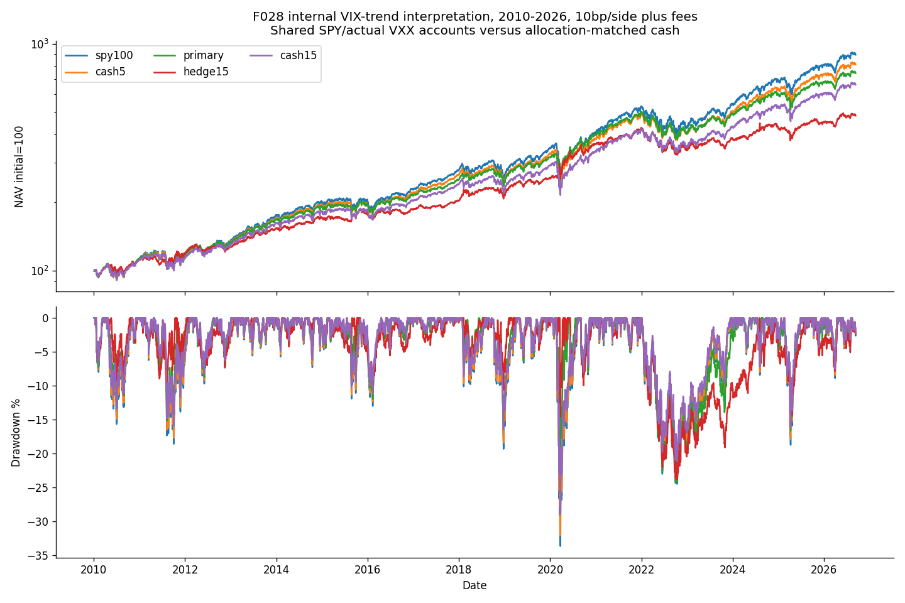

<!-- GENERATED FILE. EDIT THE CANONICAL KNOWLEDGE RECORD. -->

# VIX temporal-trend insurance: protection survives but later return cost fails

!!! warning "Research-only"
    This page summarizes saved research evidence. It does not authorize LIVE, allocation, or deployment.

## TL;DR

> **Verdict:** The fixed temporal VIX-trend hedge provides crisis protection, but fails its predeclared later return-cost gate; retain the mechanism as evidence, reject this candidate for promotion. No exact author replication or trading approval.

> **Status:** `diagnostic`

> **Disposition:** `rejected`

> **Replication:** `not_reproducible`

## Research question

Does an explicitly defined temporal VIX-trend long-note hedge reduce SPY portfolio losses beyond a matched cash reserve at a bounded return cost?

## Exact setup

| Field | Value |
| --- | --- |
| Signal family | vix_temporal_trend_hedge |
| Universe | ["USA: SPY with separate actual VXX-201901 and VXX Series B ETNs"] |
| Decision | Completed CloseT; final daily VIX and actual shared account state |
| Fill | Fixed quantities at next SPX session OpenD; reductions before increases |
| Primary cost layer | central_research |
| Last reviewed | 2026-09-14T19:38:00.775852+00:00 |

## Timing and overnight attribution

```text
information available: Completed CloseT; final daily VIX and actual shared account state
primary executable fill: Fixed quantities at next SPX session OpenD; reductions before increases
```

If final `Close_T` data formed the signal, a hypothetical `Close_T` entry is diagnostic only unless a separate pre-close protocol was modeled. Comparing that diagnostic with `Open_(T+1)` and applying the compounded return identity shows whether the apparent edge occurred in the overnight gap. Missing attribution numbers mean **not tested**, not zero.

| Attribution field | Value |
| --- | --- |
| Status | completed |
| Diagnostic Path | CloseT to same full exitOpenX |
| Executable Path | OpenD to same full exitOpenX |
| Method | Per-episode compounded CAPITAL-price decomposition; open episodes censored |
| Headline Result | Pre-fill changes excluded from earned portfolio entry profit |
| Artifact | C:/Users/User/Documents/workspace/pakal/pakal-research/reports/tradequantix_vix_trend_interpretation_study/tables/same_exit_timing.csv |

## Primary metrics

| Metric | Value |
| --- | ---: |
| Period | 2019-01-01:2025-05-06 |
| Universe | USA: SPY with separate actual VXX-201901 and VXX Series B ETNs |
| Cost Layer | central_research |
| Cagr | 13.78% |
| Annualized Volatility | 17.20% |
| Sharpe | 0.837 |
| Maximum Drawdown | -24.27% |
| Turnover | 141.83% |

## Four separate verdicts

| Question | Conclusion |
| --- | --- |
| Source Replication | Unknown author trend and execution rules; internal interpretation only |
| Predictive Value | Protection in five of six crisis windows, not independent alpha evidence |
| Economic Value | Validation protection at0.80pp annual cost; later4.02pp total-return cost fails fixed2pp gate |
| Promotion | Reject the fixed candidate for promotion; retain mechanism evidence |

## Key findings

| Feature | Role | Direction | Status | Effect | Action |
| --- | --- | --- | --- | --- | --- |
| VIX above20-observation mean with rising mean over5 observations | risk_overlay | Long actual VXX while temporal trend is on | diagnostic | Validation drawdown32.12% to24.27%, annual return cost0.80pp | No candidate promotion; do not retune the failed gate on seen history |

## Visual evidence




## Limitations

- Source64 trend, size, timing and costs are absent; all implemented rules are internal
- Actual VXX notes are distinct; explicit dated sale/re-entry is not author parity
- SPY dividend entitlement proxy not payment-date cash; fractional reverse-split claims not cash-in-lieu proof
- VXX market premium and2022 issuance regime retained, not spot VIX or synthetic futures index
- Monthly allocation protocol is not author25-system portfolio or exact SPY buy-and-hold
- Zero positive cash yield and uncalibrated debit/whole-open fills; no broker margin or execution proof
- All related market history already seen; later source-publication window is not virgin research holdout
- No pre2009 hedge crisis evidence; no rejected proxy request retry

## Next gates

- New data or a prospectively specified companion portfolio; no same-history threshold rescue

## Sources

- `{"content_id": "sha256:46832bc5e2bad96f6e47fe55c6ddf257fdb872bd26d9d59fca24e8f592ee1778", "location": "C:/Users/User/Documents/workspace/0_papers/TradeQuantiX_PDFs/TradeQuantiX_PDFs_WHITE/why-would-i-trade-a-losing-system.pdf", "read_complete": true, "read_note": "64 all14pages reread;25/50/52 reuse verified full reads, see prior source audit", "role": "primary undefined temporal trend", "source_id": "64"}`
- `{"content_id": "sha256:32a02ebe2612efb3853c736bfb1711fb7d704289b55240fbe196e72d81249ec8", "location": "C:/Users/User/Documents/workspace/0_papers/TradeQuantiX_PDFs/TradeQuantiX_PDFs_WHITE/portfolio-development-series-part-140.pdf", "read_complete": true, "read_note": "64 all14pages reread;25/50/52 reuse verified full reads, see prior source audit", "role": "related contextual source; distinct F027 signal not imported", "source_id": "25"}`
- `{"content_id": "sha256:f0fd49590a26ae238d61792e5849494770d8bdd637efb17eb875fc8ee29af80b", "location": "C:/Users/User/Documents/workspace/0_papers/TradeQuantiX_PDFs/TradeQuantiX_PDFs_WHITE/tradetronix-portfolio-update-1112024.pdf", "read_complete": true, "read_note": "64 all14pages reread;25/50/52 reuse verified full reads, see prior source audit", "role": "related contextual source; distinct F027 signal not imported", "source_id": "50"}`
- `{"content_id": "sha256:17d1b6aa2a0d20148a6495868aef17393d8cd7423397652a5e736a78b84a0fbe", "location": "C:/Users/User/Documents/workspace/0_papers/TradeQuantiX_PDFs/TradeQuantiX_PDFs_WHITE/tradetronix-portfolio-update-9102024.pdf", "read_complete": true, "read_note": "64 all14pages reread;25/50/52 reuse verified full reads, see prior source audit", "role": "related contextual source; distinct F027 signal not imported", "source_id": "52"}`

## Canonical artifacts

| Artifact | Pakal path |
| --- | --- |
| Source Rule Map | `C:/Users/User/Documents/workspace/pakal/pakal-research/reports/tradequantix_vix_trend_interpretation_study/SOURCE_RULE_MAP.md` |
| Hypothesis Registry | `C:/Users/User/Documents/workspace/pakal/pakal-research/reports/tradequantix_vix_trend_interpretation_study/hypothesis_registry.json` |
| Experiment Ledger | `C:/Users/User/Documents/workspace/pakal/pakal-research/reports/tradequantix_vix_trend_interpretation_study/experiment_ledger.jsonl` |
| Decision Log | `C:/Users/User/Documents/workspace/pakal/pakal-research/reports/tradequantix_vix_trend_interpretation_study/decision_log.jsonl` |
| Frozen Specification | `C:/Users/User/Documents/workspace/pakal/pakal-research/reports/tradequantix_vix_trend_interpretation_study/research_spec_frozen.json` |
| Concise Report | `C:/Users/User/Documents/workspace/pakal/pakal-research/reports/tradequantix_vix_trend_interpretation_study/REPORT.md` |
| Full Report | `C:/Users/User/Documents/workspace/pakal/pakal-research/reports/tradequantix_vix_trend_interpretation_study/REPORT_FULL.md` |
| Knowledge Record | `C:/Users/User/Documents/workspace/pakal/pakal-research/reports/tradequantix_vix_trend_interpretation_study/knowledge_record.json` |
| Manifest | `C:/Users/User/Documents/workspace/pakal/pakal-research/reports/tradequantix_vix_trend_interpretation_study/run_manifest.json` |
| Research State | `C:/Users/User/Documents/workspace/pakal/pakal-research/reports/tradequantix_vix_trend_interpretation_study/research_state.json` |
| Notebook | `C:/Users/User/Documents/workspace/pakal/pakal-research/reports/tradequantix_vix_trend_interpretation_study/research.ipynb` |
| Primary Source Code | `["C:/Users/User/Documents/workspace/pakal/pakal-research/tradequantix_vix_trend_interpretation_engine.py"]` |
| Primary Tables | `["C:/Users/User/Documents/workspace/pakal/pakal-research/reports/tradequantix_vix_trend_interpretation_study/tables/period_metrics.csv"]` |
| Primary Charts | `["C:/Users/User/Documents/workspace/pakal/pakal-research/reports/tradequantix_vix_trend_interpretation_study/charts/equity_drawdown.png"]` |
