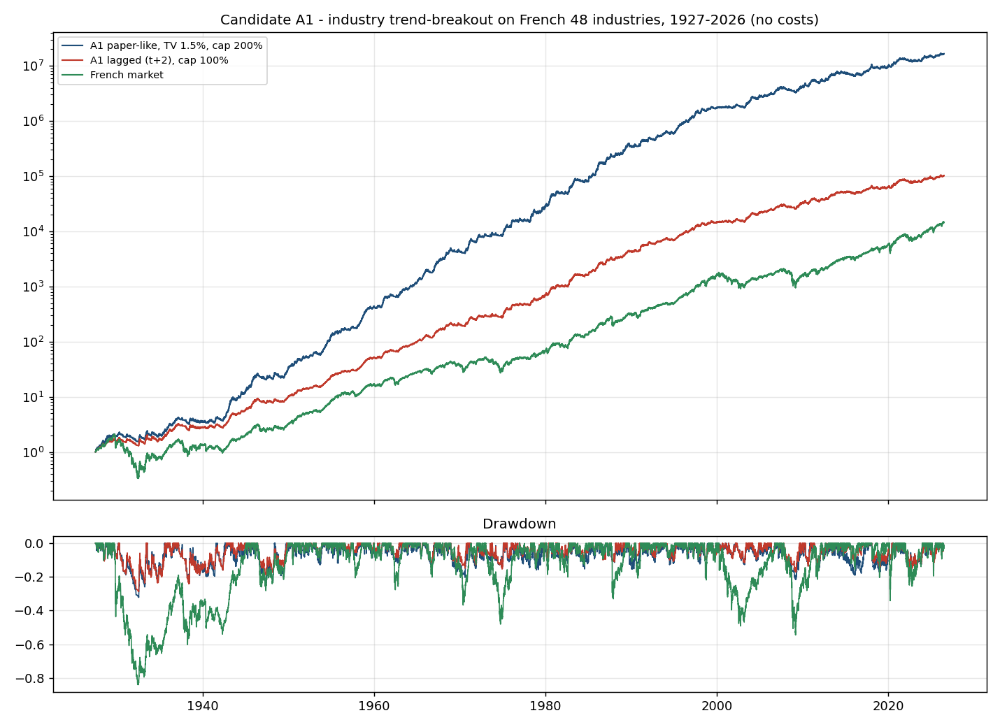
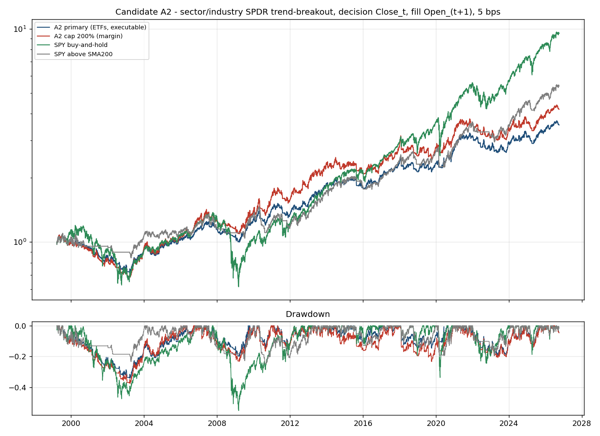

<!-- GENERATED FILE. EDIT THE CANONICAL KNOWLEDGE RECORD. -->

# Trend / breakout / momentum candidates not yet tested in Pakal: industry trend-breakout (Dow Award 2025), trend-smoothness double sort, two-factor rotation with trailing stops, recent-IPO all-time-high breakout

!!! warning "Research-only"
    This page summarizes saved research evidence. It does not authorize LIVE, allocation, or deployment.

## TL;DR

> **Verdict:** NO CANDIDATE PASSES THE FROZEN 'REAL HIGH-SHARPE STRATEGY' GATE. (A) The Dow-Award industry trend-breakout replicates on French industries over a century (Sharpe 1.15 vs the paper's 1.39, CAGR 17.8%) but its edge sits in 1927-1989 (decade Sharpe 1.4-2.3 vs market 0.1-1.7); since 2000 it earns Sharpe 0.7 against a market at 0.8-0.9, and the executable sector-ETF version earns Sharpe 0.49 (0.68 in 2012-2026 vs SPY 0.94). (B) The trend-smoothness double sort beats plain 12-1 momentum by 3-4%/yr (t 1.7-2.4, Holm-significant only in the Russell 1000) but inherits the same -69% drawdown and Sharpe 0.6-0.8; it is an ingredient, not a strategy. (D) The two-factor low-vol + momentum rotation with 25% trailing stops reproduces its source: CAGR 11.3%, Sharpe 0.95 (0.89 / 1.01 by half), max DD -25% vs -55% for SPY, alpha 5.7%/yr (t 4.1) at beta 0.48; it misses the Sharpe 1.0 gate by 0.05 and does not beat SPY by 0.25 after 2012, but it is the only candidate that lifts the live book (G3 1.30 -> 1.35 at a 30% mix). (E) The recent-IPO all-time-high breakout earns Sharpe 0.62 with a -39% drawdown and lost 9%/yr after publication. Bottom line: the high-Sharpe, high-CAGR, cross-sectional strategy the owner asked for does not exist among these four; D is a sound low-drawdown equity sleeve worth a 12-month shadow log, nothing more. ROBUSTNESS (SPEC v2, 230 runs): D passes all six frozen robustness gates (parameter grid Sharpe 0.86-0.98, rank-noise median 0.90, lag/MOC 0.96, 40 bps 0.93, four universes 0.83-1.06, bootstrap P(Sharpe>SPY) 0.99 full). Random stock picks with the same stops/filter/sizing already earn 0.79; ranking adds ~0.15 Sharpe (beats 99% of random runs). Versus SPY the edge is a bear-market story (bootstrap 0.67 since 2012; beats SPY in 52% of years). Robust but modest: true Sharpe ~0.9.

> **Status:** `forward_hypothesis`

> **Disposition:** `D robust at Sharpe ~0.9 (SPEC v2 suite passed); shadow log only; A, B, E rejected`

> **Replication:** `A1 century result replicated (CAGR 17.8% vs 18.2%, Sharpe 1.15 vs 1.39) but the edge decays after 1990; D source claim reproduced (S&P-like return with half the drawdown); B direction reproduced but small; E not reproduced`

## Research question

Owner asked for one real momentum / breakout / trend / volatility strategy with high Sharpe and CAGR, preferably cross-sectional rotational. Screen four published, fully specified rules that the Pakal registry had not tested, under one frozen spec.

## Exact setup

| Field | Value |
| --- | --- |
| Signal family | long_only_trend_breakout_and_cross_sectional_momentum_candidates |
| Universe | ["French 48 VW industries (paper-like)", "29 State Street sector/industry SPDRs", "S&P 500 / Russell 1000 / Nasdaq-100 PIT", "S&P 100 U Nasdaq-100 PIT", "US listings aged <= 90 sessions incl. delisted"] |
| Decision | Close_t (daily for A, D, E; month end for B); all scores scale-free |
| Fill | Open_(t+1) stateful engines (A2, B, D, E); A1 paper-like close and lagged t+2 diagnostics |
| Primary cost layer | central_research |
| Last reviewed | 2026-10-02T00:00:00+03:00 |

## Timing and overnight attribution

```text
information available: Close_t (daily for A, D, E; month end for B); all scores scale-free
primary executable fill: Open_(t+1) stateful engines (A2, B, D, E); A1 paper-like close and lagged t+2 diagnostics
```

If final `Close_T` data formed the signal, a hypothetical `Close_T` entry is diagnostic only unless a separate pre-close protocol was modeled. Comparing that diagnostic with `Open_(T+1)` and applying the compounded return identity shows whether the apparent edge occurred in the overnight gap. Missing attribution numbers mean **not tested**, not zero.

| Attribution field | Value |
| --- | --- |
| Status | tested |
| Diagnostic Path | A1 French paper-like replication (no costs) and lagged path |
| Executable Path | A2 ETF engine with 20% rebalance band, 5 bps; B monthly engine 10 bps; D/E slot engine 10 bps |
| Method | single pass on externally specified rules; pre-declared primaries; Holm within the B family |
| Headline Result | A2 ETF Sharpe 0.49; B1 vs momentum +3-4%/yr with -69% DD; D Sharpe 0.95 / DD -25% / G3 mix30 1.35; E Sharpe 0.62 |
| Metrics | {"A1_lagged_cap100_sharpe_2012_2026": 0.622, "A1_paper_like_sharpe_1926_2024": 1.151, "A2_primary_sharpe_2012_2026": 0.678, "A2_primary_sharpe_full": 0.49, "B1_r1000_diff_vs_mom_ann": 0.041, "B1_r1000_holm_p": 0.044, "B1_sp500_maxdd": -0.693, "D_alpha_vs_spy_t": 4.09, "D_g3_mix30_sharpe": 1.354, "D_maxdd": -0.248, "D_rob_bootstrap_p_2012": 0.6695, "D_rob_bootstrap_p_full": 0.9895, "D_rob_grid_min_sharpe": 0.856, "D_rob_noise_median": 0.899, "D_rob_random_median": 0.786, "D_sharpe_1994_2011": 0.894, "D_sharpe_2012_2026": 1.012, "D_sharpe_full": 0.946, "E_post_pub_cagr": -0.09, "E_sharpe_full": 0.624} |
| Unavailable Reason | N/A |
| Artifact | pakal-research/reports/trend_breakout_momentum_candidates_study/tables/D_stats.csv |

## Primary metrics

| Metric | Value |
| --- | ---: |
| Period | 1994-01-04..2026-09-25 |
| Universe | D primary (the only retained candidate): PIT S&P 100 U Nasdaq-100, two sub-systems x 10 slots, 25% trailing stop, 10 bps, cash 0% |
| Cost Layer | central_research (10 bps per side stocks; 5 bps ETFs in A2) |
| Cagr | 11.34% |
| Annualized Volatility | 12.13% |
| Sharpe | 0.946 |
| Maximum Drawdown | -24.79% |
| Turnover | 1257.40% |

## Four separate verdicts

| Question | Conclusion |
| --- | --- |
| Source Replication | A1 replicated within gate (CAGR, vol, MDD; Sharpe at the low edge); D claim reproduced; B1 direction reproduced; E not reproduced (source had no costs, market-cap priority and intraday brackets) |
| Predictive Value | A: strong before 1990, none after 2000; B1: small positive increment over 12-1 momentum, same crashes; D: positive alpha vs SPY and vs the equal-weight universe (t 4.1) in both halves; E: positive alpha (t 2.2) but negative since publication |
| Economic Value | none at the owner's gates; D alone is a Sharpe ~1.0, half-drawdown equity sleeve and adds +0.06 Sharpe to G3 at 30% |
| Promotion | none; D shadow log only |

## Key findings

| Feature | Role | Direction | Status | Effect | Action |
| --- | --- | --- | --- | --- | --- |
| Industry breakout entry: close > min(EMA20 + 2 ATR20, 20-day high); ratcheted stop = max(EMA40 - 2 ATR40, 40-day low) | entry/exit | positive 1927-1989, about zero vs market after 2000 | rejected for the current era | French: decade Sharpe 1.4-2.3 to 1990, 0.7 after 2000 (market 0.8-0.9); ETFs 1999-2026 Sharpe 0.49, 2012-26 0.68 vs SPY 0.94 | do not implement; do not re-tune |
| Equal-volatility-contribution sizing (1.5%/N per industry) with 200% gross cap and 20% name cap | sizing | raises CAGR 12% -> 18% at equal Sharpe in the century run | diagnostic | A1 cap 200% vs 100%: CAGR 17.8% vs 12.8%, Sharpe 1.15 vs 1.05, DD -32% vs -31% | not available in the stack (no account leverage); irrelevant since the signal decayed |
| Trend-smoothness conditional double sort: R^2 quintile first, slope quintile within (Schmerling 2026), long top cell | cross-sectional selection | positive vs plain 12-1 momentum | diagnostic (weak) | +3.3 / +4.1 / +3.1 %/yr vs mom12_1 top quintile in sp500 / r1000 / ndx (t 1.75 / 2.44 / 1.69; Holm p 0.20 / 0.044 / 0.20); same -69% DD | possible score ingredient for an NDX sleeve; not a standalone strategy |
| Smoothness rank blend (slope t-stat, log-price slope x R^2, minus information discreteness), top quintile | cross-sectional selection | about zero vs plain momentum | rejected | +0.2 / +0.7 / +1.1 %/yr (t 0.2 / 0.7 / 0.6) | reject |
| SPXTR > SMA200 else cash gate on monthly momentum sleeves | exposure | era-dependent | diagnostic (known) | +0.3..+0.4 Sharpe in 1996-2011, -0.2..-0.3 in 2012-2026 across 12 sleeves | consistent with the mtus 'dual' half-brake finding; do not use a full-off SMA200 gate |
| Two-factor rotation: low-vol (C/ATR blend) and vol-normalised multi-horizon momentum (ROC/NATR), 10 + 10 slots, vol sizing min(2%/sigma, 10%) x 0.5, entries only when SPX or NDX > 200 sessions ago, 25% trailing stop on closes | cross-sectional rotation with trend exit | positive | diagnostic candidate (defensive growth) | 1994-2026: CAGR 11.3%, Sharpe 0.95 (0.89 / 1.01), DD -25% vs SPY -55%; alpha 5.7%/yr t 4.1, beta 0.48; G3 30% mix 1.30 -> 1.35 | 12-month shadow log beside the live pods; no promotion; a vol-targeted or NDX-only variant needs a new frozen spec |
| ROC / NATR (normalised ATR) instead of ROC / dollar ATR | signal hygiene | not_applicable | supported | keeps the score invariant to future splits (synthetic test passes) | use in every vol-normalised momentum score |
| Recent-IPO all-time-high breakout (age <= 90 sessions, new high close, 20 slots, +20% target / -10% trailing stop, turnover priority) | event breakout | weakly positive, negative since publication | rejected | 2001-2026 Sharpe 0.62, CAGR 7.2%, DD -39%, 115 trades/yr, win 40%; post-pub -9%/yr; alpha 5.4%/yr t 2.2 | reject; do not build intraday brackets for it |
| D robustness suite (SPEC v2): 16-cell parameter grid, 100 rank-noise and 100 random-rank runs, lag/MOC, 20/40 bps, filter off/SPX-only, 4 universes, exposure-timed SPY control, block bootstrap | validation | robust | supported | grid 0.86-0.98; noise median 0.90 (baseline pct 86); random median 0.79 (baseline pct 99); universes 0.83-1.06; alpha vs exposure-timed SPY 4.7%/yr t 3.8; bootstrap 0.99 full / 0.67 since 2012 | shadow log; a 20-slot or 3% vol-target variant needs a new frozen spec |

## Visual evidence






## Limitations

- A1 is paper-like (index data, no costs, daily weights, borrowing at T-bills); the lagged t+2 path is the honest one
- A2 covers 1999-2026 with 9 sector ETFs until 2005-11 and 29 afterwards (the paper used 31)
- B uses the mtus monthly panel conventions (last-known GICS, $5 / $1M floors, 10 bps, no vol targeting)
- D deviates from the source in one declared way (ROC / NATR instead of ROC / dollar ATR); RealTest fills not reproduced
- E has no market-cap field (dollar turnover proxy), close-evaluated brackets, a name-based SPAC filter
- flat per-side costs, no impact model

## Next gates

- D only: a 12-month shadow log beside the live pods with the frozen rules (decision Close_t, next-open fills), checked in 2027-10 on Sharpe >= 0.9 and daily correlation to G3 <= 0.55; if the owner wants a vol-targeted or NDX-only variant, freeze a new spec first. Do not re-run A, B or E variants. If a genuinely new return source is wanted, look outside long-only US equity trend (EOM flow, futures carry/basis after a data purchase).

## Sources

- `Zarattini & Antonacci, A Century of Profitable Industry Trends (Dow Award 2025); Concretum 2026-09-20`
- `Schmerling 2026, Slope, Strength and Retail Extrapolation; Quantitativo 2026-07-01; QuantSeeker 2024-10-10`
- `TradeQuantiX, Trading System Investigation Series 3 (2025-06-03), after Bensdorp`
- `Quantitativo 2024-06-08, The edge in trading IPOs (Marsten Parker)`

## Canonical artifacts

| Artifact | Pakal path |
| --- | --- |
| Concise Report | `pakal-research/reports/trend_breakout_momentum_candidates_study/REPORT.md` |
| Full Report | `pakal-research/reports/trend_breakout_momentum_candidates_study/REPORT_FULL.md` |
| Notebook | `pakal-research/reports/trend_breakout_momentum_candidates_study/trend_breakout_momentum_candidates_study.ipynb` |
| Frozen Specification | `pakal-research/reports/trend_breakout_momentum_candidates_study/research_spec_frozen.json` |
| Frozen Specification Md | `pakal-research/reports/trend_breakout_momentum_candidates_study/SPEC_v1_frozen.md` |
| Manifest | `pakal-research/reports/trend_breakout_momentum_candidates_study/run_manifest.json` |
| Catalog Entry | `pakal-research/reports/trend_breakout_momentum_candidates_study/catalog_entry.md` |
| Primary Source Code | `["pakal-research/trend_breakout_momentum_candidates/tbmc_lib.py", "pakal-research/trend_breakout_momentum_candidates/tbmc_industry_trend.py", "pakal-research/trend_breakout_momentum_candidates/tbmc_smooth_momentum.py", "pakal-research/trend_breakout_momentum_candidates/tbmc_daily_engine.py", "pakal-research/trend_breakout_momentum_candidates/tbmc_two_factor.py", "pakal-research/trend_breakout_momentum_candidates/tbmc_ipo_breakout.py", "pakal-research/trend_breakout_momentum_candidates/tbmc_charts.py", "pakal-research/trend_breakout_momentum_candidates/tbmc_d_robustness.py", "pakal-research/trend_breakout_momentum_candidates/tbmc_build_artifacts.py", "tests/test_trend_breakout_momentum_candidates.py"]` |
| Primary Tables | `["pakal-research/reports/trend_breakout_momentum_candidates_study/tables/A_stats.csv", "pakal-research/reports/trend_breakout_momentum_candidates_study/tables/A_summary.json", "pakal-research/reports/trend_breakout_momentum_candidates_study/tables/B_stats.csv", "pakal-research/reports/trend_breakout_momentum_candidates_study/tables/B_primary_family.csv", "pakal-research/reports/trend_breakout_momentum_candidates_study/tables/B_summary.json", "pakal-research/reports/trend_breakout_momentum_candidates_study/tables/D_stats.csv", "pakal-research/reports/trend_breakout_momentum_candidates_study/tables/D_summary.json", "pakal-research/reports/trend_breakout_momentum_candidates_study/tables/D_rob_summary.json", "pakal-research/reports/trend_breakout_momentum_candidates_study/tables/D_rob_grid.csv", "pakal-research/reports/trend_breakout_momentum_candidates_study/tables/D_rob_universe.csv", "pakal-research/reports/trend_breakout_momentum_candidates_study/tables/E_stats.csv", "pakal-research/reports/trend_breakout_momentum_candidates_study/tables/E_summary.json"]` |
| Primary Charts | `["pakal-research/reports/trend_breakout_momentum_candidates_study/charts/A1_french_growth.png", "pakal-research/reports/trend_breakout_momentum_candidates_study/charts/A2_etf_growth.png", "pakal-research/reports/trend_breakout_momentum_candidates_study/charts/B_growth_by_universe.png", "pakal-research/reports/trend_breakout_momentum_candidates_study/charts/D_growth.png", "pakal-research/reports/trend_breakout_momentum_candidates_study/charts/E_growth.png", "pakal-research/reports/trend_breakout_momentum_candidates_study/charts/overview_g3_window.png"]` |
