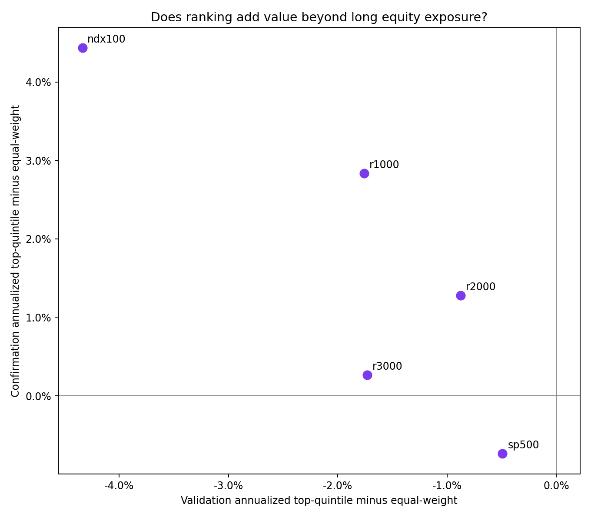
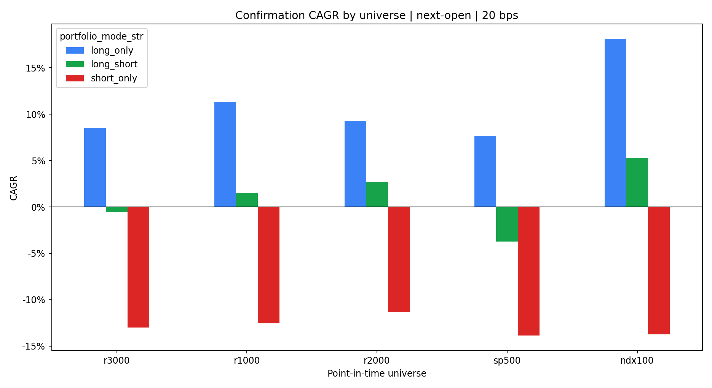

<!-- GENERATED FILE. EDIT THE CANONICAL KNOWLEDGE RECORD. -->

# Trend Factor Cross-Universe Robustness

!!! warning "Research-only"
    This page summarizes saved research evidence. It does not authorize LIVE, allocation, or deployment.

## TL;DR

> **Verdict:** The frozen cross-universe promotion gate failed; treat the result as diagnostic, not validated alpha.

> **Status:** `diagnostic`

> **Disposition:** `not_recorded`

> **Replication:** `not_recorded`

## Research question

Test whether the paper-SMA trend-factor ranking and portfolio returns survive across five point-in-time US equity baskets.

## Exact setup

| Field | Value |
| --- | --- |
| Signal family | cross_sectional_trend |
| Universe | ["Russell 3000", "Russell 1000", "Russell 2000", "S&P 500", "Nasdaq-100"] |
| Decision | After final common market Close_T |
| Fill | First Open_T+1 to first Open_T+2 |
| Primary cost layer | central_research |
| Last reviewed | 2026-07-26T01:44:06.746589+03:00 |

## Timing and overnight attribution

```text
information available: After final common market Close_T
primary executable fill: First Open_T+1 to first Open_T+2
```

If final `Close_T` data formed the signal, a hypothetical `Close_T` entry is diagnostic only unless a separate pre-close protocol was modeled. Comparing that diagnostic with `Open_(T+1)` and applying the compounded return identity shows whether the apparent edge occurred in the overnight gap. Missing attribution numbers mean **not tested**, not zero.


## Primary metrics

| Metric | Value |
| --- | ---: |
| Period | 2000-01 through 2026-05 |
| Universe | ndx100 |
| Cost Layer | central_research_20bps_round_trip |
| Cagr | 10.61% |
| Annualized Volatility | 26.75% |
| Sharpe | 0.509 |
| Maximum Drawdown | -62.52% |
| Turnover | 53.73% |

## Key findings

| Feature | Role | Direction | Status | Effect | Action |
| --- | --- | --- | --- | --- | --- |
| cross_universe_ranking_alpha | robustness_test | top forecast quintile minus equal weight | diagnostic | See ranking_alpha_inference.csv for five universes. | Use only as a frozen forward hypothesis if the family gate passed; otherwise reject as validated alpha. |

## Visual evidence






## Limitations

- The universe sweep is post-hoc to the Russell 3000 result.
- Nasdaq-100 is intersected with the domestic base panel.
- Short borrow and locate costs are excluded.
- Opening-auction impact is hypothetical.

## Next gates

- Freeze any passing result without changing basket or parameters.
- Collect empirical opening-auction slippage and volume.
- Require borrow evidence before any short implementation.

## Sources

- `Han, Zhou, and Zhu (2016), A Trend Factor`
- `Pakal trend_factor_powers_of_two baseline`
- `Norgate point-in-time constituent histories`

## Canonical artifacts

| Artifact | Pakal path |
| --- | --- |
| Concise Report | `C:\\Users\\User\\Documents\\workspace\\pakal\\pakal-research\\reports\\trend_factor_cross_universe\\REPORT.md` |
| Frozen Specification | `C:\\Users\\User\\Documents\\workspace\\pakal\\pakal-research\\reports\\trend_factor_cross_universe\\research_spec_frozen.json` |
| Full Report | `C:\\Users\\User\\Documents\\workspace\\pakal\\pakal-research\\reports\\trend_factor_cross_universe\\REPORT_FULL.md` |
| Manifest | `C:\\Users\\User\\Documents\\workspace\\pakal\\pakal-research\\reports\\trend_factor_cross_universe\\run_manifest.json` |
| Notebook | `C:\\Users\\User\\Documents\\workspace\\pakal\\pakal-research\\trend_factor_cross_universe_research.ipynb` |
| Primary Charts | `["C:\\\\Users\\\\User\\\\Documents\\\\workspace\\\\pakal\\\\pakal-research\\\\reports\\\\trend_factor_cross_universe\\\\charts\\\\confirmation_cagr_by_universe.png", "C:\\\\Users\\\\User\\\\Documents\\\\workspace\\\\pakal\\\\pakal-research\\\\reports\\\\trend_factor_cross_universe\\\\charts\\\\ranking_alpha_validation_confirmation.png"]` |
| Primary Source Code | `["C:\\\\Users\\\\User\\\\Documents\\\\workspace\\\\pakal\\\\pakal-research\\\\norgate_trend_factor_cross_universe_study.py", "C:\\\\Users\\\\User\\\\Documents\\\\workspace\\\\pakal\\\\pakal-research\\\\norgate_trend_factor_fixed_n_long_only_study.py"]` |
| Primary Tables | `["C:\\\\Users\\\\User\\\\Documents\\\\workspace\\\\pakal\\\\pakal-research\\\\reports\\\\trend_factor_cross_universe\\\\tables\\\\performance_by_period.csv", "C:\\\\Users\\\\User\\\\Documents\\\\workspace\\\\pakal\\\\pakal-research\\\\reports\\\\trend_factor_cross_universe\\\\tables\\\\ranking_alpha_inference.csv", "C:\\\\Users\\\\User\\\\Documents\\\\workspace\\\\pakal\\\\pakal-research\\\\reports\\\\trend_factor_cross_universe\\\\tables\\\\long_short_inference.csv", "C:\\\\Users\\\\User\\\\Documents\\\\workspace\\\\pakal\\\\pakal-research\\\\reports\\\\trend_factor_cross_universe\\\\tables\\\\capacity_scenarios.csv"]` |
