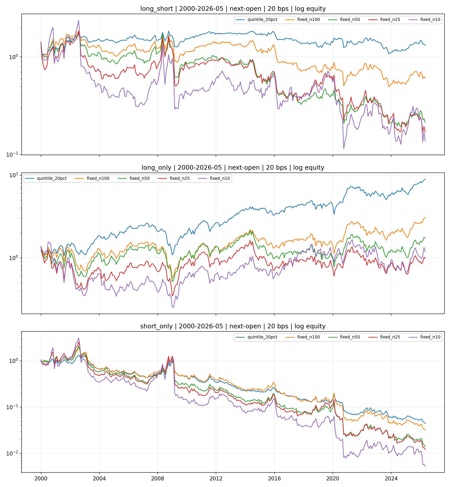
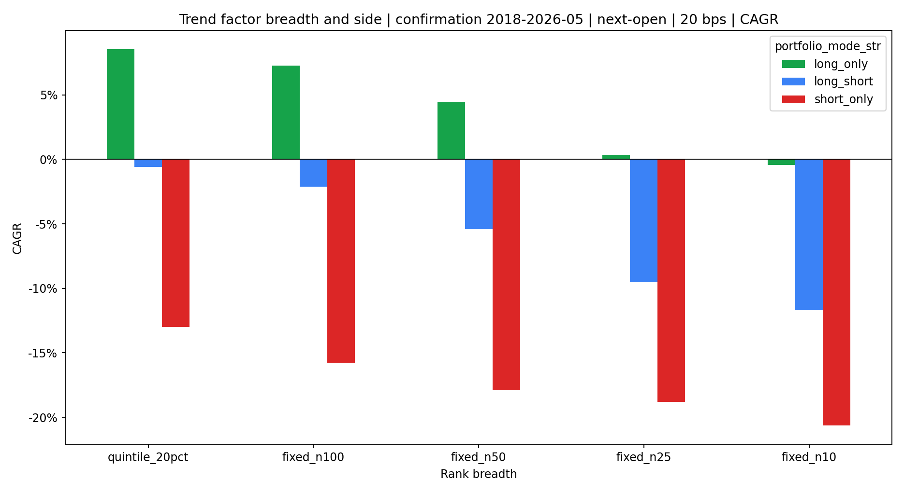

<!-- GENERATED FILE. EDIT THE CANONICAL KNOWLEDGE RECORD. -->

# Trend Factor Fixed-N Breadth and Long-Only Attribution

!!! warning "Research-only"
    This page summarizes saved research evidence. It does not authorize LIVE, allocation, or deployment.

## TL;DR

> **Verdict:** No fixed-N variant passed the frozen promotion gate. The strongest confirmation long-only row was quintile_20pct__long_only: 8.53% CAGR and 0.49 Sharpe at 20 bps.

> **Status:** `diagnostic`

> **Disposition:** `not_recorded`

> **Replication:** `not_recorded`

## Research question

Determine whether fixed extreme ranks or removal of the short leg improves the executable paper-SMA trend factor.

## Exact setup

| Field | Value |
| --- | --- |
| Signal family | cross_sectional_trend |
| Universe | ["Russell 3000 Current & Past with PIT membership and USD 5 raw-price floor"] |
| Decision | After final common market Close_T |
| Fill | First Open_T+1 to first Open_T+2 |
| Primary cost layer | central_research |
| Last reviewed | 2026-07-26T01:05:22.982643+03:00 |

## Timing and overnight attribution

```text
information available: After final common market Close_T
primary executable fill: First Open_T+1 to first Open_T+2
```

If final `Close_T` data formed the signal, a hypothetical `Close_T` entry is diagnostic only unless a separate pre-close protocol was modeled. Comparing that diagnostic with `Open_(T+1)` and applying the compounded return identity shows whether the apparent edge occurred in the overnight gap. Missing attribution numbers mean **not tested**, not zero.


## Primary metrics

| Metric | Value |
| --- | ---: |
| Period | 2000-01 through 2026-05 |
| Universe | Russell 3000 PIT approximation |
| Cost Layer | central_research_20bps_round_trip |
| Cagr | 8.64% |
| Annualized Volatility | 21.24% |
| Sharpe | 0.499 |
| Maximum Drawdown | -58.90% |
| Turnover | 59.56% |

## Key findings

| Feature | Role | Direction | Status | Effect | Action |
| --- | --- | --- | --- | --- | --- |
| fixed_rank_breadth | portfolio_construction | more concentrated extreme forecast ranks | diagnostic | Best long-only confirmation CAGR 0.085265, Sharpe 0.491616 | Freeze for a future untouched period only if the promotion gate passed; otherwise retain as diagnostic. |
| long_only_side | exposure_definition | remove short book | diagnostic | Long-only quintile confirmation CAGR 0.085265 versus long-short -0.005706 | Prefer long-only for further research only if it remains positive across validation and confirmation. |
| equal_weight_beta_control | posthoc_benchmark_diagnostic | top forecast quintile minus all eligible stocks | diagnostic | Confirmation paired mean difference 0.000222 per month | Do not label long-only absolute return as factor alpha. |

## Visual evidence






## Limitations

- The fixed-N hypothesis is post-hoc relative to the baseline.
- Norgate Russell 3000 does not exactly reproduce the paper CRSP universe.
- Opening-auction impact is hypothetical.
- Short borrow, locates, recalls, dividends, and squeezes are excluded.
- N=10 has severe single-name concentration.

## Next gates

- Freeze any passing breadth for an untouched future period without changing N.
- Measure opening-auction volume, spread, and realized fill slippage.
- Require locate and borrow evidence before reconsidering any short book.

## Sources

- `Han, Zhou, and Zhu (2016), A Trend Factor`
- `Pakal trend_factor_powers_of_two baseline`

## Canonical artifacts

| Artifact | Pakal path |
| --- | --- |
| Concise Report | `C:\\Users\\User\\Documents\\workspace\\pakal\\pakal-research\\reports\\trend_factor_fixed_n_long_only\\REPORT.md` |
| Frozen Specification | `C:\\Users\\User\\Documents\\workspace\\pakal\\pakal-research\\reports\\trend_factor_fixed_n_long_only\\research_spec_frozen.json` |
| Full Report | `C:\\Users\\User\\Documents\\workspace\\pakal\\pakal-research\\reports\\trend_factor_fixed_n_long_only\\REPORT_FULL.md` |
| Manifest | `C:\\Users\\User\\Documents\\workspace\\pakal\\pakal-research\\reports\\trend_factor_fixed_n_long_only\\run_manifest.json` |
| Notebook | `C:\\Users\\User\\Documents\\workspace\\pakal\\pakal-research\\trend_factor_fixed_n_long_only_research.ipynb` |
| Primary Charts | `["C:\\\\Users\\\\User\\\\Documents\\\\workspace\\\\pakal\\\\pakal-research\\\\reports\\\\trend_factor_fixed_n_long_only\\\\charts\\\\confirmation_cagr_by_breadth.png", "C:\\\\Users\\\\User\\\\Documents\\\\workspace\\\\pakal\\\\pakal-research\\\\reports\\\\trend_factor_fixed_n_long_only\\\\charts\\\\equity_by_mode.png"]` |
| Primary Source Code | `["C:\\\\Users\\\\User\\\\Documents\\\\workspace\\\\pakal\\\\pakal-research\\\\norgate_trend_factor_fixed_n_long_only_study.py", "C:\\\\Users\\\\User\\\\Documents\\\\workspace\\\\pakal\\\\pakal-research\\\\norgate_trend_factor_powers_of_two_study.py"]` |
| Primary Tables | `["C:\\\\Users\\\\User\\\\Documents\\\\workspace\\\\pakal\\\\pakal-research\\\\reports\\\\trend_factor_fixed_n_long_only\\\\tables\\\\performance_by_period.csv", "C:\\\\Users\\\\User\\\\Documents\\\\workspace\\\\pakal\\\\pakal-research\\\\reports\\\\trend_factor_fixed_n_long_only\\\\tables\\\\paired_fixed_n_inference.csv", "C:\\\\Users\\\\User\\\\Documents\\\\workspace\\\\pakal\\\\pakal-research\\\\reports\\\\trend_factor_fixed_n_long_only\\\\tables\\\\capacity_scenarios.csv", "C:\\\\Users\\\\User\\\\Documents\\\\workspace\\\\pakal\\\\pakal-research\\\\reports\\\\trend_factor_fixed_n_long_only\\\\tables\\\\posthoc_equal_weight_benchmark_inference.csv"]` |
