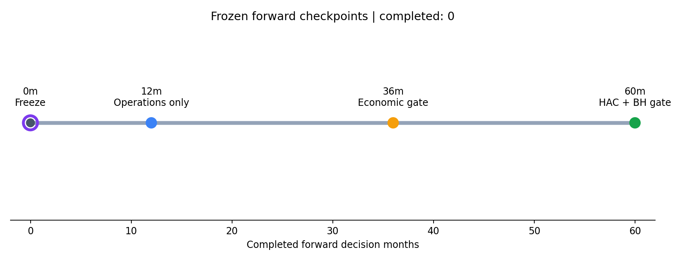

<!-- GENERATED FILE. EDIT THE CANONICAL KNOWLEDGE RECORD. -->

# Trend Factor Frozen Forward Shadow

!!! warning "Research-only"
    This page summarizes saved research evidence. It does not authorize LIVE, allocation, or deployment.

## TL;DR

> **Verdict:** Tracker armed; current readiness is NOT_READY. No capital or live wiring is authorized.

> **Status:** `forward_hypothesis`

> **Disposition:** `not_recorded`

> **Replication:** `not_recorded`

## Research question

Prospectively test whether frozen Russell 1000 and Nasdaq-100 top-quintile ranks beat equal-weight universe controls.

## Exact setup

| Field | Value |
| --- | --- |
| Signal family | cross_sectional_trend |
| Universe | ["Russell 1000 point-in-time primary", "Nasdaq-100 point-in-time domestic-panel-intersection secondary"] |
| Decision | After exact final common market Close_T |
| Fill | First Open_T+1 to first Open_T+2 |
| Primary cost layer | central_research |
| Last reviewed | 2026-07-26T19:27:30.079176+00:00 |

## Timing and overnight attribution

```text
information available: After exact final common market Close_T
primary executable fill: First Open_T+1 to first Open_T+2
```

If final `Close_T` data formed the signal, a hypothetical `Close_T` entry is diagnostic only unless a separate pre-close protocol was modeled. Comparing that diagnostic with `Open_(T+1)` and applying the compounded return identity shows whether the apparent edge occurred in the overnight gap. Missing attribution numbers mean **not tested**, not zero.


## Primary metrics

| Metric | Value |
| --- | ---: |
| Period | Forward from 2026-07; completed months 0 |
| Universe | Russell 1000 primary |
| Cost Layer | central_research_20bps_round_trip |
| Cagr | N/A |
| Annualized Volatility | N/A |
| Sharpe | N/A |
| Maximum Drawdown | N/A |
| Turnover | N/A |

## Key findings

| Feature | Role | Direction | Status | Effect | Action |
| --- | --- | --- | --- | --- | --- |
| frozen_cross_universe_top_quintile | forward_hypothesis | highest forecast quintile versus equal weight | forward_hypothesis | No pristine forward return exists at initialization. | Operate the shadow causally without changing any rule. |

## Visual evidence




## Limitations

- No forward return exists at initialization.
- A late signal month is unavailable and cannot be backfilled.
- Nasdaq-100 retains the domestic-panel intersection.
- No live execution or capacity parity evidence exists.

## Next gates

- Refresh the dedicated inputs after the July 31 close.
- Create the July snapshot before the August 3 entry cutoff.
- Perform an operational-only review after 12 completed months.

## Sources

- `Pakal trend_factor_cross_universe frozen study`
- `Norgate point-in-time constituent and price histories`

## Canonical artifacts

| Artifact | Pakal path |
| --- | --- |
| Concise Report | `C:\\Users\\User\\Documents\\workspace\\pakal\\pakal-research\\reports\\trend_factor_forward_shadow\\REPORT.md` |
| Frozen Specification | `C:\\Users\\User\\Documents\\workspace\\pakal\\pakal-research\\reports\\trend_factor_forward_shadow\\research_spec_frozen.json` |
| Full Report | `C:\\Users\\User\\Documents\\workspace\\pakal\\pakal-research\\reports\\trend_factor_forward_shadow\\REPORT_FULL.md` |
| Manifest | `C:\\Users\\User\\Documents\\workspace\\pakal\\pakal-research\\reports\\trend_factor_forward_shadow\\run_manifest.json` |
| Notebook | `C:\\Users\\User\\Documents\\workspace\\pakal\\pakal-research\\trend_factor_forward_shadow\\forward_shadow_decision.ipynb` |
| Primary Charts | `["C:\\\\Users\\\\User\\\\Documents\\\\workspace\\\\pakal\\\\pakal-research\\\\reports\\\\trend_factor_forward_shadow\\\\charts\\\\forward_checkpoints.png"]` |
| Primary Source Code | `["C:\\\\Users\\\\User\\\\Documents\\\\workspace\\\\pakal\\\\pakal-research\\\\trend_factor_forward_shadow\\\\run_forward_shadow.py"]` |
| Primary Tables | `["C:\\\\Users\\\\User\\\\Documents\\\\workspace\\\\pakal\\\\pakal-research\\\\reports\\\\trend_factor_forward_shadow\\\\ledgers\\\\signal_ledger.csv", "C:\\\\Users\\\\User\\\\Documents\\\\workspace\\\\pakal\\\\pakal-research\\\\reports\\\\trend_factor_forward_shadow\\\\ledgers\\\\return_ledger.csv"]` |
