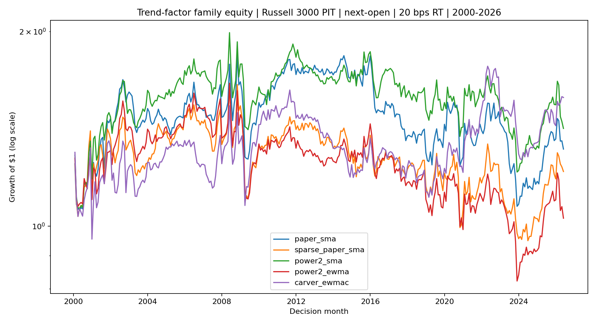
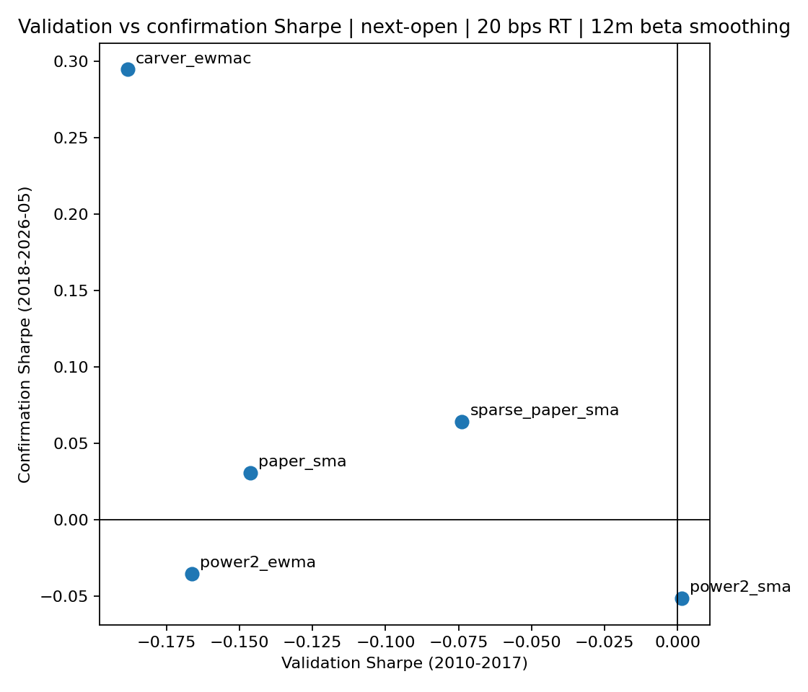

<!-- GENERATED FILE. EDIT THE CANONICAL KNOWLEDGE RECORD. -->

# Han-Zhou-Zhu Trend Factor with Powers-of-Two SMA, EWMA, and EWMAC

!!! warning "Research-only"
    This page summarizes saved research evidence. It does not authorize LIVE, allocation, or deployment.

## TL;DR

> **Verdict:** No alternative passed the frozen promotion gate. carver_ewmac was the strongest alternative by confirmation Sharpe, but remains diagnostic.

> **Status:** `diagnostic`

> **Disposition:** `not_recorded`

> **Replication:** `not_recorded`

## Research question

Test whether power-of-two SMA, power-of-two EWMA, or Carver-style EWMAC families improve the causal monthly trend factor relative to the paper baseline.

## Exact setup

| Field | Value |
| --- | --- |
| Signal family | cross_sectional_trend |
| Universe | ["Russell 3000 Current & Past with PIT membership and USD 5 raw-price floor"] |
| Decision | After final Close_T at month-end |
| Fill | First Open_T+1 to first Open_T+2 |
| Primary cost layer | central_research |
| Last reviewed | 2026-07-26T00:16:29.307316+03:00 |

## Timing and overnight attribution

```text
information available: After final Close_T at month-end
primary executable fill: First Open_T+1 to first Open_T+2
```

If final `Close_T` data formed the signal, a hypothetical `Close_T` entry is diagnostic only unless a separate pre-close protocol was modeled. Comparing that diagnostic with `Open_(T+1)` and applying the compounded return identity shows whether the apparent edge occurred in the overnight gap. Missing attribution numbers mean **not tested**, not zero.


## Primary metrics

| Metric | Value |
| --- | ---: |
| Period | 2000-01 through 2026-05 |
| Universe | Russell 3000 PIT approximation |
| Cost Layer | central_research_20bps_round_trip |
| Cagr | 1.75% |
| Annualized Volatility | 15.89% |
| Sharpe | 0.190 |
| Maximum Drawdown | -31.76% |
| Turnover | 123.11% |

## Key findings

| Feature | Role | Direction | Status | Effect | Action |
| --- | --- | --- | --- | --- | --- |
| paper_sma | entry signal and cross-sectional rank | higher forecast long, lower forecast short | benchmark | Confirmation at 20 bps: CAGR -0.55%, Sharpe 0.03 | Retain only as the paper benchmark |
| sparse_paper_sma | entry signal and cross-sectional rank | higher forecast long, lower forecast short | rejected_for_promotion | Confirmation at 20 bps: CAGR -0.09%, Sharpe 0.06 | Retain as a collinearity and smoothing diagnostic |
| power2_sma | entry signal and cross-sectional rank | higher forecast long, lower forecast short | rejected_for_promotion | Confirmation at 20 bps: CAGR -1.44%, Sharpe -0.05 | Reject the power-of-two SMA substitution |
| power2_ewma | entry signal and cross-sectional rank | higher forecast long, lower forecast short | rejected_for_promotion | Confirmation at 20 bps: CAGR -1.50%, Sharpe -0.04 | Reject the power-of-two EWMA substitution |
| carver_ewmac | entry signal and cross-sectional rank | higher forecast long, lower forecast short | rejected_for_promotion | Confirmation at 20 bps: CAGR 2.98%, Sharpe 0.29 | Retain as a diagnostic; do not promote or wire live |

## Visual evidence






## Limitations

- Norgate Russell 3000 is not the exact CRSP/NYSE-breakpoint universe.
- CAPITALSPECIAL excludes ordinary dividends.
- Borrow and opening-auction execution are unresolved.
- Capacity is hypothetical and not deployable.

## Next gates

- Replicate with exact CRSP share codes and historical NYSE market-cap breakpoints.
- Measure opening-auction volume, spread, and realized borrow availability.
- Freeze any surviving alternative for a later untouched forward period.

## Sources

- `Han, Zhou, and Zhu (2016), A Trend Factor`
- `Quantitativo (2025), Coding Trend Factor`
- `Robert Carver pysystemtrade EWMAC documentation`

## Canonical artifacts

| Artifact | Pakal path |
| --- | --- |
| Concise Report | `C:\\Users\\User\\Documents\\workspace\\pakal\\pakal-research\\reports\\trend_factor_powers_of_two\\REPORT.md` |
| Frozen Specification | `C:\\Users\\User\\Documents\\workspace\\pakal\\pakal-research\\reports\\trend_factor_powers_of_two\\research_spec_frozen.json` |
| Full Report | `C:\\Users\\User\\Documents\\workspace\\pakal\\pakal-research\\reports\\trend_factor_powers_of_two\\REPORT_FULL.md` |
| Manifest | `C:\\Users\\User\\Documents\\workspace\\pakal\\pakal-research\\reports\\trend_factor_powers_of_two\\run_manifest.json` |
| Notebook | `C:\\Users\\User\\Documents\\workspace\\pakal\\pakal-research\\trend_factor_powers_of_two_research.ipynb` |
| Primary Charts | `["C:\\\\Users\\\\User\\\\Documents\\\\workspace\\\\pakal\\\\pakal-research\\\\reports\\\\trend_factor_powers_of_two\\\\charts\\\\primary_equity.png", "C:\\\\Users\\\\User\\\\Documents\\\\workspace\\\\pakal\\\\pakal-research\\\\reports\\\\trend_factor_powers_of_two\\\\charts\\\\validation_confirmation_scatter.png"]` |
| Primary Source Code | `["C:\\\\Users\\\\User\\\\Documents\\\\workspace\\\\pakal\\\\pakal-research\\\\norgate_trend_factor_powers_of_two_study.py"]` |
| Primary Tables | `["C:\\\\Users\\\\User\\\\Documents\\\\workspace\\\\pakal\\\\pakal-research\\\\reports\\\\trend_factor_powers_of_two\\\\tables\\\\performance_by_period.csv", "C:\\\\Users\\\\User\\\\Documents\\\\workspace\\\\pakal\\\\pakal-research\\\\reports\\\\trend_factor_powers_of_two\\\\tables\\\\paired_family_inference.csv", "C:\\\\Users\\\\User\\\\Documents\\\\workspace\\\\pakal\\\\pakal-research\\\\reports\\\\trend_factor_powers_of_two\\\\tables\\\\liquidity_band_returns.csv", "C:\\\\Users\\\\User\\\\Documents\\\\workspace\\\\pakal\\\\pakal-research\\\\reports\\\\trend_factor_powers_of_two\\\\tables\\\\capacity_scenarios.csv", "C:\\\\Users\\\\User\\\\Documents\\\\workspace\\\\pakal\\\\pakal-research\\\\reports\\\\trend_factor_powers_of_two\\\\tables\\\\posthoc_common_support_performance.csv"]` |
